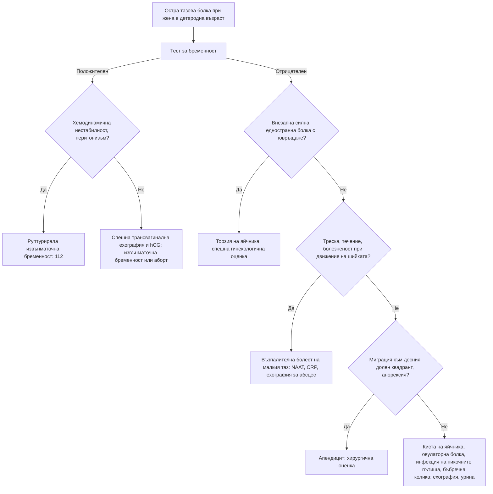

# Глава 64. Тазова болка и вагинално течение

> **Част XIII. Репродуктивно здраве и бременност**

## Цели на главата

- Да се оценява острата тазова болка при жена в детеродна възраст, като първата стъпка е тест за бременност.
- Да се разпознават извънматочната бременност, торзията на яйчника, възпалителната болест на малкия таз и руптурата на киста.
- Да се разпознават ендометриозата и другите причини за хронична тазова болка.
- Да се разграничават бактериалната вагиноза, кандидозата, трихомониазата и цервицитът.
- Да се разграничават основните причини за генитални язви и вулварни симптоми.

---

## А. ОСТРА ТАЗОВА БОЛКА

## 1. Причини

| Група | Причини |
|---|---|
| **Свързани с бременността** | **Извънматочна бременност**, спонтанен аборт, кръвоизлив в жълтото тяло |
| **Яйчници и тръби** | **Торзия на яйчника** (или на тръбата), **руптура или кръвоизлив в киста**, **овулаторна болка** (миттелшмерц, в средата на цикъла), синдром на овариална хиперстимулация (след стимулация на овулацията) |
| **Инфекциозни** | **Възпалителна болест на малкия таз**, **тубоовариален абсцес**, ендометрит (след раждане, аборт, поставяне на спирала) |
| **Матка** | Дегенерация на миом (включително „червена“ дегенерация при бременност), аденомиоза |
| **Извънгенитални** | **Апендицит**, инфекция на пикочните пътища и пиелонефрит, **бъбречна колика**, дивертикулит, възпалителни болести на червата, чревна непроходимост |

**Първото изследване при всяка жена в детеродна възраст с тазова болка е тестът за бременност.**

## 2. Диференциално-диагностична таблица

| Заболяване | Ключови белези | Изследвания |
|---|---|---|
| **Извънматочна бременност** | Аменорея 6–8 седмици (може да няма забавяне!), болка (често едностранна), **зацапване**, **болка във върха на рамото**, **синкоп**; рискови фактори — предишна извънматочна бременност, **възпалителна болест на малкия таз**, операции на тръбите, **спирала** (ако настъпи бременност), ин витро оплождане, тютюнопушене | **hCG**, **трансвагинална ехография** (липса на вътрематочна бременност при hCG над дискриминационната зона, свободна течност) |
| **Торзия на яйчника** | **Внезапна силна едностранна болка** с **гадене и повръщане**, често при киста или формация > 5 cm | Доплерова ехография (**нормалният кръвоток не изключва торзия**); лапароскопия |
| **Руптура или кръвоизлив в киста** | Внезапна болка, често в средата или втората половина на цикъла, след полов акт или усилие; хемоперитонеум | Ехография, ПКК |
| **Възпалителна болест на малкия таз** | **Двустранна** болка в долната половина на корема, **диспареуния**, **патологично течение**, треска, **болезненост при движение на шийката**, болезненост в аднексите; хламидия, гонорея, *M. genitalium* | NAAT, CRP, ехография (тубоовариален абсцес); **ниският праг за лечение** предотвратява безплодието |
| **Перихепатит (синдром на Fitz-Hugh-Curtis)** | Болка в десния горен квадрант при възпалителна болест на малкия таз | — |
| **Овулаторна болка** | Едностранна болка в средата на цикъла, продължава часове | Клинична диагноза |
| **Апендицит** | Миграция на болката, анорексия | Ехография, КТ |

---

## Б. ХРОНИЧНА ТАЗОВА БОЛКА

## 3. Причини

| Причина | Ключови белези |
|---|---|
| **Ендометриоза** | **Вторична, прогресираща дисменорея**, **дълбока диспареуния**, **болка при дефекация** (дисхезия), циклични уринарни симптоми, **безплодие**; при преглед — болезнени възли в задния свод, фиксирана матка в ретроверзия. **Средното забавяне на диагнозата е 7–10 години.** Трансвагинална ехография (ендометриоми, дълбока ендометриоза), ЯМР, лапароскопия |
| **Аденомиоза** | Обилни и болезнени менструации, уголемена, „мека“ матка; по-често при жени, раждали, на по-възрастна възраст |
| **Хронична възпалителна болест и сраствания** | Предшестваща инфекция или операция |
| **Синдром на тазовия венозен застой** | Тъпа болка, по-силна в края на деня и при стоене, след полов акт |
| **Синдром на раздразненото черво** | Много честа причина (вж. глава 20) |
| **Синдром на болезнения пикочен мехур** | Болка при пълен мехур, облекчаване след уриниране |
| **Мускулно-скелетни** | Миалгия на тазовото дъно, **пудендална невралгия** (болка при седене), сакроилиачни стави |
| **Карцином на яйчника** | **Подуване**, ранно засищане, тазова болка, често уриниране — **CA-125 и ехография** |
| **Психосоциални** | Депресия, **анамнеза за сексуално насилие** |

## 4. Дисменорея

- **Първична** — започва до 1–2 години след менархето, прегледът е нормален.
- **Вторична** — започва по-късно или се влошава; причини: **ендометриоза**, **аденомиоза**, **миоми**, възпалителна болест на малкия таз, **медна спирала**, цервикална стеноза.

## 5. Диспареуния

- **Повърхностна** (при вход): вагинизъм, вулводиния, **генитоуринарен синдром на менопаузата** (атрофия), инфекции, **лихен склерозус**, киста на Bartholin, недостатъчна лубрикация, женско генитално осакатяване.
- **Дълбока**: **ендометриоза**, възпалителна болест на малкия таз, сраствания, кисти на яйчниците, миоми, синдром на раздразненото черво, тазов венозен застой.

---

## В. ВАГИНАЛНО ТЕЧЕНИЕ

## 6. Диференциално-диагностична таблица

| Причина | Течение | Други белези | pH | Диагноза |
|---|---|---|---|---|
| **Физиологично** | Бяло или прозрачно, без миризма; циклични промени | Няма | ≤ 4,5 | Клинична |
| **Бактериална вагиноза** | **Тънко, хомогенно, сиво-бяло**, **рибен мирис** (особено след полов акт) | Без сърбеж и възпаление | **> 4,5** | Тест с KOH (засилване на мириса), **„ключови“ клетки** при микроскопия |
| **Вулвовагинална кандидоза** | **Гъсто, бяло, „като извара“** | **Сърбеж**, парене, зачервяване, повърхностна диспареуния, „външна“ дизурия | **≤ 4,5** | Микроскопия, посявка |
| **Трихомониаза** | **Пенливо, жълто-зелено**, неприятен мирис | Сърбеж, „ягодова“ шийка | **> 4,5** | NAAT, микроскопия; **полово предавана инфекция** |
| **Цервицит** (хламидия, гонорея, *M. genitalium*) | Мукопурулентно от шийката; **често безсимптомен** | **Контактно кървене**, междуменструално и посткоитално кървене, тазова болка | Различно | **NAAT** (вагинална самонатривка) |
| **Задържано чуждо тяло** (тампон) | **Силно неприятна миризма**, кафеникаво | Риск от **синдром на токсичния шок** | — | Оглед |
| **Атрофичен вагинит** | Оскъдно, понякога кървенисто | Сухота, диспареуния, след менопаузата | > 4,5 | Клинична |
| **Карцином на шийката или ендометриума** | **Кървенисто, воднисто, неприятна миризма** | Кървене, посткоитално кървене | — | Оглед, колпоскопия, биопсия |
| **Фистула** | **Постоянно** воднисто или фекално | След операция, облъчване, раждане | — | Специализирано изследване |

**Рецидивираща кандидоза** (≥ 4 епизода годишно): изключете **захарен диабет**, имуносупресия, чести антибиотици, бременност, **SGLT2 инхибитори**; уточнете вида (*non-albicans*).

**При подозрение за полово предавана инфекция:** NAAT за хламидия и гонорея (± *M. genitalium*, трихомонас), серология за **HIV и сифилис**, **уведомяване на партньорите**.

---

## Г. ГЕНИТАЛНИ ЯЗВИ И ВУЛВАРНИ ОПЛАКВАНИЯ

## 7. Генитални язви

| Причина | Ключови белези |
|---|---|
| **Генитален херпес** | **Болезнени** множествени везикули и язви, рецидиви, болезнени ингвинални лимфни възли |
| **Сифилис** (първичен шанкър) | **Неболезнена**, твърда язва с чиста основа, регионални лимфни възли |
| **Венерическа лимфогранулома** | Преходна язвичка, изразена ингвинална лимфаденопатия, проктит (при мъже, които правят секс с мъже) |
| **Болест на Behçet** | Рецидивиращи **орални и генитални** язви, увеит |
| **Язва на Lipschütz** | Остра болезнена язва при млади момичета по време на вирусна инфекция (EBV); не е полово предавана |
| **Фиксирана лекарствена реакция** | Рецидивира на същото място след същото лекарство |
| **Болест на Crohn** | Язви и фистули |
| **Сквамозноклетъчен карцином на вулвата** | **Възрастни жени**, на фона на **лихен склерозус**; персистираща язва или бучка, сърбеж — **биопсия** |

## 8. Вулварни оплаквания

- **Лихен склерозус** — бели, атрофични, сърбящи участъци с форма на „осмица“ около вулвата и ануса; **риск от сквамозноклетъчен карцином**; при деца може да се сбърка със сексуално насилие.
- Вулварна интраепителна неоплазия.
- Вулводиния (болка без видима причина).
- Кандидоза, контактен дерматит, лихен симплекс хроникус.

---

## 9. Безопасна диагностична стратегия

| Въпрос | Отговор |
|---|---|
| **Вероятна диагноза** | Бактериална вагиноза, кандидоза, полово предавани инфекции, овулаторна болка, кисти на яйчниците, ендометриоза, синдром на раздразненото черво |
| **Сериозни заболявания, които не бива да се пропускат** | **Извънматочна бременност**; **торзия на яйчника**; **тубоовариален абсцес**; **апендицит**; **карцином на яйчника, шийката и вулвата**; синдром на токсичния шок; сепсис след аборт или раждане |
| **Чести капани** | Извънматочна бременност без аменорея; торзия с нормален доплер; безсимптомна хламидийна инфекция; ендометриоза, приета за синдром на раздразненото черво; SGLT2 инхибитори и рецидивираща кандидоза; лихен склерозус; сексуално насилие |
| **Маскиращи заболявания** | Захарен диабет, инфекция на пикочните пътища, депресия, гръбначна дисфункция |
| **Психосоциални аспекти** | Сексуално насилие, домашно насилие, сексуална дисфункция, депресия |

---

## 10. Диагностичен алгоритъм при остра тазова болка

---

## 11. Клинични перли

- Всяка жена в детеродна възраст с тазова болка трябва да има тест за бременност.
- Липсата на закъсняла менструация не изключва извънматочна бременност.
- Нормалният доплеров кръвоток не изключва торзия на яйчника.
- Прагът за лечение на възпалителната болест на малкия таз трябва да е нисък. Пропуснатата инфекция води до безплодие и извънматочни бременности.
- Прогресиращата дисменорея, дълбоката диспареуния и болката при дефекация означават ендометриоза, дори ако ехографията е нормална.
- Жена над 50 години с ново персистиращо подуване: CA-125 и ехография.
- Течение с неприятна миризма: попитайте за забравен тампон.
- Рецидивираща кандидоза при пациентка на SGLT2 инхибитор: лекарствен ефект.
- Сърбящи бели участъци по вулвата при възрастна жена: лихен склерозус. Необходимо е проследяване, защото рискът от карцином е повишен.

---

## 12. Клиничен случай

**Случай.** Жена на 29 години от 10 години има много болезнени менструации, които с времето се засилват. Не ходи на работа 1–2 дни всеки месец. Има болка при полов акт в дълбочина и болка при дефекация по време на менструация. Диагностицирана е със „синдром на раздразненото черво“. От 18 месеца опитва да забременее без успех. При гинекологичния преглед матката е в ретроверзия, с ограничена подвижност, а в задния свод се палпират болезнени възли.

**Въпроси.** 1) Коя е най-вероятната диагноза? 2) Кои изследвания ще я потвърдят?

**Обсъждане.** Прогресиращата **вторична дисменорея**, **дълбоката диспареуния**, **цикличната дисхезия**, **безплодието** и находката при прегледа са типични за **ендометриоза** с дълбоко засягане на ретроцервикалната област и ректосигмата. Трансвагиналната ехография от опитен специалист показва ендометриом в левия яйчник и нодул на ендометриоза в ректовагиналната преграда. ЯМР уточнява разпространението. Лапароскопията с хистологично потвърждение и лечение се планира в специализиран център. Предвид безплодието се включва и специалист по репродуктивна медицина.

**Поука.** Силната менструална болка не е „нормална“. Ендометриозата често се диагностицира с години закъснение, защото симптомите се приписват на синдрома на раздразненото черво или на „ниския праг на болка“.

<!-- навигация -->

---

[← Глава 63. Аменорея и анормално маточно кървене](63-menstrualni-narushenia.md) · [Съдържание](../README.md) · [Глава 65. Заболявания на гърдата →](65-garda.md)
