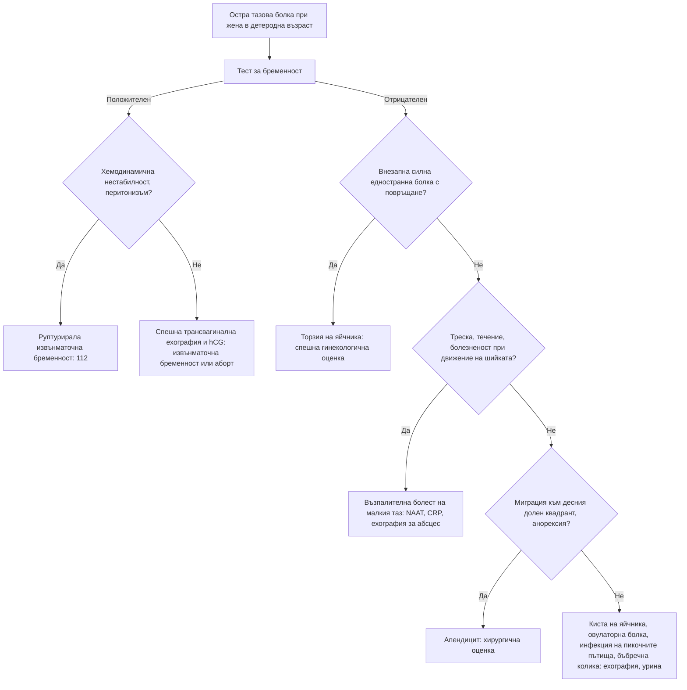

# Глава 64. Тазова болка и вагинално течение

> **Част XIII. Репродуктивно здраве и бременност**

## Цели на главата

- Да се оценява острата тазова болка при жена в детеродна възраст, като първата стъпка е тест за бременност.
- Да се разпознават извънматочната бременност, торзията на яйчника, възпалителната болест на малкия таз и руптурата на киста.
- Да се разпознават ендометриозата и другите причини за хронична тазова болка.
- Да се разграничават бактериалната вагиноза, кандидозата, трихомониазата и цервицитът.
- Да се разграничават основните причини за генитални язви и вулварни симптоми.

## Ключови моменти

- При всяка жена в детеродна възраст с тазова или коремна болка се прави тест за бременност. Около една трета от жените с извънматочна бременност нямат известни рискови фактори *(SORT C [1])*.
- Нормалният доплеров кръвоток не изключва торзия на яйчника. При съмнение е нужна спешна гинекологична оценка *(SORT C [2])*.
- Прагът за емпирично лечение на възпалителната болест на малкия таз е нисък, защото пропуснатата инфекция води до безплодие *(SORT C [3])*.
- Прогресиращата дисменорея, дълбоката диспареуния и болката при дефекация насочват към ендометриоза. Нормалните преглед и ехография не я изключват *(SORT C [5, 6])*.
- При персистиращи симптоми, подозрителни за карцином на яйчника, след 40-годишна възраст се изследва CA-125 с възрастов праг, а при по-млади жени се прави ехография *(SORT C [7])*.
- Лихен склерозус увеличава риска от сквамозноклетъчен карцином на вулвата и изисква проследяване *(SORT C [9])*.

### Първите 60 секунди

- Направете тест за бременност на всяка жена в детеродна възраст с тазова или коремна болка, дори при неспецифични симптоми [1].
- Оценете пулса, АН, бледостта, синкопа и перитонеалните признаци. При хемодинамична нестабилност или силна болка или кървене — 112 [1].
- Положителен тест с болка и болезненост в корема, таза или при движение на шийката: незабавно насочване към кабинет за ранна бременност или дежурен гинеколог [1].
- Внезапна силна едностранна болка с повръщане: мислете за торзия на яйчника. Нормалният доплер не я изключва [2].
- Не давайте храна и течности през устата, ако е вероятна операция.

---

## А. Остра тазова болка

### 1. Причини

| Група | Причини |
|---|---|
| **Свързани с бременността** | **Извънматочна бременност**, спонтанен аборт, кръвоизлив в жълтото тяло |
| **Яйчници и тръби** | **Торзия на яйчника** (или на тръбата), **руптура или кръвоизлив в киста**, **овулаторна болка** (миттелшмерц, в средата на цикъла), синдром на овариална хиперстимулация (след стимулация на овулацията) |
| **Инфекциозни** | **Възпалителна болест на малкия таз**, **тубоовариален абсцес**, ендометрит (след раждане, аборт, поставяне на спирала) |
| **Матка** | Дегенерация на миом (включително „червена“ дегенерация при бременност), аденомиоза |
| **Извънгенитални** | **Апендицит**, инфекция на пикочните пътища и пиелонефрит, **бъбречна колика**, дивертикулит, възпалителни болести на червата, чревна непроходимост |

**Първото изследване при всяка жена в детеродна възраст с тазова болка е тестът за бременност.**

### 2. Диференциално-диагностична таблица

| Заболяване | Ключови белези | Изследвания |
|---|---|---|
| **Извънматочна бременност** | Аменорея 6–8 седмици (може да няма забавяне!), болка (често едностранна), **зацапване**, **болка във върха на рамото**, **синкоп**; рискови фактори — предишна извънматочна бременност, **възпалителна болест на малкия таз**, операции на тръбите, **спирала** (ако настъпи бременност), ин витро оплождане, тютюнопушене; около една трета от жените нямат известни рискови фактори [1] | **hCG**, **трансвагинална ехография** (липса на вътрематочна бременност при hCG над дискриминационната зона, свободна течност) |
| **Торзия на яйчника** | **Внезапна силна едностранна болка** с **гадене и повръщане**, често при киста или формация > 5 cm | Доплерова ехография (**нормалният кръвоток не изключва торзия**); лапароскопия [2] |
| **Руптура или кръвоизлив в киста** | Внезапна болка, често в средата или втората половина на цикъла, след полов акт или усилие; хемоперитонеум | Ехография, ПКК |
| **Възпалителна болест на малкия таз** | **Двустранна** болка в долната половина на корема, **диспареуния**, **патологично течение**, треска, **болезненост при движение на шийката**, болезненост в аднексите; хламидия, гонорея, *M. genitalium* | NAAT, CRP, ехография (тубоовариален абсцес); **ниският праг за лечение** предотвратява безплодието [3] |
| **Перихепатит (синдром на Fitz-Hugh-Curtis)** | Болка в десния горен квадрант при възпалителна болест на малкия таз | — |
| **Овулаторна болка** | Едностранна болка в средата на цикъла, продължава часове | Клинична диагноза |
| **Апендицит** | Миграция на болката, анорексия | Ехография, КТ |

---

## Б. Хронична тазова болка

### 3. Причини

| Причина | Ключови белези |
|---|---|
| **Ендометриоза** | **Вторична, прогресираща дисменорея**, **дълбока диспареуния**, **болка при дефекация** (дисхезия), циклични уринарни симптоми, **безплодие**; при преглед — болезнени възли в задния свод, фиксирана матка в ретроверзия. **Забавянето на диагнозата често е 7–10 години**: в европейско проучване медианата е 10,4 години, а 74% от пациентките са получили поне една погрешна диагноза [4]. Трансвагинална ехография (ендометриоми, дълбока ендометриоза), ЯМР, лапароскопия; нормалните преглед и ехография не изключват ендометриоза [5, 6] |
| **Аденомиоза** | Обилни и болезнени менструации, уголемена, „мека“ матка; по-често при жени, раждали, на по-възрастна възраст |
| **Хронична възпалителна болест и сраствания** | Предшестваща инфекция или операция |
| **Синдром на тазовия венозен застой** | Тъпа болка, по-силна в края на деня и при стоене, след полов акт |
| **Синдром на раздразненото черво** | Много честа причина (вж. глава 20) |
| **Синдром на болезнения пикочен мехур** | Болка при пълен мехур, облекчаване след уриниране |
| **Мускулно-скелетни** | Миалгия на тазовото дъно, **пудендална невралгия** (болка при седене), сакроилиачни стави |
| **Карцином на яйчника** | **Подуване**, ранно засищане, тазова болка, често уриниране — при 40 и повече години **CA-125** с възрастов праг и **ехография**, под 40 години — ехография [7] |
| **Психосоциални** | Депресия, **анамнеза за сексуално насилие** |

### 4. Дисменорея

- **Първична** — започва до 1–2 години след менархето, прегледът е нормален.
- **Вторична** — започва по-късно или се влошава; причини: **ендометриоза**, **аденомиоза**, **миоми**, възпалителна болест на малкия таз, **медна спирала**, цервикална стеноза.

### 5. Диспареуния

- **Повърхностна** (при вход): вагинизъм, вулводиния, **генитоуринарен синдром на менопаузата** (атрофия), инфекции, **лихен склерозус**, киста на Bartholin, недостатъчна лубрикация, женско генитално осакатяване.
- **Дълбока**: **ендометриоза**, възпалителна болест на малкия таз, сраствания, кисти на яйчниците, миоми, синдром на раздразненото черво, тазов венозен застой.

---

## В. Вагинално течение

### 6. Диференциално-диагностична таблица

| Причина [8] | Течение | Други белези | pH | Диагноза |
|---|---|---|---|---|
| **Физиологично** | Бяло или прозрачно, без миризма; циклични промени | Няма | ≤ 4,5 | Клинична |
| **Бактериална вагиноза** | **Тънко, хомогенно, сиво-бяло**, **рибен мирис** (особено след полов акт) | Без сърбеж и възпаление | **> 4,5** | Тест с KOH (засилване на мириса), **„ключови“ клетки** при микроскопия |
| **Вулвовагинална кандидоза** | **Гъсто, бяло, „като извара“** | **Сърбеж**, парене, зачервяване, повърхностна диспареуния, „външна“ дизурия | **≤ 4,5** | Микроскопия, посявка |
| **Трихомониаза** | **Пенливо, жълто-зелено**, неприятен мирис | Сърбеж, „ягодова“ шийка | **> 4,5** | NAAT, микроскопия; **полово предавана инфекция** |
| **Цервицит** (хламидия, гонорея, *M. genitalium*) | Мукопурулентно от шийката; **често безсимптомен** | **Контактно кървене**, междуменструално и посткоитално кървене, тазова болка | Различно | **NAAT** (вагинална самонатривка) |
| **Задържано чуждо тяло** (тампон) | **Силно неприятна миризма**, кафеникаво | Риск от **синдром на токсичния шок** | — | Оглед |
| **Атрофичен вагинит** | Оскъдно, понякога кървенисто | Сухота, диспареуния, след менопаузата | > 4,5 | Клинична |
| **Карцином на шийката или ендометриума** | **Кървенисто, воднисто, неприятна миризма** | Кървене, посткоитално кървене | — | Оглед, колпоскопия, биопсия |
| **Фистула** | **Постоянно** воднисто или фекално | След операция, облъчване, раждане | — | Специализирано изследване |

**Рецидивираща кандидоза** (≥ 3–4 епизода годишно [8]): изключете **захарен диабет**, имуносупресия, чести антибиотици, бременност, **SGLT2 инхибитори**; уточнете вида (*non-albicans*).

**При подозрение за полово предавана инфекция:** NAAT за хламидия и гонорея (± *M. genitalium*, трихомонас), серология за **HIV и сифилис**, **уведомяване на партньорите** [8].

---

## Г. Генитални язви и вулварни оплаквания

### 7. Генитални язви

| Причина | Ключови белези |
|---|---|
| **Генитален херпес** | **Болезнени** множествени везикули и язви, рецидиви, болезнени ингвинални лимфни възли [8] |
| **Сифилис** (първичен шанкър) | **Неболезнена**, твърда язва с чиста основа, регионални лимфни възли |
| **Венерическа лимфогранулома** | Преходна язвичка, изразена ингвинална лимфаденопатия, проктит (при мъже, които правят секс с мъже) |
| **Болест на Behçet** | Рецидивиращи **орални и генитални** язви, увеит |
| **Язва на Lipschütz** | Остра болезнена язва при млади момичета по време на вирусна инфекция (EBV); не е полово предавана |
| **Фиксирана лекарствена реакция** | Рецидивира на същото място след същото лекарство |
| **Болест на Crohn** | Язви и фистули |
| **Сквамозноклетъчен карцином на вулвата** | **Възрастни жени**, на фона на **лихен склерозус**; персистираща язва или бучка, сърбеж — **биопсия** |

### 8. Вулварни оплаквания

- **Лихен склерозус** — бели, атрофични, сърбящи участъци с форма на „осмица“ около вулвата и ануса; **риск от сквамозноклетъчен карцином**; при деца може да се сбърка със сексуално насилие [9].
- Вулварна интраепителна неоплазия.
- Вулводиния (болка без видима причина).
- Кандидоза, контактен дерматит, лихен симплекс хроникус.

---

## 9. Безопасна диагностична стратегия

| Въпрос | Отговор |
|---|---|
| **Вероятна диагноза** | Бактериална вагиноза, кандидоза, полово предавани инфекции, овулаторна болка, кисти на яйчниците, ендометриоза, синдром на раздразненото черво |
| **Сериозни заболявания, които не бива да се пропускат** | **Извънматочна бременност**; **торзия на яйчника**; **тубоовариален абсцес**; **апендицит**; **карцином на яйчника, шийката и вулвата**; синдром на токсичния шок; сепсис след аборт или раждане |
| **Чести капани** | Извънматочна бременност без аменорея; торзия с нормален доплер; безсимптомна хламидийна инфекция; ендометриоза, приета за синдром на раздразненото черво; SGLT2 инхибитори и рецидивираща кандидоза; лихен склерозус; сексуално насилие |
| **Маскиращи заболявания** | Захарен диабет, инфекция на пикочните пътища, депресия, гръбначна дисфункция |
| **Психосоциални аспекти** | Сексуално насилие, домашно насилие, сексуална дисфункция, депресия |

---

## 10. Диагностичен алгоритъм при остра тазова болка

*Фигура 64.1. Диагностичен алгоритъм при остра тазова болка. Схема на авторите въз основа на източниците, цитирани в главата.*

Текстово описание на фигура 64.1

1. Остра тазова болка при жена в детеродна възраст. Следва: към т. 2.
2. Тест за бременност. Следва: Положителен — към т. 3; Отрицателен — към т. 4.
3. **Въпрос:** Хемодинамична нестабилност, перитонизъм? Да — към т. 5; Не — към т. 6.
4. **Въпрос:** Внезапна силна едностранна болка с повръщане? Да — към т. 7; Не — към т. 8.
5. Руптурирала извънматочна бременност: 112.
6. Спешна трансвагинална ехография и hCG: извънматочна бременност или аборт.
7. Торзия на яйчника: спешна гинекологична оценка.
8. **Въпрос:** Треска, течение, болезненост при движение на шийката? Да — към т. 9; Не — към т. 10.
9. Възпалителна болест на малкия таз: NAAT, CRP, ехография за абсцес.
10. **Въпрос:** Миграция към десния долен квадрант, анорексия? Да — към т. 11; Не — към т. 12.
11. Апендицит: хирургична оценка.
12. Киста на яйчника, овулаторна болка, инфекция на пикочните пътища, бъбречна колика: ехография, урина.

---

## 11. Червени флагове и насочване

### 11.1. Червени флагове

- Положителен тест за бременност с болка, кървене, болка в рамото или синкоп.
- Хемодинамична нестабилност или перитонеални признаци.
- Внезапна силна едностранна болка с гадене и повръщане.
- Тазова болка с треска и силно общо неразположение (тубоовариален абсцес).
- Треска, обрив и хипотония при забравен тампон (синдром на токсичния шок).
- Треска и тазова болка след раждане, аборт или гинекологична интервенция.
- Персистиращо подуване на корема, ранно засищане или асцит, особено след 50-годишна възраст.
- Кървенисто течение с неприятна миризма, посткоитално или междуменструално кървене.
- Персистираща вулварна язва или бучка при възрастна жена.

### 11.2. Кога и колко спешно да насочим

| Спешност | Клинична ситуация |
|---|---|
| **Незабавно (112 или спешно отделение)** | Хемодинамична нестабилност или силна болка или кървене при възможна бременност [1]; подозрение за торзия на яйчника [2]; перитонит; синдром на токсичния шок; сепсис след раждане или аборт |
| **В същия ден** | Положителен тест за бременност с болка и болезненост в корема, таза или при движение на шийката — кабинет за ранна бременност [1]; кървене в ранна бременност с болка, при срок ≥ 6 седмици или с неясен срок [1]; възпалителна болест на малкия таз с тежко протичане или подозрение за тубоовариален абсцес [3]; подозрение за апендицит |
| **Бързо (до 2 седмици)** | Асцит или формация в корема или таза — пътека за подозрение за рак [7]; CA-125 над възрастовия праг и ехография, подозрителна за карцином на яйчника [7]; вид на шийката, подозрителен за карцином [7]; персистираща вулварна язва или бучка — биопсия [9] |
| **Планово** | Подозрение за ендометриоза при неефективно лечение, симптоми, които нарушават ежедневието, или безплодие [6]; хронична тазова болка с неясна причина; лихен склерозус с атипични промени или без ефект от лечението [9]; рецидивираща кандидоза без ефект от лечението |
| **Проследяване в общата практика** | Бактериална вагиноза, кандидоза и трихомониаза [8]; неусложнени полово предавани инфекции — лечение и уведомяване на партньорите [8]; първична дисменорея; неусложнен лихен склерозус — локален кортикостероид и проследяване [9] |

---

## 12. Клинични перли

- Всяка жена в детеродна възраст с тазова болка трябва да има тест за бременност.
- Липсата на закъсняла менструация не изключва извънматочна бременност.
- Нормалният доплеров кръвоток не изключва торзия на яйчника.
- Прагът за лечение на възпалителната болест на малкия таз трябва да е нисък. Пропуснатата инфекция води до безплодие и извънматочни бременности.
- Прогресиращата дисменорея, дълбоката диспареуния и болката при дефекация означават ендометриоза, дори ако ехографията е нормална.
- Жена над 50 години с ново персистиращо подуване: CA-125 и ехография (праговете на CA-125 по възраст са в приложение Б) [7].
- Течение с неприятна миризма: попитайте за забравен тампон.
- Рецидивираща кандидоза при пациентка на SGLT2 инхибитор: лекарствен ефект.
- Сърбящи бели участъци по вулвата при възрастна жена: лихен склерозус. Необходимо е проследяване, защото рискът от карцином е повишен.

---

## 13. Клиничен случай

**Етап 1 — представяне.** Жена на 29 години от 10 години има много болезнени менструации, които с времето се засилват. Всеки месец отсъства от работа 1–2 дни. Диагностицирана е със „синдром на раздразненото черво“.

> **Въпрос 1.** Какво ще попитате?

**Етап 2 — допълнителна анамнеза и преглед.** Пациентката съобщава за болка при полов акт в дълбочина и болка при дефекация по време на менструация. От 18 месеца опитва да забременее без успех. При гинекологичния преглед матката е в ретроверзия, с ограничена подвижност, а в задния свод се палпират болезнени възли.

> **Въпрос 2.** Коя е най-вероятната диагноза?

> **Въпрос 3.** Какви са следващите стъпки и изключва ли нормалната ехография диагнозата?

Обсъждане и отговори

**Отговор 1.** Питат се началото и прогресията на болката, дълбоката диспареуния, болката при дефекация и уриниране, цикличността на симптомите, ефектът от аналгетиците и хормоналните контрацептиви и желанието за бременност.

**Отговор 2.** Прогресиращата **вторична дисменорея**, **дълбоката диспареуния**, **цикличната болка при дефекация**, **безплодието** и находката при прегледа са типични за **ендометриоза** с дълбоко засягане на ректовагиналната област [5]. Приписването на симптомите на синдрома на раздразненото черво е честа причина за закъсняла диагноза [4].

**Отговор 3.** Трансвагинална ехография от опитен специалист показва ендометриом в левия яйчник и нодул в ректовагиналната преграда, а ЯМР уточнява разпространението. Нормалната ехография не би изключила ендометриоза [6]. Дълбоката ендометриоза с възможно засягане на червото се лекува в специализиран център, а поради безплодието се включва и специалист по репродуктивна медицина [6].

**Поука.** Силната менструална болка не е „нормална“. Ендометриозата често се диагностицира с години закъснение, защото симптомите се приписват на синдрома на раздразненото черво или на „ниския праг на болка“.

---

## Обобщение

- При всяка жена в детеродна възраст с тазова болка първо се прави тест за бременност. Извънматочната бременност, торзията на яйчника, възпалителната болест на малкия таз и апендицитът са спешни.
- Хроничната тазова болка се дължи най-често на ендометриоза, аденомиоза, синдром на раздразненото черво или синдром на болезнения пикочен мехур. Диагнозата на ендометриозата често закъснява с години.
- Бактериалната вагиноза, кандидозата, трихомониазата и цервицитът се разграничават по вида на течението, pH, микроскопията и NAAT.
- Персистиращите симптоми на карцином на яйчника, вулварните язви при възрастни жени и лихен склерозус изискват изключване на злокачествено заболяване.

## Самопроверка

### Въпроси с един верен отговор

**1.** *(основно ниво)* Жена на 26 години има болка в долния ляв квадрант от 6 часа и зацапване. Менструацията ѝ закъснява с една седмица. Тестът за бременност е положителен, а при преглед има болезненост в таза. Хемодинамично е стабилна. Кое е правилното поведение?

- **А.** Повторен hCG след 48 часа и контрол
- **Б.** Незабавно насочване към кабинет за ранна бременност или дежурен гинеколог
- **В.** Антибиотик за възпалителна болест на малкия таз
- **Г.** Планова ехография след седмица
- **Д.** Спазмолитик и наблюдение у дома

Отговор и обосновка

**Верен отговор: Б.** Положителният тест за бременност с болка и болезненост в таза изисква незабавна оценка за извънматочна бременност [1].

**2.** *(основно ниво)* Жена на 23 години има тънко сиво-бяло течение с рибен мирис, по-силен след полов акт. Няма сърбеж. pH е 5,0, а тестът с KOH засилва мириса. Коя е най-вероятната диагноза?

- **А.** Вулвовагинална кандидоза
- **Б.** Бактериална вагиноза
- **В.** Трихомониаза
- **Г.** Физиологично течение
- **Д.** Атрофичен вагинит

Отговор и обосновка

**Верен отговор: Б.** Тънкото хомогенно течение с рибен мирис, pH над 4,5 и положителният тест с KOH са типични за бактериална вагиноза [8].

**3.** *(основно ниво)* Жена на 20 години има двустранна болка в долната половина на корема, дълбока диспареуния и течение. Температурата е 38 °C, а движението на шийката е болезнено. Тестът за бременност е отрицателен. Кое е правилното поведение?

- **А.** Лечение едва след резултата от NAAT
- **Б.** Натривки за NAAT и незабавно емпирично лечение, изследване и лечение на партньорите
- **В.** Само аналгетик
- **Г.** Лапароскопия при всички пациентки
- **Д.** КТ на корема

Отговор и обосновка

**Верен отговор: Б.** Клиничната картина отговаря на възпалителна болест на малкия таз. Прагът за емпирично лечение е нисък, защото забавянето увеличава риска от безплодие [3]. Партньорите се изследват и лекуват [8].

**4.** *(напреднало ниво)* Жена на 34 години има внезапна силна болка вдясно в таза с повръщане. Известно е, че има киста на десния яйчник с размер 6 cm. Доплеровата ехография показва запазен кръвоток в яйчника. Кое твърдение е вярно?

- **А.** Запазеният кръвоток изключва торзия
- **Б.** Запазеният кръвоток не изключва торзия — нужна е спешна гинекологична оценка
- **В.** Контролна ехография след 6 седмици
- **Г.** НСПВС и изписване
- **Д.** Изследване на CA-125

Отговор и обосновка

**Верен отговор: Б.** Няма клиничен или образен критерий, който сигурно потвърждава или изключва торзия. Доплеровият кръвоток не бива сам да определя поведението [2].

**5.** *(напреднало ниво)* Жена на 45 години почти ежедневно има подуване на корема и ранно засищане от 2 месеца. CA-125 е 38 IU/ml. Кое е правилното поведение?

- **А.** CA-125 е под прага — успокояване
- **Б.** CA-125 е над възрастовия праг — спешна ехография на корема и таза
- **В.** Лечение за синдром на раздразненото черво
- **Г.** Повторен CA-125 след година
- **Д.** Колоноскопия

Отговор и обосновка

**Верен отговор: Б.** За възрастта 40–49 години прагът на CA-125 е 35 IU/ml. При стойност над прага се прави спешна ехография на корема и таза [7].

### Задача

Жена на 58 години с диабет тип 2 приема емпаглифлозин от 4 месеца. Има трети епизод на вулвовагинален сърбеж с бяло, „като извара“ течение за последните 6 месеца. Как ще подходите?

Решение

Картината отговаря на **рецидивираща вулвовагинална кандидоза** [8]. Диагнозата се потвърждава с микроскопия и посявка, включително за видове, различни от *Candida albicans* [8]. Оценява се контролът на диабета (HbA1c). Инхибиторите на SGLT2 повишават риска чрез глюкозурията. Търсят се и други фактори: антибиотици, имуносупресия. Прилага се индукционно и поддържащо противогъбично лечение. Ползата от емпаглифлозина обикновено надвишава този риск, затова лекарството най-често се продължава, а решението се взема заедно с пациентката.

### OSCE станция: Анамнеза при остра тазова болка

**Време:** 8 минути. **Ниво:** основно (студенти, специализанти).

**Задача за кандидата.** Жена на 28 години има болка в долната половина на корема от 4 часа. Снемете насочена анамнеза, посочете какво ще изследвате и решете колко спешно е насочването.

**Информация за симулирания пациент (за изпитващия).** Последната менструация е била преди 7 седмици. Болката е вдясно, има зацапване и леко замайване при изправяне. Използва медна спирала.

**Рубрика за оценяване**

| Критерий | Точки |
|---|---|
| Пита за последната менструация, контрацепцията и възможността за бременност | 2 |
| Пита за характера, началото и локализацията на болката, кървенето, болката в рамото, замайването и синкопа | 2 |
| Пита за течение, треска, диспареуния, уринарни и стомашно-чревни симптоми | 1 |
| Пита за рискови фактори: предишна извънматочна бременност, възпалителна болест на малкия таз, операции, спирала | 1 |
| Прави или назначава тест за бременност и измерва пулса и АН | 2 |
| Разпознава подозрението за извънматочна бременност и насочва незабавно | 2 |
| **Общо** | **10** |

**Праг за успешно представяне:** 7 от 10 точки, включително теста за бременност и незабавното насочване.

## Литература

1. National Institute for Health and Care Excellence. Ectopic pregnancy and miscarriage: diagnosis and initial management (NICE guideline NG126). London: NICE; 2019 [актуализирано 2026]. Достъпно на: https://www.nice.org.uk/guidance/ng126
2. American College of Obstetricians and Gynecologists' Committee on Adolescent Health Care. Adnexal torsion in adolescents: ACOG Committee Opinion No. 783. Obstet Gynecol. 2019;134(2):e56-e63. doi:10.1097/AOG.0000000000003373. PMID: 31348225.
3. Ross J, Guaschino S, Cusini M, Jensen J. 2017 European guideline for the management of pelvic inflammatory disease. Int J STD AIDS. 2018;29(2):108-114. doi:10.1177/0956462417744099. PMID: 29198181.
4. Hudelist G, Fritzer N, Thomas A, Niehues C, Oppelt P, Haas D, et al. Diagnostic delay for endometriosis in Austria and Germany: causes and possible consequences. Hum Reprod. 2012;27(12):3412-6. doi:10.1093/humrep/des316. PMID: 22990516.
5. Becker CM, Bokor A, Heikinheimo O, Horne A, Jansen F, Kiesel L, et al. ESHRE guideline: endometriosis. Hum Reprod Open. 2022;2022(2):hoac009. doi:10.1093/hropen/hoac009. PMID: 35350465.
6. National Institute for Health and Care Excellence. Endometriosis: diagnosis and management (NICE guideline NG73). London: NICE; 2017 [актуализирано 2024]. Достъпно на: https://www.nice.org.uk/guidance/ng73
7. National Institute for Health and Care Excellence. Suspected cancer: recognition and referral (NICE guideline NG12). London: NICE; 2015 [актуализирано 2026]. Достъпно на: https://www.nice.org.uk/guidance/ng12
8. Workowski KA, Bachmann LH, Chan PA, Johnston CM, Muzny CA, Park I, et al. Sexually Transmitted Infections Treatment Guidelines, 2021. MMWR Recomm Rep. 2021;70(4):1-187. doi:10.15585/mmwr.rr7004a1. PMID: 34292926.
9. Lewis FM, Tatnall FM, Velangi SS, Bunker CB, Kumar A, Brackenbury F, et al. British Association of Dermatologists guidelines for the management of lichen sclerosus, 2018. Br J Dermatol. 2018;178(4):839-853. doi:10.1111/bjd.16241. PMID: 29313888.

*Последна проверка на съдържанието: септември 2026 г. Следващ планиран преглед: септември 2027 г. (вж. „Политика за актуализация“ в README).*

<!-- навигация -->

---

[← Глава 63. Аменорея и анормално маточно кървене](63-menstrualni-narushenia.md) · [Съдържание](../README.md) · [Глава 65. Заболявания на гърдата →](65-garda.md)
