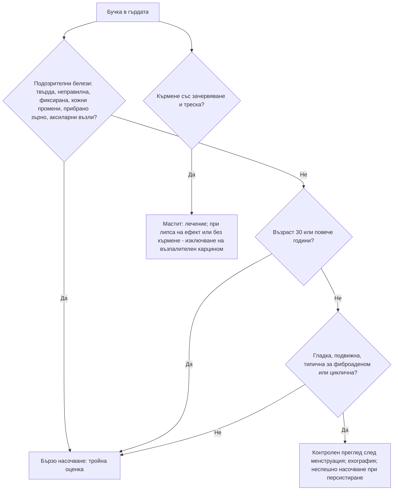

# Глава 65. Заболявания на гърдата

> **Част XIII. Репродуктивно здраве и бременност**

## Цели на главата

- Да се оценява бучката в гърдата чрез „тройната оценка“: клиничен преглед, образно изследване, биопсия.
- Да се разграничават доброкачествените от злокачествените лезии по клиничните белези и възрастта.
- Да се разпознават възпалителният карцином на гърдата и болестта на Paget на зърното.
- Да се разграничават цикличната от нецикличната мастодиния и физиологичната от патологичната секреция от зърното.
- Да се определят показанията за бързо насочване.

---

## 1. Бучка в гърдата

### 1.1. Доброкачествени причини

| Лезия | Типична възраст | Ключови белези |
|---|---|---|
| **Фиброаденом** | 15–35 години | **Гладък, гумено-еластичен, много подвижен** („подвижна мишка“), неболезнен |
| **Киста** | 35–50 години (перименопауза) | Гладка, добре ограничена, понякога болезнена, **може да се появи внезапно** и да се променя с цикъла |
| **Фиброкистозни промени** | 20–50 години | **Циклична** нодуларност и болезненост, двустранно, в горните външни квадранти |
| **Мастна некроза** | Всяка | След **травма** или операция; **твърда, неправилна**, може да прибира кожата — **имитира карцином** |
| **Абсцес** | Кърмещи; **пушачки** (перидуктален мастит) | Болка, зачервяване, флуктуация, треска |
| **Галактоцеле** | Кърмене | Киста, съдържаща мляко |
| **Филоиден тумор** | 40–50 години | **Бързо растящ**, голям; доброкачествен, граничен или злокачествен |
| **Интрадуктален папилом** | 35–55 години | Малка субареоларна формация, **секреция от зърното** |
| **Липом, хамартом, епидермоидна киста, лимфен възел** | Всяка | Съответни белези |

### 1.2. Белези, подозрителни за карцином

- **Твърда, неправилна, фиксирана** формация, обикновено **неболезнена**.
- **Прибиране на кожата** (трапчинка), **„портокалова кора“**.
- **Новопоявило се прибиране на зърното**.
- **Кървава секреция** от един канал.
- **Аксиларна лимфаденопатия.**
- Промени по кожата на зърното (екзема, язва).
- Възраст над 30 години (рискът нараства с възрастта).

### 1.3. Рискови фактори за карцином на гърдата

- Възраст, женски пол.
- **Фамилна анамнеза** (роднини от първа степен, **мутации в BRCA1 и BRCA2**, карцином на яйчника в семейството, карцином на гърдата при мъж в семейството).
- Предшестващ карцином на гърдата или атипия при биопсия.
- Ранно менархе, късна менопауза, липса на раждания или късно първо раждане.
- **Комбинирана хормонозаместителна терапия.**
- **Алкохол**, затлъстяване след менопаузата.
- **Облъчване на гръдния кош** (например при лимфом на Hodgkin).
- Плътна гърдна тъкан.

## 2. Тройна оценка

1. **Клиничен преглед** — оглед (в седнало положение, с ръце встрани и над главата), палпация на двете гърди и на аксиларните и надключичните лимфни възли.
2. **Образно изследване:**
   - **ехография** при жени под 30–35 години;
   - **мамография и ехография** при по-възрастни жени.
3. **Биопсия** — дебелоиглена (за хистология) под образен контрол.

**Нормалното образно изследване не изключва карцином, ако клиничната находка е подозрителна.** Решението се взема от съвкупността на трите компонента.

## 3. Показания за бързо насочване (по NICE NG12)

- **Възраст ≥ 30 години** с необяснима бучка в гърдата (с или без болка).
- **Възраст ≥ 50 години** със секреция, прибиране или други тревожни промени **само на едното зърно**.
- **Кожни промени**, подозрителни за карцином.
- **Възраст ≥ 30 години** с необяснима формация в подмишницата.
- При възраст под 30 години с необяснима бучка — неспешно насочване.

---

## 4. Възпалителен карцином на гърдата и болест на Paget

### 4.1. Възпалителен карцином или мастит?

| Белег | Мастит (лактационен) | **Възпалителен карцином** |
|---|---|---|
| Контекст | **Кърмене** | Не кърми |
| Начало | Остро | Бързо, за седмици |
| Треска, общо неразположение | **Да** | Обикновено **не** |
| Кожа | Клиновидно зачервяване | Зачервяване, **оток, „портокалова кора“** на повече от една трета от гърдата |
| Отговор на антибиотик | Бърз | **Няма** |
| Формация | Възможен абсцес | Често не се палпира отделна формация |

**„Мастит“ при жена, която не кърми, или мастит, който не се повлиява от антибиотик за 1–2 седмици, изисква спешно изключване на възпалителен карцином.**

**Перидуктален мастит** — при непушачки е рядък. При пушачки е чест и протича като рецидивиращи субареоларни абсцеси и фистули.

### 4.2. Болест на Paget на зърното или екзема?

| Белег | Болест на Paget | Екзема на зърното |
|---|---|---|
| Страна | **Едностранно** | Често двустранно |
| Начало | **От зърното** към ареолата | **От ареолата**; зърното се засяга по-късно |
| Сърбеж | Лек или липсва | Изразен |
| Отговор на кортикостероиди | **Няма** | Бързо подобрение |
| Подлежащ карцином | **Обикновено има** | Няма |

**Едностранна „екзема“ на зърното, която не отзвучава след кратък курс локален кортикостероид, изисква биопсия.**

---

## 5. Мастодиния (болка в гърдата)

| Вид | Особености | Причини |
|---|---|---|
| **Циклична** | Двустранна, дифузна, преди менструация; млади жени | Хормонална |
| **Нециклична** | Често едностранна, локализирана | Кисти, дуктална ектазия, мастит, **лекарства** (хормонозаместителна терапия, контрацептиви, SSRI, спиронолактон, дигоксин), бременност |
| **Извънгърдна (отразена)** | Локализирана в гръдната стена | **Костохондрит**, мускулна болка, **миокардна исхемия**, белодробни заболявания, **херпес зостер**, шийна радикулопатия, жлъчни заболявания |

**Болката като единствен симптом рядко се дължи на карцином.** Тя все пак изисква преглед. При бучка, кожни промени или промени в зърното се прилагат критериите за насочване.

---

## 6. Секреция от зърното

| Вид | Особености | Причини |
|---|---|---|
| **Физиологична** | Двустранна, от **много канали**, само при изстискване; бистра, млечна или зеленикава | Норма |
| **Галакторея** | Двустранна, **млечна** | **Хиперпролактинемия**, лекарства (антипсихотици, метоклопрамид), хипотиреоидизъм, бременност и кърмене, стимулация на зърната (вж. глава 38) |
| **Дуктална ектазия** | Гъста, **зелена или черна**, от много канали | По-възрастни жени, пушачки |
| **Интрадуктален папилом** | **От един канал**, **кървава** или серозна, **спонтанна** | Най-честата причина за кървава секреция |
| **Карцином** | **Едностранна**, от **един канал**, **спонтанна**, **кървава** или серозна, с формация, при възраст над 50 години | Изисква образно изследване и дуктография, цитология или ексцизия |

---

## 7. Безопасна диагностична стратегия

| Въпрос | Отговор |
|---|---|
| **Вероятна диагноза** | Фиброаденом, кисти, фиброкистозни промени, циклична мастодиния, лактационен мастит |
| **Сериозни заболявания, които не бива да се пропускат** | **Карцином на гърдата** (включително при млади жени, при бременност и кърмене); **възпалителен карцином**; **болест на Paget**; филоиден тумор; лимфом; **карцином на гърдата при мъже** |
| **Чести капани** | Мастна некроза, която имитира карцином (и обратното); „мастит“, който не отговаря на антибиотик; едностранна „екзема“ на зърното; бучка при бременност или кърмене, приписана на „млечни канали“; отразена болка от сърцето или от гръдната стена |
| **Маскиращи заболявания** | Лекарства (галакторея, мастодиния), заболявания на щитовидната жлеза |
| **Психосоциални аспекти** | Страх от рак, тревожност, травма (мастна некроза при насилие) |

---

## 8. Диагностичен алгоритъм при бучка в гърдата

---

## 9. Клинични перли

- Всяка персистираща бучка в гърдата при жена над 30 години се насочва за тройна оценка.
- Нормалната мамография не изключва карцином при подозрителна клинична находка.
- „Мастит“ без кърмене и без отговор на антибиотик: възпалителен карцином, докато не се докаже противното.
- Едностранна „екзема“ на зърното, която не се повлиява от кортикостероид: болест на Paget. Направете биопсия.
- Новопоявилото се прибиране на зърното изисква оценка.
- Кървава спонтанна секреция от един канал: интрадуктален папилом или карцином.
- Бучката по време на бременност или кърмене трябва да се оценява със същата сериозност. Карциномът на гърдата при бременност се диагностицира често късно.
- Мастната некроза и карциномът могат да изглеждат еднакво. Решава биопсията.
- Болката в лявата гърда при усилие може да е стенокардия.

---

## 10. Клиничен случай

**Случай.** Жена на 46 години идва заради зачервяване, оток и затопляне на лявата гърда от 3 седмици. Не кърми. Няма треска. Приела е два курса антибиотици за „мастит“ без ефект. При прегледа: зачервяване и оток на над половината от гърдата, кожата има вид на **портокалова кора**, зърното е леко прибрано, отделна формация не се палпира. В лявата подмишница има твърд лимфен възел.

**Въпроси.** 1) Коя е най-вероятната диагноза? 2) Какво е поведението?

**Обсъждане.** Бързо развилото се зачервяване и оток на голяма част от гърдата с „портокалова кора“, **без треска**, **без кърмене** и **без отговор на антибиотици**, с аксиларна лимфаденопатия, е типично за **възпалителен карцином на гърдата**. Той се дължи на туморна инвазия на дермалните лимфни съдове и често протича без отделна палпируема формация. Пациентката се насочва **спешно** за мамография, ехография и **биопсия** (включително на кожата) и стадиране. Възпалителният карцином е агресивен. Всяка седмица забавяне има значение.

**Поука.** „Маститът“ при жена, която не кърми, особено без треска и без отговор на антибиотици, е възпалителен карцином, докато не се докаже противното.

<!-- навигация -->

---

[← Глава 64. Тазова болка и вагинално течение](64-tazova-bolka-techenie.md) · [Съдържание](../README.md) · [Глава 66. Диференциална диагноза по време на бременност →](66-bremennost.md)
