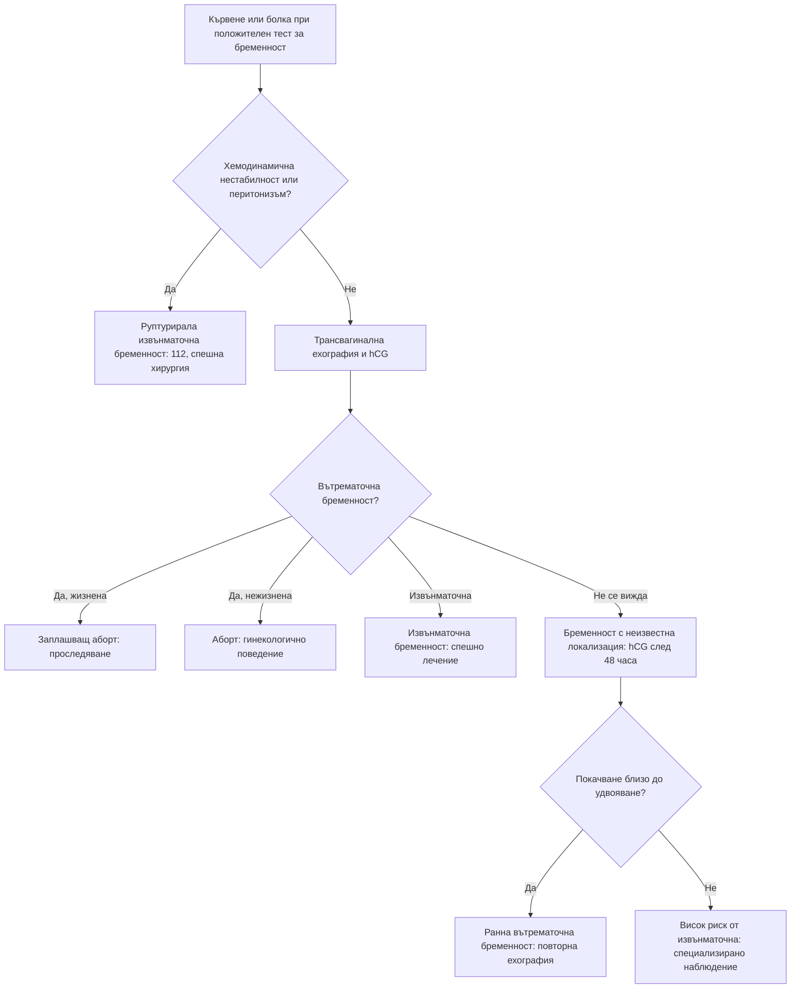

# Глава 66. Диференциална диагноза по време на бременност

> **Част XIII. Репродуктивно здраве и бременност**

## Цели на главата

- Да се подхожда към кървенето и болката в ранната бременност, като се изключва извънматочна бременност.
- Да се разпознават причините за кървене в късната бременност: предлежаща плацента, отлепване на плацентата, руптура на матката.
- Да се разграничават хипертоничните състояния при бременност и да се разпознават прееклампсията и HELLP синдромът, включително при нормално налягане.
- Да се познават чернодробните заболявания, специфични за бременността.
- Да се оценяват задухът, болката в гърдите, отокът на краката, сърбежът, треската и гърчовете при бременна.
- Да се разпознават спешните следродилни състояния.

---

## 1. Общи принципи

- Физиологичните промени при бременността променят нормалните стойности на много показатели (вж. глава 3). Например D-димерът, СУЕ, алкалната фосфатаза и левкоцитите се повишават, а креатининът се понижава.
- **Необходимите изследвания не бива да се отлагат.** Предпочитат се **ехографията** и **ЯМР** (без гадолиний). Рентгенографията и КТ са допустими, когато са показани. Лъчевото натоварване на плода при повечето диагностични изследвания е много под рисковия праг.
- Бременността **не предпазва** от небременни заболявания: апендицит, белодробна тромбемболия, инсулт.
- **Всяка жена в детеродна възраст с коремна болка, кървене или синкоп може да е бременна.**

---

## 2. Кървене и болка в ранната бременност (до 20 седмици)

| Причина | Ключови белези |
|---|---|
| **Имплантационно кървене** | Оскъдно кървене около времето на очакваната менструация |
| **Заплашващ аборт** | Кървене, затворена шийка, жизнена бременност |
| **Неизбежен, непълен, пълен или задържан аборт** | Кървене, болки тип „спазми“, отворена шийка, отделяне на тъкани; задържан аборт — без сърдечна дейност на плода |
| **Извънматочна бременност** | Болка (често едностранна), зацапване, **болка във върха на рамото**, **синкоп**, болезненост при движение на шийката; рисковите фактори са в глава 64. **Руптурата е животозастрашаваща** |
| **Мехурна бременност** (гестационна трофобластна болест) | Кървене, **хиперемеза**, **матка, по-голяма от гестационната възраст**, **много висок hCG**, **ранна прееклампсия** (преди 20 седмици), **хипертиреоидизъм**; ехографски образ на „снежна буря“ |
| **Причини от шийката** | **Ектропион** (чест при бременност), полипи, цервицит, карцином |
| **Субхорионален хематом** | Ехографска находка |

**Бременност с неизвестна локализация** — положителен тест, без видима вътрематочна или извънматочна бременност. Проследява се **динамиката на hCG**: при жизнена вътрематочна бременност hCG обикновено почти се удвоява за 48 часа. Недостатъчното покачване, платото или спадането насочват към извънматочна или неуспешна бременност.

---

## 3. Кървене в късната бременност

| Причина | Ключови белези |
|---|---|
| **Предлежаща плацента** | **Неболезнено** ярко червено кървене, **мека, неболезнена матка**, неправилно положение на плода. **Не се прави вагинален преглед с пръсти** преди ехография |
| **Отлепване на плацентата** | **Болка**, **напрегната, „дървена“ матка**, кървенето може да е скрито (несъответствие между видимата кръвозагуба и шока); **хипертония, кокаин, травма, тютюнопушене**; дистрес на плода, ДВС |
| **Vasa previa** | Кървене при пукване на околоплодния мехур с **брадикардия на плода** |
| **Руптура на матката** | **Предишно цезарово сечение**, внезапна силна болка, спиране на контракциите, шок |
| **Начало на раждане** | Слуз с кръв, контракции |
| **Причини от шийката и влагалището** | Ектропион, полипи, травма |

---

## 4. Коремна болка при бременност

| Група | Причини |
|---|---|
| **Акушерски** | Извънматочна бременност, аборт, **отлепване на плацентата**, раждане и преждевременно раждане, **руптура на матката**, **хориоамнионит**, болка от кръглите връзки (доброкачествена), дегенерация на миом, **торзия на яйчника** (по-честа при бременност) |
| **Хирургични** | **Апендицит** (най-честото хирургично спешно състояние при бременност; апендиксът се измества нагоре с растежа на матката), холецистит, панкреатит, чревна непроходимост |
| **Уринарни** | **Инфекция на пикочните пътища и пиелонефрит** (по-чести при бременност), бъбречна колика |
| **Специфични за бременността** | **Прееклампсия и HELLP синдром** (болка в **епигастриума и десния горен квадрант**!), **остра мастна дегенерация на черния дроб** |
| **Други** | Диабетна кетоацидоза, запек, хематом на правия коремен мускул |

---

## 5. Хипертония при бременност

| Състояние | Определение |
|---|---|
| **Хронична хипертония** | Хипертония преди бременността или преди 20-ата седмица |
| **Гестационна хипертония** | Хипертония, възникнала след 20-ата седмица, **без** протеинурия и без органна дисфункция |
| **Прееклампсия** | Хипертония след 20-ата седмица **и** протеинурия **или** органна дисфункция: бъбречна (покачване на креатинина), чернодробна (повишени трансаминази, болка в десния горен квадрант), **неврологична** (силно главоболие, **зрителни нарушения**, хиперрефлексия, клонус), хематологична (**тромбоцитопения**, хемолиза), маточно-плацентарна (изоставане в растежа на плода) |
| **Тежка прееклампсия** | АН ≥ 160/110 mmHg или тежка органна дисфункция |
| **HELLP синдром** | **Хемолиза** (**H**emolysis), **повишени чернодробни ензими** (**E**levated **L**iver enzymes), **ниски тромбоцити** (**L**ow **P**latelets). Проявява се с болка в епигастриума или десния горен квадрант, гадене, повръщане, неразположение. **Налягането може да е нормално или само леко повишено** |
| **Еклампсия** | Гърчове при прееклампсия |
| **Следродилна прееклампсия** | До **6 седмици** след раждането |

**Главоболие при бременна или родилка — диференциална диагноза:** прееклампсия, **тромбоза на венозните синуси**, синдром на обратимата церебрална вазоконстрикция, синдром на задната обратима енцефалопатия, **хипофизна апоплексия**, **субарахноидален кръвоизлив**, главоболие след пункция на твърдата мозъчна обвивка (епидурална анестезия), мигрена (обикновено се подобрява при бременност), менингит.

---

## 6. Чернодробни заболявания при бременност

| Заболяване | Време | Ключови белези |
|---|---|---|
| **Hyperemesis gravidarum** | I триместър | Упорито повръщане, **загуба на > 5% от теглото**, дехидратация, кетонурия; леко повишени трансаминази; **риск от енцефалопатия на Wernicke** |
| **Интрахепатална холестаза на бременността** | II–III триместър | **Сърбеж, особено по дланите и ходилата**, **без обрив**; **повишени жлъчни киселини**; риск от **мъртво раждане** |
| **Прееклампсия и HELLP** | След 20-ата седмица | Вж. т. 5 |
| **Остра мастна дегенерация на черния дроб** | III триместър | Гадене, повръщане, коремна болка, **полидипсия**, жълтеница, **хипогликемия**, коагулопатия, ОБУ, енцефалопатия — **спешно родоразрешение** |
| **Вирусен хепатит** | Всяко време | **Хепатит E** протича тежко при бременни |
| **Жлъчнокаменна болест** | Всяко време | По-честа при бременност |
| **Синдром на Budd-Chiari** | Всяко време | Хиперкоагулабилитет |

---

## 7. Гадене и повръщане

- **Гадене и повръщане при бременност** са нормални в I триместър, с максимум около 9–12-ата седмица.
- **Hyperemesis gravidarum** се диагностицира след изключване на мехурна и многоплодна бременност (ехография), инфекция на пикочните пътища, заболявания на щитовидната жлеза, стомашно-чревни заболявания и диабетна кетоацидоза.
- **Повръщане, започнало след 12-ата седмица**, изисква търсене на друга причина: апендицит, пиелонефрит, панкреатит, остра мастна дегенерация на черния дроб, прееклампсия.

---

## 8. Задух, болка в гърдите и оток на краката

| Оплакване | Физиологично | **Патологично** |
|---|---|---|
| **Задух** | Постепенен, не в покой, нормални SpO₂ и преглед | **Белодробна тромбемболия** (водеща причина за майчина смъртност в развитите страни); **перипартална кардиомиопатия** (сърдечна недостатъчност в края на бременността или след раждането); белодробен оток при прееклампсия; пристъп на астма; пневмония; **митрална стеноза**, проявила се за първи път; анемия; **емболия с околоплодна течност** (по време на раждане) |
| **Болка в гърдите** | Гастроезофагеален рефлукс, мускулно-скелетна | **Спонтанна дисекация на коронарна артерия** (особено перипартално), **белодробна тромбемболия**, **дисекация на аортата** (синдром на Marfan, двукуспидна клапа), миокарден инфаркт |
| **Оток на краката** | Двустранен, в края на бременността | **Тромбоза на дълбоките вени** (по-често **вляво** и илиофеморално), прееклампсия |

**D-димерът е с ограничена стойност при бременност**, защото физиологично се повишава. При съмнение за белодробна тромбемболия се използват адаптирани алгоритми и образни изследвания (компресионна ехография на краката, КТ-ангиография или вентилационно-перфузионна сцинтиграфия).

---

## 9. Сърбеж и обриви при бременност

| Състояние | Ключови белези |
|---|---|
| **Интрахепатална холестаза на бременността** | **Сърбеж без обрив**, дланите и ходилата, III триместър; жлъчни киселини |
| **Полиморфна ерупция на бременността** | Първа бременност, III триместър, **в стриите на корема**, **пощадява пъпа** |
| **Пемфигоид на бременността** | Везикули и мехури **около и в пъпа**, риск за плода |
| **Атопична ерупция на бременността** | Екземни промени, често в по-ранните срокове |
| **Инфекции** | **Варицела** (риск от пневмония при майката и увреждане на плода), **парвовирус B19** (хидропс на плода), рубеола, морбили, сифилис |

---

## 10. Треска при бременност

- Инфекция на пикочните пътища и **пиелонефрит**.
- **Хориоамнионит** (след пукване на околоплодния мехур).
- **Листериоза** — грипоподобно заболяване; непастьоризирани сирена, колбаси; риск от аборт, мъртво раждане и неонатален сепсис.
- Грип и COVID-19 (по-тежко протичане).
- Апендицит.
- **Сепсис** — включително **стрептококи от група A** (висока смъртност, особено следродилно).
- **Малария** (при пътуване).
- CMV и токсоплазмоза (риск за плода).

---

## 11. Гърчове при бременност

**Гърчовете при бременна след 20-ата седмица или в следродилния период са еклампсия, докато не се докаже противното.** Други причини: епилепсия, **тромбоза на венозните синуси**, синдром на задната обратима енцефалопатия, хипогликемия, инсулт, тромботична тромбоцитопенична пурпура.

---

## 12. Намалени движения на плода

Намалените или променени движения на плода след 24-ата седмица изискват **оценка в същия ден** (кардиотокография и при нужда ехография).

---

## 13. Следродилен период

| Състояние | Ключови белези |
|---|---|
| **Следродилен кръвоизлив** | „4-те Т“: тонус (атония на матката), травма, тъкан (задържани части от плацентата), тромбин (коагулопатия) |
| **Ендометрит, сепсис** | Треска, болка, неприятно течение; **стрептококи от група A** |
| **Венозен тромбоемболизъм** | Най-висок риск в първите седмици след раждането |
| **Следродилна прееклампсия** | До 6 седмици |
| **Следродилен тиреоидит** | Вж. глава 37 |
| **Следродилна депресия** | Вж. глава 74 |
| **Следродилна психоза** | **Спешно състояние**: начало обикновено в **първите 2 седмици**, объркване, мания, психоза; анамнеза за биполярно разстройство |
| **Синдром на Sheehan** | Масивен кръвоизлив → липса на лактация, хипопитуитаризъм |
| **Перипартална кардиомиопатия** | Задух, отоци, умора |
| **Спонтанна дисекация на коронарна артерия** | Болка в гърдите |
| **Мастит** | Вж. глава 65 |
| **Тромбоза на венозните синуси** | Главоболие, гърчове |

---

## 14. Безопасна диагностична стратегия

| Въпрос | Отговор |
|---|---|
| **Вероятна диагноза** | Физиологични промени, гадене и повръщане при бременност, заплашващ аборт, инфекция на пикочните пътища, гастроезофагеален рефлукс, болка от кръглите връзки |
| **Сериозни заболявания, които не бива да се пропускат** | **Извънматочна бременност**; **отлепване на плацентата**; **предлежаща плацента**; **руптура на матката**; **прееклампсия, HELLP, еклампсия**; **остра мастна дегенерация на черния дроб**; **белодробна тромбемболия**; **сепсис**; **апендицит**; **перипартална кардиомиопатия**; **тромбоза на венозните синуси**; **следродилна психоза**; мехурна бременност |
| **Чести капани** | HELLP, приет за „гастрит“ поради нормално налягане; холестаза на бременността, лекувана с антихистамини; апендицит с нетипична локализация; белодробна тромбемболия, приета за „физиологичен задух“; повръщане след 12-ата седмица, прието за „бременност“; тромбоза на левия крак, приета за физиологичен оток |
| **Маскиращи заболявания** | Заболявания на щитовидната жлеза, анемия, инфекция на пикочните пътища, захарен диабет, депресия |
| **Психосоциални аспекти** | **Домашно насилие** (често започва или се засилва по време на бременност), депресия, тревожност, злоупотреба с вещества |

---

## 15. Червени флагове

- Вагинално кървене с болка или с хемодинамична нестабилност.
- Силна коремна болка, особено с напрегната матка.
- **АН ≥ 140/90 mmHg** с главоболие, **зрителни нарушения**, болка в епигастриума, повръщане, оток на лицето.
- Гърчове или нарушено съзнание.
- Задух в покой, болка в гърдите, тахикардия, хипоксемия.
- Треска с тахикардия, хипотония или нарушено съзнание (сепсис).
- **Намалени движения на плода.**
- Сърбеж по дланите и ходилата в III триместър.
- Жълтеница, хипогликемия, коагулопатия.
- Изтичане на околоплодна течност преди термина.
- Следродилно объркване, мания или психоза.

---

## 16. Диагностичен алгоритъм при кървене и болка в ранната бременност

---

## 17. Клинични перли

- Всяка бременна с болка в епигастриума изисква измерване на АН, изследване на урината за белтък, тромбоцити и чернодробни ензими.
- HELLP синдромът може да протече с нормално налягане.
- Сърбежът по дланите и ходилата в III триместър изисква изследване на жлъчните киселини.
- При кървене в късната бременност не правете вагинален преглед с пръсти, преди да е изключена предлежаща плацента.
- Болка с напрегната матка и шок, непропорционален на видимото кървене: отлепване на плацентата.
- Задухът в покой при бременна не е физиологичен.
- Гърчове при бременна или родилка: еклампсия, докато не се докаже противното.
- Много висок hCG с хиперемеза и голяма матка: мехурна бременност.
- Намалените движения на плода изискват оценка в същия ден.
- Питайте за домашно насилие. Бременността е период на повишен риск.
- Следродилната психоза е психиатрично спешно състояние със суициден и инфантициден риск.

---

## 18. Клиничен случай

**Случай.** Бременна на 32 години в 34-ата гестационна седмица се оплаква от болка в епигастриума и десния горен квадрант, гадене и повръщане от вчера. Смята, че „е яла нещо“. Прегледана е в спешен кабинет, където е поставена диагноза „гастрит“. АН 146/92 mmHg (при предишните прегледи е било около 115/75 mmHg). Уринната лента показва белтък 2+. Тромбоцити 88 × 10⁹/l, АЛАТ 210 U/l, АСАТ 245 U/l, ЛДХ 720 U/l, хаптоглобин нисък.

**Въпроси.** 1) Каква е диагнозата? 2) Какво е поведението?

**Обсъждане.** Болката в епигастриума и десния горен квадрант, гаденето, новопоявилата се хипертония, протеинурията, **тромбоцитопенията**, **повишените трансаминази** и **хемолизата** (висока ЛДХ, нисък хаптоглобин) при бременна след 20-ата седмица означават **HELLP синдром** на фона на прееклампсия. Състоянието е **животозастрашаващо** за майката (руптура на черния дроб, еклампсия, ДВС, инсулт) и за плода. Необходими са спешна хоспитализация в акушерско звено с интензивни грижи, стабилизиране (контрол на налягането, магнезиев сулфат за профилактика на гърчовете), кортикостероиди за белодробната зрялост на плода и планиране на родоразрешението.

**Поука.** „Гастрит“ в третия триместър е HELLP, докато не се докаже противното. Измерете налягането и изследвайте урината, тромбоцитите и чернодробните ензими.
