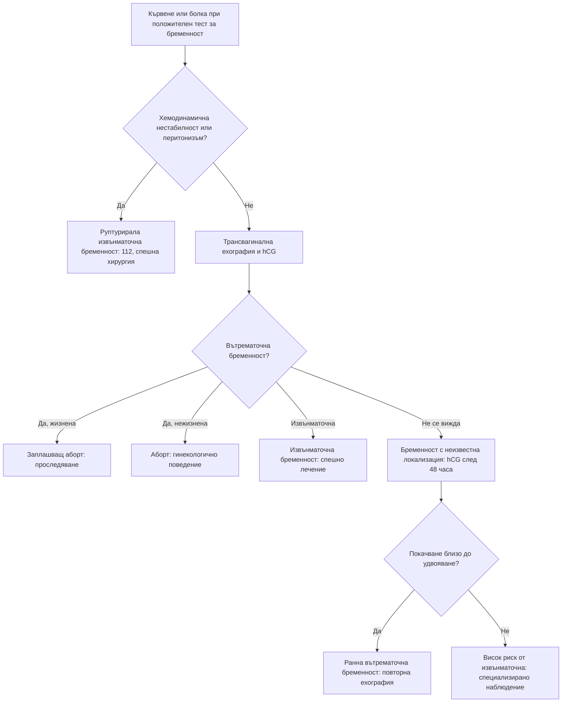

# Глава 66. Диференциална диагноза по време на бременност

> **Част XIII. Репродуктивно здраве и бременност**

## Цели на главата

- Да се оценяват кървенето и болката в ранната бременност, като се изключва извънматочна бременност (hCG и трансвагинална ехография).
- Да се разпознават причините за кървене в късната бременност: предлежаща плацента, отлепване на плацентата, руптура на матката.
- Да се разграничават хипертоничните състояния при бременност и да се разпознават прееклампсията и HELLP синдромът, включително при нормално налягане.
- Да се познават чернодробните заболявания, специфични за бременността.
- Да се оценяват задухът, болката в гърдите, отокът на краката, сърбежът, треската и гърчовете при бременна.
- Да се разпознават спешните следродилни състояния.

## Ключови моменти

- Всяка жена в детеродна възраст с коремна болка, кървене или синкоп може да е бременна. Необходимите изследвания при бременна не се отлагат *(SORT C [1])*.
- При бременност с неизвестна локализация покачване на hCG с над 63% за 48 часа говори за вътрематочна бременност, но не изключва извънматочна *(SORT C [2])*.
- Прееклампсията е хипертония след 20-ата седмица с протеинурия или органна дисфункция. HELLP синдромът може да протече с почти нормално налягане *(SORT C [4])*.
- При кървене в късната бременност не се прави вагинален преглед с пръсти, преди да се изключи предлежаща плацента *(SORT C [3])*.
- Сърбежът по дланите и ходилата в III триместър изисква изследване на жлъчните киселини *(SORT B [6, 7])*.
- Намалените движения на плода след 24-ата седмица изискват оценка в същия ден *(SORT C [9])*.

### Първите 60 секунди

- Оценете пулса, АН, дишането, съзнанието и кървенето. При шок, силно кървене, гърчове или нарушено съзнание — 112 и положение на лявата страна след 20-ата седмица.
- Измерете АН и изследвайте урината за белтък при всяка бременна с главоболие, зрителни нарушения или болка в епигастриума [4].
- Гърчове след 20-ата седмица или след раждането: еклампсия до доказване на противното — обезопасете дихателните пътища и организирайте спешен транспорт за магнезиев сулфат [4].
- При кървене в късната бременност не правете вагинален преглед с пръсти [3].
- Попитайте за движенията на плода след 24-ата седмица [9].

---

## 1. Общи принципи

- Физиологичните промени при бременността променят нормалните стойности на много показатели (вж. глава 3). Например D-димерът, СУЕ, алкалната фосфатаза и левкоцитите се повишават, а креатининът се понижава.
- **Необходимите изследвания не бива да се отлагат.** Предпочитат се **ехографията** и **ЯМР** (без гадолиний). Рентгенографията и КТ са допустими, когато са показани. Лъчевото натоварване на плода при повечето диагностични изследвания е много под рисковия праг [1].
- Бременността **не предпазва** от небременни заболявания: апендицит, белодробна тромбемболия, инсулт.
- **Всяка жена в детеродна възраст с коремна болка, кървене или синкоп може да е бременна.**

---

## 2. Кървене и болка в ранната бременност (до 20 седмици)

| Причина | Ключови белези |
|---|---|
| **Имплантационно кървене** | Оскъдно кървене около времето на очакваната менструация |
| **Заплашващ аборт** | Кървене, затворена шийка, жизнена бременност |
| **Неизбежен, непълен, пълен или задържан аборт** | Кървене, болки тип „спазми“, отворена шийка, отделяне на тъкани; задържан аборт — без сърдечна дейност на плода |
| **Извънматочна бременност** | Болка (често едностранна), зацапване, **болка във върха на рамото**, **синкоп**, болезненост при движение на шийката; рисковите фактори са в глава 64. **Руптурата е животозастрашаваща** |
| **Мехурна бременност** (гестационна трофобластна болест) | Кървене, **хиперемеза**, **матка, по-голяма от гестационната възраст**, **много висок hCG**, **ранна прееклампсия** (преди 20 седмици), **хипертиреоидизъм**; ехографски образ на „снежна буря“ |
| **Причини от шийката** | **Ектропион** (чест при бременност), полипи, цервицит, карцином |
| **Субхорионален хематом** | Ехографска находка |

**Бременност с неизвестна локализация** — положителен тест, без видима вътрематочна или извънматочна бременност. Проследява се **динамиката на hCG** за 48 часа. Покачване с над 63% говори за вероятна развиваща се вътрематочна бременност, но не изключва извънматочна. Спад с над 50% говори за неуспешна бременност. При по-малко покачване или по-малък спад е нужна оценка в кабинет за ранна бременност до 24 часа [2].

---

## 3. Кървене в късната бременност

| Причина | Ключови белези |
|---|---|
| **Предлежаща плацента** | **Неболезнено** ярко червено кървене, **мека, неболезнена матка**, неправилно положение на плода. **Не се прави вагинален преглед с пръсти** преди ехография [3] |
| **Отлепване на плацентата** | **Болка**, **напрегната, „дървена“ матка**, кървенето може да е скрито (несъответствие между видимата кръвозагуба и шока); **хипертония, кокаин, травма, тютюнопушене**; дистрес на плода, ДВС |
| **Vasa previa** | Кървене при пукване на околоплодния мехур с **брадикардия на плода** |
| **Руптура на матката** | **Предишно цезарово сечение**, внезапна силна болка, спиране на контракциите, шок |
| **Начало на раждане** | Слуз с кръв, контракции |
| **Причини от шийката и влагалището** | Ектропион, полипи, травма |

---

## 4. Коремна болка при бременност

| Група | Причини |
|---|---|
| **Акушерски** | Извънматочна бременност, аборт, **отлепване на плацентата**, раждане и преждевременно раждане, **руптура на матката**, **хориоамнионит**, болка от кръглите връзки (доброкачествена), дегенерация на миом, **торзия на яйчника** (по-честа при бременност) |
| **Хирургични** | **Апендицит** (най-честото хирургично спешно състояние при бременност; апендиксът се измества нагоре с растежа на матката), холецистит, панкреатит, чревна непроходимост |
| **Уринарни** | **Инфекция на пикочните пътища и пиелонефрит** (по-чести при бременност), бъбречна колика |
| **Специфични за бременността** | **Прееклампсия и HELLP синдром** (болка в **епигастриума и десния горен квадрант**!), **остра мастна дегенерация на черния дроб** |
| **Други** | Диабетна кетоацидоза, запек, хематом на правия коремен мускул |

---

## 5. Хипертония при бременност

| Състояние | Определение |
|---|---|
| **Хронична хипертония** | Хипертония преди бременността или преди 20-ата седмица |
| **Гестационна хипертония** | Хипертония, възникнала след 20-ата седмица, **без** протеинурия и без органна дисфункция |
| **Прееклампсия** | Хипертония след 20-ата седмица **и** протеинурия **или** органна дисфункция: бъбречна (покачване на креатинина), чернодробна (повишени трансаминази, болка в десния горен квадрант), **неврологична** (силно главоболие, **зрителни нарушения**, хиперрефлексия, клонус), хематологична (**тромбоцитопения**, хемолиза), маточно-плацентарна (изоставане в растежа на плода) [4] |
| **Тежка прееклампсия** | АН ≥ 160/110 mmHg или тежка органна дисфункция |
| **HELLP синдром** | **Хемолиза** (**H**emolysis), **повишени чернодробни ензими** (**E**levated **L**iver enzymes), **ниски тромбоцити** (**L**ow **P**latelets). Проявява се с болка в епигастриума или десния горен квадрант, гадене, повръщане, неразположение. **Налягането може да е нормално или само леко повишено** |
| **Еклампсия** | Гърчове при прееклампсия |
| **Следродилна прееклампсия** | До **6 седмици** след раждането |

**Главоболие при бременна или родилка — диференциална диагноза:** прееклампсия, **тромбоза на венозните синуси**, синдром на обратимата церебрална вазоконстрикция, синдром на задната обратима енцефалопатия, **хипофизна апоплексия**, **субарахноидален кръвоизлив**, главоболие след пункция на твърдата мозъчна обвивка (епидурална анестезия), мигрена (обикновено се подобрява при бременност), менингит.

---

## 6. Чернодробни заболявания при бременност

| Заболяване | Време | Ключови белези |
|---|---|---|
| **Hyperemesis gravidarum** | I триместър | Упорито повръщане с дехидратация, електролитни нарушения и **загуба на тегло** (класически > 5%). Тежестта се оценява с валидирана скала (PUQE), а кетонурията не е показател за дехидратация. Леко повишени трансаминази; **риск от енцефалопатия на Wernicke** — тиамин при хоспитализация, особено преди глюкоза [5] |
| **Интрахепатална холестаза на бременността** | II–III триместър | **Сърбеж, особено по дланите и ходилата**, **без обрив**; **повишени жлъчни киселини**; рискът от **мъртво раждане** нараства при жлъчни киселини ≥ 100 µmol/l [6, 7] |
| **Прееклампсия и HELLP** | След 20-ата седмица | Вж. т. 5 |
| **Остра мастна дегенерация на черния дроб** | III триместър | Гадене, повръщане, коремна болка, **полидипсия**, жълтеница, **хипогликемия**, коагулопатия, ОБУ, енцефалопатия — **спешно родоразрешение** |
| **Вирусен хепатит** | Всяко време | **Хепатит E** протича тежко при бременни |
| **Жлъчнокаменна болест** | Всяко време | По-честа при бременност |
| **Синдром на Budd-Chiari** | Всяко време | Хиперкоагулабилитет |

---

## 7. Гадене и повръщане

- **Гадене и повръщане при бременност** са нормални в I триместър, с максимум около 9–12-ата седмица.
- **Hyperemesis gravidarum** се диагностицира след изключване на мехурна и многоплодна бременност (ехография), инфекция на пикочните пътища, заболявания на щитовидната жлеза, стомашно-чревни заболявания и диабетна кетоацидоза.
- **Повръщане, започнало след 12-ата седмица**, изисква търсене на друга причина: апендицит, пиелонефрит, панкреатит, остра мастна дегенерация на черния дроб, прееклампсия.

---

## 8. Задух, болка в гърдите и оток на краката

| Оплакване | Физиологично | **Патологично** |
|---|---|---|
| **Задух** | Постепенен, не в покой, нормални SpO₂ и преглед | **Белодробна тромбемболия** (водеща причина за майчина смъртност в развитите страни); **перипартална кардиомиопатия** (сърдечна недостатъчност в края на бременността или след раждането); белодробен оток при прееклампсия; пристъп на астма; пневмония; **митрална стеноза**, проявила се за първи път; анемия; **емболия с околоплодна течност** (по време на раждане) |
| **Болка в гърдите** | Гастроезофагеален рефлукс, мускулно-скелетна | **Спонтанна дисекация на коронарна артерия** (особено перипартално), **белодробна тромбемболия**, **дисекация на аортата** (синдром на Marfan, двукуспидна клапа), миокарден инфаркт |
| **Оток на краката** | Двустранен, в края на бременността | **Тромбоза на дълбоките вени** (по-често **вляво** и илиофеморално), прееклампсия |

**D-димерът е с ограничена стойност при бременност**, защото физиологично се повишава. При съмнение за белодробна тромбемболия се използват адаптирани алгоритми и образни изследвания (компресионна ехография на краката, КТ-ангиография или вентилационно-перфузионна сцинтиграфия). С адаптирания за бременност алгоритъм YEARS КТ-ангиографията е избегната при 32–65% от бременните при много нисък риск от пропуснат тромбемболизъм [8].

---

## 9. Сърбеж и обриви при бременност

| Състояние | Ключови белези |
|---|---|
| **Интрахепатална холестаза на бременността** | **Сърбеж без обрив**, дланите и ходилата, III триместър; жлъчни киселини |
| **Полиморфна ерупция на бременността** | Първа бременност, III триместър, **в стриите на корема**, **пощадява пъпа** |
| **Пемфигоид на бременността** | Везикули и мехури **около и в пъпа**, риск за плода |
| **Атопична ерупция на бременността** | Екземни промени, често в по-ранните срокове |
| **Инфекции** | **Варицела** (риск от пневмония при майката и увреждане на плода), **парвовирус B19** (хидропс на плода), рубеола, морбили, сифилис |

---

## 10. Треска при бременност

- Инфекция на пикочните пътища и **пиелонефрит**.
- **Хориоамнионит** (след пукване на околоплодния мехур).
- **Листериоза** — грипоподобно заболяване; непастьоризирани сирена, колбаси; риск от аборт, мъртво раждане и неонатален сепсис.
- Грип и COVID-19 (по-тежко протичане).
- Апендицит.
- **Сепсис** — включително **стрептококи от група A** (висока смъртност, особено следродилно).
- **Малария** (при пътуване).
- CMV и токсоплазмоза (риск за плода).

---

## 11. Гърчове при бременност

**Гърчовете при бременна след 20-ата седмица или в следродилния период са еклампсия, докато не се докаже противното.** Прилага се магнезиев сулфат [4]. Други причини: епилепсия, **тромбоза на венозните синуси**, синдром на задната обратима енцефалопатия, хипогликемия, инсулт, тромботична тромбоцитопенична пурпура.

---

## 12. Намалени движения на плода

Намалените или променени движения на плода след 24-ата седмица изискват **оценка в същия ден** (кардиотокография и при нужда ехография). Бременната трябва да знае, че може да потърси акушерска помощ по всяко време на денонощието [9].

---

## 13. Следродилен период

| Състояние | Ключови белези |
|---|---|
| **Следродилен кръвоизлив** | „4-те Т“: тонус (атония на матката), травма, тъкан (задържани части от плацентата), тромбин (коагулопатия) |
| **Ендометрит, сепсис** | Треска, болка, неприятно течение; **стрептококи от група A** |
| **Венозен тромбемболизъм** | Най-висок риск в първите седмици след раждането |
| **Следродилна прееклампсия** | До 6 седмици |
| **Следродилен тиреоидит** | Вж. глава 37 |
| **Следродилна депресия** | Вж. глава 74 |
| **Следродилна психоза** | **Спешно състояние**: начало обикновено в **първите 2 седмици**, объркване, мания, психоза; анамнеза за биполярно разстройство; оценка от психиатър до 4 часа [10] |
| **Синдром на Sheehan** | Масивен кръвоизлив → липса на лактация, хипопитуитаризъм |
| **Перипартална кардиомиопатия** | Задух, отоци, умора |
| **Спонтанна дисекация на коронарна артерия** | Болка в гърдите |
| **Мастит** | Вж. глава 65 |
| **Тромбоза на венозните синуси** | Главоболие, гърчове |

---

## 14. Безопасна диагностична стратегия

| Въпрос | Отговор |
|---|---|
| **Вероятна диагноза** | Физиологични промени, гадене и повръщане при бременност, заплашващ аборт, инфекция на пикочните пътища, гастроезофагеален рефлукс, болка от кръглите връзки |
| **Сериозни заболявания, които не бива да се пропускат** | **Извънматочна бременност**; **отлепване на плацентата**; **предлежаща плацента**; **руптура на матката**; **прееклампсия, HELLP, еклампсия**; **остра мастна дегенерация на черния дроб**; **белодробна тромбемболия**; **сепсис**; **апендицит**; **перипартална кардиомиопатия**; **тромбоза на венозните синуси**; **следродилна психоза**; мехурна бременност |
| **Чести капани** | HELLP, приет за „гастрит“ поради нормално налягане; холестаза на бременността, лекувана с антихистамини; апендицит с нетипична локализация; белодробна тромбемболия, приета за „физиологичен задух“; повръщане след 12-ата седмица, прието за „бременност“; тромбоза на левия крак, приета за физиологичен оток |
| **Маскиращи заболявания** | Заболявания на щитовидната жлеза, анемия, инфекция на пикочните пътища, захарен диабет, депресия |
| **Психосоциални аспекти** | **Домашно насилие** (често започва или се засилва по време на бременност), депресия, тревожност, злоупотреба с вещества |

---

## 15. Червени флагове

- Вагинално кървене с болка или с хемодинамична нестабилност.
- Силна коремна болка, особено с напрегната матка.
- **АН ≥ 140/90 mmHg** с главоболие, **зрителни нарушения**, болка в епигастриума, повръщане, оток на лицето.
- Гърчове или нарушено съзнание.
- Задух в покой, болка в гърдите, тахикардия, хипоксемия.
- Треска с тахикардия, хипотония или нарушено съзнание (сепсис).
- **Намалени движения на плода.**
- Сърбеж по дланите и ходилата в III триместър.
- Жълтеница, хипогликемия, коагулопатия.
- Изтичане на околоплодна течност преди термина.
- Следродилно объркване, мания или психоза.

---

## 16. Диагностичен алгоритъм при кървене и болка в ранната бременност

*Фигура 66.1. Диагностичен алгоритъм при кървене и болка в ранната бременност. Схема на авторите въз основа на източниците, цитирани в главата.*

Текстово описание на фигура 66.1

1. Кървене или болка при положителен тест за бременност. Следва: към т. 2.
2. **Въпрос:** Хемодинамична нестабилност или перитонизъм? Да — към т. 3; Не — към т. 4.
3. Руптурирала извънматочна бременност: 112, спешна хирургия.
4. Трансвагинална ехография и hCG. Следва: към т. 5.
5. **Въпрос:** Вътрематочна бременност? Да, жизнена — към т. 6; Да, нежизнена — към т. 7; Извънматочна — към т. 8; Не се вижда — към т. 9.
6. Заплашващ аборт: проследяване.
7. Аборт: гинекологично поведение.
8. Извънматочна бременност: спешно лечение.
9. Бременност с неизвестна локализация: hCG след 48 часа. Следва: към т. 10.
10. **Въпрос:** Покачване близо до удвояване? Да — към т. 11; Не — към т. 12.
11. Ранна вътрематочна бременност: повторна ехография.
12. Висок риск от извънматочна: специализирано наблюдение.

---

## 17. Кога и колко спешно да насочим

| Спешност | Клинична ситуация |
|---|---|
| **Незабавно (112 или спешно отделение)** | Хемодинамична нестабилност или силна болка или кървене в ранна бременност [2]; кървене в късната бременност, особено с болка или напрегната матка; гърчове (еклампсия) [4]; тежка хипертония (≥ 160/110 mmHg) или прееклампсия с неврологични симптоми, болка в епигастриума или тромбоцитопения [4]; задух в покой, болка в гърдите или хипоксемия; сепсис; следродилен кръвоизлив |
| **В същия ден** | Положителен тест с болка и болезненост в корема, таза или при движение на шийката — кабинет за ранна бременност [2]; хипертония след 20-ата седмица с протеинурия — акушерска оценка [4]; намалени движения на плода след 24-ата седмица [9]; hyperemesis gravidarum с дехидратация или невъзможност за прием на течности [5]; сърбеж по дланите и ходилата с жълтеница; подозрение за следродилна психоза — психиатрична оценка до 4 часа [10]; изтичане на околоплодна течност преди термина |
| **Бързо (до 2 седмици)** | Сърбеж по дланите и ходилата в III триместър — жлъчни киселини и акушерска оценка съобразно резултата [6]; нова хронична хипертония при бременна — специалист по хипертония при бременност [4] |
| **Планово** | Бременни с хронични заболявания — предварителна консултация със съответния специалист; следродилна проверка на бъбречната функция и налягането след прееклампсия [4] |
| **Проследяване в общата практика** | Гадене и повръщане в I триместър без дехидратация [5]; гастроезофагеален рефлукс; физиологичен задух и оток; кървене под 6 седмици без болка и без рискови фактори — повторен тест след 7–10 дни [2] |

---

## 18. Клинични перли

- Всяка бременна с болка в епигастриума изисква измерване на АН, изследване на урината за белтък, тромбоцити и чернодробни ензими.
- HELLP синдромът може да протече с нормално налягане.
- Сърбежът по дланите и ходилата в III триместър изисква изследване на жлъчните киселини.
- При кървене в късната бременност не правете вагинален преглед с пръсти, преди да е изключена предлежаща плацента.
- Болка с напрегната матка и шок, непропорционален на видимото кървене: отлепване на плацентата.
- Задухът в покой при бременна не е физиологичен.
- Гърчове при бременна или родилка: еклампсия, докато не се докаже противното.
- Много висок hCG с хиперемеза и голяма матка: мехурна бременност.
- Намалените движения на плода изискват оценка в същия ден.
- Питайте за домашно насилие. Бременността е период на повишен риск.
- Следродилната психоза е психиатрично спешно състояние със суициден и инфантициден риск.

---

## 19. Клиничен случай

**Етап 1 — представяне.** Бременна на 32 години в 34-ата гестационна седмица има болка в епигастриума и десния горен квадрант, гадене и повръщане от вчера. Смята, че „е яла нещо“. В спешен кабинет е поставена диагноза „гастрит“.

> **Въпрос 1.** Какво трябва да се изследва веднага?

**Етап 2 — изследвания.** АН е 146/92 mmHg, а при предишните прегледи е било около 115/75 mmHg. Уринната лента показва белтък 2+. Тромбоцитите са 88 × 10⁹/l, АЛАТ — 210 U/l, АСАТ — 245 U/l, ЛДХ — 720 U/l, а хаптоглобинът е нисък.

> **Въпрос 2.** Каква е диагнозата?

> **Въпрос 3.** Какво е поведението?

Обсъждане и отговори

**Отговор 1.** При всяка бременна след 20-ата седмица с болка в епигастриума или десния горен квадрант се измерват АН и белтък в урината и се изследват тромбоцити, чернодробни ензими и креатинин [4].

**Отговор 2.** Новопоявилата се хипертония, протеинурията, **тромбоцитопенията**, **повишените трансаминази** и **хемолизата** (висока ЛДХ, нисък хаптоглобин) означават **HELLP синдром** на фона на прееклампсия [4]. Състоянието е животозастрашаващо за майката (руптура на черния дроб, еклампсия, ДВС, инсулт) и за плода.

**Отговор 3.** Необходими са спешна хоспитализация в акушерско звено с интензивни грижи и стабилизиране: контрол на налягането и магнезиев сулфат за профилактика на гърчовете — натоварваща доза 4 g интравенозно за 5–15 минути, след това 1 g/час за 24 часа [4]. Дават се кортикостероиди за белодробната зрялост на плода и се планира родоразрешение.

**Поука.** „Гастрит“ в третия триместър е HELLP синдром, докато не се докаже противното. Измерете налягането и изследвайте урината, тромбоцитите и чернодробните ензими.

---

## Обобщение

- Всяка жена в детеродна възраст с коремна болка, кървене или синкоп може да е бременна. Необходимите изследвания при бременна не се отлагат.
- Кървенето и болката в ранната бременност налагат изключване на извънматочна бременност с hCG и трансвагинална ехография. В късната бременност се мисли за предлежаща плацента, отлепване на плацентата и руптура на матката.
- Прееклампсията и HELLP синдромът се разпознават по налягането, белтъка в урината, тромбоцитите и чернодробните ензими. Гърчовете след 20-ата седмица са еклампсия до доказване на противното.
- Задухът в покой, сърбежът по дланите и ходилата, намалените движения на плода и следродилното объркване не са „нормални за бременността“.

## Самопроверка

### Въпроси с един верен отговор

**1.** *(основно ниво)* Жена на 27 години е с положителен тест за бременност. Ехографията не показва нито вътрематочна, нито извънматочна бременност. hCG е 900 IU/l, а след 48 часа — 1600 IU/l. Кое тълкуване е вярно?

- **А.** Извънматочната бременност е изключена
- **Б.** Вероятна е развиваща се вътрематочна бременност, но извънматочна не е изключена — повторна ехография
- **В.** Бременността е неуспешна
- **Г.** Необходимо е спешно лечение с метотрексат
- **Д.** Нужно е изследване на прогестерона

Отговор и обосновка

**Верен отговор: Б.** Покачването с около 78% за 48 часа (над 63%) говори за вероятна вътрематочна бременност, но не изключва извънматочна. Прави се повторна трансвагинална ехография [2].

**2.** *(основно ниво)* Бременна в 32-рата седмица има неболезнено ярко червено кървене. Матката е мека и неболезнена, а плодът е в седалищно предлежание. Кое е правилното поведение?

- **А.** Вагинален преглед с пръсти за оценка на шийката
- **Б.** Спешно насочване, без вагинален преглед с пръсти, преди ехография
- **В.** Наблюдение у дома
- **Г.** Токолиза в кабинета
- **Д.** Амниотомия

Отговор и обосновка

**Верен отговор: Б.** Неболезненото кървене с мека матка и неправилно положение насочват към предлежаща плацента. Вагиналният преглед с пръсти може да предизвика масивен кръвоизлив [3].

**3.** *(основно ниво)* Бременна в 35-ата седмица има силен сърбеж по дланите и ходилата от седмица, без обрив. Кое изследване е най-важно?

- **А.** Изследване за краста
- **Б.** Жлъчни киселини и чернодробни показатели
- **В.** ТСХ
- **Г.** Кожна биопсия
- **Д.** IgE

Отговор и обосновка

**Верен отговор: Б.** Сърбежът по дланите и ходилата в III триместър е типичен за интрахепатална холестаза на бременността. Рискът от мъртво раждане нараства при жлъчни киселини ≥ 100 µmol/l [6, 7].

**4.** *(напреднало ниво)* Жена на 30 години е родила преди 5 дни. Близките ѝ съобщават, че от вчера е объркана, не спи, говори бързо и твърди, че бебето „не е нейното“. Има анамнеза за биполярно разстройство. Кое е правилното поведение?

- **А.** Наблюдение и контрол след седмица
- **Б.** Незабавна психиатрична оценка (до 4 часа)
- **В.** Антидепресант и контрол след месец
- **Г.** Успокояване — „бебешка тъга“
- **Д.** Консултация с психолог по график

Отговор и обосновка

**Верен отговор: Б.** Внезапното объркване, манийните и психотичните симптоми в първите седмици след раждането, особено при биполярно разстройство, са следродилна психоза. Нужна е оценка до 4 часа [10].

**5.** *(напреднало ниво)* Бременна в 30-ата седмица има внезапен задух и болка в гърдите. Пулсът е 112/min, а SpO₂ — 94%. Кракът ѝ не е подут. Кое твърдение е вярно?

- **А.** Задухът е физиологичен за бременността
- **Б.** D-димерът е безполезен и не се изследва
- **В.** Използва се адаптиран за бременност алгоритъм и при нужда образно изследване, без да се отлага диагнозата
- **Г.** КТ-ангиографията е противопоказана при бременност
- **Д.** Лечение се започва едва след раждането

Отговор и обосновка

**Верен отговор: В.** Задухът в покой с тахикардия и хипоксемия не е физиологичен. Адаптираният алгоритъм YEARS безопасно намалява нуждата от КТ-ангиография [8], а лъчевото натоварване при нужните изследвания е много под рисковия праг [1].

### Задача

Бременна на 29 години в 9-ата седмица повръща многократно от 2 седмици, не задържа течности и е отслабнала с 4 kg (от 62 kg). Как ще подходите?

Решение

Загубата на тегло (над 6%), невъзможността да задържа течности и продължителното повръщане насочват към **hyperemesis gravidarum**. Тежестта се оценява със скалата PUQE, а кетонурията не е показател за дехидратация [5]. Изследват се електролити, креатинин, чернодробни показатели и урина. Ехографията изключва многоплодна и мехурна бременност. Пациентката се насочва в същия ден за интравенозна рехидратация с физиологичен разтвор и калий, антиеметици и **тиамин**, особено преди глюкоза [5]. Ако повръщането започне след 12-ата седмица, се търси друга причина.

### OSCE станция: Оценка на бременна с главоболие

**Време:** 8 минути. **Ниво:** основно (студенти, специализанти).

**Задача за кандидата.** Бременна на 28 години в 36-ата седмица има главоболие от сутринта. Снемете насочена анамнеза, посочете какво ще изследвате и решете колко спешно е насочването.

**Информация за симулирания пациент (за изпитващия).** Главоболието е силно и не минава с парацетамол. Вижда „искри“ пред очите и има лека болка под ребрата вдясно. АН е 158/104 mmHg, а на уринната лента белтъкът е 2+.

**Рубрика за оценяване**

| Критерий | Точки |
|---|---|
| Пита за характера и началото на главоболието, зрителните нарушения, болката в епигастриума и повръщането | 2 |
| Пита за движенията на плода, отоците и предишните стойности на налягането | 1 |
| Измерва правилно АН и изследва урината за белтък | 2 |
| Предлага ПКК, чернодробни ензими и креатинин | 1 |
| Разпознава тежката прееклампсия | 2 |
| Насочва незабавно към акушерско звено и обяснява причината | 2 |
| **Общо** | **10** |

**Праг за успешно представяне:** 7 от 10 точки, включително разпознаването на прееклампсията и незабавното насочване.

## Литература

1. Committee on Obstetric Practice. Committee Opinion No. 723: Guidelines for diagnostic imaging during pregnancy and lactation. Obstet Gynecol. 2017;130(4):e210-e216. doi:10.1097/AOG.0000000000002355. PMID: 28937575.
2. National Institute for Health and Care Excellence. Ectopic pregnancy and miscarriage: diagnosis and initial management (NICE guideline NG126). London: NICE; 2019 [актуализирано 2026]. Достъпно на: https://www.nice.org.uk/guidance/ng126
3. Jauniaux E, Alfirevic Z, Bhide AG, Belfort MA, Burton GJ, Collins SL, et al. Placenta Praevia and Placenta Accreta: Diagnosis and Management: Green-top Guideline No. 27a. BJOG. 2019;126(1):e1-e48. doi:10.1111/1471-0528.15306. PMID: 30260097.
4. National Institute for Health and Care Excellence. Hypertension in pregnancy: diagnosis and management (NICE guideline NG133). London: NICE; 2019 [актуализирано 2023]. Достъпно на: https://www.nice.org.uk/guidance/ng133
5. Nelson-Piercy C, Dean C, Shehmar M, Gadsby R, O'Hara M, Hodson K, et al. The Management of Nausea and Vomiting in Pregnancy and Hyperemesis Gravidarum (Green-top Guideline No. 69). BJOG. 2024;131(7):e1-e30. doi:10.1111/1471-0528.17739. PMID: 38311315.
6. Girling J, Knight CL, Chappell L; Royal College of Obstetricians and Gynaecologists. Intrahepatic cholestasis of pregnancy: Green-top Guideline No. 43 June 2022. BJOG. 2022;129(13):e95-e114. doi:10.1111/1471-0528.17206. PMID: 35942656.
7. Ovadia C, Seed PT, Sklavounos A, Geenes V, Di Ilio C, Chambers J, et al. Association of adverse perinatal outcomes of intrahepatic cholestasis of pregnancy with biochemical markers: results of aggregate and individual patient data meta-analyses. Lancet. 2019;393(10174):899-909. doi:10.1016/S0140-6736(18)31877-4. PMID: 30773280.
8. van der Pol LM, Tromeur C, Bistervels IM, Ni Ainle F, van Bemmel T, Bertoletti L, et al. Pregnancy-Adapted YEARS Algorithm for Diagnosis of Suspected Pulmonary Embolism. N Engl J Med. 2019;380(12):1139-1149. doi:10.1056/NEJMoa1813865. PMID: 30893534.
9. National Institute for Health and Care Excellence. Antenatal care (NICE guideline NG201). London: NICE; 2021. Достъпно на: https://www.nice.org.uk/guidance/ng201
10. National Institute for Health and Care Excellence. Antenatal and postnatal mental health: clinical management and service guidance (Clinical guideline CG192). London: NICE; 2014 [актуализирано 2020]. Достъпно на: https://www.nice.org.uk/guidance/cg192

*Последна проверка на съдържанието: септември 2026 г. Следващ планиран преглед: септември 2027 г. (вж. „Политика за актуализация“ в README).*

<!-- навигация -->

---

[← Глава 65. Заболявания на гърдата](65-garda.md) · [Съдържание](../README.md) · [Глава 67. Мъжко здраве: скротум, пенис и сексуална функция →](67-mazhko-zdrave.md)
