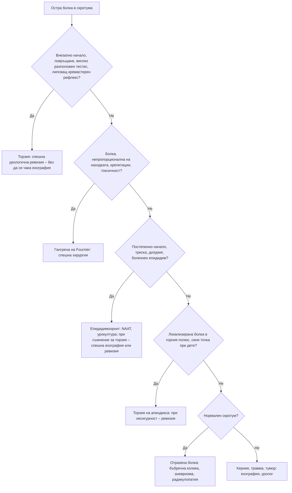

# Глава 67. Мъжко здраве: скротум, пенис и сексуална функция

> **Част XIII. Репродуктивно здраве и бременност**

## Цели на главата

- Да се насочва незабавно пациентът с остър скротум за хирургична ревизия при подозрение за торзия на тестиса.
- Да се разграничават торзията на тестиса, торзията на апендикса на тестиса и епидидимоорхитът.
- Да се оценяват формациите в скротума и да се разпознава туморът на тестиса.
- Да се разпознават спешните състояния на пениса: парафимоза, приапизъм, фрактура на пениса.
- Да се оценява сърдечно-съдовият риск при пациент с еректилна дисфункция.
- Да се разпознават уретритът и гениталните язви.

## Ключови моменти

- Всяка остра болка в скротума е торзия на тестиса до доказване на противното. Хирургичната ревизия не се отлага заради ехография *(SORT B [1, 2])*.
- При ревизия до 6 часа тестисът се запазва при около 97% от пациентите, но шанс има и след 24 часа *(SORT B [1])*.
- Твърдата неболезнена формация в тестиса е тумор до доказване на противното *(SORT C [5])*.
- Болка в перинеума, непропорционална на находката, при диабетик, особено на SGLT2 инхибитор, е гангрена на Fournier до доказване на противното *(SORT C [4])*.
- Исхемичният приапизъм (болезнена ерекция над 4 часа) е спешно състояние *(SORT C [6])*.
- Еректилната дисфункция е маркер за сърдечно-съдов риск и повод за оценка на налягането, липидите и глюкозата *(SORT B [8–10])*.

### Първите 60 секунди

- Попитайте кога точно е започнала болката, дали е внезапна и дали има гадене и повръщане.
- Прегледайте двата тестиса (положение, ос, болезненост, кремастерен рефлекс), включително при всяко момче с коремна болка.
- При подозрение за торзия насочете незабавно за урологична ревизия, без да чакате ехография [1, 2].
- Не давайте храна и течности през устата до решението за операция и обезболете адекватно.

---

## А. Остър скротум

### 1. Причини

*Таблица 67.1. Остър скротум: причини.*

| Заболяване | Възраст | Ключови белези |
|---|---|---|
| **Торзия на тестиса** | Най-често 12–18 години, но всяка възраст (включително новородени) | Внезапна силна болка, гадене и повръщане, високо разположен, хоризонтален тестис, липсващ кремастерен рефлекс; болката често се отразява в корема. Спешна хирургична ревизия. При ревизия до 6 часа тестисът се запазва при около 97% от пациентите, а след 24 часа – при около 18%, затова ревизия се прави и при по-късно представяне [1]. Ехографията не бива да забавя операцията при силно подозрение. Скалата TWIST помага за оценка на риска [2] |
| **Торзия на апендикса на тестиса** (хидатида на Morgagni) | 7–12 години | По-постепенно начало, болката е локализирана в горния полюс, „синя точка“ през кожата, запазен кремастерен рефлекс |
| **Епидидимоорхит** | Юноши и мъже | Постепенно начало, треска, дизурия, уретрален секрет, болезнен и оточен епидидим. Под 35 години – обикновено полово предавани инфекции (хламидия, гонорея); над 35 години – чревни бактерии (*E. coli*) при инфекции на пикочните пътища и урологични аномалии [3]. Паротитен орхит (неваксинирани; след паротит). Туберкулоза, бруцелоза (рядка в България, но се среща при огнища) |
| **Травма** | Всяка | Хематоцеле, руптура на тестиса |
| **Инкарцерирана ингвинална херния** | Всяка | Не може да се „стигне над“ формацията, повръщане, непроходимост |
| **Гангрена на Fournier** | Възрастни | Некротизиращ фасциит на перинеума и скротума: болка, непропорционална на находката, крепитации, тъмна кожа, системна токсичност; диабет, алкохол, имуносупресия, SGLT2 инхибитори – спешна хирургия [4] |
| **Отразена болка** | Всяка | Бъбречна колика, аневризма на коремната аорта, апендицит, лумбална радикулопатия – нормален скротум |
| **IgA васкулит** (пурпура на Henoch-Schönlein) | Деца | Пурпура, артралгии, коремна болка |
| **Идиопатичен оток на скротума** | Деца | Неболезнен оток и зачервяване |
| **Кръвоизлив в тумор** | Млади мъже | Около 10% от туморите на тестиса се проявяват с остра болка |

Всяка остра болка в скротума е торзия до доказване на противното. При момчета с коремна болка винаги се преглеждат тестисите.

---

## Б. Формации в скротума

### 2. Систематичен подход

1. **Може ли да се „стигне над“ формацията?** Ако не може – **ингвиноскротална херния**.
2. **Отделна ли е формацията от тестиса?**
3. **Прозира ли при трансилюминация?**

*Таблица 67.2. Формации в скротума: систематичен подход.*

| Формация | Ключови белези |
|---|---|
| **Киста на епидидима, сперматоцеле** | Над и зад тестиса, отделна от него, прозира |
| **Варикоцеле** | „Торба с червеи“, вляво, изчезва в легнало положение. Новопоявило се варикоцеле при възрастен, особено вдясно или неизчезващо в легнало положение – изключете тумор на бъбрека или ретроперитонеален процес |
| **Хидроцеле** | Обгражда тестиса, прозира; при млад мъж – ехография (вторично хидроцеле при тумор или инфекция) |
| **Тумор на тестиса** | Твърда, неболезнена формация в самия тестис; 15–40 години; рискови фактори – крипторхизъм, фамилна анамнеза, предишен тумор, синдром на Klinefelter, безплодие; гинекомастия (hCG); туморни маркери – AFP, бета-hCG, ЛДХ; ехография |
| **Лимфом на тестиса** | Мъже над 60 години – най-честият тумор на тестиса в тази възраст |
| **Възли на епидидима** | Туберкулоза, сперматична гранулома |
| **Кисти на кожата на скротума** | Повърхностни |

**Всяка твърда формация в тестиса е злокачествена до доказване на противното.** Необходими са бърза ехография и насочване към уролог [5].

---

## В. Пенис и уретра

### 3. Заболявания

*Таблица 67.3. Заболявания на пениса и уретрата.*

| Състояние | Ключови белези |
|---|---|
| **Баланит** | Зачервяване на главичката; кандида (диабет!), бактерии, дразнители. Рецидивиращ баланит – изследване за диабет |
| **Лихен склерозус (ксеротичен облитериращ баланит)** | Бели склерозирани участъци, вторична фимоза; риск от карцином |
| **Фимоза** | Физиологична при малки деца; патологична при белези |
| **Парафимоза** | Спешно: ретрахиран, оточен препуциум, който не може да се върне; често при катетеризирани възрастни хора |
| **Приапизъм** | Ерекция > 4 часа. Исхемичен (болезнен) – спешно; причини – сърповидноклетъчна болест, интракавернозни инжекции, тразодон, антипсихотици, кокаин, левкемия. Неисхемичен (неболезнен) – след травма [6] |
| **Фрактура на пениса** | „Пукане“ при полов акт, бързо спадане на ерекцията, хематом – спешно |
| **Болест на Peyronie** | Изкривяване, палпируема плака, болезнени ерекции |
| **Карцином на пениса** | Незарастваща лезия под препуциума, фимоза, HPV, възрастни мъже – бързо насочване [5] |
| **Генитални брадавици** | HPV |

### 4. Уретрален секрет

*Таблица 67.4. Уретрален секрет.*

| Причинител | Особености |
|---|---|
| ***Neisseria gonorrhoeae*** | Гноен, обилен секрет, кратък инкубационен период (2–5 дни), дизурия |
| ***Chlamydia trachomatis*** | Оскъден, мукоиден или бистър секрет, често безсимптомен |
| ***Mycoplasma genitalium*** | Персистиращ или рецидивиращ уретрит |
| ***Trichomonas vaginalis*** | Често безсимптомен при мъжете |

**Изследвания:** NAAT от първа порция урина; серология за HIV и сифилис; уведомяване на партньорите [7]. Реактивен артрит (уретрит, конюнктивит, артрит) може да последва хламидийната инфекция.

### 5. Генитални язви

Вж. таблицата в глава 64. Най-чести са генитален херпес (болезнени, множествени) и сифилис (неболезнен, твърд шанкър). Възможни са също венерическа лимфогранулома, болест на Behçet, фиксирана лекарствена реакция и карцином.

### 6. Хемоспермия

- **При мъже под 40 години** с единичен епизод обикновено е доброкачествена (след инструментални процедури, инфекции).
- **При мъже над 40 години** или при персистиране е необходима оценка на простатата (ректално туше, ПСА), изследване на урината, скрининг за полово предавани инфекции. Трябва да се има предвид и антикоагулантната терапия, простатитът, туберкулозата и шистозомиазата.

---

## Г. Еректилна дисфункция

### 7. Причини

*Таблица 67.5. Еректилна дисфункция: причини.*

| Група | Причини |
|---|---|
| **Съдови** (най-честите) | Атеросклероза, хипертония, дислипидемия, тютюнопушене. При около две трети от мъжете с еректилна дисфункция и исхемична болест на сърцето еректилната дисфункция се появява средно около 3 години по-рано [8]. Тя увеличава риска от сърдечно-съдови заболявания с около 50% [9] и е „канарчето в мината“ |
| **Метаболитни** | Захарен диабет (съдови и невропатни механизми), затлъстяване, метаболитен синдром |
| **Неврологични** | Множествена склероза, увреждане на гръбначния мозък, болест на Parkinson, простатектомия и други тазови операции, диабетна невропатия |
| **Хормонални** | Хипогонадизъм (особено с понижено либидо), хиперпролактинемия, заболявания на щитовидната жлеза |
| **Лекарства** | Антихипертензивни (тиазиди, неселективни бета-блокери), антидепресанти (SSRI – и забавена еякулация), антипсихотици, инхибитори на 5-алфа-редуктазата, антиандрогени, опиоиди, алкохол, наркотични вещества |
| **Психогенни** | Внезапно начало, ситуационна (запазена при мастурбация или с друг партньор), запазени сутрешни и нощни ерекции, проблеми във връзката, тревожност от представянето, депресия |
| **Структурни** | Болест на Peyronie |
| **Други** | Обструктивна сънна апнея, ХБЗ, чернодробни заболявания |

### 8. Оценка

- **Анамнеза:** начало, **сутрешни ерекции**, либидо, еякулация, връзка, лекарства, алкохол, тютюнопушене; въпросник IIEF-5.
- **Сърдечно-съдова оценка:** АН, липиди, **HbA1c**, ИТМ, обиколка на талията.
- Сутрешен тестостерон при понижено либидо или белези на хипогонадизъм; пролактин при нисък тестостерон или понижено либидо; ТСХ [10].
- **Преглед:** гениталии (Peyronie, размер на тестисите), вторични полови белези, пулсации, неврологичен статус.

---

## 9. Безопасна диагностична стратегия

*Таблица 67.6. Безопасна диагностична стратегия.*

| Въпрос | Отговор |
|---|---|
| **Вероятна диагноза** | Епидидимоорхит, кисти на епидидима, хидроцеле, варикоцеле, баланит, уретрит, съдова еректилна дисфункция |
| **Сериозни заболявания, които не бива да се пропускат** | Торзия на тестиса; тумор на тестиса; гангрена на Fournier; инкарцерирана херния; парафимоза; исхемичен приапизъм; фрактура на пениса; карцином на пениса; аневризма на коремната аорта с отразена болка; исхемична болест на сърцето (зад еректилната дисфункция); тумор на бъбрека (при ново варикоцеле) |
| **Чести капани** | Торзия, приета за епидидимит или гастроентерит; тестисът, който не е прегледан при коремна болка; тумор с остра болка; рецидивиращ баланит при недиагностициран диабет; SGLT2 инхибитори и гангрена на Fournier; анаболни стероиди (атрофия на тестисите, безплодие) |
| **Маскиращи заболявания** | Захарен диабет, лекарства, хипогонадизъм, депресия |
| **Психосоциални аспекти** | Срам и забавено търсене на помощ, тревожност от представянето, проблеми във връзката, полово предавани инфекции |

---

## 10. Диагностичен алгоритъм при остър скротум

*Фигура 67.1. Диагностичен алгоритъм при остър скротум. Схема на авторите въз основа на източниците, цитирани в главата.*

Текстово описание на фигура 67.1

1. Остра болка в скротума. Следва: към т. 2.
2. **Въпрос:** Внезапно начало, повръщане, високо разположен тестис, липсващ кремастерен рефлекс? Да – към т. 3; Не – към т. 4.
3. Торзия: спешна урологична ревизия – без да се чака ехография.
4. **Въпрос:** Болка, непропорционална на находката, крепитации, токсичност? Да – към т. 5; Не – към т. 6.
5. Гангрена на Fournier: спешна хирургия.
6. **Въпрос:** Постепенно начало, треска, дизурия, болезнен епидидим? Да – към т. 7; Не – към т. 8.
7. Епидидимоорхит: NAAT, урокултура; при съмнение за торзия – спешна ехография или ревизия.
8. **Въпрос:** Локализирана болка в горния полюс, синя точка при дете? Да – към т. 9; Не – към т. 10.
9. Торзия на апендикса: при несигурност – ревизия.
10. **Въпрос:** Нормален скротум? Да – към т. 11; Не – към т. 12.
11. Отразена болка: бъбречна колика, аневризма, радикулопатия.
12. Херния, травма, тумор: ехография, уролог.

---

## 11. Червени флагове и насочване

### 11.1. Червени флагове

- Внезапна силна болка в скротума, особено с гадене и повръщане.
- Коремна болка при момче, при което тестисите не са прегледани.
- Твърда неболезнена формация в тестиса.
- Болка в перинеума или скротума, непропорционална на находката, крепитации или потъмняване на кожата.
- Болезнена ерекция, продължаваща над 4 часа.
- Ретрахиран оточен препуциум, който не може да се върне.
- „Пукане“, бързо спадане на ерекцията и хематом при полов акт.
- Незарастваща лезия на пениса.
- Ново варикоцеле при възрастен, особено вдясно или неизчезващо в легнало положение.
- Болезнена ингвиноскротална формация, която не може да се репозира, с повръщане.

### 11.2. Кога и колко спешно да насочим

*Таблица 67.7. Кога и колко спешно да насочим.*

| Спешност | Клинична ситуация |
|---|---|
| **Незабавно (112 или спешно отделение)** | Подозрение за торзия на тестиса – спешна урологична ревизия, без да се чака ехография [1, 2]; гангрена на Fournier [4]; исхемичен приапизъм [6]; парафимоза, която не може да се репозира; фрактура на пениса; инкарцерирана херния |
| **В същия ден** | Епидидимоорхит с тежко протичане или когато торзията не е сигурно изключена [3]; остра болка в скротума с неясна причина; травма на скротума с хематоцеле |
| **Бързо (до 2 седмици)** | Неболезнено уголемяване или промяна във формата или консистенцията на тестиса – бързо насочване при подозрение за рак [5]; необяснени или персистиращи симптоми от тестиса – ехография [5]; лезия на пениса след изключване или лечение на полово предавана инфекция [5]; ново варикоцеле при възрастен – ехография на корема |
| **Планово** | Еректилна дисфункция без ефект от лечението или с подозрение за хипогонадизъм [10]; болест на Peyronie; хидроцеле или киста на епидидима със симптоми; персистираща хемоспермия след 40-годишна възраст; безплодие |
| **Проследяване в общата практика** | Еректилна дисфункция – оценка на сърдечно-съдовия риск и лечение [9, 10]; неусложнен уретрит – лечение и уведомяване на партньорите [7]; баланит (изследване за диабет при рецидив); физиологична фимоза при деца |

---

## 12. Клинични перли

- При всяко момче с коремна болка прегледайте тестисите.
- При торзия времето е тестис. Не забавяйте хирургичната ревизия заради ехография.
- Запазеният кремастерен рефлекс прави торзията по-малко вероятна, но не я изключва.
- Твърда формация в тестиса е тумор до доказване на противното.
- Ново дясностранно варикоцеле или варикоцеле, което не изчезва в легнало положение: изключете тумор на бъбрека.
- Рецидивиращ баланит: изследвайте за диабет.
- Силна болка в перинеума при диабетик, особено на SGLT2 инхибитор: гангрена на Fournier.
- Еректилната дисфункция е повод за оценка на сърдечно-съдовия риск.
- Запазените сутрешни ерекции насочват към психогенна причина.
- Млад мъж с атрофия на тестисите, гинекомастия и безплодие, който тренира интензивно: анаболни стероиди.

---

## 13. Клиничен случай

**Етап 1 – представяне.** Момче на 14 години е доведено в спешния кабинет с болка в долната половина на корема и повръщане от 3 часа. Няма диария. Предварителната диагноза е „гастроентерит“.

> **Въпрос 1.** Какво задължително трябва да се прегледа?

**Етап 2 – преглед.** Левият тестис е силно болезнен, оточен, твърд, високо разположен и хоризонтален. Кремастерният рефлекс вляво липсва. Повдигането на тестиса не облекчава болката.

> **Въпрос 2.** Каква е диагнозата и колко точки има по скалата TWIST?

> **Въпрос 3.** Какво е поведението?

Обсъждане и отговори

**Отговор 1.** При всяко момче с коремна болка се преглеждат гениталиите. Болката при торзия често се отразява в корема, а момчетата от срам не съобщават за болка в скротума.

**Отговор 2.** Внезапната болка с повръщане, високо разположеният хоризонтален тестис и липсващият кремастерен рефлекс са класическа картина на **торзия на тестиса**. По скалата TWIST има 7 точки: оток (2), твърд тестис (2), липсващ кремастерен рефлекс (1), гадене или повръщане (1) и високо разположен тестис (1). Резултат 5 или повече означава висок риск [2].

**Отговор 3.** Необходима е **незабавна урологична ревизия** без ехография. При ревизия до 6 часа тестисът се запазва при около 97% от пациентите [1]. При операцията се прави деторзия и фиксация на двата тестиса.

**Поука.** Коремната болка при момче изисква преглед на тестисите. „Гастроентерит“ без диария е подозрителна диагноза.

---

## Обобщение

- Острата болка в скротума е торзия на тестиса до доказване на противното. Ревизията не се отлага заради ехография.
- Формациите в скротума се оценяват по това дали може да се „стигне над“ тях, дали са отделни от тестиса и дали прозират. Твърдата формация в тестиса е тумор до доказване на противното.
- Парафимозата, исхемичният приапизъм, фрактурата на пениса и гангрената на Fournier са спешни състояния.
- Еректилната дисфункция често е съдова и е маркер за сърдечно-съдов риск.

## Самопроверка

### Въпроси с един верен отговор

**1.** *(основно ниво)* Момче на 13 години има внезапна болка в десния тестис от 2 часа и е повърнало два пъти. Тестисът е високо разположен и хоризонтален, а кремастерният рефлекс липсва. Кое е правилното поведение?

- **А.** Ехография на следващия ден
- **Б.** Незабавно насочване за урологична ревизия
- **В.** Антибиотик за епидидимит
- **Г.** Аналгетик и контрол след 24 часа
- **Д.** Изследване на урината и изчакване

Отговор и обосновка

**Верен отговор: Б.** Картината е типична за торзия на тестиса. Ревизията не се отлага заради ехография, защото шансът за запазване на тестиса намалява с всеки час [1, 2].

**2.** *(основно ниво)* Мъж на 24 години има постепенно нарастваща болка в левия скротум от 3 дни, дизурия и оскъден уретрален секрет. Епидидимът е болезнен и оточен. Има нова партньорка. Коя е най-вероятната причина?

- **А.** Чревни бактерии
- **Б.** Полово предавана инфекция (хламидия или гонорея)
- **В.** Туберкулоза
- **Г.** Тумор на тестиса
- **Д.** Паротитен орхит

Отговор и обосновка

**Верен отговор: Б.** При мъже под 35 години епидидимоорхитът обикновено се дължи на полово предавани инфекции [3]. Изследват се NAAT, HIV и сифилис и се уведомяват партньорите.

**3.** *(основно ниво)* Мъж на 29 години от месец има неболезнена твърда формация в десния тестис. Кое е правилното поведение?

- **А.** Антибиотик за 2 седмици
- **Б.** Бърза ехография и насочване към уролог
- **В.** Наблюдение 3 месеца
- **Г.** Успокояване – вероятна киста
- **Д.** Пункция в кабинета

Отговор и обосновка

**Верен отговор: Б.** Неболезненото уголемяване или промяната в консистенцията на тестиса налага бързо насочване за изключване на тумор [5].

**4.** *(напреднало ниво)* Мъж на 62 години с диабет приема дапаглифлозин. Има силна болка в перинеума и скротума, треска и потъмняване на кожата. Болката е непропорционална на находката, а при палпация има крепитации. Кое е правилното поведение?

- **А.** Локален антибиотик и контрол
- **Б.** Спешна хирургия – вероятна гангрена на Fournier
- **В.** Ехография планово
- **Г.** Спиране на лекарството и наблюдение
- **Д.** Перорален антибиотик

Отговор и обосновка

**Верен отговор: Б.** Болката, непропорционална на находката, крепитациите и системната токсичност са типични за некротизиращ фасциит на перинеума. Инхибиторите на SGLT2 са свързани с гангрена на Fournier [4].

**5.** *(напреднало ниво)* Мъж на 52 години, пушач, има постепенно развиваща се еректилна дисфункция от година. Либидото и сутрешните ерекции са намалени, без да липсват напълно. Кое е най-важното допълнително действие?

- **А.** Само предписване на инхибитор на PDE5
- **Б.** Оценка на сърдечно-съдовия риск: АН, липиди, HbA1c
- **В.** ЯМР на хипофизата
- **Г.** Психотерапия
- **Д.** Ехография на скротума

Отговор и обосновка

**Верен отговор: Б.** Еректилната дисфункция често е съдова и увеличава риска от сърдечно-съдови заболявания [9]. Тя може да предшества исхемичната болест на сърцето с години [8], затова се оценяват рисковите фактори [10].

### Задача

Мъж на 45 години има болезнена ерекция от 5 часа след интракавернозна инжекция за еректилна дисфункция. Как ще подходите?

Решение

Болезнената ерекция над 4 часа след интракавернозна инжекция е исхемичен приапизъм – урологично спешно състояние [6]. Пациентът се насочва незабавно към уролог за аспирация на кръв от кавернозните тела и при нужда интракавернозно приложение на фенилефрин [6]. Забавянето увеличава риска от фиброза и трайна еректилна дисфункция. След овладяването се обсъждат дозата на лекарството, други причини (тразодон, антипсихотици, кокаин, сърповидноклетъчна болест, левкемия) и предпазване от повторни епизоди.

### OSCE станция: Оценка на остра болка в скротума

**Време:** 7 минути. **Ниво:** основно (студенти, специализанти).

**Задача за кандидата.** Момче на 15 години има болка в скротума от 2 часа. Снемете насочена анамнеза, опишете прегледа и решете колко спешно е насочването.

**Информация за симулирания пациент (за изпитващия).** Болката вляво е започнала внезапно и е повърнал. Няма дизурия. Левият тестис е високо разположен, а кремастерният рефлекс липсва.

*Таблица 67.8. OSCE станция „Оценка на остра болка в скротума“ – критерии за оценяване.*

| Критерий | Точки |
|---|---|
| Пита за началото (внезапно или постепенно), продължителността и повръщането | 2 |
| Пита за травма, дизурия, секрет, сексуална активност и предишни епизоди | 1 |
| Иска съгласие и предлага придружител | 1 |
| Преглежда двата тестиса: положение, ос, болезненост и оток | 2 |
| Проверява кремастерния рефлекс | 1 |
| Разпознава подозрението за торзия | 1 |
| Насочва незабавно, без да чака ехография, и не дава храна и течности | 2 |
| **Общо** | **10** |

**Праг за успешно представяне:** 7 от 10 точки, включително незабавното насочване.

## Литература

1. Mellick LB, Sinex JE, Gibson RW, Mears K. A Systematic Review of Testicle Survival Time After a Torsion Event. Pediatr Emerg Care. 2019;35(12):821-825. doi:10.1097/PEC.0000000000001287. PMID: 28953100.
2. Barbosa JA, Tiseo BC, Barayan GA, Rosman BM, Torricelli FC, Passerotti CC, et al. Development and initial validation of a scoring system to diagnose testicular torsion in children. J Urol. 2013;189(5):1859-64. doi:10.1016/j.juro.2012.10.056. PMID: 23103800.
3. Street EJ, Justice ED, Kopa Z, Portman MD, Ross JD, Skerlev M, et al. The 2016 European guideline on the management of epididymo-orchitis. Int J STD AIDS. 2017;28(8):744-749. doi:10.1177/0956462417699356. PMID: 28632112.
4. Bersoff-Matcha SJ, Chamberlain C, Cao C, Kortepeter C, Chong WH. Fournier Gangrene Associated With Sodium-Glucose Cotransporter-2 Inhibitors: A Review of Spontaneous Postmarketing Cases. Ann Intern Med. 2019;170(11):764-769. doi:10.7326/M19-0085. PMID: 31060053.
5. National Institute for Health and Care Excellence. Suspected cancer: recognition and referral (NICE guideline NG12). London: NICE; 2015 [актуализирано 2026]. Достъпно на: https://www.nice.org.uk/guidance/ng12
6. Bivalacqua TJ, Allen BK, Brock G, Broderick GA, Kohler TS, Mulhall JP, et al. Acute Ischemic Priapism: An AUA/SMSNA Guideline. J Urol. 2021;206(5):1114-1121. doi:10.1097/JU.0000000000002236. PMID: 34495686.
7. Workowski KA, Bachmann LH, Chan PA, Johnston CM, Muzny CA, Park I, et al. Sexually Transmitted Infections Treatment Guidelines, 2021. MMWR Recomm Rep. 2021;70(4):1-187. doi:10.15585/mmwr.rr7004a1. PMID: 34292926.
8. Montorsi F, Briganti A, Salonia A, Rigatti P, Margonato A, Macchi A, et al. Erectile dysfunction prevalence, time of onset and association with risk factors in 300 consecutive patients with acute chest pain and angiographically documented coronary artery disease. Eur Urol. 2003;44(3):360-4; discussion 364-5. doi:10.1016/s0302-2838(03)00305-1. PMID: 12932937.
9. Dong JY, Zhang YH, Qin LQ. Erectile dysfunction and risk of cardiovascular disease: meta-analysis of prospective cohort studies. J Am Coll Cardiol. 2011;58(13):1378-85. doi:10.1016/j.jacc.2011.06.024. PMID: 21920268.
10. Salonia A, Bettocchi C, Boeri L, Capogrosso P, Carvalho J, Cilesiz NC, et al. European Association of Urology Guidelines on Sexual and Reproductive Health-2021 Update: Male Sexual Dysfunction. Eur Urol. 2021;80(3):333-357. doi:10.1016/j.eururo.2021.06.007. PMID: 34183196.

*Последна проверка на съдържанието: септември 2026 г. Следващ планиран преглед: септември 2027 г. (вж. „Политика за актуализация“ в README).*

<!-- навигация -->

---

[← Глава 66. Диференциална диагноза по време на бременност](66-bremennost.md) · [Съдържание](../README.md) · [Глава 68. Фебрилното дете →](68-treska-dete.md)
