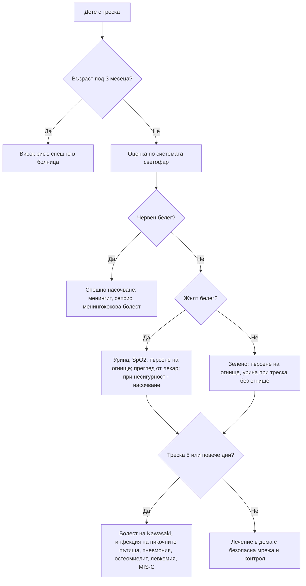

# Глава 68. Фебрилното дете

> **Част XIV. Детска възраст**

## Цели на главата

- Да се оценява рискът от сериозно заболяване при дете под 5 години със системата „светофар“ (NICE NG143).
- Да се насочва спешно всяко кърмаче под 3 месеца с температура ≥ 38 °C.
- Да се изследва урината при всяко дете с треска без огнище (инфекцията на пикочните пътища е най-честата сериозна бактериална инфекция).
- Да се разпознава болестта на Kawasaki при продължителна треска.
- Да се разграничават простите от сложните фебрилни гърчове.
- Да се прилага безопасна мрежа за родителите.

## Ключови моменти

- Кърмаче под 3 месеца с температура ≥ 38 °C е с висок риск и се насочва спешно *(SORT C [1])*.
- Системата „светофар“ помага да се оцени рискът от сериозно заболяване при деца под 5 години *(SORT C [1])*.
- Тревогата на родителя и усещането на лекаря, че „нещо не е наред“, са силни червени флагове за сериозна инфекция *(SORT B [7])*.
- Болките в краката, студените крайници и промяната в цвета на кожата са ранни белези на менингококовата болест *(SORT B [4])*.
- Спадането на температурата след антипиретик не разграничава сериозното от несериозното заболяване *(SORT C [1])*.
- Треска ≥ 5 дни налага търсене на болест на Kawasaki. Лечението до 10-ия ден намалява риска от коронарни аневризми *(SORT B [5])*.

### Първите 60 секунди

- Оценете дишането (честота, ретракции, стенене, SpO₂), циркулацията (сърдечна честота, капилярно пълнене), съзнанието и цвета на кожата.
- Потърсете неизбледняващ обрив (тест с чаша) и червените белези на системата „светофар“ [1].
- При червен белег или при кърмаче под 3 месеца с температура ≥ 38 °C насочете спешно, а при нестабилност — 112 [1].
- При силно подозрение за менингококова болест дайте парентерален антибиотик възможно най-рано, ако това не забавя транспорта [8].

---

## 1. Определение и измерване

- **Треска:** температура ≥ 38,0 °C.
- **Измерване:**
  - под 4 седмици — **електронен термометър в подмишницата**;
  - от 4 седмици до 5 години — електронен термометър в подмишницата или инфрачервен ушен термометър.
- **Съобщението на родителя за треска трябва да се приема сериозно**, дори ако при прегледа детето е афебрилно.
- **Отговорът на антипиретици не разграничава** бактериалните от вирусните инфекции и не бива да се използва за оценка на тежестта [1].

---

## 2. Система „светофар“ (NICE, деца под 5 години)

*Таблица 68.1. Система „светофар“ (NICE, деца под 5 години).*

| Област | **Зелено** (нисък риск) | **Жълто** (междинен риск) | **Червено** (висок риск) |
|---|---|---|---|
| **Цвят** | Нормален цвят на кожата, устните и езика | Бледост, съобщена от родителя | **Бледа, мраморна, пепелява или синкава** кожа |
| **Активност** | Нормален отговор на социални стимули, усмихва се, буден или се събужда бързо, силен нормален плач или не плаче | Не реагира нормално на социални стимули, не се усмихва, събужда се само при продължително стимулиране, намалена активност | **Не реагира** на социални стимули, **изглежда болно** според медицинския специалист, **не се събужда** или не остава будно, **слаб, пронизителен или непрекъснат плач** |
| **Дишане** | — | **Разширяване на ноздрите**; **тахипнея** (> 50/min на 6–12 месеца; > 40/min над 12 месеца); **SpO₂ ≤ 95%**; крепитации | **Стенене**, **тахипнея > 60/min**, **умерени или тежки междуребрени и субкостални ретракции** |
| **Циркулация и хидратация** | Нормална кожа и очи, влажни лигавици | **Тахикардия** (> 160/min под 12 месеца; > 150/min на 12–24 месеца; > 140/min на 2–5 години); **капилярно пълнене ≥ 3 s**; сухи лигавици; лошо хранене при кърмачета; **намалена диуреза** | **Намален тургор на кожата** |
| **Други** | Няма жълти и червени белези | **Възраст 3–6 месеца с температура ≥ 39 °C**; **треска ≥ 5 дни**; **тръпки**; оток на крайник или става; **не натоварва крайник** | **Възраст под 3 месеца с температура ≥ 38 °C**; **неизбледняващ обрив**; **изпъкнала фонтанела**; **вратна ригидност**; **епилептичен статус**; **фокални неврологични белези**; **фокални гърчове** |

*Таблицата е адаптиран превод по NICE NG143 „Fever in under 5s: assessment and initial management“ (2019, актуализация 2021). © NICE. Използването на съдържание на NICE извън Обединеното кралство (включително превод) за цели, различни от лично обучение и изследване, изисква писмено разрешение от NICE.*

**Поведение:**

- **зелено** — лечение в домашни условия с безопасна мрежа;
- **жълто** — преглед от лекар, насочени изследвания или ясна безопасна мрежа с контролен преглед;
- **червено** — **спешно насочване** към болница.

---

## 3. Кърмачета под 3 месеца

- **Всяко кърмаче под 3 месеца с температура ≥ 38 °C** е с **висок риск** и се насочва спешно към болница.
- **Под 1 месец:** пълен септичен скрининг (хемокултура, урина, лумбална пункция, ПКК, CRP) и парентерални антибиотици.
- **1–3 месеца:** рискова стратификация в болница (прокалцитонин, CRP, урина, хемокултура, при нужда лумбална пункция) [2].
- Кърмачетата могат да имат сериозна инфекция **без треска** или дори с **хипотермия**. Лошото хранене, сънливостта, раздразнителността и апнеите са тревожни белези.

---

## 4. Сериозни бактериални инфекции

*Таблица 68.2. Сериозни бактериални инфекции.*

| Инфекция | Особености |
|---|---|
| **Инфекция на пикочните пътища** | **Най-честата** сериозна бактериална инфекция при треска без огнище. При кърмачета протича неспецифично: треска, повръщане, раздразнителност, лошо хранене. **Урина (чиста проба) при всяко дете с треска без видимо огнище** [3] |
| **Пневмония** | Тахипнея, ретракции, крепитации, понижена SpO₂; кашлицата може да липсва в ранния стадий |
| **Бактериемия и сепсис** | Червени белези, тахикардия, удължено капилярно пълнене |
| **Менингит** | При кърмачета — **изпъкнала фонтанела**, раздразнителност, отказ от храна; **вратната ригидност често липсва** под 1–2 години |
| **Менингококова болест** | **Неизбледняващ обрив** (тест с чаша), **болки в краката**, **студени крайници**, промяна в цвета на кожата — ранни белези, които се появяват средно около 8 часа от началото, много преди класическите признаци [4] |
| **Септичен артрит, остеомиелит** | **Не натоварва крайника**, оток на става (вж. глава 72) |
| **Инвазивна стрептококова инфекция от група A** | Скарлатина, целулит, пневмония с емпием, некротизиращ фасциит, токсичен шок |

---

## 5. Продължителна треска (≥ 5 дни)

*Таблица 68.3. Продължителна треска (≥ 5 дни).*

| Причина | Насочващи белези |
|---|---|
| **Болест на Kawasaki** | Треска ≥ 5 дни и поне 4 от: **двустранно негнойно зачервяване на конюнктивите**, **промени в устата** (ягодов език, зачервени напукани устни), **полиморфен обрив**, **промени по крайниците** (оток и зачервяване на дланите и ходилата, по-късно лющене около ноктите), **шийна лимфаденопатия** ≥ 1,5 cm (едностранно). **Непълната форма** (особено при кърмачета под 6 месеца) е честа — **риск от коронарни аневризми**, който намалява значително при лечение с интравенозен имуноглобулин до 10-ия ден от началото на треската [5] |
| **Мултисистемен възпалителен синдром при деца** (MIS-C, PIMS-TS) | След COVID-19; треска, коремна болка, обрив, конюнктивит, шок, миокардна дисфункция |
| **Инфекция на пикочните пътища, пневмония** | — |
| **Инфекциозна мононуклеоза, аденовирус** | Фарингит, лимфаденопатия |
| **Остеомиелит, абсцеси** | Локална болка |
| **Левкемия, лимфом** | Бледост, кървене, болки в костите, хепатоспленомегалия, цитопении |
| **Системен ювенилен идиопатичен артрит** | Треска веднъж дневно, **сьомгово-розов обрив**, артрит (може да се появи по-късно), висок феритин |
| **Туберкулоза, ендокардит** | Рискови фактори |
| **Малария** | **Пътуване** до ендемичен район |

---

## 6. Фебрилни гърчове

- Възраст **6 месеца – 5 години**, при треска, **без** инфекция на ЦНС и без предшестващи афебрилни гърчове.
- **Прост фебрилен гърч:** генерализиран, **< 15 минути**, **не се повтаря в рамките на 24 часа**, пълно възстановяване до 1 час [6].
- **Сложен фебрилен гърч:** **фокален**, **> 15 минути** или **повторен в рамките на 24 часа**.
- **Задължително е да се изключи менингит**, особено при:
  - възраст 6–12 месеца при непълна или неизвестна ваксинация срещу *Haemophilus influenzae* тип b и пневмокок [6];
  - **предшестващо лечение с антибиотици** (маскира менингит) [6];
  - сложен гърч;
  - **продължителна сънливост** след гърча;
  - менингеални белези, изпъкнала фонтанела.

---

## 7. Безопасна диагностична стратегия

*Таблица 68.4. Безопасна диагностична стратегия.*

| Въпрос | Отговор |
|---|---|
| **Вероятна диагноза** | Вирусни инфекции на горните дихателни пътища, остър среден отит, вирусен гастроентерит, тонзилит |
| **Сериозни заболявания, които не бива да се пропускат** | **Менингококова болест** и **менингит**, **сепсис**, **инфекция на пикочните пътища** (пиелонефрит), **пневмония**, **болест на Kawasaki**, **септичен артрит и остеомиелит**, **херпесен енцефалит**, **MIS-C**, **малария**, **левкемия** |
| **Чести капани** | Инфекция на пикочните пътища без уринарни симптоми; менингит без вратна ригидност при кърмаче; непълна болест на Kawasaki; менингит, маскиран от антибиотик; „вирусна инфекция“ с продължителна треска; треска от неслучайна травма (фрактури) |
| **Маскиращи заболявания** | Инфекция на пикочните пътища, лекарства (антипиретици маскират треската), захарен диабет тип 1 (кетоацидоза с треска при инфекция) |
| **Психосоциални аспекти** | **Тревогата на родителя** (силен червен флаг [7]), пренебрегване, **неслучайна травма** |

---

## 8. Преглед и изследвания в общата практика

**Преглед:** температура, **сърдечна и дихателна честота**, **капилярно пълнене**, SpO₂, ниво на активност и контакт, хидратация, **кожа** (обрив — тест с чаша), фонтанела, менингеални белези, уши, гърло, бял дроб, корем, **стави и крайници**, лимфни възли.

**Изследвания:**

- **урина** (чиста проба) — при треска без огнище, при кърмачета и при всички с жълти белези; посявка при кърмачета под 3 месеца и при положителна лента [3];
- **SpO₂**;
- при възможност — CRP.

При треска без видимо огнище не се предписват перорални антибиотици [1]. При силно подозрение за менингококова болест се прилага интравенозно или интрамускулно цефтриаксон или бензилпеницилин възможно най-рано, ако това не забавя транспорта [8].

---

## 9. Безопасна мрежа за родителите

Родителите трябва да потърсят помощ **незабавно** при:

- **обрив, който не избледнява** при натиск с чаша;
- детето е **трудно за събуждане**, отпуснато, **плаче непрекъснато или пронизително**;
- **затруднено дишане**, стенене, ретракции;
- **отказ от течности** и **малко мокри пелени**;
- **гърч**;
- **студени ръце и крака** при висока температура, **болки в краката**, бледа или мраморна кожа;
- температура **≥ 5 дни**;
- **усещането, че „нещо не е наред“**.

---

## 10. Диагностичен алгоритъм

*Фигура 68.1. Диагностичен алгоритъм: фебрилното дете. Схема на авторите въз основа на източниците, цитирани в главата.*

Текстово описание на фигура 68.1

1. Дете с треска. Следва: към т. 2.
2. **Въпрос:** Възраст под 3 месеца? Да — към т. 3; Не — към т. 4.
3. Висок риск: спешно в болница.
4. Оценка по системата светофар. Следва: към т. 5.
5. **Въпрос:** Червен белег? Да — към т. 6; Не — към т. 7.
6. Спешно насочване: менингит, сепсис, менингококова болест.
7. **Въпрос:** Жълт белег? Да — към т. 8; Не — към т. 9.
8. Урина, SpO2, търсене на огнище; преглед от лекар; при несигурност — насочване. Следва: към т. 10.
9. Зелено: търсене на огнище, урина при треска без огнище. Следва: към т. 10.
10. **Въпрос:** Треска 5 или повече дни? Да — към т. 11; Не — към т. 12.
11. Болест на Kawasaki, инфекция на пикочните пътища, пневмония, остеомиелит, левкемия, MIS-C.
12. Лечение в дома с безопасна мрежа и контрол.

---

## 11. Червени флагове и насочване

### 11.1. Червени флагове

- Кърмаче под 3 месеца с температура ≥ 38 °C.
- Неизбледняващ обрив.
- Бледа, мраморна или синкава кожа, студени крайници, болки в краката.
- Не реагира, не се събужда или има слаб, пронизителен или непрекъснат плач.
- Стенене, тахипнея над 60/min, изразени ретракции.
- Изпъкнала фонтанела, вратна ригидност, гърч или фокални неврологични белези.
- Намален тургор на кожата, отказ от течности, малко мокри пелени.
- Треска ≥ 5 дни.
- Тревога на родителя или усещане на лекаря, че детето „изглежда болно“.

### 11.2. Кога и колко спешно да насочим

*Таблица 68.5. Кога и колко спешно да насочим.*

| Спешност | Клинична ситуация |
|---|---|
| **Незабавно (112 или спешно отделение)** | Червен белег по системата „светофар“ [1]; кърмаче под 3 месеца с температура ≥ 38 °C [1, 2]; подозрение за менингококова болест — парентерален антибиотик, ако не забавя транспорта [8]; епилептичен статус или сложен фебрилен гърч с продължителна сънливост [6] |
| **В същия ден** | Жълт белег без ясна причина или при несигурност — преглед от педиатър [1]; треска ≥ 5 дни с белези на болест на Kawasaki — ехокардиография и лечение [5]; подозрение за инфекция на пикочните пътища при кърмаче под 3 месеца [3]; куцане или отказ да натоварва крайник с треска |
| **Бързо (до 2 седмици)** | Продължителна или рецидивираща треска без огнище с бледост, хепатоспленомегалия или болки в костите — ПКК в същия ден и насочване по резултата |
| **Планово** | Рецидивиращи инфекции на пикочните пътища — образни изследвания според препоръките [3]; периодична треска |
| **Проследяване в общата практика** | Зелени белези — домашно лечение с ясна безопасна мрежа [1]; прост фебрилен гърч с пълно възстановяване и ясна причина за треската [6] |

---

## 12. Клинични перли

- Кърмаче под 3 месеца с температура ≥ 38 °C винаги се насочва спешно.
- При треска без огнище изследвайте урината.
- При кърмачета вратната ригидност често липсва при менингит. Търсете изпъкнала фонтанела, раздразнителност и отказ от храна.
- Болките в краката, студените крайници и промяната в цвета на кожата са ранни белези на менингококова болест.
- Треска над 5 дни при малко дете: мислете за болестта на Kawasaki, дори ако не са налице всички критерии.
- Спадането на температурата след антипиретик не изключва тежка инфекция.
- Тревогата на родителите и вашето собствено усещане, че детето „изглежда болно“, са червени флагове.
- След сложен фебрилен гърч или при дете, което е приемало антибиотик, изключете менингит.

---

## 13. Клиничен случай

**Етап 1 — представяне.** Момче на 2 години има температура до 40 °C от 6 дни, която се повлиява слабо от антипиретици. Раздразнително е. Прегледано е два пъти и е прието за „вирусна инфекция“.

> **Въпрос 1.** Какво трябва да се търси при треска с такава продължителност?

**Етап 2 — преглед и изследвания.** Има двустранно зачервяване на конюнктивите без гноен секрет, зачервени напукани устни, **ягодов език**, полиморфен обрив по трупа, **оток и зачервяване на дланите и ходилата** и увеличен шиен лимфен възел вдясно с диаметър 2 cm. CRP е 124 mg/l, тромбоцитите — 520 × 10⁹/l, а албуминът — 30 g/l.

> **Въпрос 2.** Коя е диагнозата?

> **Въпрос 3.** Защо е спешна?

Обсъждане и отговори

**Отговор 1.** Продължителността на треската сама по себе си не предсказва сериозно заболяване, но треската ≥ 5 дни налага търсене на **болест на Kawasaki** [1]. Търсят се и инфекция на пикочните пътища, пневмония, остеомиелит, левкемия и MIS-C.

**Отговор 2.** Треската над 5 дни и петте основни белега (конюнктивит, промени в устата, обрив, промени по крайниците и шийна лимфаденопатия) отговарят на **болест на Kawasaki**. Високият CRP, тромбоцитозата и хипоалбуминемията я подкрепят [5].

**Отговор 3.** Рискът от **аневризми на коронарните артерии** намалява значително при лечение с интравенозен имуноглобулин и аспирин до 10-ия ден от началото на треската [5]. Детето се насочва в същия ден в болница за ехокардиография и лечение.

**Поука.** Продължителната треска при малко дете не бива да се приема за „вирусна“ без търсене на белезите на болестта на Kawasaki.

---

## Обобщение

- Рискът от сериозно заболяване при дете под 5 години с треска се оценява със системата „светофар“. Кърмачетата под 3 месеца с температура ≥ 38 °C са с висок риск.
- Инфекцията на пикочните пътища е най-честата сериозна бактериална инфекция при треска без огнище. Урината се изследва при треска без ясна причина.
- Ранните белези на менингококовата болест са болките в краката, студените крайници и промяната в цвета на кожата. Неизбледняващият обрив се появява по-късно.
- Треска ≥ 5 дни налага търсене на болест на Kawasaki. Родителите получават ясна безопасна мрежа.

## Самопроверка

### Въпроси с един верен отговор

**1.** *(основно ниво)* Кърмаче на 7 седмици има температура 38,3 °C от 4 часа. Храни се добре и изглежда в добро състояние. Кое е правилното поведение?

- **А.** Парацетамол и контрол на следващия ден
- **Б.** Спешно насочване към болница
- **В.** Изследване на урината в кабинета и лечение у дома
- **Г.** Перорален антибиотик
- **Д.** Наблюдение от родителите с безопасна мрежа

Отговор и обосновка

**Верен отговор: Б.** Всяко кърмаче под 3 месеца с температура ≥ 38 °C е с висок риск за сериозно заболяване и се насочва спешно, независимо от вида му [1].

**2.** *(основно ниво)* Момиче на 18 месеца има температура 39,2 °C от ден. Не се открива огнище, а детето е в добро общо състояние. Кое изследване е най-важно в общата практика?

- **А.** Рентгенография на гръдния кош
- **Б.** Изследване на урината
- **В.** Хемокултура
- **Г.** Лумбална пункция
- **Д.** Не е нужно изследване

Отговор и обосновка

**Верен отговор: Б.** Треската без видимо огнище увеличава вероятността за инфекция на пикочните пътища, затова се изследва урината [3].

**3.** *(основно ниво)* Момче на 3 години има треска от 12 часа. Родителите съобщават, че го болят краката, а ръцете и краката му са студени. Обрив няма. Кое е вярно?

- **А.** Болките в краката са типични за вирусна инфекция
- **Б.** Болките в краката, студените крайници и промяната в цвета на кожата са ранни белези на менингококова болест
- **В.** Липсата на обрив изключва менингококова болест
- **Г.** Нужна е само безопасна мрежа
- **Д.** Показан е перорален антибиотик

Отговор и обосновка

**Верен отговор: Б.** Ранните белези на сепсис при менингококова болест се появяват средно около 8 часа от началото, много преди обрива и менингизма [4].

**4.** *(напреднало ниво)* Момиче на 2 години получава генерализиран гърч с продължителност 3 минути при температура 39,5 °C. Възстановява се напълно за 30 минути. Ваксинирано е и не е приемало антибиотици. Няма менингеални белези. Кое е правилното поведение?

- **А.** Задължителна лумбална пункция
- **Б.** Търсене на огнище на треската, обяснение и безопасна мрежа
- **В.** ЕЕГ и ЯМР на главата
- **Г.** Дългосрочна антиконвулсивна профилактика
- **Д.** КТ на главата

Отговор и обосновка

**Верен отговор: Б.** Това е прост фебрилен гърч. Лумбална пункция се прави при менингеални белези, а се обсъжда при предшестващо лечение с антибиотици или непълна ваксинация [6].

**5.** *(напреднало ниво)* Момче на 4 години има треска 38,6 °C след парацетамол, но изглежда отпуснато. Дишането е 45/min, капилярното пълнене е 3 s, а майката казва, че „никога не е било така“. Кое е вярно?

- **А.** Спадането на температурата след антипиретик изключва тежка инфекция
- **Б.** Тревогата на майката и жълтите белези изискват преглед от лекар и ниска граница за насочване
- **В.** Детето е с нисък риск — лечение у дома
- **Г.** Показан е перорален антибиотик
- **Д.** Нужна е само повторна доза парацетамол

Отговор и обосновка

**Верен отговор: Б.** Отговорът на антипиретик не разграничава сериозното заболяване [1]. Тревогата на родителя е силен червен флаг [7], а тахипнеята и удълженото капилярно пълнене са жълти белези [1].

### Задача

Майка съобщава по телефона, че 10-месечното ѝ бебе има температура 38,8 °C от сутринта. Как ще оцените по телефона дали е нужен спешен преглед и каква безопасна мрежа ще дадете?

Решение

Питат се активността и контактът (усмихва ли се, трудно ли се събужда), плачът, дишането (стенене, ретракции), цветът на кожата и крайниците, приемът на течности и мокрите пелени, обривът (тест с чаша) и гърчовете [1]. Всеки червен белег налага спешен преглед, а жълтите — преглед от лекар в същия ден. Тревогата на майката се приема сериозно [7]. Безопасната мрежа включва незабавно търсене на помощ при неизбледняващ обрив, трудно събуждане, затруднено дишане, отказ от течности, гърч, студени крайници или болки в краката, треска ≥ 5 дни и усещане, че „нещо не е наред“ [1].

### OSCE станция: Оценка на дете с треска по системата „светофар“

**Време:** 8 минути. **Ниво:** основно (студенти, специализанти).

**Задача за кандидата.** Момиче на 14 месеца има температура от 2 дни. Снемете насочена анамнеза от майката, прегледайте детето и решете за поведението.

**Информация за симулирания пациент (за изпитващия).** Детето е по-отпуснато от обикновено, пие по-малко и има по-малко мокри пелени. Дишането е 44/min, сърдечната честота — 155/min, а капилярното пълнене — 3 s. Обрив няма.

*Таблица 68.6. OSCE станция: Оценка на дете с треска по системата „светофар“ — рубрика за оценяване.*

| Критерий | Точки |
|---|---|
| Пита за активността, плача, храненето, мокрите пелени, обрива, гърчовете и болните в семейството | 2 |
| Измерва температура, сърдечна и дихателна честота, SpO₂ и капилярно пълнене | 2 |
| Оглежда кожата с тест с чаша, фонтанелата, ушите, гърлото и белия дроб | 1 |
| Изследва урината при треска без огнище | 1 |
| Разпознава жълтите белези | 2 |
| Предлага преглед от педиатър или ясна безопасна мрежа с контролен преглед и обяснява кога да се търси незабавна помощ | 2 |
| **Общо** | **10** |

**Праг за успешно представяне:** 7 от 10 точки, включително разпознаването на жълтите белези.

## Литература

1. National Institute for Health and Care Excellence. Fever in under 5s: assessment and initial management (NICE guideline NG143). London: NICE; 2019 [актуализирано 2021]. Достъпно на: https://www.nice.org.uk/guidance/ng143
2. Pantell RH, Roberts KB, Adams WG, Dreyer BP, Kuppermann N, O'Leary ST, et al. Evaluation and Management of Well-Appearing Febrile Infants 8 to 60 Days Old. Pediatrics. 2021;148(2):e2021052228. doi:10.1542/peds.2021-052228. PMID: 34281996.
3. National Institute for Health and Care Excellence. Urinary tract infection in under 16s: diagnosis and management (NICE guideline NG224). London: NICE; 2022. Достъпно на: https://www.nice.org.uk/guidance/ng224
4. Thompson MJ, Ninis N, Perera R, Mayon-White R, Phillips C, Bailey L, et al. Clinical recognition of meningococcal disease in children and adolescents. Lancet. 2006;367(9508):397-403. doi:10.1016/S0140-6736(06)67932-4. PMID: 16458763.
5. McCrindle BW, Rowley AH, Newburger JW, Burns JC, Bolger AF, Gewitz M, et al. Diagnosis, Treatment, and Long-Term Management of Kawasaki Disease: A Scientific Statement for Health Professionals From the American Heart Association. Circulation. 2017;135(17):e927-e999. doi:10.1161/CIR.0000000000000484. PMID: 28356445.
6. Subcommittee on Febrile Seizures, American Academy of Pediatrics. Neurodiagnostic evaluation of the child with a simple febrile seizure. Pediatrics. 2011;127(2):389-94. doi:10.1542/peds.2010-3318. PMID: 21285335.
7. Van den Bruel A, Haj-Hassan T, Thompson M, Buntinx F, Mant D; European Research Network on Recognising Serious Infection investigators. Diagnostic value of clinical features at presentation to identify serious infection in children in developed countries: a systematic review. Lancet. 2010;375(9717):834-45. doi:10.1016/S0140-6736(09)62000-6. PMID: 20132979.
8. National Institute for Health and Care Excellence. Meningitis (bacterial) and meningococcal disease: recognition, diagnosis and management (NICE guideline NG240). London: NICE; 2024. Достъпно на: https://www.nice.org.uk/guidance/ng240

*Последна проверка на съдържанието: септември 2026 г. Следващ планиран преглед: септември 2027 г. (вж. „Политика за актуализация“ в README).*

<!-- навигация -->

---

[← Глава 67. Мъжко здраве: скротум, пенис и сексуална функция](67-mazhko-zdrave.md) · [Съдържание](../README.md) · [Глава 69. Обриви в детската възраст →](69-obrivi-detsa.md)
