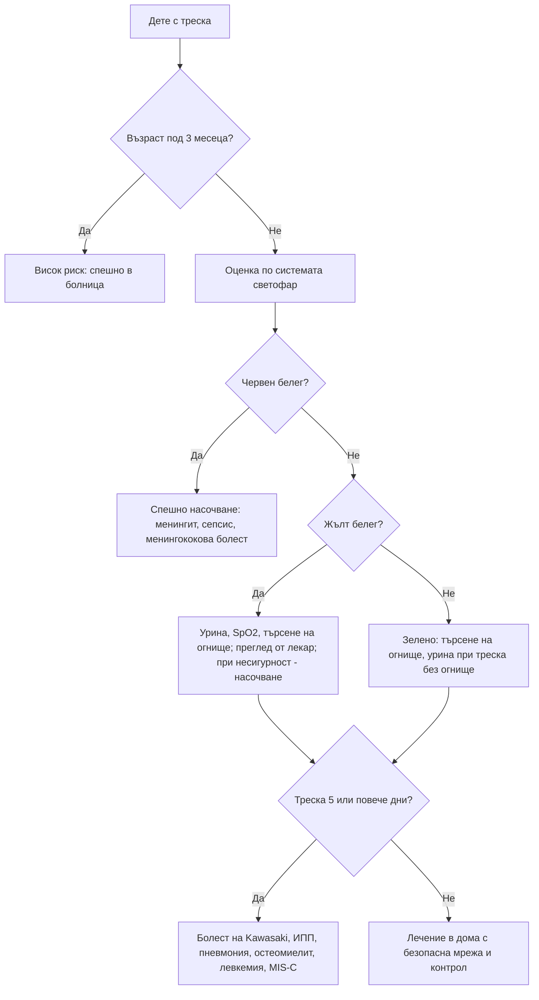

# Глава 68. Фебрилното дете

> **Част XIV. Детска възраст**

## Цели на главата

- Да се оценява рискът от сериозно заболяване при дете под 5 години със системата „светофар“ (NICE NG143).
- Да се подхожда специално към кърмачетата под 3 месеца.
- Да се помни, че инфекцията на пикочните пътища е най-честата сериозна бактериална инфекция при треска без огнище.
- Да се разпознава болестта на Kawasaki при продължителна треска.
- Да се разграничават простите от сложните фебрилни гърчове.
- Да се прилага безопасна мрежа за родителите.

---

## 1. Определение и измерване

- **Треска:** температура ≥ 38,0 °C.
- **Измерване:**
  - под 4 седмици — **електронен термометър в подмишницата**;
  - от 4 седмици до 5 години — електронен термометър в подмишницата или инфрачервен ушен термометър.
- **Съобщението на родителя за треска трябва да се приема сериозно**, дори ако при прегледа детето е афебрилно.
- **Отговорът на антипиретици не разграничава** бактериалните от вирусните инфекции и не бива да се използва за оценка на тежестта.

---

## 2. Система „светофар“ (NICE, деца под 5 години)

| Област | **Зелено** (нисък риск) | **Жълто** (междинен риск) | **Червено** (висок риск) |
|---|---|---|---|
| **Цвят** | Нормален цвят на кожата, устните и езика | Бледост, съобщена от родителя | **Бледа, мраморна, пепелява или синкава** кожа |
| **Активност** | Нормален отговор на социални стимули, усмихва се, буден или се събужда бързо, силен нормален плач или не плаче | Не реагира нормално на социални стимули, не се усмихва, събужда се само при продължително стимулиране, намалена активност | **Не реагира** на социални стимули, **изглежда болно** според медицинския специалист, **не се събужда** или не остава будно, **слаб, пронизителен или непрекъснат плач** |
| **Дишане** | — | **Разширяване на ноздрите**; **тахипнея** (> 50/min на 6–12 месеца; > 40/min над 12 месеца); **SpO₂ ≤ 95%**; крепитации | **Стенене**, **тахипнея > 60/min**, **умерени или тежки междуребрени и субкостални ретракции** |
| **Циркулация и хидратация** | Нормална кожа и очи, влажни лигавици | **Тахикардия** (> 160/min под 12 месеца; > 150/min на 12–24 месеца; > 140/min на 2–5 години); **капилярно пълнене ≥ 3 s**; сухи лигавици; лошо хранене при кърмачета; **намалена диуреза** | **Намален тургор на кожата** |
| **Други** | Няма жълти и червени белези | **Възраст 3–6 месеца с температура ≥ 39 °C**; **треска ≥ 5 дни**; **тръпки**; оток на крайник или става; **не натоварва крайник** | **Възраст под 3 месеца с температура ≥ 38 °C**; **неизбледняващ обрив**; **изпъкнала фонтанела**; **вратна ригидност**; **епилептичен статус**; **фокални неврологични белези**; **фокални гърчове** |

**Поведение:**

- **зелено** — лечение в домашни условия с безопасна мрежа;
- **жълто** — преглед от лекар, насочени изследвания или ясна безопасна мрежа с контролен преглед;
- **червено** — **спешно насочване** към болница.

---

## 3. Кърмачета под 3 месеца

- **Всяко кърмаче под 3 месеца с температура ≥ 38 °C** е с **висок риск** и се насочва спешно към болница.
- **Под 1 месец:** пълен септичен скрининг (хемокултура, урина, лумбална пункция, ПКК, CRP) и парентерални антибиотици.
- **1–3 месеца:** рискова стратификация в болница (прокалцитонин, CRP, урина, хемокултура, при нужда лумбална пункция).
- Кърмачетата могат да имат сериозна инфекция **без треска** или дори с **хипотермия**. Лошото хранене, сънливостта, раздразнителността и апнеите са тревожни белези.

---

## 4. Сериозни бактериални инфекции

| Инфекция | Особености |
|---|---|
| **Инфекция на пикочните пътища** | **Най-честата** сериозна бактериална инфекция при треска без огнище. При кърмачета протича неспецифично: треска, повръщане, раздразнителност, лошо хранене. **Урина (чиста проба) при всяко дете с треска без видимо огнище** |
| **Пневмония** | Тахипнея, ретракции, крепитации, понижена SpO₂; кашлицата може да липсва в ранния стадий |
| **Бактериемия и сепсис** | Червени белези, тахикардия, удължено капилярно пълнене |
| **Менингит** | При кърмачета — **изпъкнала фонтанела**, раздразнителност, отказ от храна; **вратната ригидност често липсва** под 1–2 години |
| **Менингококова болест** | **Неизбледняващ обрив** (тест с чаша), **болки в краката**, **студени крайници**, промяна в цвета на кожата — ранни белези |
| **Септичен артрит, остеомиелит** | **Не натоварва крайника**, оток на става (вж. глава 72) |
| **Инвазивна стрептококова инфекция от група A** | Скарлатина, целулит, пневмония с емпием, некротизиращ фасциит, токсичен шок |

---

## 5. Продължителна треска (≥ 5 дни)

| Причина | Насочващи белези |
|---|---|
| **Болест на Kawasaki** | Треска ≥ 5 дни и поне 4 от: **двустранно негнойно зачервяване на конюнктивите**, **промени в устата** (ягодов език, зачервени напукани устни), **полиморфен обрив**, **промени по крайниците** (оток и зачервяване на дланите и ходилата, по-късно лющене около ноктите), **шийна лимфаденопатия** ≥ 1,5 cm (едностранно). **Непълната форма** (особено при кърмачета под 6 месеца) е честа — **риск от коронарни аневризми** |
| **Мултисистемен възпалителен синдром при деца** (MIS-C, PIMS-TS) | След COVID-19; треска, коремна болка, обрив, конюнктивит, шок, миокардна дисфункция |
| **Инфекция на пикочните пътища, пневмония** | — |
| **Инфекциозна мононуклеоза, аденовирус** | Фарингит, лимфаденопатия |
| **Остеомиелит, абсцеси** | Локална болка |
| **Левкемия, лимфом** | Бледост, кървене, болки в костите, хепатоспленомегалия, цитопении |
| **Системен ювенилен идиопатичен артрит** | Треска веднъж дневно, **сьомгово-розов обрив**, артрит (може да се появи по-късно), висок феритин |
| **Туберкулоза, ендокардит** | Рискови фактори |
| **Малария** | **Пътуване** до ендемичен район |

---

## 6. Фебрилни гърчове

- Възраст **6 месеца – 5 години**, при треска, **без** инфекция на ЦНС и без предшестващи афебрилни гърчове.
- **Прост фебрилен гърч:** генерализиран, **< 15 минути**, **не се повтаря в рамките на 24 часа**, пълно възстановяване до 1 час.
- **Сложен фебрилен гърч:** **фокален**, **> 15 минути** или **повторен в рамките на 24 часа**.
- **Задължително е да се изключи менингит**, особено при:
  - възраст под 12 месеца;
  - **предшестващо лечение с антибиотици** (маскира менингит);
  - непълна ваксинация;
  - сложен гърч;
  - **продължителна сънливост** след гърча;
  - менингеални белези, изпъкнала фонтанела.

---

## 7. Безопасна диагностична стратегия

| Въпрос | Отговор |
|---|---|
| **Вероятна диагноза** | Вирусни инфекции на горните дихателни пътища, остър среден отит, вирусен гастроентерит, тонзилит |
| **Сериозни заболявания, които не бива да се пропускат** | **Менингококова болест** и **менингит**, **сепсис**, **инфекция на пикочните пътища** (пиелонефрит), **пневмония**, **болест на Kawasaki**, **септичен артрит и остеомиелит**, **херпесен енцефалит**, **MIS-C**, **малария**, **левкемия** |
| **Чести капани** | Инфекция на пикочните пътища без уринарни симптоми; менингит без вратна ригидност при кърмаче; непълна болест на Kawasaki; менингит, маскиран от антибиотик; „вирусна инфекция“ с продължителна треска; треска от неслучайна травма (фрактури) |
| **Маскиращи заболявания** | Инфекция на пикочните пътища, лекарства (антипиретици маскират треската), захарен диабет тип 1 (кетоацидоза с треска при инфекция) |
| **Психосоциални аспекти** | **Тревогата на родителя** (е клинична информация), пренебрегване, **неслучайна травма** |

---

## 8. Преглед и изследвания в общата практика

**Преглед:** температура, **сърдечна и дихателна честота**, **капилярно пълнене**, SpO₂, ниво на активност и контакт, хидратация, **кожа** (обрив — тест с чаша), фонтанела, менингеални белези, уши, гърло, бял дроб, корем, **стави и крайници**, лимфни възли.

**Изследвания:**

- **урина** (чиста проба) — при треска без огнище, при кърмачета и при всички с жълти белези; посявка при кърмачета под 3 месеца и при положителна лента;
- **SpO₂**;
- при възможност — CRP.

---

## 9. Безопасна мрежа за родителите

Родителите трябва да потърсят помощ **незабавно** при:

- **обрив, който не избледнява** при натиск с чаша;
- детето е **трудно за събуждане**, отпуснато, **плаче непрекъснато или пронизително**;
- **затруднено дишане**, стенене, ретракции;
- **отказ от течности** и **малко мокри пелени**;
- **гърч**;
- **студени ръце и крака** при висока температура, **болки в краката**, бледа или мраморна кожа;
- температура **≥ 5 дни**;
- **усещането, че „нещо не е наред“**.

---

## 10. Диагностичен алгоритъм

---

## 11. Клинични перли

- Кърмаче под 3 месеца с температура ≥ 38 °C винаги се насочва спешно.
- При треска без огнище изследвайте урината.
- При кърмачета вратната ригидност често липсва при менингит. Търсете изпъкнала фонтанела, раздразнителност и отказ от храна.
- Болките в краката, студените крайници и промяната в цвета на кожата са ранни белези на менингококова болест.
- Треска над 5 дни при малко дете: мислете за болестта на Kawasaki, дори ако не са налице всички критерии.
- Спадането на температурата след антипиретик не изключва тежка инфекция.
- Тревогата на родителите и вашето собствено усещане, че детето „изглежда болно“, са червени флагове.
- След сложен фебрилен гърч или при дете, което е приемало антибиотик, изключете менингит.

---

## 12. Клиничен случай

**Случай.** Момче на 2 години има температура до 40 °C от 6 дни, която се повлиява слабо от антипиретици. Раздразнително е. Прегледано е два пъти и е прието за „вирусна инфекция“. При прегледа: двустранно зачервяване на конюнктивите без гноен секрет, зачервени напукани устни, **ягодов език**, полиморфен обрив по трупа, **оток и зачервяване на дланите и ходилата** и увеличен шиен лимфен възел вдясно с диаметър 2 cm. CRP 124 mg/l, тромбоцити 520 × 10⁹/l, албумин 30 g/l.

**Въпроси.** 1) Коя е диагнозата? 2) Защо е спешна?

**Обсъждане.** Треската над 5 дни и петте основни белега (конюнктивит, промени в устата, обрив, промени по крайниците, шийна лимфаденопатия) отговарят на **болест на Kawasaki**. Лабораторните находки (висок CRP, тромбоцитоза, хипоалбуминемия) я подкрепят. Спешността се дължи на риска от **аневризми на коронарните артерии**, който значително намалява при лечение с интравенозен имуноглобулин и аспирин **до 10-ия ден** от началото на треската. Детето се насочва спешно в болница за ехокардиография и лечение.

**Поука.** Продължителната треска при малко дете не бива да се приема за „вирусна“ без търсене на белезите на болестта на Kawasaki.
