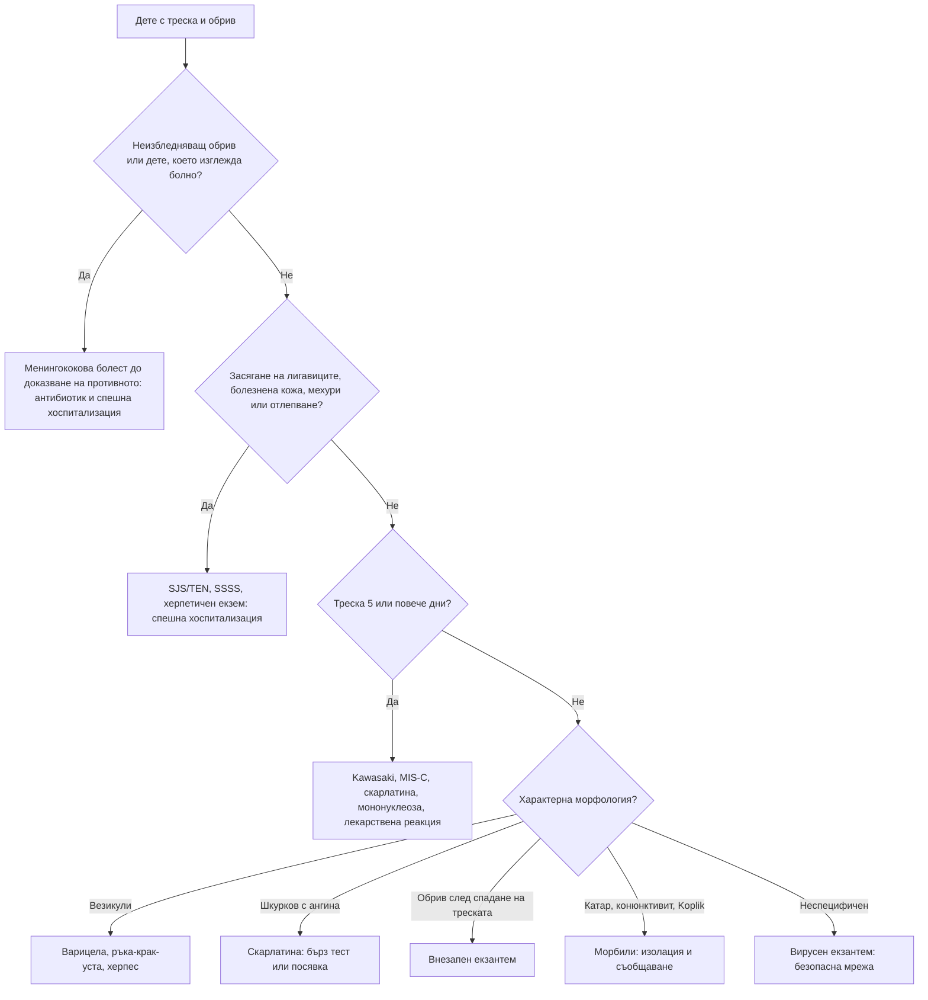

# Глава 69. Обриви в детската възраст

> **Част XIV. Детска възраст**

## Цели на главата

- Да се разграничават класическите вирусни екзантеми по продрома, морфологията, разпространението и хода на обрива.
- Да се разпознава веднага **неизбледняващият обрив** при фебрилно дете и да се мисли за менингококова болест.
- Да се разпознават болестта на Kawasaki, скарлатината и синдромът на токсичния шок като лечими причини за треска с обрив.
- Да се разграничават пурпурата на Henoch-Schönlein (IgA васкулит), имунната тромбоцитопения и левкемията.
- Да се разпознават спешните кожни състояния: херпетичен екзем, синдром на стафилококово изгаряне на кожата, синдром на Stevens-Johnson.
- Да се разпознават белезите на неслучайна травма при необичайни синини и да се знае редът за съобщаване.

---

## 1. Подход към обрива при дете

### 1.1. Първите три въпроса

1. **Изглежда ли детето болно?** (система „светофар“, вж. глава 68)
2. **Избледнява ли обривът при натиск?** Използвайте **теста с чаша**: при натиск със стъклена чаша петехиите и пурпурата не избледняват.
3. **Има ли треска?**

**Фебрилно дете с неизбледняващ обрив има менингококова болест, докато не се докаже противното.**

### 1.2. Морфологични типове

| Тип | Описание | Примери |
|---|---|---|
| **Макулопапулозен** (морбилиформен) | Червени петна и папули, избледняващи | Морбили, рубеола, внезапен екзантем, ентеровируси, лекарствен обрив, болест на Kawasaki |
| **Шкурков (скарлатиниформен)** | Дифузна еритема с дребни папули, „шкурка“ при допир | **Скарлатина**, синдром на токсичния шок, Kawasaki |
| **Везикулозен** | Мехурчета с бистро съдържание | **Варицела**, херпес симплекс, болест „ръка-крак-уста“, херпетичен екзем |
| **Булозен** | Големи мехури | **Булозно импетиго**, синдром на стафилококово изгаряне на кожата, SJS/TEN, ухапвания |
| **Петехиален или пурпурен** | Неизбледняващи | **Менингококова болест**, IgA васкулит, ИТП, левкемия, ентеровируси, силна кашлица или повръщане (над линията на мамилите) |
| **Уртикариален** | Мигриращи уртики | Вирусни инфекции, храни, лекарства, серумна болест-подобна реакция |
| **Еритема мултиформе** | Мишеновидни лезии | Херпес симплекс, *Mycoplasma* |

---

## 2. Класически вирусни екзантеми

| Заболяване | Причинител | Продром | Обрив | Ключови белези | Усложнения |
|---|---|---|---|---|---|
| **Морбили** (дребна шарка) | Морбилен вирус | 3–4 дни **висока треска, кашлица, хрема, конюнктивит** („трите К“) | Макулопапулозен, **започва зад ушите и по лицето** и се спуска надолу, **сливащ се**; след това кафеникава пигментация и лющене | **Петна на Koplik** (бели точки на бузите срещу молярите) преди обрива; детето **изглежда болно** | Пневмония, отит, диария, **енцефалит**, подостър склерозиращ паненцефалит, смърт |
| **Рубеола** | Рубеолен вирус | Лек или липсва | Розов, дребен, **несливащ се**, от лицето надолу, изчезва за 3 дни | **Задни шийни и тилни лимфни възли**, артралгии при подрастващи | **Вродена рубеола** при бременни |
| **Скарлатина** | *Streptococcus pyogenes* (токсин) | Остро: **треска, болки в гърлото**, повръщане | Дребнопапулозен, **„шкурков“**, в гънките по-наситен (**линии на Pastia**), **бледо назолабиално триъгълниче** | **Ягодов език**, ангина; **лющене на дланите и ходилата** след 1–2 седмици | Ревматична треска, гломерулонефрит |
| **Инфекциозна еритема** (пета болест) | **Парвовирус B19** | Лек | **„Зашлевени бузи“**, после **дантелен (ретикуларен)** обрив по крайниците, който се засилва от топлина | Детето е в добро общо състояние; при подрастващи и възрастни — **артропатия** | **Апластична криза** при хемолитични анемии; **хидропс на плода** при бременни |
| **Внезапен екзантем** (шеста болест, розеола) | **HHV-6**, HHV-7 | **3–5 дни висока треска** при добро общо състояние | **Появява се, когато треската спадне**; розов, по трупа | Възраст **6 месеца – 2 години** | **Фебрилни гърчове** |
| **Варицела** | Varicella-zoster | Лек | **Везикули на различни стадии** („звездно небе“), **сърбящи**, започват от трупа и скалпа, засягат лигавиците | Везикули като „капка роса върху розово листенце“ | Бактериална суперинфекция (**стрептококова — некротизиращ фасциит**), пневмония, церебелит, енцефалит |
| **Болест „ръка-крак-уста“** | Коксакивируси, ентеровирус 71 | Лек | **Овални везикули по дланите, ходилата**, седалището; афти в устата | Лятно-есенни епидемии в детски заведения | Рядко менингит, енцефалит (ЕВ71), **онихомадеза** след седмици |
| **Инфекциозна мононуклеоза** | EBV | Треска, **ангина**, лимфаденопатия | Макулопапулозен, **особено след амоксицилин** | Спленомегалия, атипични лимфоцити | Руптура на слезката, обструкция на дихателните пътища |
| **Синдром на Gianotti-Crosti** | EBV, хепатит B, други вируси | Лек | **Симетрични папули по лицето, крайниците и седалището**, **трупът е пощаден** | Деца 1–6 години; продължава седмици | Няма |

**Морбили в България.** Епидемиите от 2009–2011 и 2019 г. показват, че морбили не е „болест от миналото“. Всяко дете с треска, катарални симптоми и обрив се оценява за морбили и се проверява имунизационният му статус. Заболяването е задължително за съобщаване.

---

## 3. Сериозни заболявания с треска и обрив

### 3.1. Менингококова болест

- **Ранни симптоми** (първите 12 часа): треска, **болки в краката**, **студени ръце и крака**, **необичаен цвят на кожата** (бледост, мраморност).
- **Обривът** може да започне като **избледняващ макулопапулозен** и бързо да стане **петехиален и пурпурен**. Липсва при около 20% от случаите.
- **Класическите белези на менингит** (вратна ригидност, фотофобия, изпъкнала фонтанела) са **късни** или липсват.
- **Поведение в общата практика:** при подозрение — **бензилпеницилин i.m. или i.v. преди транспорта**, ако това няма да забави хоспитализацията, и спешна хоспитализация. **Дози** (BNF, прилагани в препоръките на NICE): **под 1 година — 300 mg; 1–9 години — 600 mg; 10 и повече години и възрастни — 1,2 g**. Алтернатива е цефтриаксон по местния протокол. Антибиотик извън болница не се прилага само при анамнеза за тежка алергична реакция към антибиотика.

### 3.2. Болест на Kawasaki

- Треска **≥ 5 дни** плюс ≥ 4 от 5 белега:
  - двустранен **небулозен конюнктивит** (без секрет);
  - промени в устата — **зачервени напукани устни, ягодов език**;
  - **полиморфен обрив**;
  - промени по крайниците — **оток и зачервяване на дланите и ходилата**, по-късно **лющене около ноктите**;
  - **шийна лимфаденопатия** (≥ 1,5 cm, обикновено едностранна).
- **Непълна** болест на Kawasaki: по-малко белези, особено при **кърмачета**, при които рискът от коронарни аневризми е най-висок.
- **Зачервяване и втвърдяване на мястото на БЦЖ ваксината** е характерен ранен белег.
- Вж. клиничния случай в глава 68.

### 3.3. Синдром на токсичния шок

- **Стафилококов** (тампони, рани, изгаряния) или **стрептококов** (варицела, некротизиращ фасциит).
- **Висока треска, хипотония, дифузна еритродермия** („слънчево изгаряне“), **засягане на множество органи** (повръщане, диария, миалгии, бъбречно и чернодробно увреждане, объркване), **лющене на дланите и ходилата** след 1–2 седмици.
- Детето може да изглежда „по-болно, отколкото показва кожата“.

### 3.4. Мултисистемен възпалителен синдром при деца (MIS-C)

- 2–6 седмици след инфекция със SARS-CoV-2; треска, **гастроинтестинални симптоми**, обрив, конюнктивит, **миокардит и шок**. Прилича на болестта на Kawasaki, но при по-големи деца и с по-често засягане на сърцето.

### 3.5. Други

- **Марсилска треска** (*Rickettsia conorii*) — лятото в България; треска, **„tache noire“** (черна коричка на мястото на ухапването от кърлеж), макулопапулозен обрив, **засягащ дланите и ходилата**.
- **Ентеровирусни инфекции** — чести, могат да дадат петехии; изискват изключване на менингококова болест.
- **Лекарствени реакции** (вж. раздел 5).

---

## 4. Пурпура и синини без треска

| Заболяване | Възраст | Ключови белези | Изследвания |
|---|---|---|---|
| **IgA васкулит** (пурпура на Henoch-Schönlein) | 3–10 години | **Палпируема пурпура по седалището и краката**, **артралгии или артрит** (глезени, колена), **коремна болка** (риск от **инвагинация**), **хематурия, протеинурия** | Нормален брой тромбоцити; **урина** — задължително, с проследяване 6–12 месеца |
| **Имунна тромбоцитопения (ИТП)** | 2–5 години, след вирусна инфекция | **Внезапни петехии, синини**, кървене от носа при **иначе здраво дете**; **без** лимфаденопатия, хепатоспленомегалия, болки в костите | **Изолирана тромбоцитопения**, нормална кръвна картина и натривка |
| **Остра левкемия** | 2–5 години | Петехии, синини **плюс** бледост, умора, **болки в костите**, **лимфаденопатия, хепатоспленомегалия**, треска | **Цитопения в повече от една линия**, бласти в натривката |
| **Хемофилия и болест на von Willebrand** | Момчета (хемофилия), всякаква | Синини, **хемартрози**, продължително кървене след процедури; фамилна анамнеза | Коагулация (APTT), фактори VIII, IX, VWF |
| **Хемолитично-уремичен синдром** | Под 5 години | **Кървава диария** (*E. coli* O157), след това **бледост, олигурия, петехии** | Тромбоцитопения, **шистоцити**, хемолиза, креатинин |
| **Механични петехии** | Всякаква | **Над линията на мамилите** след силна кашлица, повръщане, плач | Детето е здраво |
| **Насилие** | Всякаква, особено **кърмачета** | Вж. раздел 7 | |

**ИТП или левкемия?** Изолираната тромбоцитопения при иначе здраво дете с нормален преглед и нормални останали клетъчни линии е ИТП. **Всяко отклонение** (анемия, неутропения, бласти, лимфаденопатия, органомегалия, болки в костите, треска) налага изключване на левкемия.

---

## 5. Лекарствени обриви и спешни кожни състояния

| Състояние | Ключови белези | Поведение |
|---|---|---|
| **Морбилиформен лекарствен обрив** | 7–14 дни след началото на лекарство (най-често **аминопеницилини, сулфонамиди, антиконвулсанти**); детето е в добро общо състояние | Спиране на лекарството; при инфекциозна мононуклеоза амоксицилинът дава обрив при около 30% от децата (по-старите данни за ампицилина — до 90%); обривът обикновено не означава трайна алергия |
| **Серумна болест-подобна реакция** | Уртикариален обрив, **артралгии, оток на ставите**, треска след 1–3 седмици, най-често от **цефаклор**, амоксицилин | Спиране, антихистамини |
| **Синдром на Stevens-Johnson / TEN** | Треска, **болезнена** кожа, **ерозии на лигавиците** (уста, очи, гениталии), атипични мишени, **мехури и отлепване** (белег на **Nikolsky**) | Спешна хоспитализация; причини: **антиконвулсанти, сулфонамиди, НСПВС**, *Mycoplasma* |
| **DRESS** | 2–8 седмици след **антиконвулсант**; треска, обрив, **оток на лицето**, лимфаденопатия, **еозинофилия**, хепатит | Спешна хоспитализация |
| **Синдром на стафилококово изгаряне на кожата (SSSS)** | Кърмачета и малки деца; треска, **болезнена еритема**, особено около устата и в гънките, **повърхностно отлепване**, белег на Nikolsky, **лигавиците не са засегнати** | Хоспитализация, i.v. антибиотик |
| **Херпетичен екзем** (екзема херпетикум) | Дете с **атопичен дерматит** и внезапно **влошаване с болезнени, еднакви, „изровени“ ерозии** и везикули, треска | **Спешно** лечение с ацикловир; при засягане около очите — офталмолог |
| **Импетиго** | **Медено-жълти корички** около носа и устата (небулозно) или отпуснати мехури (булозно) | Локално или системно антибиотично лечение |

**SSSS или TEN?** При SSSS **лигавиците не са засегнати**, отлепването е повърхностно (субкорнеално), а детето е по-малко. При TEN **лигавиците са засегнати**, има лекарствена експозиция и отлепването е през целия епидермис.

---

## 6. Хронични и повтарящи се обриви

| Състояние | Ключови белези |
|---|---|
| **Атопичен дерматит** | Сърбеж, при кърмачета — **лицето и екстензорните повърхности**, при по-големи деца — **сгъвките**; лична или фамилна атопия |
| **Себореен дерматит** | Кърмачета: **„млечни люспи“** по скалпа, гънките, пелената; не сърби |
| **Пелен дерматит** | Иритативен — **гънките са пощадени**; кандидозен — **засяга гънките**, със **сателитни лезии** |
| **Краста** | **Нощен сърбеж**, **сърбеж у други членове на семейството**, ходове между пръстите, по китките; при кърмачета — **дланите, ходилата, главата** |
| **Молускум контагиозум** | Перлени папули с **централно вдлъбване** |
| **Тинея корпорис и тинея капитис** | Пръстеновидни люспести лезии; **по скалпа — окапване на косата**, керион |
| **Pityriasis rosea** | **„Майчина плака“**, последвана от лезии по трупа по посока на ребрата („коледна елха“) |
| **Псориазис (гутатен)** | Малки люспести плаки **след стрептококова ангина** |
| **Хемангиом** | Появява се **в първите седмици**, расте до 6–12 месеца, после регресира; периорбитален, по дихателните пътища или сегментен изисква насочване |
| **Мастоцитоза** | Кафеникави петна, които **се подуват при триене** (белег на Darier) |

---

## 7. Синини и насилие

Синините при дете, което **още не ходи**, са необичайни. **„Ако не ходи — не се удря.“**

**Подозрителни белези:**

- синини при **кърмаче, което не пълзи и не ходи**;
- локализация: **ушите, шията, бузите, трупа, седалището, вътрешната страна на бедрата, гениталиите**, ръцете (нормалните синини при деца са по **пищялите, коленете, челото** — изпъкналите места);
- **групи от синини**, **синини с форма на предмет** (ръка, колан, кабел), **следи от ухапване**, **изгаряния с цигара** или изгаряния тип „чорап“ и „ръкавица“;
- обяснение, което **не отговаря** на уврежданията или на етапа на развитие, **забавено търсене на помощ**, **различни версии**;
- **фрактури** с различна давност, **метафизни фрактури**, фрактури на ребрата при кърмачета.

**Диференциална диагноза:** **монголски петна** (синкави петна по кръста и седалището от раждането, не се променят), **коагулопатии** (изследване на кръвна картина и коагулация), **фитофотодерматит**, народни практики (вендузи), **остеогенеза имперфекта**.

**Поведение:** документиране, съобщаване по реда на Закона за закрила на детето (Дирекция „Социално подпомагане“, отдел „Закрила на детето“), насочване за педиатрична оценка. Задължението за съобщаване важи и при **подозрение**.

---

## 8. Безопасна диагностична стратегия

| Въпрос | Отговор |
|---|---|
| **Вероятна диагноза** | Неспецифичен вирусен екзантем, внезапен екзантем, варицела, болест „ръка-крак-уста“, атопичен дерматит, импетиго, уртикария |
| **Сериозни заболявания, които не бива да се пропускат** | **Менингококова болест**; **болест на Kawasaki**; **синдром на токсичния шок**; **SJS/TEN, DRESS**; **херпетичен екзем**; **SSSS**; **левкемия**; **хемолитично-уремичен синдром**; **морбили**; **насилие**; некротизиращ фасциит при варицела |
| **Чести капани** | Избледняващ обрив в началото на менингококова болест; обривът след амоксицилин при мононуклеоза се приема за алергия; ИТП без изследване на натривката; коремна болка при IgA васкулит преди появата на пурпурата; кракът, който дете с варицела не натоварва (некротизиращ фасциит, остеомиелит) |
| **Маскиращи заболявания** | Лекарства; EBV; *Mycoplasma*; марсилска треска |
| **Психосоциални аспекти** | Насилие, неглижиране, краста в семейството; ваксинален отказ |

---

## 9. Диагностичен алгоритъм при фебрилно дете с обрив

---

## 10. Клинични перли

- Фебрилно дете с неизбледняващ обрив: антибиотик и спешна хоспитализация. Не чакайте резултатите.
- Обривът при менингококова болест може да започне като обикновени избледняващи петна.
- Внезапният екзантем е единственият обрив, който се появява, след като треската е спаднала.
- Обрив след амоксицилин при дете с ангина: мислете за мононуклеоза, а не само за алергия.
- Дете с варицела, при което треската се връща, болката е несъразмерна на находката или кракът не се натоварва: стрептококова суперинфекция или некротизиращ фасциит.
- Внезапно влошаване на атопичния дерматит с ерозии и треска: херпетичен екзем. Започнете ацикловир.
- При пурпура на Henoch-Schönlein изследвайте урината и измерете кръвното налягане, и продължете да проследявате поне 6 месеца.
- ИТП е изолирана тромбоцитопения. Всяка друга цитопения, органомегалия или болка в костите изисква изключване на левкемия.
- Синини при кърмаче, което не ходи, изискват оценка за насилие.

---

## 11. Клиничен случай

**Случай.** Момиче на 18 месеца има треска от 8 часа. Майката съобщава, че детето е „отпуснато“, не иска да стъпва на краката си и плаче, когато го пипат по краката. Ръцете и краката му са студени. При прегледа: T 39,4 °C, пулс 180/min, капилярно пълнене 4 s, мраморна кожа. По корема и бедрата има няколко розови петна с диаметър 2–3 mm; повечето избледняват при натиск, но две от тях при теста с чаша не избледняват. Вратът е свободен.

**Въпроси.** 1) Коя е най-вероятната диагноза? 2) Какво трябва да се направи веднага в общата практика?

**Обсъждане.** Треската, тахикардията, удълженото капилярно пълнене, студените крайници, болките в краката и мраморната кожа са **ранни белези на менингококов сепсис**. Те предхождат класическия пурпурен обрив и белезите на менингит. Дори два неизбледняващи елемента при фебрилно дете са достатъчни за подозрение. Липсата на вратна ригидност не изключва заболяването. В общата практика се прилага **бензилпеницилин** (или цефтриаксон) интрамускулно или интравенозно, без това да забавя транспорта, и се организира **спешна хоспитализация** с линейка. Близките контакти ще получат химиопрофилактика след потвърждаване на диагнозата.

**Поука.** Менингококовата болест се разпознава по белезите на сепсис, а не по пълната картина на менингит. Неизбледняващият обрив при фебрилно дете налага незабавни действия.

<!-- навигация -->

---

[← Глава 68. Фебрилното дете](68-treska-dete.md) · [Съдържание](../README.md) · [Глава 70. Коремна болка, повръщане и диария при деца →](70-korem-detsa.md)
