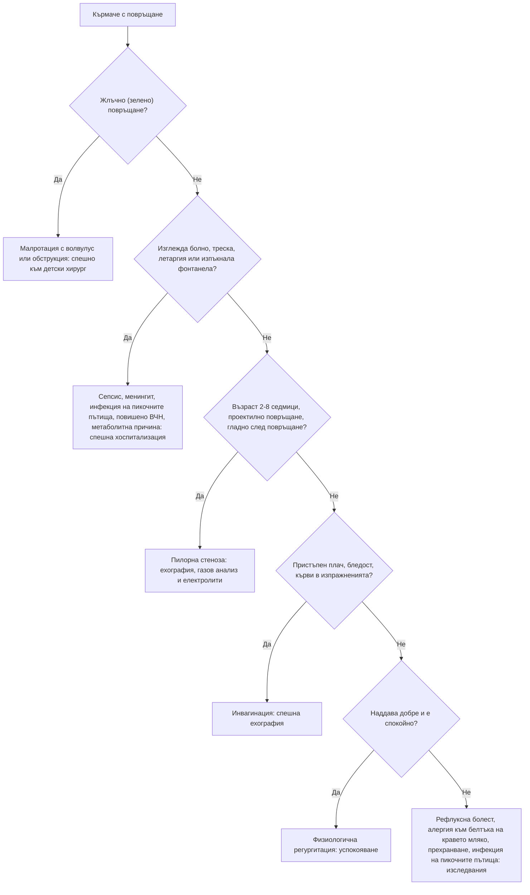

# Глава 70. Коремна болка, повръщане и диария при деца

> **Част XIV. Детска възраст**

## Цели на главата

- Да се съставя диференциална диагноза на острата коремна болка при деца според възрастта.
- Да се разпознават хирургичните спешни състояния: инвагинация, малротация с волвулус, пилорна стеноза, апендицит, инкарцерирана херния, торзия на тестиса и яйчника.
- Да се насочва спешно към детски хирург кърмачето с **жлъчно (зелено) повръщане**.
- Да се оценява дехидратацията.
- Да се разпознават извънкоремните причини за коремна болка и повръщане: диабетна кетоацидоза, пневмония, инфекция на пикочните пътища, повишено вътречерепно налягане.
- Да се разграничава функционалната от органичната хронична коремна болка.

## Ключови моменти

- Жлъчното (зелено) повръщане при кърмаче е хирургично спешно състояние до доказване на противното *(SORT C [5])*.
- Анамнезата и прегледът имат ниска точност за инвагинация. Методът на избор е ехографията *(SORT B [1])*.
- Колкото по-малко е детето с апендицит, толкова по-често апендиксът е перфорирал до поставянето на диагнозата *(SORT B [2])*.
- Повръщането без диария не е гастроентерит, докато не се изключат апендицит, диабетна кетоацидоза, менингит и инфекция на пикочните пътища. Измерва се кръвната захар *(SORT C [4, 6])*.
- Дехидратацията се оценява по клиничните белези. Рискът е най-висок под 1 година, при ниско тегло при раждане и при чести изхождания или повръщания *(SORT C [6])*.
- Хроничната коремна болка при деца е най-често функционална, но червените флагове налагат изследване *(SORT C [8])*.

### Първите 60 секунди

- Оценете съзнанието, пулса, капилярното пълнене, дишането и признаците на шок и дехидратация [6].
- Измерете капилярната глюкоза при всяко дете с повръщане и дехидратация или със сънливост [4].
- Жлъчно повръщане, подут корем или шок: спешно към детски хирург, а при нестабилност – 112 [5].
- Прегледайте скротума при момче и направете тест за бременност при подрастващо момиче.
- При подозрение за хирургично състояние не давайте храна през устата.

---

## 1. Остра коремна болка според възрастта

*Таблица 70.1. Остра коремна болка според възрастта.*

| Възраст | Чести причини | Сериозни причини, които не бива да се пропускат |
|---|---|---|
| **Кърмачета (под 1 година)** | Колики, гастроентерит, запек, инфекция на пикочните пътища | Инвагинация, малротация с волвулус, инкарцерирана ингвинална херния, торзия на тестиса, некротизиращ ентероколит (недоносени), насилие |
| **1–5 години** | Гастроентерит, запек, инфекция на пикочните пътища, вирусни инфекции, мезентериален лимфаденит | Инвагинация (до 3 години), апендицит (често перфориран поради късна диагноза), долнолобарна пневмония, диабетна кетоацидоза, IgA васкулит, хемолитично-уремичен синдром, Меккелов дивертикул, тумор на Wilms, невробластом, отравяне |
| **5–12 години** | Гастроентерит, запек, мезентериален лимфаденит, стрептококова ангина, инфекция на пикочните пътища, функционална болка | Апендицит, торзия на тестиса, диабетна кетоацидоза, IgA васкулит, пневмония, холецистит (при сърповидно-клетъчна анемия и сфероцитоза), панкреатит (травма, паротит) |
| **Подрастващи** | Като при по-малките, дисменорея, Mittelschmerz | Апендицит, торзия на яйчника или на тестиса, извънматочна бременност, тазова възпалителна болест, възпалителни заболявания на червата, камъни, отравяне |

### 1.1. Инвагинация

- Най-честа на **3 месеца – 3 години** (пик 6–9 месеца).
- Пристъпен силен плач с присвиване на краката към корема, бледост по време на пристъпа, спокойствие или летаргия между пристъпите.
- **Повръщане** (по-късно жлъчно).
- Кървави слузни изпражнения („желе от червено френско грозде“) – късен белег, при по-малко от половината от децата. Отделните симптоми и находките при прегледа имат ниска диагностична точност [1].
- **Наденицовидна формация** в десния горен квадрант.
- **Летаргията** може да е водещ или единствен симптом.
- **Ехография** – метод на избор („мишена“) с висока точност [1]; лечение – хидростатична или въздушна дезинвагинация, при неуспех – операция.

### 1.2. Апендицит при деца

- При под 5 години – нетипична картина и висока честота на перфорация (в голяма серия – 86% под 1 година и 60–74% на 1–3 години [2]).
- Болката започва периумбиликално и мигрира в десния долен квадрант; анорексия, повръщане след началото на болката, субфебрилитет.
- Детето лежи неподвижно, болката се засилва при подскачане, кашляне, ходене.
- **Диарията** не изключва апендицит (тазов апендицит).
- **Pediatric Appendicitis Score (PAS)** или **скалата на Alvarado** помагат при стратификацията [3].

### 1.3. Извънкоремни причини

*Таблица 70.2. Остра коремна болка според възрастта: извънкоремни причини.*

| Причина | Насочващи белези |
|---|---|
| **Долнолобарна пневмония** | Треска, тахипнея, кашлица; болката може да е единственият симптом |
| **Диабетна кетоацидоза** | Полиурия, полидипсия, загуба на тегло, дълбоко дишане, дъх на ацетон, дехидратация, повръщане без диария [4] |
| **Инфекция на пикочните пътища** | Треска, дизурия, енуреза; при малки деца неспецифична |
| **Стрептококова ангина** | Треска, болки в гърлото, коремна болка при малки деца |
| **IgA васкулит** | Коремната болка може да предхожда пурпурата |
| **Торзия на тестиса** | Момчетата често съобщават болка в корема, а не в скротума. Прегледайте скротума. |
| **Абдоминална мигрена** | Пристъпи с бледост, гадене, фамилна анамнеза за мигрена |
| **Отравяне** | Желязо, олово, алкохол |

---

## 2. Повръщане

### 2.1. Повръщане при кърмачета

*Таблица 70.3. Повръщане: повръщане при кърмачета.*

| Причина | Възраст | Ключови белези |
|---|---|---|
| **Регургитация и гастроезофагеален рефлукс** | От първите седмици, отшумява до 12–18 месеца | Малки количества, детето наддава и е спокойно („щастливо повръщащо“) |
| **Хипертрофична пилорна стеноза** | 2–8 седмици, по-често при първородни момчета | Шадраванно (проектилно) повръщане без жлъчка след хранене, детето е гладно веднага след това, загуба на тегло, видима перисталтика, палпируема „маслина“; хипохлоремична хипокалиемична метаболитна алкалоза |
| **Малротация с волвулус** | Обикновено първия месец, но и по-късно | Жлъчно (зелено) повръщане, подут корем, кърваво изпражнение, шок – хирургично спешно състояние |
| **Атрезия и стеноза на червата** | Новородени | Повръщане от първите часове или дни, жлъчно при обструкция под папилата на Vater; синдром на Down (дуоденална атрезия) |
| **Инфекции** | Всяка | Инфекция на пикочните пътища, менингит, сепсис, гастроентерит, отит |
| **Алергия към белтъка на кравето мляко** | Първите месеци | Повръщане, диария, кръв в изпражненията, екзема, слабо наддаване |
| **Повишено вътречерепно налягане** | Всяка | Изпъкнала фонтанела, нарастваща обиколка на главата, „залязващо слънце“, раздразнителност – хидроцефалия, субдурален хематом (насилие – синдром на разтърсеното бебе) |
| **Метаболитни и ендокринни заболявания** | Новородени | Вродена надбъбречна хиперплазия (солезагубваща форма: хипонатриемия, хиперкалиемия, дехидратация на 1–3 седмици, неясни гениталии при момичета), вродени метаболитни грешки (хипогликемия, ацидоза, хиперамониемия) |
| **Прехранване** | Изкуствено хранени | Големи обеми, нормално наддаване |

**Жлъчното повръщане при кърмаче е малротация с волвулус до доказване на противното.** Необходимо е спешно насочване към детски хирург. Червото може да некротизира за часове. При новородени с жлъчно повръщане хирургична причина се открива при около 38% [5].

### 2.2. Повръщане при по-големи деца

*Таблица 70.4. Повръщане при по-големи деца.*

| Причина | Насочващи белези |
|---|---|
| **Остър гастроентерит** | Често с диария, контакти; повръщането обикновено предшества диарията |
| **Системни инфекции** | Отит, ангина, пневмония, инфекция на пикочните пътища, менингит |
| **Хирургични причини** | Апендицит (повръщане след болката), обструкция, торзия |
| **Диабетна кетоацидоза** | Полиурия, полидипсия, дълбоко дишане. Повръщане без диария изисква изследване на кръвната захар. |
| **Повишено вътречерепно налягане** | Сутрешно повръщане с главоболие, без гадене, атаксия, промени в поведението, изоставане в растежа – мозъчен тумор |
| **Синдром на цикличното повръщане** | Стереотипни пристъпи с добро състояние между тях; фамилна анамнеза за мигрена |
| **Мигрена и абдоминална мигрена** | Главоболие, фотофобия, фамилна анамнеза |
| **Отравяне** | Лекарства (парацетамол, желязо), битова химия, гъби |
| **Мозъчно сътресение** | Анамнеза за травма |
| **Хранителни разстройства и бременност** | Подрастващи |

---

## 3. Диария

### 3.1. Остра диария

- Най-често вирусна: ротавирус (кърмачета и малки деца, зимата), норовирус, аденовирус.
- Бактериална (кръв, висока треска, силна коремна болка): *Salmonella*, *Campylobacter*, *Shigella*, ентерохеморагична *E. coli* (O157) – риск от хемолитично-уремичен синдром.
- **Паразитна**: *Giardia*, *Cryptosporidium*.
- **Извънчревни причини**: инфекция на пикочните пътища, отит, пневмония, сепсис.
- Хирургични причини, които имитират гастроентерит: апендицит (тазов), инвагинация.

**Червени флагове при „гастроентерит“:**

- **жлъчно повръщане**;
- **повръщане без диария**;
- **силна или локализирана коремна болка**, подут корем;
- **кръв в изпражненията** (особено с олигурия и бледост – хемолитично-уремичен синдром);
- **висока треска** или дете, което изглежда болно;
- **продължителност** над 7 дни (диария) или над 3 дни (повръщане);
- признаци на тежка дехидратация или шок [6].

### 3.2. Оценка на дехидратацията (по NICE CG84)

*Таблица 70.5. Оценка на дехидратацията (по NICE CG84).*

| Белег | Без клинична дехидратация | **Клинична дехидратация** | **Клиничен шок** |
|---|---|---|---|
| Общо състояние | Буден, реагира | Променено (раздразнителен, летаргичен) | **Понижено съзнание** |
| Очи | Нормални | **Хлътнали** | – |
| Лигавици | Влажни | **Сухи** | – |
| Сълзи | Има | – | – |
| Пулс | Нормален | **Тахикардия** | Тахикардия |
| Дишане | Нормално | **Тахипнея** | Тахипнея |
| Периферен пулс | Нормален | Нормален | **Слаб** |
| Капилярно пълнене | Нормално | Нормално | **Удължено** |
| Кожа | Нормален тургор, топли крайници | **Намален тургор** | **Бледа или мраморна, студени крайници** |
| Кръвно налягане | Нормално | Нормално | Хипотония (късен белег) |
| Диуреза | Нормална | **Намалена** | – |

*Таблицата е адаптиран превод по NICE CG84 „Diarrhoea and vomiting caused by gastroenteritis in under 5s“ (2009). © NICE. Използването на съдържание на NICE извън Обединеното кралство за цели, различни от лично обучение и изследване, изисква писмено разрешение от NICE.*

**Рискови групи:** деца под 1 година (особено под 6 месеца), кърмачета с ниско тегло при раждане, повече от 5 диарийни изхождания или повече от 2 повръщания за последните 24 часа, прекратено хранене, признаци на недохранване [6].

**Хипернатриемична дехидратация:** тестовидна кожа, раздразнителност, хиперрефлексия, гърчове – белезите на дехидратация са по-слабо изразени, а рискът е по-голям.

### 3.3. Хронична диария (над 2–4 седмици)

*Таблица 70.6. Хронична диария (над 2–4 седмици).*

| Причина | Насочващи белези |
|---|---|
| **Функционална диария при малки деца** („диария на прохождащото дете“) | 1–4 години, несмлени храни в изпражненията, добро наддаване, много сокове |
| **Цьолиакия** | След въвеждане на глутен; изоставане в растежа, подут корем, анемия, раздразнителност; анти-тТГ IgA + общ IgA |
| **Алергия към белтъка на кравето мляко** | Кърмачета; кръв и слуз, екзема |
| **Лактозна непоносимост** | Вторична след гастроентерит; при по-големи деца – първична |
| **Кистозна фиброза** | Стеаторея, рецидивиращи белодробни инфекции, изоставане в растежа, мекониев илеус при раждане; потен тест |
| **Лямблиоза** | Детски градини, стеаторея, подуване |
| **Възпалителни заболявания на червата** | Кръв, загуба на тегло, забавен растеж и пубертет, перианални лезии, високи CRP и фекален калпротектин |
| **Преливаща диария при запек** | Изцапване на бельото, палпируеми изпражнения в корема |
| **Имунен дефицит** | Рецидивиращи инфекции |

---

## 4. Запек

- **Функционален запек** – над 95% от случаите. Започва често при отбиване, при обучение за гърне или при тръгване на училище. Детето задържа изпражненията заради болка (анална фисура) и се образува порочен кръг.
- **Червени флагове за органична причина:**
  - забавено отделяне на мекониума (над 48 часа след раждането при доносено) – болест на Hirschsprung [7];
  - запек **от първите седмици**;
  - **„лентовидни“ изпражнения**;
  - **подут корем с повръщане**;
  - неврологични находки в краката, аномалии в лумбосакралната област (кичур косми, трапчинка, липом) – спинален дизрафизъм;
  - **изоставане в растежа**;
  - анални аномалии, празна ампула с изхвърляне на изпражнения при изваждане на пръста (Hirschsprung);
  - **подозрение за насилие**.
- **Други органични причини:** хипотиреоидизъм, цьолиакия, хиперкалциемия, кистозна фиброза, олово, лекарства.

---

## 5. Кръв в изпражненията

*Таблица 70.7. Кръв в изпражненията.*

| Причина | Възраст | Насочващи белези |
|---|---|---|
| **Анална фисура** | Всяка | Прясна кръв по повърхността на твърди изпражнения, болка при дефекация |
| **Инфекциозен колит** | Всяка | Диария, треска |
| **Алергичен проктоколит** | Кърмачета | Слуз и ивици кръв при иначе здраво дете |
| **Инвагинация** | 3 месеца – 3 години | Кървави слузни изпражнения („желе от червено френско грозде“), пристъпна болка, летаргия |
| **Меккелов дивертикул** | Под 2 години | Безболезнено обилно кървене (тъмночервено), анемия; сцинтиграфия с Tc-99m |
| **Ювенилен полип** | 2–10 години | Безболезнено кървене, пролабиране на полип |
| **Възпалителни заболявания на червата** | По-големи деца | Диария, загуба на тегло |
| **Хемолитично-уремичен синдром** | Под 5 години | Кървава диария, след това бледост, олигурия, петехии |
| **Малротация с волвулус, некротизиращ ентероколит** | Новородени | Жлъчно повръщане, подут корем, тежко състояние |
| **Погълната кръв** | Кърмачета | От напукани зърна на майката, от носа |

---

## 6. Хронична и рецидивираща коремна болка

- Засяга 10–15% от децата в училищна възраст. Над 90% е функционална: функционална коремна болка, синдром на раздразненото черво, функционална диспепсия, абдоминална мигрена (критерии Rome IV) [8].
- **Червени флагове за органична причина:**
  - болка, която **събужда** детето;
  - локализирана болка, далеч от пъпа;
  - загуба на тегло, изоставане в растежа, забавен пубертет;
  - кръв в изпражненията, нощна диария;
  - упорито повръщане, жлъчно повръщане;
  - **дисфагия**, болка при преглъщане;
  - необяснена треска, артрит, обриви, перианални лезии;
  - **фамилна анамнеза** за възпалително заболяване на червата, цьолиакия, язвена болест;
  - **отклонения в изследванията** (анемия, висок CRP или СУЕ, висок фекален калпротектин, положителни антитела за цьолиакия).
- **Минимални изследвания:** кръвна картина, CRP или СУЕ, антитела за цьолиакия, урина, при диария – фекален калпротектин и изследване на изпражнения; при диспепсия – *H. pylori*.
- **Психосоциални фактори:** тормоз в училище, семейни конфликти, тревожност, насилие. Те не изключват органична причина, но са чест фактор.

---

## 7. Безопасна диагностична стратегия

*Таблица 70.8. Безопасна диагностична стратегия.*

| Въпрос | Отговор |
|---|---|
| **Вероятна диагноза** | Остър гастроентерит, запек, мезентериален лимфаденит, колики при кърмачета, гастроезофагеален рефлукс, функционална коремна болка |
| **Сериозни заболявания, които не бива да се пропускат** | Инвагинация; малротация с волвулус; апендицит (особено при малки деца); инкарцерирана херния; торзия на тестиса или яйчника; пилорна стеноза; диабетна кетоацидоза; менингит и сепсис; хемолитично-уремичен синдром; мозъчен тумор; извънматочна бременност при подрастващи; солезагубваща надбъбречна хиперплазия; насилие |
| **Чести капани** | „Гастроентерит“, който е апендицит, инвагинация или диабетна кетоацидоза; летаргия като единствен белег на инвагинация; непрегледан скротум; пневмония като коремна болка; инфекция на пикочните пътища при треска без огнище; сутрешно повръщане, приписано на стомаха |
| **Маскиращи заболявания** | Диабет, цьолиакия, инфекция на пикочните пътища, IgA васкулит, отравяне |
| **Психосоциални аспекти** | Тормоз, семеен стрес, тревожност, насилие, хранителни разстройства |

---

## 8. Диагностичен алгоритъм при повръщащо кърмаче

*Фигура 70.1. Диагностичен алгоритъм при повръщащо кърмаче. Схема на авторите въз основа на източниците, цитирани в главата.*

Текстово описание на фигура 70.1

1. Кърмаче с повръщане. Следва: към т. 2.
2. **Въпрос:** Жлъчно (зелено) повръщане? Да – към т. 3; Не – към т. 4.
3. Малротация с волвулус или обструкция: спешно към детски хирург.
4. **Въпрос:** Изглежда болно, треска, летаргия или изпъкнала фонтанела? Да – към т. 5; Не – към т. 6.
5. Сепсис, менингит, инфекция на пикочните пътища, повишено ВЧН, метаболитна причина: спешна хоспитализация.
6. **Въпрос:** Възраст 2-8 седмици, проектилно повръщане, гладно след повръщане? Да – към т. 7; Не – към т. 8.
7. Пилорна стеноза: ехография, газов анализ и електролити.
8. **Въпрос:** Пристъпен плач, бледост, кърви в изпражненията? Да – към т. 9; Не – към т. 10.
9. Инвагинация: спешна ехография.
10. **Въпрос:** Наддава добре и е спокойно? Да – към т. 11; Не – към т. 12.
11. Физиологична регургитация: успокояване.
12. Рефлуксна болест, алергия към белтъка на кравето мляко, прехранване, инфекция на пикочните пътища: изследвания.

---

## 9. Червени флагове и насочване

### 9.1. Червени флагове

- Жлъчно (зелено) повръщане.
- Пристъпен плач с бледост и летаргия между пристъпите.
- Повръщане без диария, особено с полиурия, дълбоко дишане или сънливост.
- Силна или локализирана коремна болка, подут корем, перитонеални белези.
- Кръв в изпражненията, особено с бледост и намалена диуреза.
- Признаци на тежка дехидратация или шок.
- Сутрешно повръщане с главоболие, атаксия или промени в поведението.
- Изпъкнала фонтанела или нарастваща обиколка на главата.
- Забавено отделяне на мекониума (над 48 часа) или запек от първите седмици.
- Загуба на тегло, изоставане в растежа, нощна диария или болка, която събужда детето.

### 9.2. Кога и колко спешно да насочим

*Таблица 70.9. Кога и колко спешно да насочим.*

| Спешност | Клинична ситуация |
|---|---|
| **Незабавно (112 или спешно отделение)** | Жлъчно повръщане при кърмаче – детски хирург [5]; подозрение за инвагинация [1]; апендицит или перитонит [2]; инкарцерирана херния; торзия на тестиса; клиничен шок [6]; диабетна кетоацидоза [4]; хемолитично-уремичен синдром |
| **В същия ден** | Клинична дехидратация с неуспех на пероралната рехидратация или с рискови фактори [6]; пилорна стеноза; сутрешно повръщане с главоболие, атаксия или изпъкнала фонтанела – спешна неврологична оценка; кървава диария с треска; подозрение за солезагубваща надбъбречна хиперплазия |
| **Бързо (до 2 седмици)** | Изоставане в растежа с хронична диария; положителни антитела за цьолиакия или висок фекален калпротектин [8] |
| **Планово** | Запек с червени флагове или без ефект от лечението [7]; хронична коремна болка с неясна причина [8]; алергия към белтъка на кравето мляко без ефект от елиминацията |
| **Проследяване в общата практика** | Неусложнен гастроентерит без дехидратация – перорална рехидратация и указания при влошаване [6]; функционален запек [7]; функционална коремна болка [8]; физиологична регургитация |

---

## 10. Клинични перли

- Зеленото повръщане при кърмаче е хирургично спешно състояние до доказване на противното.
- Летаргията при кърмаче може да е единственият признак на инвагинация.
- Кървавите слузни изпражнения („желе от червено френско грозде“) са късен белег на инвагинация. Не чакайте да се появи.
- Повръщане без диария не е гастроентерит, докато не се изключат апендицит, диабетна кетоацидоза, менингит и инфекция на пикочните пътища.
- При всяко дете с повръщане и дехидратация измерете кръвната захар. Дълбокото дишане не е пневмония, а кетоацидоза.
- При момче с коремна болка винаги преглеждайте скротума.
- При подрастващо момиче с коремна болка винаги правете тест за бременност.
- Сутрешното повръщане с главоболие и без гадене изисква неврологичен преглед и изследване на очните дъна.
- Кървава диария с бледост и намалена диуреза при малко дете: хемолитично-уремичен синдром.
- Мекониум, отделен след 48 часа: изключете болест на Hirschsprung.

---

## 11. Клиничен случай

**Етап 1 – представяне.** Момче на 9 месеца е доведено от родителите си, защото от 12 часа има пристъпи на силен плач, при които пребледнява и прибира крачетата към корема. Пристъпите траят няколко минути и се повтарят на всеки 15–20 минути. Между тях детето е необичайно отпуснато и сънливо. Преди седмица е имало хрема.

> **Въпрос 1.** Какви диагнози имате предвид и какво ще прегледате?

**Етап 2 – допълнителна анамнеза и преглед.** Детето е повърнало три пъти, последния път с жълто-зелено съдържание. Температурата е 37,6 °C. Коремът е мек, а в десния горен квадрант се опипва удължена формация. При ректалното изследване по ръкавицата има слуз с кръв.

> **Въпрос 2.** Коя е диагнозата?

> **Въпрос 3.** Какво е поведението?

Обсъждане и отговори

**Отговор 1.** Пристъпната болка с бледост и летаргия между пристъпите насочва към **инвагинация**. Мисли се също за инкарцерирана херния, торзия на тестиса, инфекция на пикочните пътища и гастроентерит. Преглеждат се коремът, ингвиналните области, скротумът и изпражненията.

**Отговор 2.** Възрастта, пристъпната болка, летаргията, жлъчното повръщане, наденицовидната формация и кръвта със слуз в изпражненията са класическа картина на **илеоколична инвагинация**. Предшестващата вирусна инфекция е честа, защото хиперплазията на лимфоидната тъкан в илеума служи за водеща точка. Кървавите изпражнения са късен белег, а анамнезата и прегледът сами по себе си не са достатъчно точни [1].

**Отговор 3.** Детето се насочва **спешно** в детско хирургично отделение. Ехографията показва типичния образ на „мишена“ [1], а при липса на перитонит се прави хидростатична или въздушна дезинвагинация. Забавянето води до исхемия и некроза на червото, перфорация и шок.

**Поука.** Пристъпният плач с бледост и летаргия между пристъпите при кърмаче е инвагинация, дори преди да се появят кървавите изпражнения.

---

## Обобщение

- Причините за острата коремна болка при деца зависят от възрастта. Хирургичните спешни състояния – инвагинация, малротация, апендицит, херния и торзия – не бива да се пропускат.
- Жлъчното повръщане при кърмаче е хирургично спешно състояние.
- Дехидратацията се оценява по клиничните белези. Повръщането без диария изисква търсене на друга причина, включително диабетна кетоацидоза.
- Хроничната коремна болка и запекът при деца са най-често функционални, а червените флагове насочват към органична причина.

## Самопроверка

### Въпроси с един верен отговор

**1.** *(основно ниво)* Кърмаче на 3 седмици има жлъчно (зелено) повръщане от 4 часа. Няма треска, а коремът е мек. Кое е правилното поведение?

- **А.** Смяна на млякото и контрол след 2 дни
- **Б.** Спешно насочване към детски хирург
- **В.** Перорална рехидратация и наблюдение
- **Г.** Антиеметик
- **Д.** Изследване на урината и изчакване

Отговор и обосновка

**Верен отговор: Б.** Жлъчното повръщане при кърмаче е малротация с волвулус или друга обструкция до доказване на противното [5]. Меко коремче не изключва волвулус.

**2.** *(основно ниво)* Първородно момче на 5 седмици повръща като шадраван без жлъчка след всяко хранене и веднага иска да яде отново. Губи тегло. Коя е най-вероятната диагноза и кое изследване е подходящо?

- **А.** Гастроезофагеален рефлукс – успокояване
- **Б.** Хипертрофична пилорна стеноза – ехография, газов анализ и електролити
- **В.** Малротация – рентгенография с контраст
- **Г.** Алергия към белтъка на кравето мляко – елиминационна диета
- **Д.** Инвагинация – ехография

Отговор и обосновка

**Верен отговор: Б.** Шадраванното повръщане без жлъчка при гладно момче на 2–8 седмици е типично за пилорна стеноза. Характерна е хипохлоремичната хипокалиемична метаболитна алкалоза.

**3.** *(основно ниво)* Момиче на 2 години има диария от 2 дни. Раздразнително е, очите са хлътнали, лигавиците са сухи, а сърдечната честота е повишена. Капилярното пълнене е нормално, а крайниците са топли. Как ще класифицирате състоянието?

- **А.** Без клинична дехидратация
- **Б.** Клинична дехидратация
- **В.** Клиничен шок
- **Г.** Хипернатриемична дехидратация
- **Д.** Не може да се определи без изследвания

Отговор и обосновка

**Верен отговор: Б.** Промененото поведение, хлътналите очи, сухите лигавици и тахикардията при нормално капилярно пълнене и топли крайници отговарят на клинична дехидратация без шок [6].

**4.** *(напреднало ниво)* Момиче на 7 години повръща от ден и има коремна болка. Няма диария. Дишането е дълбоко, а от 2 седмици пие много, уринира често и е отслабнало. Кое изследване е най-важно веднага?

- **А.** Ехография на корема
- **Б.** Капилярна глюкоза и кетони
- **В.** Изследване на изпражненията
- **Г.** Рентгенография на гръдния кош
- **Д.** Изследване на урината за посявка

Отговор и обосновка

**Верен отговор: Б.** Повръщането без диария с полиурия, полидипсия, загуба на тегло и дълбоко дишане насочва към диабетна кетоацидоза [4].

**5.** *(напреднало ниво)* Момче на 3 години има коремна болка от 36 часа, повръщане и температура 38,3 °C. Лежи неподвижно, а болката се засилва при подскачане. Кое твърдение е вярно?

- **А.** При малки деца апендицитът протича типично и се открива рано
- **Б.** При малки деца апендиксът често е перфорирал при диагнозата – нужна е спешна хирургична оценка
- **В.** Повръщането изключва апендицит
- **Г.** Треската говори за гастроентерит
- **Д.** Нужно е само наблюдение у дома

Отговор и обосновка

**Верен отговор: Б.** При деца под 5 години перфорацията е честа – в голяма серия 60–74% на 1–3 години [2]. Болката при подскачане е важен белег в педиатричната скала [3].

### Задача

Момиче на 10 години от 4 месеца има почти ежедневна болка около пъпа, без връзка с храненето. Болката не я буди нощем, детето наддава нормално, а прегледът е нормален. Как ще подходите?

Решение

Най-вероятна е **функционална коремна болка** по критериите Rome IV [8]. Търсят се червените флагове: болка, която събужда детето, локализирана болка далеч от пъпа, загуба на тегло, забавен растеж или пубертет, кръв в изпражненията, нощна диария, упорито повръщане, треска, артрит, перианални лезии и фамилна анамнеза за възпалително заболяване на червата или цьолиакия [8]. Минималните изследвания включват ПКК, CRP или СУЕ, антитела за цьолиакия и урина, а при диария – фекален калпротектин. Питат се психосоциалните фактори (тормоз в училище, семейни конфликти). Детето и семейството получават обяснение и подкрепа, при нужда когнитивно-поведенческа терапия, и се договаря контролен преглед.

### OSCE станция: Оценка на дехидратацията при дете с гастроентерит

**Време:** 7 минути. **Ниво:** основно (студенти, специализанти).

**Задача за кандидата.** Момче на 18 месеца има повръщане и диария от 2 дни. Снемете насочена анамнеза, оценете дехидратацията и решете за поведението.

**Информация за симулирания пациент (за изпитващия).** За 24 часа е имало 8 диарийни изхождания и 4 повръщания. Раздразнително е, очите са хлътнали, лигавиците – сухи, сърдечната честота е 150/min, капилярното пълнене – 2 s, а крайниците са топли. Мокрите пелени са по-малко.

*Таблица 70.10. OSCE станция: Оценка на дехидратацията при дете с гастроентерит – рубрика за оценяване.*

| Критерий | Точки |
|---|---|
| Пита за броя на изхожданията и повръщанията, кръвта, жлъчното повръщане, диурезата и приема на течности | 2 |
| Пита за рисковите фактори: възраст, ниско тегло при раждане, недохранване | 1 |
| Оценява общото състояние, очите, лигавиците, тургора, пулса, дишането, капилярното пълнене и крайниците | 2 |
| Класифицира правилно състоянието като клинична дехидратация без шок | 2 |
| Търси червени флагове за друга диагноза: жлъчно повръщане, силна коремна болка, кръв, треска | 1 |
| Предлага перорална рехидратация на малки чести порции и контролен преглед и обяснява кога да се търси спешна помощ | 2 |
| **Общо** | **10** |

**Праг за успешно представяне:** 7 от 10 точки, включително правилната класификация.

## Литература

1. Hom J, Kaplan C, Fowler S, Messina C, Chandran L, Kunkov S. Evidence-Based Diagnostic Test Accuracy of History, Physical Examination, and Imaging for Intussusception: A Systematic Review and Meta-analysis. Pediatr Emerg Care. 2022;38(1):e225-e230. doi:10.1097/PEC.0000000000002224. PMID: 32941364.
2. Bansal S, Banever GT, Karrer FM, Partrick DA. Appendicitis in children less than 5 years old: influence of age on presentation and outcome. Am J Surg. 2012;204(6):1031-5; discussion 1035. doi:10.1016/j.amjsurg.2012.10.003. PMID: 23231939.
3. Samuel M. Pediatric appendicitis score. J Pediatr Surg. 2002;37(6):877-81. doi:10.1053/jpsu.2002.32893. PMID: 12037754.
4. Glaser N, Fritsch M, Priyambada L, Rewers A, Cherubini V, Estrada S, et al. ISPAD clinical practice consensus guidelines 2022: Diabetic ketoacidosis and hyperglycemic hyperosmolar state. Pediatr Diabetes. 2022;23(7):835-856. doi:10.1111/pedi.13406. PMID: 36250645.
5. Godbole P, Stringer MD. Bilious vomiting in the newborn: How often is it pathologic? J Pediatr Surg. 2002;37(6):909-11. doi:10.1053/jpsu.2002.32909. PMID: 12037761.
6. National Institute for Health and Care Excellence. Diarrhoea and vomiting caused by gastroenteritis in under 5s: diagnosis and management (Clinical guideline CG84). London: NICE; 2009. Достъпно на: https://www.nice.org.uk/guidance/cg84
7. National Institute for Health and Care Excellence. Constipation in children and young people: diagnosis and management (Clinical guideline CG99). London: NICE; 2010 [актуализирано 2017]. Достъпно на: https://www.nice.org.uk/guidance/cg99
8. Hyams JS, Di Lorenzo C, Saps M, Shulman RJ, Staiano A, van Tilburg M. Functional Disorders: Children and Adolescents. Gastroenterology. 2016;150(6):1456-1468.e2. doi:10.1053/j.gastro.2016.02.015. PMID: 27144632.

*Последна проверка на съдържанието: септември 2026 г. Следващ планиран преглед: септември 2027 г. (вж. „Политика за актуализация“ в README).*

<!-- навигация -->

---

[← Глава 69. Обриви в детската възраст](69-obrivi-detsa.md) · [Съдържание](../README.md) · [Глава 71. Дихателни симптоми при деца →](71-dishane-detsa.md)
