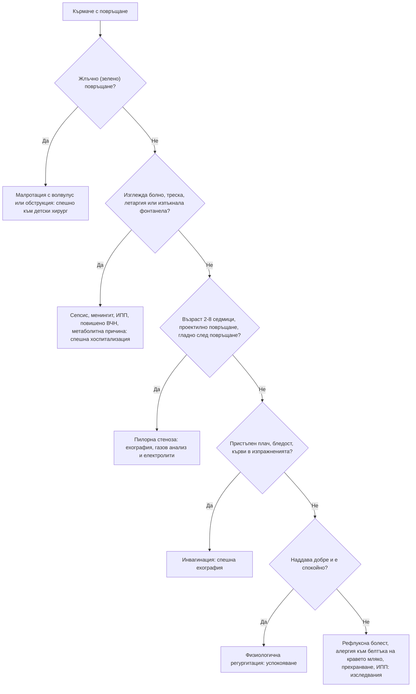

# Глава 70. Коремна болка, повръщане и диария при деца

> **Част XIV. Детска възраст**

## Цели на главата

- Да се подхожда към острата коремна болка при деца според възрастта.
- Да се разпознават хирургичните спешни състояния: инвагинация, малротация с волвулус, пилорна стеноза, апендицит, инкарцерирана херния, торзия на тестиса и яйчника.
- Да се помни, че **жлъчното (зелено) повръщане** при кърмаче е хирургично спешно състояние.
- Да се оценява дехидратацията.
- Да се разпознават извънкоремните причини за коремна болка и повръщане: диабетна кетоацидоза, пневмония, инфекция на пикочните пътища, повишено вътречерепно налягане.
- Да се разграничава функционалната от органичната хронична коремна болка.

---

## 1. Остра коремна болка според възрастта

| Възраст | Чести причини | Сериозни причини, които не бива да се пропускат |
|---|---|---|
| **Кърмачета (под 1 година)** | Колики, гастроентерит, запек, инфекция на пикочните пътища | **Инвагинация**, **малротация с волвулус**, **инкарцерирана ингвинална херния**, **торзия на тестиса**, некротизиращ ентероколит (недоносени), насилие |
| **1–5 години** | Гастроентерит, запек, **инфекция на пикочните пътища**, вирусни инфекции, мезентериален лимфаденит | **Инвагинация** (до 3 години), **апендицит** (често **перфориран** поради късна диагноза), **долнолобарна пневмония**, **диабетна кетоацидоза**, IgA васкулит, **хемолитично-уремичен синдром**, **Меккелов дивертикул**, тумор на Wilms, невробластом, отравяне |
| **5–12 години** | Гастроентерит, запек, мезентериален лимфаденит, **стрептококова ангина**, инфекция на пикочните пътища, функционална болка | **Апендицит**, **торзия на тестиса**, **диабетна кетоацидоза**, IgA васкулит, пневмония, **холецистит** (при сърповидно-клетъчна анемия и сфероцитоза), панкреатит (травма, паротит) |
| **Подрастващи** | Като при по-малките, дисменорея, **Mittelschmerz** | **Апендицит**, **торзия на яйчника или на тестиса**, **извънматочна бременност**, **тазова възпалителна болест**, възпалителни заболявания на червата, камъни, отравяне |

### 1.1. Инвагинация

- Най-честа на **3 месеца – 3 години** (пик 6–9 месеца).
- **Пристъпен** силен плач с **присвиване на краката** към корема, **бледост** по време на пристъпа, спокойствие или **летаргия** между пристъпите.
- **Повръщане** (по-късно жлъчно).
- **Кървави слузни изпражнения** („**желе от касис**“) — **късен** белег, при по-малко от половината от децата.
- **Наденицовидна формация** в десния горен квадрант.
- **Летаргията** може да е водещ или единствен симптом.
- **Ехография** — метод на избор („мишена“); лечение — хидростатична или въздушна дезинвагинация, при неуспех — операция.

### 1.2. Апендицит при деца

- При **под 5 години** — нетипична картина и **висока честота на перфорация** (над 50% при под 3 години).
- Болката започва периумбиликално и мигрира в десния долен квадрант; **анорексия**, повръщане **след** началото на болката, субфебрилитет.
- Детето **лежи неподвижно**, болката се засилва при **подскачане, кашляне, ходене**.
- **Диарията** не изключва апендицит (тазов апендицит).
- **Pediatric Appendicitis Score (PAS)** или **скалата на Alvarado** помагат при стратификацията.

### 1.3. Извънкоремни причини

| Причина | Насочващи белези |
|---|---|
| **Долнолобарна пневмония** | Треска, **тахипнея**, кашлица; болката може да е единственият симптом |
| **Диабетна кетоацидоза** | **Полиурия, полидипсия, загуба на тегло**, **дълбоко дишане**, дъх на ацетон, дехидратация, **повръщане без диария** |
| **Инфекция на пикочните пътища** | Треска, дизурия, енуреза; при малки деца неспецифична |
| **Стрептококова ангина** | Треска, болки в гърлото, коремна болка при малки деца |
| **IgA васкулит** | Коремната болка **може да предхожда** пурпурата |
| **Торзия на тестиса** | Момчетата често съобщават болка в корема, а не в скротума. **Прегледайте скротума.** |
| **Абдоминална мигрена** | Пристъпи с бледост, гадене, фамилна анамнеза за мигрена |
| **Отравяне** | Желязо, олово, алкохол |

---

## 2. Повръщане

### 2.1. Повръщане при кърмачета

| Причина | Възраст | Ключови белези |
|---|---|---|
| **Регургитация и гастроезофагеален рефлукс** | От първите седмици, отшумява до 12–18 месеца | Малки количества, **детето наддава и е спокойно** („щастливо повръщащо“) |
| **Хипертрофична пилорна стеноза** | **2–8 седмици**, по-често при **първородни момчета** | **Шадравано (проектилно) повръщане без жлъчка** след хранене, **детето е гладно** веднага след това, загуба на тегло, **видима перисталтика**, палпируема „маслина“; **хипохлоремична хипокалиемична метаболитна алкалоза** |
| **Малротация с волвулус** | Обикновено **първия месец**, но и по-късно | **Жлъчно (зелено) повръщане**, подут корем, кърваво изпражнение, шок — **хирургично спешно състояние** |
| **Атрезия и стеноза на червата** | Новородени | Повръщане от първите часове или дни, **жлъчно** при обструкция под папилата на Vater; синдром на Down (дуоденална атрезия) |
| **Инфекции** | Всяка | Инфекция на пикочните пътища, **менингит**, сепсис, гастроентерит, отит |
| **Алергия към белтъка на кравето мляко** | Първите месеци | Повръщане, диария, **кръв в изпражненията**, екзема, слабо наддаване |
| **Повишено вътречерепно налягане** | Всяка | **Изпъкнала фонтанела**, **нарастваща обиколка на главата**, **„залязващо слънце“**, раздразнителност — хидроцефалия, субдурален хематом (**насилие — синдром на разтърсеното бебе**) |
| **Метаболитни и ендокринни заболявания** | Новородени | **Вродена надбъбречна хиперплазия** (солезагубваща форма: **хипонатриемия, хиперкалиемия**, дехидратация на 1–3 седмици, неясни гениталии при момичета), вродени метаболитни грешки (хипогликемия, ацидоза, хиперамониемия) |
| **Прехранване** | Изкуствено хранени | Големи обеми, нормално наддаване |

**Жлъчното повръщане при кърмаче е малротация с волвулус, докато не се докаже противното.** Необходимо е спешно насочване към детски хирург. Червото може да некротизира за часове.

### 2.2. Повръщане при по-големи деца

| Причина | Насочващи белези |
|---|---|
| **Остър гастроентерит** | Често с диария, контакти; повръщането обикновено предшества диарията |
| **Системни инфекции** | Отит, ангина, пневмония, инфекция на пикочните пътища, **менингит** |
| **Хирургични причини** | **Апендицит** (повръщане след болката), обструкция, торзия |
| **Диабетна кетоацидоза** | Полиурия, полидипсия, дълбоко дишане. **Повръщане без диария изисква изследване на кръвната захар.** |
| **Повишено вътречерепно налягане** | **Сутрешно повръщане** с главоболие, **без гадене**, атаксия, промени в поведението, **изоставане в растежа** — **мозъчен тумор** |
| **Синдром на цикличното повръщане** | Стереотипни пристъпи с добро състояние между тях; фамилна анамнеза за мигрена |
| **Мигрена и абдоминална мигрена** | Главоболие, фотофобия, фамилна анамнеза |
| **Отравяне** | Лекарства (**парацетамол**, желязо), битова химия, **гъби** |
| **Мозъчно сътресение** | Анамнеза за травма |
| **Хранителни разстройства и бременност** | Подрастващи |

---

## 3. Диария

### 3.1. Остра диария

- Най-често **вирусна**: **ротавирус** (кърмачета и малки деца, зимата), **норовирус**, аденовирус.
- **Бактериална** (кръв, висока треска, силна коремна болка): *Salmonella*, *Campylobacter*, *Shigella*, **ентерохеморагична *E. coli* (O157)** — риск от **хемолитично-уремичен синдром**.
- **Паразитна**: *Giardia*, *Cryptosporidium*.
- **Извънчревни причини**: инфекция на пикочните пътища, отит, пневмония, сепсис.
- **Хирургични причини**, които **имитират гастроентерит**: апендицит (тазов), инвагинация.

**Червени флагове при „гастроентерит“:**

- **жлъчно повръщане**;
- **повръщане без диария**;
- **силна или локализирана коремна болка**, подут корем;
- **кръв в изпражненията** (особено с олигурия и бледост — хемолитично-уремичен синдром);
- **висока треска** или дете, което изглежда болно;
- **продължителност** над 7 дни (диария) или над 3 дни (повръщане);
- признаци на **тежка дехидратация** или **шок**.

### 3.2. Оценка на дехидратацията (по NICE CG84)

| Белег | Без клинична дехидратация | **Клинична дехидратация** | **Клиничен шок** |
|---|---|---|---|
| Общо състояние | Буден, реагира | **Променено** (раздразнителен, летаргичен) | **Понижено съзнание** |
| Очи | Нормални | **Хлътнали** | — |
| Лигавици | Влажни | **Сухи** | — |
| Сълзи | Има | — | — |
| Пулс | Нормален | **Тахикардия** | Тахикардия |
| Дишане | Нормално | **Тахипнея** | Тахипнея |
| Периферен пулс | Нормален | Нормален | **Слаб** |
| Капилярно пълнене | Нормално | Нормално | **Удължено** |
| Кожа | Нормален тургор, топли крайници | **Намален тургор** | **Бледа или мраморна, студени крайници** |
| Кръвно налягане | Нормално | Нормално | **Хипотония** (късен белег) |
| Диуреза | Нормална | **Намалена** | — |

**Рискови групи:** кърмачета **под 6 месеца** (особено под 1 година с ниско тегло при раждане), **повече от 5 диарийни изхождания** или **повече от 2 повръщания** за последните 24 часа, **прекратено хранене**, **признаци на недохранване**.

**Хипернатриемична дехидратация:** **тестовидна кожа**, раздразнителност, хиперрефлексия, гърчове — белезите на дехидратация са **по-слабо изразени**, а рискът е по-голям.

### 3.3. Хронична диария (над 2–4 седмици)

| Причина | Насочващи белези |
|---|---|
| **Функционална диария при малки деца** („диария на прохождащото дете“) | 1–4 години, **несмлени храни** в изпражненията, **добро наддаване**, много сокове |
| **Цьолиакия** | След въвеждане на глутен; **изоставане в растежа**, подут корем, **анемия**, раздразнителност; анти-тТГ IgA + общ IgA |
| **Алергия към белтъка на кравето мляко** | Кърмачета; кръв и слуз, екзема |
| **Лактозна непоносимост** | Вторична след гастроентерит; при по-големи деца — първична |
| **Кистозна фиброза** | **Стеаторея**, **рецидивиращи белодробни инфекции**, изоставане в растежа, **мекониев илеус** при раждане; потен тест |
| **Лямблиоза** | Детски градини, стеаторея, подуване |
| **Възпалителни заболявания на червата** | Кръв, **загуба на тегло**, **забавен растеж и пубертет**, перианални лезии, високи CRP и фекален калпротектин |
| **Преливаща диария при запек** | **Изцапване на бельото**, палпируеми изпражнения в корема |
| **Имунен дефицит** | Рецидивиращи инфекции |

---

## 4. Запек

- **Функционален запек** — над 95% от случаите. Започва често при **отбиване**, при **обучение за гърне** или при **тръгване на училище**. Детето **задържа** изпражненията заради болка (**анална фисура**) и се образува порочен кръг.
- **Червени флагове за органична причина:**
  - **забавено отделяне на мекониума** (**над 48 часа** след раждането при доносено) — **болест на Hirschsprung**;
  - запек **от първите седмици**;
  - **„лентовидни“ изпражнения**;
  - **подут корем с повръщане**;
  - **неврологични находки в краката**, **аномалии в лумбосакралната област** (кичур косми, трапчинка, липом) — **спинален дизрафизъм**;
  - **изоставане в растежа**;
  - **анални аномалии**, **празна ампула** с изхвърляне на изпражнения при изваждане на пръста (Hirschsprung);
  - **подозрение за насилие**.
- **Други органични причини:** хипотиреоидизъм, цьолиакия, хиперкалциемия, кистозна фиброза, олово, лекарства.

---

## 5. Кръв в изпражненията

| Причина | Възраст | Насочващи белези |
|---|---|---|
| **Анална фисура** | Всяка | Прясна кръв **по повърхността** на твърди изпражнения, болка при дефекация |
| **Инфекциозен колит** | Всяка | Диария, треска |
| **Алергичен проктоколит** | Кърмачета | Слуз и ивици кръв при **иначе здраво** дете |
| **Инвагинация** | 3 месеца – 3 години | „Желе от касис“, пристъпна болка, летаргия |
| **Меккелов дивертикул** | Под 2 години | **Безболезнено обилно** кървене (тъмночервено), анемия; сцинтиграфия с Tc-99m |
| **Ювенилен полип** | 2–10 години | Безболезнено кървене, пролабиране на полип |
| **Възпалителни заболявания на червата** | По-големи деца | Диария, загуба на тегло |
| **Хемолитично-уремичен синдром** | Под 5 години | Кървава диария, **след това** бледост, олигурия, петехии |
| **Малротация с волвулус, некротизиращ ентероколит** | Новородени | Жлъчно повръщане, подут корем, тежко състояние |
| **Погълната кръв** | Кърмачета | От напукани зърна на майката, от носа |

---

## 6. Хронична и рецидивираща коремна болка

- Засяга **10–15% от децата** в училищна възраст. **Над 90% е функционална:** функционална коремна болка, **синдром на раздразненото черво**, **функционална диспепсия**, **абдоминална мигрена** (критерии Rome IV).
- **Червени флагове за органична причина:**
  - болка, която **събужда** детето;
  - **локализирана** болка, **далеч от пъпа**;
  - **загуба на тегло**, **изоставане в растежа**, **забавен пубертет**;
  - **кръв** в изпражненията, **нощна диария**;
  - **упорито повръщане**, **жлъчно** повръщане;
  - **дисфагия**, болка при преглъщане;
  - **необяснена треска**, **артрит**, **обриви**, **перианални лезии**;
  - **фамилна анамнеза** за възпалително заболяване на червата, цьолиакия, язвена болест;
  - **отклонения в изследванията** (анемия, висок CRP или СУЕ, висок фекален калпротектин, положителни антитела за цьолиакия).
- **Минимални изследвания:** кръвна картина, CRP или СУЕ, **антитела за цьолиакия**, урина, при диария — **фекален калпротектин** и изследване на изпражнения; при диспепсия — *H. pylori*.
- **Психосоциални фактори:** тормоз в училище, семейни конфликти, тревожност, насилие. Те не изключват органична причина, но са чест фактор.

---

## 7. Безопасна диагностична стратегия

| Въпрос | Отговор |
|---|---|
| **Вероятна диагноза** | Остър гастроентерит, запек, мезентериален лимфаденит, колики при кърмачета, гастроезофагеален рефлукс, функционална коремна болка |
| **Сериозни заболявания, които не бива да се пропускат** | **Инвагинация**; **малротация с волвулус**; **апендицит** (особено при малки деца); **инкарцерирана херния**; **торзия на тестиса или яйчника**; **пилорна стеноза**; **диабетна кетоацидоза**; **менингит** и **сепсис**; **хемолитично-уремичен синдром**; **мозъчен тумор**; **извънматочна бременност** при подрастващи; **солезагубваща надбъбречна хиперплазия**; **насилие** |
| **Чести капани** | „Гастроентерит“, който е апендицит, инвагинация или диабетна кетоацидоза; летаргия като единствен белег на инвагинация; непрегледан скротум; пневмония като коремна болка; инфекция на пикочните пътища при треска без огнище; сутрешно повръщане, приписано на стомаха |
| **Маскиращи заболявания** | Диабет, цьолиакия, инфекция на пикочните пътища, IgA васкулит, отравяне |
| **Психосоциални аспекти** | Тормоз, семеен стрес, тревожност, насилие, хранителни разстройства |

---

## 8. Диагностичен алгоритъм при повръщащо кърмаче

---

## 9. Клинични перли

- Зеленото повръщане при кърмаче е хирургично спешно състояние, докато не се докаже противното.
- Летаргията при кърмаче може да е единственият признак на инвагинация.
- „Желето от касис“ е късен белег на инвагинация. Не чакайте да се появи.
- Повръщане без диария не е гастроентерит, докато не се изключат апендицит, диабетна кетоацидоза, менингит и инфекция на пикочните пътища.
- При всяко дете с повръщане и дехидратация измерете кръвната захар. Дълбокото дишане не е пневмония, а кетоацидоза.
- При момче с коремна болка винаги преглеждайте скротума.
- При подрастващо момиче с коремна болка винаги правете тест за бременност.
- Сутрешното повръщане с главоболие и без гадене изисква неврологичен преглед и изследване на очните дъна.
- Кървава диария с бледост и намалена диуреза при малко дете: хемолитично-уремичен синдром.
- Мекониум, отделен след 48 часа: изключете болест на Hirschsprung.

---

## 10. Клиничен случай

**Случай.** Момче на 9 месеца е доведено от родителите си, защото от 12 часа има пристъпи на силен плач, при които пребледнява и прибира крачетата към корема. Пристъпите траят няколко минути и се повтарят на всеки 15–20 минути. Между тях детето е необичайно отпуснато и сънливо. Повърнало е три пъти, последния път с жълто-зелено съдържание. Преди седмица е имало хрема. Температура 37,6 °C. Коремът е мек, в десния горен квадрант се опипва удължена формация. При ректалното изследване по ръкавицата има слуз с кръв.

**Въпроси.** 1) Коя е диагнозата? 2) Какво е поведението?

**Обсъждане.** Възрастта, пристъпната коликообразна болка с бледост, летаргията между пристъпите, повръщането (вече жлъчно), наденицовидната формация и кръвта със слуз в изпражненията са класическа картина на **илеоколична инвагинация**. Предшестващата вирусна инфекция е честа (хиперплазия на лимфоидната тъкан в илеума като водеща точка). Детето се насочва **спешно** в детско хирургично отделение. Там ехографията показва типичния образ на „мишена“, а при липса на перитонит се прави **хидростатична или въздушна дезинвагинация**. Забавянето води до исхемия и некроза на червото, перфорация и шок.

**Поука.** Пристъпният плач с бледост и летаргия между пристъпите при кърмаче е инвагинация, дори преди да се появят кървавите изпражнения.
