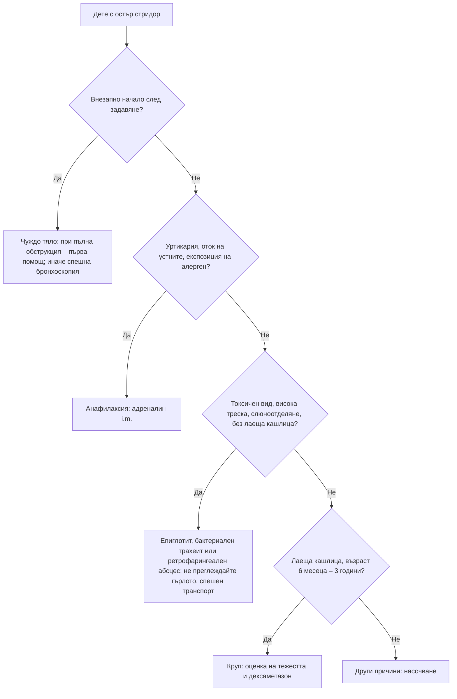

# Глава 71. Дихателни симптоми при деца

> **Част XIV. Детска възраст**

## Цели на главата

- Да се разграничават причините за **стридор** и да се разпознават състоянията, които застрашават дихателните пътища.
- Да се разграничават бронхиолитът, вирусното свирене в предучилищна възраст и бронхиалната астма.
- Да се оценява тежестта на дихателния дистрес по възрастовите норми.
- Да се определят показанията за изследване при **хронична кашлица** при деца и да се разпознават чуждото тяло, коклюшът, кистозната фиброза и туберкулозата.
- Да се разпознават кратките необясними епизоди при кърмачета (BRUE).

## Ключови моменти

- Тахипнеята е ключов белег на пневмония при дете, а стененето, изразените ретракции и апнеите – на тежко заболяване *(SORT C [4])*.
- При епиглотит, бактериален трахеит или ретрофарингеален абсцес гърлото не се преглежда с шпатула, а детето не се разделя от родителя.
- При круп еднократна доза кортикостероид намалява симптомите и повторните посещения *(SORT A [1])*.
- Бронхиолитът се лекува поддържащо. Бронходилататори, кортикостероиди и антибиотици не се използват *(SORT A [3])*.
- Анамнезата за задавяне е достатъчна за бронхоскопия. Нормалната рентгенография не изключва чуждо тяло *(SORT C [9])*.
- Специфичните белези при хронична кашлица (влажна кашлица без ефект от антибиотик, барабанни пръсти, изоставане в растежа) налагат изследване *(SORT C [7])*.

### Първите 60 секунди

- Оценете дихателния път, дихателната честота, ретракциите, стененето, SpO₂, цвета, съзнанието и способността за говорене или хранене.
- Внезапно задавяне с пълна обструкция: първа помощ при задавяне според възрастта и 112.
- Стридор с токсичен вид, слюноотделяне и приглушен глас: не преглеждайте гърлото, оставете детето при родителя, дайте кислород без насилие и организирайте спешен транспорт.
- Уртикария, оток на устните и езика и стридор: адреналин интрамускулно и 112.
- Апнеи, цианоза, стенене или изразени ретракции при кърмаче: 112 [3].

---

## 1. Оценка на дихателния дистрес

### 1.1. Нормални стойности и тахипнея

*Таблица 71.1. Нормални стойности и тахипнея.*

| Възраст | Нормална дихателна честота (APLS) | Тахипнея – праг на СЗО за пневмония | Нормален пулс (APLS) |
|---|---|---|---|
| Под 2 месеца | 30–40/min | **≥ 60/min** | 110–160/min |
| 2–12 месеца | 30–40/min | **≥ 50/min** | 110–160/min |
| 1–2 години | 25–35/min | **≥ 40/min** | 100–150/min |
| 2–5 години | 25–30/min | **≥ 40/min** | 95–140/min |
| 5–12 години | 20–25/min | над горната граница на нормата | 80–120/min |

Нормалните стойности са по APLS и съвпадат с таблиците в глава 3 и приложение А. Праговете за тахипнея са на СЗО (стратегията IMCI) и се отнасят за деца под 5 години.

### 1.2. Белези на дихателен дистрес

- **Тахипнея** – най-чувствителният белег на пневмония.
- **Ретракции** – интеркостални, субкостални, супрастернални, **трахеално подръпване**.
- Разширяване на ноздрите, кимане с главата при кърмачета.
- Стенене (експираторен звук) – белег на тежко заболяване.
- Цианоза, SpO₂ под 92%.
- Затруднено хранене или говорене, възбуда или сънливост.
- **Апнеи** – особено при кърмачета под 2 месеца.
- **Изтощение**: намаляваща дихателна честота, „тих гръден кош“, понижено съзнание – предстоящ дихателен арест.

### 1.3. Звуци при дишане

*Таблица 71.2. Звуци при дишане.*

| Звук | Фаза | Ниво на обструкция | Примери |
|---|---|---|---|
| **Стридор** | Предимно инспираторен | Екстраторакални дихателни пътища (ларинкс, горна трахея) | Круп, епиглотит, чуждо тяло, ларингомалация |
| **Двуфазен стридор** | Вдишване и издишване | Глотис, субглотис, трахея | Субглотисна стеноза, съдов пръстен, тежък круп |
| **Свирене (wheeze)** | Предимно експираторно | Интраторакални дихателни пътища | Астма, бронхиолит, вирусно свирене |
| **Хъркане (стертор)** | Инспираторно, нискочестотно | Нос, фаринкс | Аденоидна хипертрофия, обструктивна сънна апнея |
| **Стенене** | Експираторно | Алвеоли – опит за поддържане на положително налягане | Тежка пневмония, сепсис, сърдечна недостатъчност |

---

## 2. Стридор

### 2.1. Остър стридор

*Таблица 71.3. Остър стридор.*

| Заболяване | Възраст | Начало | Ключови белези |
|---|---|---|---|
| **Вирусен круп** (ларинготрахеобронхит) | **6 месеца – 3 години** | Постепенно, нощем, след хрема | „Лаеща“ кашлица, дрезгав глас, лека треска, детето не изглежда токсично |
| **Спазматичен круп** | 1–3 години | Внезапно, нощем, рецидивиращ | Без треска, бързо отзвучаване |
| **Епиглотит** | 2–7 години (рядък след ваксинацията срещу *Hib*) | **Остро, за часове** | Висока треска, токсичен вид, слюноотделяне, дисфагия, приглушен глас, седи наведено напред („статив“), липсва лаеща кашлица |
| **Бактериален трахеит** | 3–8 години | След вирусен круп | Висока треска, токсичен вид, лаеща кашлица, не отговаря на лечението за круп |
| **Чуждо тяло** | **6 месеца – 4 години** | Внезапно, след задавяне | Без треска, анамнеза за задавяне при игра или хранене |
| **Ретрофарингеален абсцес** | Под 5 години | Дни | Треска, дисфагия, слюноотделяне, ограничена екстензия на шията, тортиколис |
| **Анафилаксия и ангиоедем** | Всяка | **Минути** | Уртикария, оток на устните и езика, експозиция на алерген |
| **Травма и изгаряния** | Всяка | | Вдишване на горещ дим, поглъщане на корозивни вещества |

**Епиглотит, бактериален трахеит или ретрофарингеален абсцес: не преглеждайте гърлото с шпатула, не поставяйте детето да легне и не го плашете.** Детето остава в скута на родителя, дава се кислород без насилие и се организира спешен транспорт с възможност за осигуряване на дихателния път.

### 2.2. Оценка на тежестта на крупа (по Westley, опростено)

*Таблица 71.4. Оценка на тежестта на крупа (по Westley, опростено).*

| Тежест | Белези | Поведение |
|---|---|---|
| **Лек** | Лаеща кашлица, без стридор в покой, без ретракции или с леки ретракции | Дексаметазон 0,15 mg/kg еднократно през устата; лечение в дома. Кортикостероидите намаляват симптомите, престоя в болница и повторните посещения [1] |
| **Умерен** | Стридор в покой, ретракции, без възбуда | Дексаметазон; наблюдение; хоспитализация при липса на подобрение |
| **Тежък** | Стридор в покой, изразени ретракции, възбуда или летаргия, тахикардия | Кислород, небулизиран адреналин, дексаметазон, спешна хоспитализация |
| **Предстояща дихателна недостатъчност** | Намаляващ стридор, сънливост, цианоза, изтощение | Реанимационен екип |

**Намаляващият стридор може да е белег на изтощение, а не на подобрение.**

### 2.3. Хроничен и рецидивиращ стридор (кърмачета)

*Таблица 71.5. Хроничен и рецидивиращ стридор (кърмачета).*

| Причина | Особености |
|---|---|
| **Ларингомалация** | Най-честата причина за стридор при кърмачета; започва в първите седмици, засилва се при плач, хранене и в положение по гръб, намалява в положение по корем; детето наддава нормално; отзвучава до 12–24 месеца |
| **Субглотисна стеноза** | След интубация (недоносени); рецидивиращ „круп“ |
| **Субглотисен хемангиом** | Стридорът се засилва след 3–6 месеца; кожни хемангиоми в областта на „брадата“ |
| **Парализа на гласните гънки** | Родова травма, неврологични заболявания, операции на сърцето; слаб плач |
| **Съдов пръстен** | Двуфазен стридор, дисфагия, свирене |
| **Трахеомалация** | Експираторен звук, „лаеща“ кашлица, рецидивиращи инфекции |

**Червени флагове при кърмаче със стридор:** затруднено хранене или лошо наддаване, апнеи, цианоза, двуфазен стридор, прогресия, слаб плач. Тези деца се насочват за ендоскопия.

---

## 3. Свирене в гърдите

### 3.1. Основни причини

*Таблица 71.6. Основни причини за свирене в гърдите.*

| Заболяване | Възраст | Ключови белези |
|---|---|---|
| **Бронхиолит** | Под 1 година (пик 3–6 месеца) | Сезонен (есен–зима, RSV), хрема 1–3 дни, после кашлица, тахипнея, ретракции, дифузни крепитации и/или свирене, затруднено хранене; апнеи при малки кърмачета |
| **Вирусно свирене в предучилищна възраст** (епизодично) | 1–5 години | Свирене само при вирусни инфекции, без симптоми между тях |
| **Свирене с множество отключващи фактори** | 1–5 години | Свирене и при усилие, смях, плач, алергени, цигарен дим, симптоми между епизодите – по-вероятна астма |
| **Бронхиална астма** | Над 5 години (диагнозата се потвърждава обективно – FeNO, спирометрия, обратимост [2]) | Рецидивиращо свирене, нощна кашлица, задух при усилие, атопия (екзема, алергичен ринит), фамилна анамнеза, отговор на лечение |
| **Чуждо тяло** | 1–4 години | Внезапно начало след задавяне, едностранно свирене или отслабено дишане |
| **Кистозна фиброза** | Всяка | Рецидивиращи инфекции, продуктивна кашлица, изоставане в растежа, стеаторея, барабанни пръсти |
| **Първична цилиарна дискинезия** | От раждането | Хрема от раждането, влажна кашлица всеки ден, хроничен отит, situs inversus (при половината) |
| **Аспирация** (гастроезофагеален рефлукс, нарушено гълтане) | Кърмачета, деца с неврологични заболявания | Кашлица и задавяне при хранене |
| **Сърдечна недостатъчност** | Кърмачета | Изпотяване и задъхване при хранене, лошо наддаване, хепатомегалия, шум, ритъм на галоп |
| **Бронхопулмонална дисплазия** | Недоносени | Анамнеза за продължителна кислородотерапия |
| **Трахеобронхомалация, съдов пръстен** | Кърмачета | Монофонично свирене, от раждането, не отговаря на бронходилататори |
| **Облитериращ бронхиолит** | След тежка инфекция (аденовирус, *Mycoplasma*) | Персистиращо свирене и крепитации |

Бронхиолитът не се лекува с бронходилататори, кортикостероиди, адреналин, хипертоничен разтвор или антибиотици [3]. Лечението е поддържащо (кислород, хранене, назална аспирация). Спешно насочване (112) при апнеи, тежко общо състояние, стенене, изразени ретракции, дихателна честота над 70/min или централна цианоза. Насочване се обсъжда при дихателна честота над 60/min, прием под 50–75% от обичайния, клинична дехидратация или SpO₂ трайно под 92% [3]. Рискови фактори за тежко протичане са възраст под 3 месеца, недоносеност, хемодинамично значими сърдечни пороци, хронични белодробни и нервно-мускулни заболявания и имунен дефицит [3].

### 3.2. Тежест на острия астматичен пристъп (деца над 5 години)

*Таблица 71.7. Тежест на острия астматичен пристъп (деца над 5 години).*

| Тежест | Белези |
|---|---|
| **Умерен** | Може да говори изречения, SpO₂ ≥ 92%, PEF ≥ 50% от най-добрата лична или очакваната стойност |
| **Тежък** | Не може да завърши изречение или да се храни, SpO₂ под 92%, PEF 33–50%, пулс над 125/min (над 5 години) или над 140/min (2–5 години), дихателна честота над 30/min (над 5 години) или над 40/min (2–5 години), използване на спомагателната дихателна мускулатура |
| **Животозастрашаващ** | SpO₂ под 92% и някое от следните: PEF под 33%, „тих гръден кош“, цианоза, слабо дихателно усилие, хипотония, изтощение, объркване |

---

## 4. Пневмония

- **Вирусна** – най-честата при деца **под 2 години** (RSV, грип, метапневмовирус, риновирус).
- **Бактериална** – *Streptococcus pneumoniae* (всяка възраст), *Mycoplasma pneumoniae* (училищна възраст; постепенно начало, суха кашлица, главоболие, обрив, еритема мултиформе, хемолиза), *Staphylococcus aureus* (след грип, емпием, пневматоцеле), *Streptococcus pyogenes*.
- **При новородени:** стрептококи от група B, Грам-отрицателни бактерии, *Chlamydia trachomatis* (1–3 месеца, **„стакато“ кашлица**, конюнктивит, без треска).
- **Белези:** треска, тахипнея (най-важният белег), кашлица, ретракции, отслабено дишане и крепитации. Коремна болка и вратна ригидност могат да са водещи при долнолобарна и горнолобарна пневмония.
- Рентгенографията не се прави рутинно при деца с лека пневмония, лекувани в дома [4]. Показана е при тежко заболяване, липса на отговор, подозрение за усложнение (плеврален излив, емпием, абсцес) и подозрение за чуждо тяло (снимка в инспириум и експириум).
- Кръгла пневмония на рентгенографията при деца може да имитира тумор.
- **Рецидивираща пневмония на едно и също място** – чуждо тяло, вродена аномалия (секвестрация, CPAM), бронхиектазии. На различни места – аспирация, имунен дефицит, кистозна фиброза, първична цилиарна дискинезия, сърдечен порок.

---

## 5. Хронична кашлица (над 4 седмици)

### 5.1. Причини

*Таблица 71.8. Причини за хронична кашлица (над 4 седмици).*

| Причина | Насочващи белези |
|---|---|
| **Поствирусна кашлица** | След вирусна инфекция, постепенно намалява за 3–8 седмици |
| **Протрахиран бактериален бронхит** | Влажна кашлица над 4 седмици, отговор на 2-седмичен курс амоксицилин-клавуланат [5] |
| **Бронхиална астма** | Суха нощна кашлица, свирене, задух при усилие, атопия |
| **Коклюш** | Пароксизми от кашлица, инспираторно „изпяване“ (реприза), повръщане след кашлицата, зачервяване или цианоза при пристъпа, добро състояние между пристъпите; при кърмачета – апнеи без типичната реприза; лимфоцитоза; при ваксинирани деца и възрастни – само продължителна кашлица [6] |
| **Чуждо тяло** | Внезапно начало, задавяне, едностранни находки, рецидивираща пневмония на едно място |
| **Кистозна фиброза** | Влажна кашлица, изоставане в растежа, стеаторея |
| **Първична цилиарна дискинезия** | Хрема и кашлица от раждането |
| **Туберкулоза** | Контакт с болен (в семейството), загуба на тегло, нощно изпотяване, хилусна лимфаденопатия |
| **Бронхиектазии** | Влажна кашлица, барабанни пръсти, рецидивиращи инфекции |
| **Имунен дефицит** | Тежки, рецидивиращи или необичайни инфекции |
| **Аспирация** | Кашлица при хранене; неврологични заболявания |
| **Навикова („тикова“) кашлица** | Силна, „гъша“ кашлица, която изчезва при сън, подрастващи, стрес |
| **Пасивно пушене, електронни цигари** | Родители пушачи |
| **Сърдечен порок** | Задух при хранене, шум |

### 5.2. Специфични белези, които изискват изследване

- **Влажна кашлица, която не се повлиява** от антибиотик.
- **Барабанни пръсти**.
- **Изоставане в растежа**.
- **Деформация на гръдния кош**.
- **Кашлица от раждането**.
- **Задавяне при хранене**.
- **Хемоптиза**.
- **Отклонения при аускултацията** или на рентгенографията.
- **Внезапно начало** след задавяне.

Наличието на някой от тези белези налага целенасочено изследване, а влажната кашлица над 4 седмици без тях – пробно антибиотично лечение [5, 7].

Туберкулозата в България остава значима, особено сред уязвимите общности. При дете с продължителна кашлица, загуба на тегло или контакт с болен се правят туберкулинов кожен тест или IGRA и рентгенография на гръдния кош.

---

## 6. Кратки необясними епизоди при кърмачета (BRUE)

BRUE (brief resolved unexplained event): внезапен кратък епизод (под 1 минута) при кърмаче под 1 година, който отзвучава напълно и включва едно или повече от: цианоза или бледост, отсъстващо, намалено или неритмично дишане, промяна в мускулния тонус, намалена реактивност.

**Диференциална диагноза:**

- гастроезофагеален рефлукс и **ларингоспазъм** (най-често);
- **инфекции** (коклюш, RSV, сепсис, менингит);
- **гърчове**;
- **сърдечни аритмии** (синдром на удълженото QT);
- **метаболитни заболявания**, хипогликемия;
- насилие (синдром на разтърсеното бебе, задушаване), отравяне;
- обструкция на дихателните пътища.

**Нискорисков BRUE:** възраст над 60 дни, гестационна възраст ≥ 32 седмици, първи епизод, продължителност под 1 минута, **без** необходимост от реанимация от медицински специалист, нормален преглед. Всички останали се хоспитализират за наблюдение и изследване [8].

---

## 7. Безопасна диагностична стратегия

*Таблица 71.9. Безопасна диагностична стратегия.*

| Въпрос | Отговор |
|---|---|
| **Вероятна диагноза** | Вирусни инфекции на горните дихателни пътища, круп, бронхиолит, вирусно свирене, поствирусна кашлица, астма |
| **Сериозни заболявания, които не бива да се пропускат** | Епиглотит, бактериален трахеит, ретрофарингеален абсцес; аспирация на чуждо тяло; анафилаксия; тежка пневмония и емпием; коклюш при кърмачета; туберкулоза; сърдечна недостатъчност; миокардит; кистозна фиброза; сепсис (тахипнея при метаболитна ацидоза); диабетна кетоацидоза (дишане на Kussmaul) |
| **Чести капани** | Чуждо тяло, прието за астма или пневмония; намаляващ стридор при изтощение; бронхиолит при кърмаче под 6 седмици с апнеи; коклюш без реприза при кърмачета и ваксинирани; тахипнея без кашлица (ацидоза, сърдечна недостатъчност); астма, диагностицирана при всяко свирене |
| **Маскиращи заболявания** | Гастроезофагеален рефлукс, сърдечни пороци, неврологични заболявания, имунен дефицит |
| **Психосоциални аспекти** | Пасивно пушене, лоши битови условия, навикова кашлица при стрес |

---

## 8. Диагностичен алгоритъм при остър стридор

*Фигура 71.1. Диагностичен алгоритъм при остър стридор. Схема на авторите въз основа на източниците, цитирани в главата.*

Текстово описание на фигура 71.1

1. Дете с остър стридор. Следва: към т. 2.
2. **Въпрос:** Внезапно начало след задавяне? Да – към т. 3; Не – към т. 4.
3. Чуждо тяло: при пълна обструкция – първа помощ; иначе спешна бронхоскопия.
4. **Въпрос:** Уртикария, оток на устните, експозиция на алерген? Да – към т. 5; Не – към т. 6.
5. Анафилаксия: адреналин i.m.
6. **Въпрос:** Токсичен вид, висока треска, слюноотделяне, без лаеща кашлица? Да – към т. 7; Не – към т. 8.
7. Епиглотит, бактериален трахеит или ретрофарингеален абсцес: не преглеждайте гърлото, спешен транспорт.
8. **Въпрос:** Лаеща кашлица, възраст 6 месеца – 3 години? Да – към т. 9; Не – към т. 10.
9. Круп: оценка на тежестта и дексаметазон.
10. Други причини: насочване.

---

## 9. Червени флагове и насочване

### 9.1. Червени флагове

- Стридор в покой, особено с възбуда, сънливост или цианоза.
- Токсичен вид, висока треска, слюноотделяне и приглушен глас.
- Внезапна кашлица или стридор след задавяне.
- Апнеи, цианоза, стенене или изразени ретракции.
- SpO₂ трайно под 92% или затруднено хранене и дехидратация.
- „Тих гръден кош“, изтощение или объркване при пристъп на астма.
- Едностранно свирене или отслабено дишане.
- Пароксизмална кашлица с апнеи при кърмаче.
- Хронична влажна кашлица с изоставане в растежа или барабанни пръсти.
- Изпотяване и задъхване при хранене, хепатомегалия или шум при кърмаче.

### 9.2. Кога и колко спешно да насочим

*Таблица 71.10. Кога и колко спешно да насочим.*

| Спешност | Клинична ситуация |
|---|---|
| **Незабавно (112 или спешно отделение)** | Подозрение за епиглотит, бактериален трахеит или ретрофарингеален абсцес; анафилаксия; тежък круп; бронхиолит с апнеи, стенене, изразени ретракции, дихателна честота над 70/min или цианоза [3]; животозастрашаващ или тежък пристъп на астма; тежка пневмония |
| **В същия ден** | Подозрение за аспирирано чуждо тяло – бронхоскопия [9]; бронхиолит с дихателна честота над 60/min, прием под 50–75% от обичайния, дехидратация или SpO₂ трайно под 92% [3]; коклюш при кърмаче [6]; BRUE, който не е нискорисков [8]; подозрение за сърдечна недостатъчност при кърмаче |
| **Бързо (до 2 седмици)** | Хронична кашлица със специфични белези (барабанни пръсти, изоставане в растежа, кашлица от раждането, хемоптиза) [7]; контакт с туберкулоза или подозрение за туберкулоза; стридор при кърмаче с лошо наддаване, апнеи или двуфазен стридор |
| **Планово** | Влажна кашлица, която не отзвучава след антибиотичен курс [5]; рецидивираща пневмония; подозрение за астма, която не може да се потвърди в общата практика [2]; ларингомалация без червени флагове при несигурност |
| **Проследяване в общата практика** | Лек круп – дексаметазон и указания при влошаване [1]; лек бронхиолит – поддържащо лечение и указания при влошаване [3]; поствирусна кашлица; вирусно свирене в предучилищна възраст; нискорисков BRUE [8] |

---

## 10. Клинични перли

- Тахипнеята е най-чувствителният белег на пневмония при дете.
- Дете с тахипнея без кашлица и без находка в белите дробове може да има метаболитна ацидоза: диабетна кетоацидоза, сепсис, отравяне със салицилати.
- При епиглотит не преглеждайте гърлото и не разделяйте детето от родителя.
- Намаляващият стридор при влошаващо се дете е белег на изтощение.
- Едностранното свирене при малко дете е чуждо тяло до доказване на противното.
- Нормалната рентгенография не изключва чуждо тяло. Анамнезата за задавяне е достатъчна за бронхоскопия.
- Коклюшът при кърмачета може да се прояви само с апнеи и цианоза.
- Кашлица, която изчезва по време на сън, е вероятно навикова.
- Не всяко свирене е астма. Астмата при деца под 5 години се диагностицира предпазливо.
- Изпотяване и задъхване при хранене при кърмаче: помислете за сърдечна недостатъчност.

---

## 11. Клиничен случай

**Етап 1 – клинична картина.** Момче на 2 години има кашлица от 3 седмици. Лекувано е два пъти с антибиотик за „бронхит“ и с инхалации без ефект. Температурата е нормална.

> **Въпрос 1.** Какво ще попитате?

**Етап 2 – допълнителна анамнеза и преглед.** Майката си спомня, че кашлицата е започнала внезапно, докато детето е яло фъстъци на масата, когато „се е задавило и посиняло за малко“. Дихателната честота е 34/min, вдясно дишането е отслабено и има монофонично свирене. Рентгенографията в инспириум е без изразени промени, а в експириум десният бял дроб остава с повишена прозрачност и медиастинумът се измества наляво.

> **Въпрос 2.** Коя е диагнозата?

> **Въпрос 3.** Какво е поведението?

Обсъждане и отговори

**Отговор 1.** Пита се за началото на кашлицата (внезапно или постепенно), епизоди на задавяне при хранене или игра, треска, свирене, контакт с болни и с туберкулоза, ваксинациите и атопия. Внезапното начало след задавяне е специфичен белег, който налага изследване [7].

**Отговор 2.** Внезапното начало със задавяне при хранене с ядки, едностранните аускултаторни находки и въздушният капан (хиперинфлация при издишване поради клапен механизъм) са типични за **аспирирано чуждо тяло** в десния бронх. Ядките са най-честото органично чуждо тяло при малки деца, а неспецифичните симптоми често забавят диагнозата [9]. Ядките не са рентгеноконтрастни и нормалната рентгенография не изключва диагнозата.

**Отговор 3.** Детето се насочва в същия ден за ригидна бронхоскопия. Забавянето води до рецидивиращи пневмонии, ателектаза и бронхиектазии.

**Поука.** Упорито търсете анамнеза за задавяне при всяко малко дете с внезапна кашлица и едностранни находки. Ядки не се дават на деца под 5 години.

---

## Обобщение

- Дихателният дистрес при деца се оценява по възрастовите норми. Тахипнеята, ретракциите, стененето и апнеите са ключови белези.
- Острият стридор най-често е круп, но епиглотитът, бактериалният трахеит, ретрофарингеалният абсцес, чуждото тяло и анафилаксията изискват спешни действия.
- Бронхиолитът се лекува поддържащо. Вирусното свирене в предучилищна възраст не е задължително астма, а при деца над 5 години астмата се потвърждава обективно.
- Хроничната кашлица със специфични белези налага изследване за чуждо тяло, коклюш, кистозна фиброза, туберкулоза и други причини.

## Самопроверка

### Въпроси с един верен отговор

**1.** *(основно ниво)* Момче на 18 месеца има лаеща кашлица и дрезгав глас от нощта. Стридор се чува само при плач, а в покой липсва. Няма ретракции и изглежда добре. Кое е правилното поведение?

- **А.** Антибиотик
- **Б.** Дексаметазон 0,15 mg/kg еднократно през устата и лечение в дома с указания при влошаване
- **В.** Спешна хоспитализация
- **Г.** Небулизиран салбутамол
- **Д.** Оглед на гърлото с шпатула

Отговор и обосновка

**Верен отговор: Б.** Това е лек круп. Еднократната доза кортикостероид намалява симптомите и повторните посещения [1].

**2.** *(основно ниво)* Кърмаче на 4 месеца има хрема от 2 дни, а след това кашлица, тахипнея 56/min, леки ретракции и дифузни крепитации. SpO₂ е 95%, храни се с около 80% от обичайното. Кое е правилното поведение?

- **А.** Салбутамол и кортикостероид
- **Б.** Поддържащо лечение в дома и указания при влошаване
- **В.** Антибиотик
- **Г.** Спешна хоспитализация
- **Д.** Небулизиран хипертоничен разтвор

Отговор и обосновка

**Верен отговор: Б.** Това е лек бронхиолит без критерии за насочване. Бронходилататори, кортикостероиди, хипертоничен разтвор и антибиотици не се използват [3].

**3.** *(основно ниво)* Момиче на 4 години има висока треска, токсичен вид, слюноотделяне, приглушен глас и седи наведено напред. Няма лаеща кашлица. Кое е правилното поведение?

- **А.** Оглед на гърлото с шпатула и посявка
- **Б.** Спешен транспорт, без преглед на гърлото, с детето в скута на родителя
- **В.** Дексаметазон и лечение в дома
- **Г.** Легнало положение и рентгенография на шията
- **Д.** Небулизиран салбутамол

Отговор и обосновка

**Верен отговор: Б.** Картината е типична за епиглотит или бактериален трахеит. Прегледът с шпатула и плачът на изплашеното дете могат да предизвикат пълна обструкция.

**4.** *(напреднало ниво)* Кърмаче на 6 седмици има кашлица от 10 дни, а днес е имало два епизода на спиране на дишането с цианоза. Температурата е нормална, а между епизодите изглежда добре. Коя е най-вероятната диагноза?

- **А.** Гастроезофагеален рефлукс
- **Б.** Коклюш
- **В.** Бронхиолит
- **Г.** Ларингомалация
- **Д.** Астма

Отговор и обосновка

**Верен отговор: Б.** При малки кърмачета коклюшът може да се прояви с апнеи и цианоза без типичната реприза [6]. Детето се насочва в същия ден.

**5.** *(напреднало ниво)* Момиче на 6 години има влажна кашлица от 6 седмици без други оплаквания. Расте нормално, прегледът е нормален и няма специфични белези. Кое е най-подходящото първо поведение?

- **А.** Инхалаторен кортикостероид
- **Б.** Двуседмичен курс амоксицилин-клавуланат за протрахиран бактериален бронхит
- **В.** КТ на гръдния кош
- **Г.** Бронхоскопия
- **Д.** Потен тест

Отговор и обосновка

**Верен отговор: Б.** Хроничната влажна кашлица без специфични белези най-често е протрахиран бактериален бронхит и се лекува с 2-седмичен курс антибиотик [5]. При липса на ефект се изследва допълнително [7].

### Задача

Бебе на 10 седмици е имало епизод, при който е пребледняло и е спряло да диша за около 20 секунди по време на хранене. Майката го е вдигнала и то се е възстановило само, без реанимация. Роден е на термин, това е първи епизод, а прегледът е нормален. Как ще подходите?

Решение

Епизодът отговаря на кратък необясним епизод (BRUE). Детето е над 60 дни, родено след 32-рата седмица, епизодът е първи, продължил е под 1 минута, не е била нужна реанимация от медицински специалист и прегледът е нормален – това е нискорисков BRUE [8]. Търсят се белези за други причини: задавяне при хранене, треска, гърчове, фамилна анамнеза за внезапна смърт или аритмии и признаци на насилие. Родителите получават обяснение, обучение по първа помощ и указания при влошаване. Обсъжда се ЕКГ, а при повторен епизод или нови симптоми детето се насочва [8].

### OSCE станция: Оценка на дете с остър стридор

**Време:** 7 минути. **Ниво:** основно (студенти, специализанти).

**Задача за кандидата.** Момче на 2 години има стридор от тази нощ. Снемете насочена анамнеза, оценете тежестта и решете за поведението.

**Информация за симулирания пациент (за изпитващия).** Детето има лаеща кашлица и хрема. Стридорът се чува в покой, има леки ретракции, но детето не е възбудено. SpO₂ е 96%, а температурата – 38 °C.

*Таблица 71.11. OSCE станция „Оценка на дете с остър стридор“ – критерии за оценяване.*

| Критерий | Точки |
|---|---|
| Пита за началото, задавяне, треска, слюноотделяне, алергии и ваксинации | 2 |
| Не преглежда гърлото с шпатула и не разделя детето от родителя | 1 |
| Оценява стридора в покой, ретракциите, възбудата, цвета и SpO₂ | 2 |
| Класифицира правилно круп с умерена тежест | 2 |
| Предлага дексаметазон и наблюдение, с хоспитализация при липса на подобрение | 2 |
| Обяснява на родителите кога да потърсят спешна помощ | 1 |
| **Общо** | **10** |

**Праг за успешно изпълнение:** 7 от 10 точки, включително правилната оценка на тежестта.

## Литература

1. Gates A, Gates M, Vandermeer B, Johnson C, Hartling L, Johnson DW, et al. Glucocorticoids for croup in children. Cochrane Database Syst Rev. 2018;8(8):CD001955. doi:10.1002/14651858.CD001955.pub4. PMID: 30133690.
2. National Institute for Health and Care Excellence. Asthma: diagnosis, monitoring and chronic asthma management (BTS, NICE, SIGN) (NICE guideline NG245). London: NICE; 2024. Достъпно на: https://www.nice.org.uk/guidance/ng245
3. National Institute for Health and Care Excellence. Bronchiolitis in children: diagnosis and management (NICE guideline NG9). London: NICE; 2015 [актуализирано 2021]. Достъпно на: https://www.nice.org.uk/guidance/ng9
4. Harris M, Clark J, Coote N, Fletcher P, Harnden A, McKean M, et al. British Thoracic Society guidelines for the management of community acquired pneumonia in children: update 2011. Thorax. 2011;66 Suppl 2:ii1-23. doi:10.1136/thoraxjnl-2011-200598. PMID: 21903691.
5. Chang AB, Oppenheimer JJ, Weinberger MM, Rubin BK, Grant CC, Weir K, et al. Management of Children With Chronic Wet Cough and Protracted Bacterial Bronchitis: CHEST Guideline and Expert Panel Report. Chest. 2017;151(4):884-890. doi:10.1016/j.chest.2017.01.025. PMID: 28143696.
6. Kilgore PE, Salim AM, Zervos MJ, Schmitt HJ. Pertussis: Microbiology, Disease, Treatment, and Prevention. Clin Microbiol Rev. 2016;29(3):449-86. doi:10.1128/CMR.00083-15. PMID: 27029594.
7. Chang AB, Oppenheimer JJ, Weinberger MM, Rubin BK, Weir K, Grant CC, et al. Use of Management Pathways or Algorithms in Children With Chronic Cough: CHEST Guideline and Expert Panel Report. Chest. 2017;151(4):875-883. doi:10.1016/j.chest.2016.12.025. PMID: 28104362.
8. Tieder JS, Bonkowsky JL, Etzel RA, Franklin WH, Gremse DA, Herman B, et al. Brief Resolved Unexplained Events (Formerly Apparent Life-Threatening Events) and Evaluation of Lower-Risk Infants. Pediatrics. 2016;137(5):e20160590. doi:10.1542/peds.2016-0590. PMID: 27244835.
9. Foltran F, Ballali S, Passali FM, Kern E, Morra B, Passali GC, et al. Foreign bodies in the airways: a meta-analysis of published papers. Int J Pediatr Otorhinolaryngol. 2012;76 Suppl 1:S12-9. doi:10.1016/j.ijporl.2012.02.004. PMID: 22333317.

*Последна проверка на съдържанието: септември 2026 г. Следващ планиран преглед: септември 2027 г. (вж. „Политика за актуализация“ в README).*

<!-- навигация -->

---

[← Глава 70. Коремна болка, повръщане и диария при деца](70-korem-detsa.md) · [Съдържание](../README.md) · [Глава 72. Накуцване и болки в крайниците при деца →](72-nakutsvane.md)
