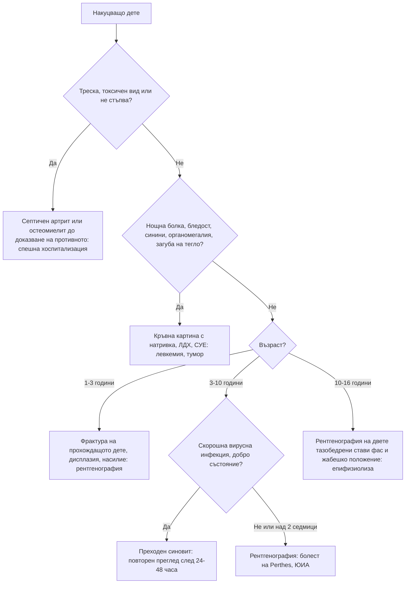

# Глава 72. Накуцване и болки в крайниците при деца

> **Част XIV. Детска възраст**

## Цели на главата

- Да се подхожда към накуцващото дете според възрастта.
- Да се разграничава **септичният артрит** от **преходния синовит** на тазобедрената става.
- Да се разпознават болестта на Perthes и **епифизиолизата на главата на бедрената кост**, включително когато се представят с болка в коляното.
- Да се разпознават злокачествените заболявания (левкемия, костни тумори) като причина за болки в крайниците.
- Да се разграничават „болките от растежа“ от органичните заболявания.
- Да се разпознават ювенилният идиопатичен артрит и острата ревматична треска.

---

## 1. Подход към накуцващото дете

### 1.1. Основни въпроси

- **Възраст** — определя най-вероятните причини.
- **Травма** — съответства ли на находката? (**Насилие**; честата „травма“ може да отклони вниманието от истинската причина.)
- **Продължителност** и **ход**.
- **Болка** — има ли, къде е, **нощна** ли е, **събужда ли** детето?
- **Системни симптоми** — **треска**, загуба на тегло, умора, **бледост, синини**, нощно изпотяване.
- **Предшестваща инфекция** — вирусна (преходен синовит), стрептококова (реактивен артрит, ревматична треска), диария (реактивен артрит).
- **Може ли детето да стъпва** на крака?

### 1.2. Преглед

- **Походка** — антиалгична (скъсена опорна фаза), **Тренделенбургова**, спастична, стъпване на пръсти.
- **Целият долен крайник, гръбначният стълб, коремът и тестисите** — **болката в коляното често е отразена от тазобедрената става**.
- **Всички стави** — оток, затопляне, болезненост, обем на движенията (особено **вътрешна ротация** на тазобедрената става).
- **Костна болезненост** — остеомиелит, фрактура, тумор.
- **Лимфни възли, черен дроб, слезка, кожа** (петехии, синини, обриви).
- **Неврологичен преглед** — рефлекси, сила, сетивност; **лумбосакрална кожа**.

---

## 2. Причини според възрастта

| Възраст | Чести причини | Сериозни причини, които не бива да се пропускат |
|---|---|---|
| **1–3 години** | Травма (**фрактура на прохождащото дете** — спираловидна фрактура на тибията), чуждо тяло в ходилото, преходен синовит | **Септичен артрит**, **остеомиелит**, **дисплазия на тазобедрената става** (късно открита), **насилие**, **левкемия**, **невробластом**, церебрална парализа, **мускулна дистрофия** |
| **3–10 години** | **Преходен синовит**, травма | **Септичен артрит**, **остеомиелит**, **болест на Perthes**, **ювенилен идиопатичен артрит**, **левкемия**, реактивен артрит, IgA васкулит |
| **10–16 години** | Травми, спортни увреждания, **болест на Osgood-Schlatter**, пателофеморална болка | **Епифизиолиза на главата на бедрената кост**, **костни тумори** (**остеосарком**, **сарком на Ewing**), септичен артрит (включително **гонококов**), остеомиелит, ювенилен идиопатичен артрит, **дисекантна остеохондроза**, **стрес фрактури** |

---

## 3. Тазобедрената става: основните диагнози

### 3.1. Септичен артрит или преходен синовит?

| Белег | **Преходен синовит** | **Септичен артрит** |
|---|---|---|
| Възраст | 3–10 години | **Всяка**, по-често **под 3 години** |
| Предхождаща инфекция | Вирусна инфекция на горните дихателни пътища преди 1–2 седмици | Възможна |
| Общо състояние | **Добро** | **Болно**, токсично |
| Температура | Нормална или субфебрилна | **Над 38,5 °C** |
| Натоварване на крака | Накуцва, но **стъпва** | **Не стъпва** |
| Движения в ставата | Леко ограничени, особено вътрешна ротация | **Силно болезнени**, ставата се държи във **флексия, абдукция и външна ротация** |
| Левкоцити | Нормални | **Над 12 × 10⁹/l** |
| СУЕ, CRP | Нормални или леко повишени | **СУЕ над 40 mm/h**, **CRP над 20 mg/l** |
| Ход | Отзвучава за **7–10 дни** | Прогресира; **разрушаване на ставата** за дни |

**Критерии на Kocher** (при дете с болезнена тазобедрена става): **не стъпва**, **температура над 38,5 °C**, **СУЕ над 40 mm/h**, **левкоцити над 12 × 10⁹/l**. Вероятност за септичен артрит: 0 критерия — под 1%; 1 — около 3%; 2 — около 40%; 3 — около 93%; 4 — над 99%. **CRP над 20 mg/l** е допълнителен независим предиктор.

**При съмнение — спешна хоспитализация:** ехография (излив), **аспирация на ставата** (Грам-оцветяване, посявка, левкоцити), хемокултура, i.v. антибиотик, хирургично промиване. **Не започвайте антибиотик в амбулаторията преди аспирацията**, освен при сепсис.

**Преходният синовит е диагноза чрез изключване.** Дете с предполагаем преходен синовит се преглежда повторно след 24–48 часа. При треска, влошаване или липса на подобрение за 7–10 дни се търси друга причина.

### 3.2. Болест на Perthes (асептична некроза на главата на бедрената кост)

- **4–8 години** (диапазон 2–12), по-често **момчета**, **ниски** за възрастта.
- **Постепенно** накуцване, **болка в слабините, бедрото или коляното**, влошаваща се при активност.
- **Ограничена абдукция и вътрешна ротация**.
- **Двустранна при 10–15%**. При двустранни симетрични промени мислете за **скелетна дисплазия** или **хипотиреоидизъм**.
- **Рентгенография** (фас и „жабешко“ положение) — в началото може да е нормална; при съмнение — ЯМР.

### 3.3. Епифизиолиза на главата на бедрената кост (SUFE, SCFE)

- **10–16 години**, по-често **момчета**, **затлъстяване**; по време на **ускорения растеж**.
- **Болка в слабините, бедрото или само в коляното** (!), накуцване, **външна ротация** на крака.
- **Загуба на вътрешната ротация**; **белег на Drehmann** — при флексия на тазобедрената става бедрото се завърта навън.
- **Двустранна при 20–40%**.
- **Нестабилна форма** (детето не може да стъпва) — **висок риск от асептична некроза**, спешна хирургия.
- **Рентгенография** на двете тазобедрени стави фас и в **„жабешко“ положение** — линията на Klein не пресича главата.
- **Атипична възраст** (под 10 или над 16 години) или **ниско, слабо дете** — изключете **хипотиреоидизъм**, **хипогонадизъм**, **бъбречна остеодистрофия**, лъчелечение.

**Дете или подрастващ с болка в коляното и нормален преглед на коляното: прегледайте тазобедрената става.**

### 3.4. Дисплазия на тазобедрената става

- **Рискови фактори:** **седалищно предлежание**, **фамилна анамнеза**, **женски пол**, първородство, олигохидрамнион.
- Скрининг при новородени (**Ortolani, Barlow**) и ехография.
- **Късно открита:** **асиметрия на кожните гънки**, **скъсяване на крака**, **ограничена абдукция**, **накуцване** или **„патешка“ походка** при двустранна дисплазия.

---

## 4. Злокачествени заболявания

| Заболяване | Възраст | Насочващи белези |
|---|---|---|
| **Остра лимфобластна левкемия** | **2–5 години** | **Болки в костите** (събуждат детето), **накуцване, отказ от ходене**, **артралгии** (може да имитира **ювенилен артрит**), бледост, умора, **синини, петехии**, треска, лимфаденопатия, **хепатоспленомегалия** |
| **Невробластом** | Под 5 години | Болки в костите, **периорбитални синини** („очи на енот“), коремна формация, опсоклонус-миоклонус |
| **Остеосарком** | **Подрастващи** | **Болка и оток около коляното** (дистален фемур, проксимална тибия) или проксималния хумерус; **нощна болка**; рентгенография — **„слънчеви лъчи“**, **триъгълник на Codman** |
| **Сарком на Ewing** | 10–20 години | **Диафизи на дългите кости и тазът**, болка, оток, **треска, висок СУЕ** — може да **имитира остеомиелит**; рентгенография — **„люспи на лук“** |
| **Остеоиден остеом** | 10–25 години | **Нощна болка**, която **отлично се повлиява от НСПВС**; малка лезия с остеосклероза |

**Червени флагове за злокачествено заболяване:**

- **нощна болка**, която **събужда** детето;
- **постоянна**, **нарастваща** болка;
- **системни симптоми** — треска, загуба на тегло, нощно изпотяване, умора;
- **бледост, синини, петехии**, лимфаденопатия, хепатоспленомегалия;
- **локален оток** или формация;
- **болка, несъразмерна** на травмата;
- **отклонения в кръвната картина** (дори в една линия), **висока ЛДХ**, висока СУЕ при **ниски тромбоцити** (при ювенилен артрит тромбоцитите обикновено са **високи**).

**„Ювенилен артрит“ с болки в костите, нощна болка, цитопения или висока ЛДХ е левкемия, докато не се докаже противното.** Кортикостероиди не се започват преди изключване на левкемия (може да маскират диагнозата).

---

## 5. Болести на коляното и ходилото при подрастващи

| Заболяване | Особености |
|---|---|
| **Болест на Osgood-Schlatter** | 10–15 години, спортуващи; болка и **подутина на туберозитас тибие**; двустранна при 25% |
| **Синдром на Sinding-Larsen-Johansson** | Болка на **долния полюс на пателата** |
| **Пателофеморална болка** | Подрастващи момичета; болка **около пателата** при **стълби, клякане, продължително седене** |
| **Дисекантна остеохондроза** | 10–20 години; болка, **оток**, **„заклинване“** на коляното |
| **Луксация на пателата** | Подрастващи момичета, хипермобилност |
| **Увреждания на менискусите и кръстните връзки** | Спортни травми; хемартроза |
| **Болест на Sever** (калканеален апофизит) | 8–12 години; болка в **петата** при спорт |
| **Болест на Köhler** | 4–7 години; асептична некроза на **навикуларната кост** |
| **Стрес фрактури** | Спортуващи, **хранителни разстройства** (триада на жената спортистка) |

---

## 6. Артрит при деца

### 6.1. Ювенилен идиопатичен артрит (ЮИА)

**Артрит с начало преди 16-годишна възраст**, продължаващ **над 6 седмици**, след изключване на други причини.

| Форма | Особености |
|---|---|
| **Олигоартикуларна** (≤ 4 стави) | Най-честата; **малки момичета** (1–5 години); колена, глезени; **ANA положителни**; **висок риск от безсимптомен преден увеит** — **редовни офталмологични прегледи с биомикроскопия** |
| **Полиартикуларна** (≥ 5 стави) | RF-отрицателна или RF-положителна (подобна на ревматоиден артрит при възрастни — подрастващи момичета) |
| **Системна** (болест на Still) | **Ежедневни фебрилни пикове** (1–2 пъти дневно, между тях нормална температура), **мимолетен розов обрив** по време на треската, **серозит**, **хепатоспленомегалия**, лимфаденопатия, висок CRP, **феритин**, **тромбоцитоза**; усложнение — **синдром на активиране на макрофагите** (спадащи тромбоцити и СУЕ, много висок феритин) |
| **Свързана с ентезит** | Момчета над 6 години; **HLA-B27**; ентезит, сакроилиит, остър симптоматичен увеит |
| **Псориатична** | Дактилит, промени по ноктите, фамилна анамнеза за псориазис |

**Сутрешната скованост** и **накуцването сутрин**, което се подобрява през деня, са характерни. **Малките деца рядко се оплакват от болка** — те накуцват или отказват да ходят.

### 6.2. Други причини за артрит

| Причина | Насочващи белези |
|---|---|
| **Реактивен артрит** | След **ентерит** (*Salmonella*, *Campylobacter*, *Yersinia*) или **урогенитална инфекция**; големи стави на краката |
| **Постстрептококов реактивен артрит** | След ангина; **немигриращ**, слабо отговаря на НСПВС |
| **Остра ревматична треска** | 5–15 години, 2–4 седмици след стрептококова ангина; **мигриращ полиартрит** на големите стави, който **отлично отговаря на аспирин или НСПВС**, **кардит** (нов шум), **хорея на Sydenham**, **маргинален еритем**, **подкожни възли** (критерии на Jones) |
| **IgA васкулит** | Пурпура, коремна болка, артрит на глезените и коленете |
| **Лаймска болест** | **Ухапване от кърлеж**, **мигриращ еритем**; по-късно **моно- или олигоартрит на коляното**, лицева парализа |
| **Вирусен артрит** | Парвовирус B19, рубеола (и след ваксинация), хепатит B, ентеровируси |
| **Серумна болест-подобна реакция** | След антибиотик |
| **Възпалителни заболявания на червата** | Диария, загуба на тегло |
| **Системен лупус еритематодес** | Подрастващи момичета; обрив, нефрит, цитопении |
| **Хемофилия** | Хемартроза при момче |

---

## 7. „Болки от растежа“

**Доброкачествени ноктурни болки в крайниците при деца**. Засягат 10–20% от децата на **3–12 години**.

**Критерии (всички трябва да са налице):**

- **двустранни** болки;
- в **мускулите** на **подбедриците, бедрата, зад коленете** — **не в ставите**;
- **вечер или нощем**; детето може да се събуди, но **сутринта е добре**;
- **повлияват се от масаж** и аналгетици;
- **не накуцва**, **нормална активност** през деня;
- **нормален преглед**;
- **без системни симптоми**.

**Всяко отклонение от тези критерии** (едностранна болка, болка в ставата, накуцване, сутрешна скованост, болка през деня, оток, системни симптоми, отклонения при прегледа) **изключва диагнозата** и налага изследване: кръвна картина с натривка, СУЕ, CRP, ЛДХ, рентгенография.

**Други причини за генерализирани болки:** **синдром на хипермобилност** (скала на Beighton), **дефицит на витамин D** (рахит), хипотиреоидизъм, фибромиалгия при подрастващи, **психосоциален стрес**.

---

## 8. Безопасна диагностична стратегия

| Въпрос | Отговор |
|---|---|
| **Вероятна диагноза** | Травма, преходен синовит, болки от растежа, болест на Osgood-Schlatter, пателофеморална болка, хипермобилност |
| **Сериозни заболявания, които не бива да се пропускат** | **Септичен артрит**; **остеомиелит**; **епифизиолиза на главата на бедрената кост**; **болест на Perthes**; **левкемия**; **невробластом**; **костни тумори**; **насилие**; **остра ревматична треска**; **ювенилен артрит с увеит**; **торзия на тестиса** (накуцване при момче); **апендицит и псоасов абсцес**; **дискит** (малко дете, което отказва да ходи или да седи) |
| **Чести капани** | Болка в коляното при заболяване на тазобедрената става; преходен синовит, който е септичен артрит; левкемия, приета за ювенилен артрит; сарком на Ewing, приет за остеомиелит; травма, приета като обяснение за туморна болка; „болки от растежа“, които не отговарят на критериите |
| **Маскиращи заболявания** | Левкемия, хипотиреоидизъм, дефицит на витамин D, възпалителни заболявания на червата |
| **Психосоциални аспекти** | Насилие, тормоз, избягване на училище, функционална болка |

---

## 9. Диагностичен алгоритъм при накуцващо дете

---

## 10. Клинични перли

- Болката в коляното при дете може да идва от тазобедрената става. Прегледайте тазобедрената става при всяка болка в коляното.
- Подрастващ с наднормено тегло, болка в коляното и ограничена вътрешна ротация на тазобедрената става има епифизиолиза, докато не се докаже противното.
- Дете, което не стъпва, с треска: септичен артрит. Ставата се аспирира преди антибиотика.
- Преходният синовит е диагноза чрез изключване и изисква повторен преглед.
- Нощна болка, която събужда детето: изключете левкемия и тумор.
- „Артрит“ с цитопения, висока ЛДХ или нисък брой тромбоцити: левкемия.
- При олигоартикуларен ЮИА с положителни ANA увеитът е безсимптомен. Нужни са редовни прегледи с биомикроскопия.
- Нощна костна болка, която изчезва след ибупрофен: остеоиден остеом.
- Малко дете, което отказва да ходи или да седи, без находка в крайниците: дискит или спинален процес.
- „Болките от растежа“ са двустранни, нощни, в мускулите и никога не причиняват накуцване.

---

## 11. Клиничен случай

**Случай.** Момче на 13 години с тегло 82 kg (над 97-ия перцентил) накуцва от 4 седмици и се оплаква от болка в **лявото коляно**. Треньорът по футбол мисли, че е „разтегнал нещо“. Прегледът на коляното е нормален. При прегледа на тазобедрената става в легнало положение и флексия бедрото се завърта навън, а **вътрешната ротация вляво липсва**. При ходене левият крак е във външна ротация.

**Въпроси.** 1) Коя е най-вероятната диагноза? 2) Какво е поведението?

**Обсъждане.** Подрастващ с наднормено тегло, **болка в коляното при нормален преглед на коляното**, **загуба на вътрешната ротация** и **белег на Drehmann** има **епифизиолиза на главата на бедрената кост** до доказване на противното. Болката се отразява по хода на обтураторния нерв към медиалната страна на коляното и това е най-честата причина за забавена диагноза. Необходима е **спешна рентгенография на двете тазобедрени стави** (фас и в „жабешко“ положение). Детето **не бива да натоварва крака** и се насочва **спешно** към детски ортопед за фиксация. Забавянето води до прогресия на плъзгането, асептична некроза на главата и ранна артроза. Другата тазобедрена става също се проследява, защото при 20–40% заболяването е двустранно.

**Поука.** Нормален преглед на болезнено коляно при дете задължава да прегледате тазобедрената става.
