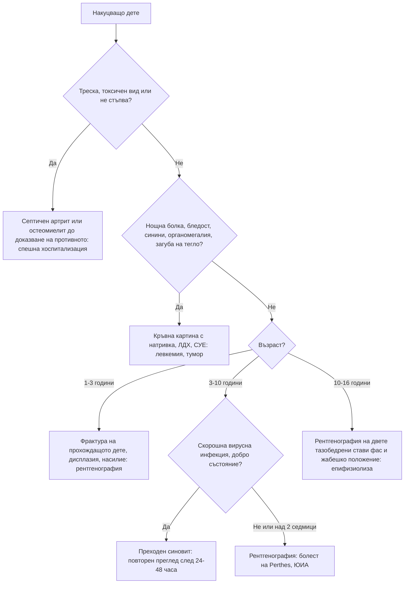

# Глава 72. Накуцване и болки в крайниците при деца

> **Част XIV. Детска възраст**

## Цели на главата

- Да се съставя диференциална диагноза при накуцващо дете според възрастта.
- Да се разграничава септичният артрит от преходния синовит на тазобедрената става.
- Да се разпознават болестта на Perthes и **епифизиолизата на главата на бедрената кост**, включително когато се представят с болка в коляното.
- Да се разпознават злокачествените заболявания (левкемия, костни тумори) като причина за болки в крайниците.
- Да се разграничават „болките от растежа“ от органичните заболявания.
- Да се разпознават ювенилният идиопатичен артрит и острата ревматична треска.

## Ключови моменти

- Дете с болезнена тазобедрена става, което не стъпва, с температура над 38,5 °C, СУЕ над 40 mm/h и левкоцити над 12 × 10⁹/l, има висока вероятност за септичен артрит (критерии на Kocher) *(SORT B [1])*.
- Преходният синовит е диагноза чрез изключване и изисква повторен преглед след 24–48 часа.
- Болката в коляното при подрастващ с нормален преглед на коляното изисква преглед на тазобедрената става за епифизиолиза *(SORT C [3])*.
- Нощната болка, ниските левкоцити и ниско-нормалните тромбоцити при дете с мускулно-скелетни оплаквания насочват към левкемия *(SORT B [5])*.
- При необяснена костна болка у дете се прави ПКК до 48 часа, а при петехии или хепатоспленомегалия детето се насочва незабавно *(SORT C [6])*.
- „Болките от растежа“ се диагностицират само при изпълнени всички критерии. Всяко отклонение налага изследване *(SORT C [11])*.

---

## 1. Подход към накуцващото дете

### 1.1. Основни въпроси

- **Възраст** – определя най-вероятните причини.
- **Травма** – съответства ли на находката? (**Насилие**; честата „травма“ може да отклони вниманието от истинската причина.)
- Продължителност и ход.
- **Болка** – има ли, къде е, нощна ли е, събужда ли детето?
- **Системни симптоми** – треска, загуба на тегло, умора, бледост, синини, нощно изпотяване.
- **Предшестваща инфекция** – вирусна (преходен синовит), стрептококова (реактивен артрит, ревматична треска), диария (реактивен артрит).
- **Може ли детето да стъпва** на крака?

### 1.2. Преглед

- **Походка** – антиалгична (скъсена опорна фаза), **Тренделенбургова**, спастична, стъпване на пръсти.
- **Целият долен крайник, гръбначният стълб, коремът и тестисите** – **болката в коляното често е отразена от тазобедрената става**.
- **Всички стави** – оток, затопляне, болезненост, обем на движенията (особено **вътрешна ротация** на тазобедрената става).
- **Костна болезненост** – остеомиелит, фрактура, тумор.
- **Лимфни възли, черен дроб, слезка, кожа** (петехии, синини, обриви).
- **Неврологичен преглед** – рефлекси, сила, сетивност; **лумбосакрална кожа**.

---

## 2. Причини според възрастта

*Таблица 72.1. Причини според възрастта.*

| Възраст | Чести причини | Сериозни причини, които не бива да се пропускат |
|---|---|---|
| **1–3 години** | Травма (фрактура на прохождащото дете – спираловидна фрактура на тибията), чуждо тяло в ходилото, преходен синовит | Септичен артрит, остеомиелит, дисплазия на тазобедрената става (късно открита), насилие, левкемия, невробластом, церебрална парализа, мускулна дистрофия |
| **3–10 години** | Преходен синовит, травма | Септичен артрит, остеомиелит, болест на Perthes, ювенилен идиопатичен артрит, левкемия, реактивен артрит, IgA васкулит |
| **10–16 години** | Травми, спортни увреждания, болест на Osgood-Schlatter, пателофеморална болка | Епифизиолиза на главата на бедрената кост, костни тумори (остеосарком, сарком на Ewing), септичен артрит (включително гонококов), остеомиелит, ювенилен идиопатичен артрит, дисекантна остеохондроза, стрес фрактури |

---

## 3. Тазобедрената става: основните диагнози

### 3.1. Септичен артрит или преходен синовит?

*Таблица 72.2. Септичен артрит или преходен синовит?*

| Белег | **Преходен синовит** | **Септичен артрит** |
|---|---|---|
| Възраст | 3–10 години | Всяка, по-често под 3 години |
| Предхождаща инфекция | Вирусна инфекция на горните дихателни пътища преди 1–2 седмици | Възможна |
| Общо състояние | **Добро** | Болно, токсично |
| Температура | Нормална или субфебрилна | **Над 38,5 °C** |
| Натоварване на крака | Накуцва, но стъпва | **Не стъпва** |
| Движения в ставата | Леко ограничени, особено вътрешна ротация | Силно болезнени, ставата се държи във флексия, абдукция и външна ротация |
| Левкоцити | Нормални | **Над 12 × 10⁹/l** |
| СУЕ, CRP | Нормални или леко повишени | СУЕ над 40 mm/h, CRP над 20 mg/l |
| Ход | Отзвучава за 7–10 дни | Прогресира; разрушаване на ставата за дни |

Критерии на Kocher (при дете с болезнена тазобедрена става): не стъпва, температура над 38,5 °C, СУЕ над 40 mm/h, левкоцити над 12 × 10⁹/l. Вероятност за септичен артрит: 0 критерия – под 1%; 1 – около 3%; 2 – около 40%; 3 – около 93%; 4 – над 99% [1]. CRP над 20 mg/l е допълнителен независим предиктор [2].

**При съмнение – спешна хоспитализация:** ехография (излив), аспирация на ставата (Грам-оцветяване, посявка, левкоцити), хемокултура, i.v. антибиотик, хирургично промиване. Не започвайте антибиотик в амбулаторията преди аспирацията, освен при сепсис.

**Преходният синовит е диагноза чрез изключване.** Дете с предполагаем преходен синовит се преглежда повторно след 24–48 часа. При треска, влошаване или липса на подобрение за 7–10 дни се търси друга причина.

### 3.2. Болест на Perthes (асептична некроза на главата на бедрената кост)

- 4–8 години (диапазон 2–12), по-често момчета, ниски за възрастта.
- Постепенно накуцване, болка в слабините, бедрото или коляното, влошаваща се при активност.
- **Ограничена абдукция и вътрешна ротация**.
- **Двустранна при 10–15%**. При двустранни симетрични промени помислете за скелетна дисплазия или хипотиреоидизъм.
- **Рентгенография** (фас и „жабешко“ положение) – в началото може да е нормална; при съмнение – ЯМР.

### 3.3. Епифизиолиза на главата на бедрената кост (SUFE, SCFE)

- 10–16 години, по-често момчета, затлъстяване; по време на ускорения растеж.
- Болка в слабините, бедрото или само в коляното (!), накуцване, външна ротация на крака.
- Загуба на вътрешната ротация; белег на Drehmann – при флексия на тазобедрената става бедрото се завърта навън.
- **Двустранна при 20–40%** [3].
- Нестабилна форма (детето не може да стъпва) – висок риск от асептична некроза, спешна хирургия [3].
- Рентгенография на двете тазобедрени стави фас и в „жабешко“ положение – линията на Klein не пресича главата.
- Атипична възраст (под 10 или над 16 години) или ниско, слабо дете – изключете хипотиреоидизъм, хипогонадизъм, бъбречна остеодистрофия, лъчелечение.

**Дете или подрастващ с болка в коляното и нормален преглед на коляното: прегледайте тазобедрената става.**

### 3.4. Дисплазия на тазобедрената става

- **Рискови фактори:** седалищно предлежание, фамилна анамнеза, женски пол, първородство, олигохидрамнион.
- Скрининг при новородени (**Ortolani, Barlow**) и ехография.
- **Късно открита:** асиметрия на кожните гънки, скъсяване на крака, ограничена абдукция, накуцване или „патешка“ походка при двустранна дисплазия.

---

## 4. Злокачествени заболявания

*Таблица 72.3. Злокачествени заболявания.*

| Заболяване | Възраст | Насочващи белези |
|---|---|---|
| **Остра лимфобластна левкемия** | **2–5 години** | Болки в костите (събуждат детето), накуцване, отказ от ходене, артралгии (може да имитира ювенилен артрит), бледост, умора, синини, петехии, треска, лимфаденопатия, хепатоспленомегалия; болки в крайниците има около 43% от децата [4] |
| **Невробластом** | Под 5 години | Болки в костите, периорбитални синини („очи на енот“), коремна формация, опсоклонус-миоклонус |
| **Остеосарком** | **Подрастващи** | Болка и оток около коляното (дистален фемур, проксимална тибия) или проксималния хумерус; нощна болка; рентгенография – „слънчеви лъчи“, триъгълник на Codman |
| **Сарком на Ewing** | 10–20 години | Диафизи на дългите кости и тазът, болка, оток, треска, висок СУЕ – може да имитира остеомиелит; рентгенография – „люспи на лук“ |
| **Остеоиден остеом** | 10–25 години | Нощна болка, която отлично се повлиява от НСПВС; малка лезия с остеосклероза |

**Червени флагове за злокачествено заболяване:**

- нощна болка, която събужда детето;
- постоянна, нарастваща болка;
- **системни симптоми** – треска, загуба на тегло, нощно изпотяване, умора;
- **бледост, синини, петехии**, лимфаденопатия, хепатоспленомегалия;
- **локален оток** или формация;
- **болка, несъразмерна** на травмата;
- отклонения в кръвната картина (дори в една линия), висока ЛДХ, висока СУЕ при ниски тромбоцити (при ювенилен артрит тромбоцитите обикновено са високи). При дете с мускулно-скелетни оплаквания ниските левкоцити (под 4 × 10⁹/l), ниско-нормалните тромбоцити (150–250 × 10⁹/l) и нощната болка заедно имат чувствителност 100% и специфичност 85% за остра лимфобластна левкемия, а при 75% от децата с левкемия в периферната кръв няма бласти [5].

**„Ювенилен артрит“ с болки в костите, нощна болка, цитопения или висока ЛДХ е левкемия до доказване на противното.** Кортикостероиди не се започват преди изключване на левкемия (може да маскират диагнозата). При необяснена или персистираща костна болка у дете се прави ПКК до 48 часа, а при необяснени петехии или хепатоспленомегалия детето се насочва незабавно [6].

---

## 5. Болести на коляното и ходилото при подрастващи

*Таблица 72.4. Болести на коляното и ходилото при подрастващи.*

| Заболяване | Особености |
|---|---|
| **Болест на Osgood-Schlatter** | 10–15 години, спортуващи; болка и подутина на туберозитас тибие; двустранна при 25% |
| **Синдром на Sinding-Larsen-Johansson** | Болка на долния полюс на пателата |
| **Пателофеморална болка** | Подрастващи момичета; болка около пателата при стълби, клякане, продължително седене |
| **Дисекантна остеохондроза** | 10–20 години; болка, оток, „заклинване“ на коляното |
| **Луксация на пателата** | Подрастващи момичета, хипермобилност |
| **Увреждания на менискусите и кръстните връзки** | Спортни травми; хемартроза |
| **Болест на Sever** (калканеален апофизит) | 8–12 години; болка в петата при спорт |
| **Болест на Köhler** | 4–7 години; асептична некроза на навикуларната кост |
| **Стрес фрактури** | Спортуващи, хранителни разстройства (триада на жената спортистка) |

---

## 6. Артрит при деца

### 6.1. Ювенилен идиопатичен артрит (ЮИА)

Артрит с начало преди 16-годишна възраст, продължаващ над 6 седмици, след изключване на други причини [7].

*Таблица 72.5. Ювенилен идиопатичен артрит (ЮИА).*

| Форма | Особености |
|---|---|
| **Олигоартикуларна** (≤ 4 стави) | Най-честата; малки момичета (1–5 години); колена, глезени; ANA положителни; висок риск от безсимптомен преден увеит – редовни офталмологични прегледи с биомикроскопия [8] |
| **Полиартикуларна** (≥ 5 стави) | RF-отрицателна или RF-положителна (подобна на ревматоиден артрит при възрастни – подрастващи момичета) |
| **Системна** (болест на Still) | Ежедневни фебрилни пикове (1–2 пъти дневно, между тях нормална температура), мимолетен розов обрив по време на треската, серозит, хепатоспленомегалия, лимфаденопатия, висок CRP, феритин, тромбоцитоза; усложнение – синдром на активиране на макрофагите (спадащи тромбоцити и СУЕ, много висок феритин) |
| **Свързана с ентезит** | Момчета над 6 години; HLA-B27; ентезит, сакроилеит, остър симптоматичен увеит |
| **Псориатична** | Дактилит, промени по ноктите, фамилна анамнеза за псориазис |

Сутрешната скованост и накуцването сутрин, което се подобрява през деня, са характерни. Малките деца рядко се оплакват от болка – те накуцват или отказват да ходят.

### 6.2. Други причини за артрит

*Таблица 72.6. Други причини за артрит.*

| Причина | Насочващи белези |
|---|---|
| **Реактивен артрит** | След ентерит (*Salmonella*, *Campylobacter*, *Yersinia*) или урогенитална инфекция; големи стави на краката |
| **Постстрептококов реактивен артрит** | След ангина; немигриращ, слабо отговаря на НСПВС |
| **Остра ревматична треска** | 5–15 години, 2–4 седмици след стрептококова ангина; мигриращ полиартрит на големите стави, който отлично отговаря на аспирин или НСПВС, кардит (нов шум), хорея на Sydenham, маргинален еритем, подкожни възли (критерии на Jones) [9] |
| **IgA васкулит** | Пурпура, коремна болка, артрит на глезените и коленете |
| **Лаймска болест** | Ухапване от кърлеж, мигриращ еритем; по-късно моно- или олигоартрит на коляното, лицева парализа |
| **Вирусен артрит** | Парвовирус B19, рубеола (и след ваксинация), хепатит B, ентеровируси |
| **Серумна болест-подобна реакция** | След антибиотик |
| **Възпалителни заболявания на червата** | Диария, загуба на тегло |
| **Системен лупус еритематодес** | Подрастващи момичета; обрив, нефрит, цитопении |
| **Хемофилия** | Хемартроза при момче |

---

## 7. „Болки от растежа“

**Доброкачествени ноктурни болки в крайниците при деца**. Чести са при децата на **3–12 години** – в едно проучване сред деца на 4–6 години честотата е около 37% [10].

**Критерии (всички трябва да са налице) [11]:**

- **двустранни** болки;
- в мускулите на подбедриците, бедрата, зад коленете – не в ставите;
- вечер или нощем; детето може да се събуди, но сутринта е добре;
- **повлияват се от масаж** и аналгетици;
- не накуцва, нормална активност през деня;
- **нормален преглед**;
- **без системни симптоми**.

Всяко отклонение от тези критерии (едностранна болка, болка в ставата, накуцване, сутрешна скованост, болка през деня, оток, системни симптоми, отклонения при прегледа) изключва диагнозата и налага изследване: кръвна картина с натривка, СУЕ, CRP, ЛДХ, рентгенография.

**Други причини за генерализирани болки:** синдром на хипермобилност (скала на Beighton), дефицит на витамин D (рахит), хипотиреоидизъм, фибромиалгия при подрастващи, психосоциален стрес.

---

## 8. Безопасна диагностична стратегия

*Таблица 72.7. Безопасна диагностична стратегия.*

| Въпрос | Отговор |
|---|---|
| **Вероятна диагноза** | Травма, преходен синовит, болки от растежа, болест на Osgood-Schlatter, пателофеморална болка, хипермобилност |
| **Сериозни заболявания, които не бива да се пропускат** | Септичен артрит; остеомиелит; епифизиолиза на главата на бедрената кост; болест на Perthes; левкемия; невробластом; костни тумори; насилие; остра ревматична треска; ювенилен артрит с увеит; торзия на тестиса (накуцване при момче); апендицит и псоасов абсцес; дискит (малко дете, което отказва да ходи или да седи) |
| **Чести капани** | Болка в коляното при заболяване на тазобедрената става; преходен синовит, който е септичен артрит; левкемия, приета за ювенилен артрит; сарком на Ewing, приет за остеомиелит; травма, приета като обяснение за туморна болка; „болки от растежа“, които не отговарят на критериите |
| **Маскиращи заболявания** | Левкемия, хипотиреоидизъм, дефицит на витамин D, възпалителни заболявания на червата |
| **Психосоциални аспекти** | Насилие, тормоз, избягване на училище, функционална болка |

---

## 9. Диагностичен алгоритъм при накуцващо дете

*Фигура 72.1. Диагностичен алгоритъм при накуцващо дете. Схема на авторите въз основа на източниците, цитирани в главата.*

Текстово описание на фигура 72.1

1. Накуцващо дете. Следва: към т. 2.
2. **Въпрос:** Треска, токсичен вид или не стъпва? Да – към т. 3; Не – към т. 4.
3. Септичен артрит или остеомиелит до доказване на противното: спешна хоспитализация.
4. **Въпрос:** Нощна болка, бледост, синини, органомегалия, загуба на тегло? Да – към т. 5; Не – към т. 6.
5. Кръвна картина с натривка, ЛДХ, СУЕ: левкемия, тумор.
6. **Въпрос:** Възраст? 1-3 години – към т. 7; 3-10 години – към т. 8; 10-16 години – към т. 9.
7. Фрактура на прохождащото дете, дисплазия, насилие: рентгенография.
8. **Въпрос:** Скорошна вирусна инфекция, добро състояние? Да – към т. 10; Не или над 2 седмици – към т. 11.
9. Рентгенография на двете тазобедрени стави фас и жабешко положение: епифизиолиза.
10. Преходен синовит: повторен преглед след 24-48 часа.
11. Рентгенография: болест на Perthes, ЮИА.

---

## 10. Червени флагове и насочване

### 10.1. Червени флагове

- Треска с отказ да стъпва или със силно болезнена става.
- Нощна болка, която събужда детето, или постоянна нарастваща болка.
- Бледост, синини, петехии, лимфаденопатия или хепатоспленомегалия.
- Локален оток или формация на костта.
- Болка в коляното с ограничена вътрешна ротация на тазобедрената става при подрастващ.
- Внезапна невъзможност да стъпва при подрастващ с болка в тазобедрената става.
- Отказ да ходи или да седи без находка в крайниците.
- Фрактури или синини, които не отговарят на механизма на травмата или на етапа на развитие.
- Артрит с треска, нов сърдечен шум или хорея.

### 10.2. Кога и колко спешно да насочим

*Таблица 72.8. Кога и колко спешно да насочим.*

| Спешност | Клинична ситуация |
|---|---|
| **Незабавно (112 или спешно отделение)** | Подозрение за септичен артрит или остеомиелит – аспирация и антибиотик в болница [1, 2]; нестабилна епифизиолиза (детето не стъпва) [3]; необяснени петехии или хепатоспленомегалия – незабавна оценка за левкемия [6] |
| **В същия ден** | Стабилна епифизиолиза – рентгенография и детски ортопед, без натоварване на крака [3]; необяснена костна болка или оток – ПКК и рентгенография до 48 часа [6]; накуцване с треска при дете в добро общо състояние; подозрение за насилие; подозрение за остра ревматична треска [9] |
| **Бързо (до 2 седмици)** | Подозрение за болест на Perthes; подозрение за ювенилен идиопатичен артрит – детски ревматолог [7] |
| **Планово** | Олигоартикуларен ювенилен идиопатичен артрит – офталмологичен скрининг по график [8]; болест на Osgood-Schlatter без ефект от лечението; хипермобилност със значими оплаквания |
| **Проследяване в общата практика** | Преходен синовит с повторен преглед след 24–48 часа; „болки от растежа“, които отговарят на всички критерии [11]; пателофеморална болка; болест на Sever |

---

## 11. Клинични перли

- Болката в коляното при дете може да идва от тазобедрената става. Прегледайте тазобедрената става при всяка болка в коляното.
- Подрастващ с наднормено тегло, болка в коляното и ограничена вътрешна ротация на тазобедрената става има епифизиолиза до доказване на противното.
- Дете, което не стъпва, с треска: септичен артрит. Ставата се аспирира преди антибиотика.
- Преходният синовит е диагноза чрез изключване и изисква повторен преглед.
- Нощна болка, която събужда детето: изключете левкемия и тумор.
- „Артрит“ с цитопения, висока ЛДХ или нисък брой тромбоцити: левкемия.
- При олигоартикуларен ЮИА с положителни ANA увеитът е безсимптомен. Нужни са редовни прегледи с биомикроскопия.
- Нощна костна болка, която изчезва след ибупрофен: остеоиден остеом.
- Малко дете, което отказва да ходи или да седи, без находка в крайниците: дискит или спинален процес.
- „Болките от растежа“ са двустранни, нощни, в мускулите и никога не причиняват накуцване.

---

## 12. Клиничен случай

**Етап 1 – представяне.** Момче на 13 години с тегло 82 kg (над 97-ия перцентил) накуцва от 4 седмици и се оплаква от болка в **лявото коляно**. Треньорът по футбол мисли, че е „разтегнал нещо“.

> **Въпрос 1.** Какво ще прегледате освен коляното?

**Етап 2 – преглед.** Прегледът на коляното е нормален. При флексия на лявата тазобедрена става бедрото се завърта навън, а **вътрешната ротация вляво липсва**. При ходене левият крак е във външна ротация. Момчето може да стъпва.

> **Въпрос 2.** Коя е най-вероятната диагноза?

> **Въпрос 3.** Какво е поведението?

Обсъждане и отговори

**Отговор 1.** Преглеждат се тазобедрената става (особено вътрешната ротация), гръбначният стълб и походката. Болката от тазобедрената става се отразява по хода на обтураторния нерв към медиалната страна на коляното.

**Отговор 2.** Подрастващ с наднормено тегло, болка в коляното при нормален преглед на коляното, загуба на вътрешната ротация и белег на Drehmann има епифизиолиза на главата на бедрената кост до доказване на противното. Детето може да стъпва, затова формата е стабилна [3].

**Отговор 3.** Необходима е рентгенография на двете тазобедрени стави (фас и в „жабешко“ положение) в същия ден. Детето не натоварва крака и се насочва към детски ортопед за фиксация [3]. Забавянето води до прогресия на плъзгането, асептична некроза и ранна артроза. Другата тазобедрена става също се проследява, защото при 20–40% заболяването е двустранно [3].

**Поука.** Нормален преглед на болезнено коляно при дете задължава да прегледате тазобедрената става.

---

## Обобщение

- Причините за накуцване при деца зависят от възрастта. Травмата не бива да отклонява вниманието от инфекция, тумор или насилие.
- Септичният артрит се разграничава от преходния синовит по треската, натоварването, левкоцитите, СУЕ и CRP (критерии на Kocher).
- Епифизиолизата и болестта на Perthes често се представят с болка в коляното.
- Нощната болка, цитопениите и системните симптоми насочват към левкемия или тумор, а „болките от растежа“ са диагноза само при изпълнени всички критерии.

## Самопроверка

### Въпроси с един верен отговор

**1.** *(основно ниво)* Момче на 5 години накуцва от 2 дни, 10 дни след настинка. Изглежда добре, температурата е 37,4 °C и стъпва на крака. Вътрешната ротация на дясната тазобедрена става е леко ограничена. Левкоцитите са 9 × 10⁹/l, а СУЕ – 15 mm/h. Кое е правилното поведение?

- **А.** Спешна аспирация на ставата
- **Б.** Вероятен преходен синовит – НСПВС, почивка и повторен преглед след 24–48 часа
- **В.** Перорален антибиотик
- **Г.** ЯМР на тазобедрената става
- **Д.** Имобилизация с гипс

Отговор и обосновка

**Верен отговор: Б.** Детето няма нито един от критериите на Kocher, затова вероятността за септичен артрит е под 1% [1]. Преходният синовит е диагноза чрез изключване и изисква повторен преглед.

**2.** *(основно ниво)* Момиче на 3 години не стъпва на десния крак от вчера. Температурата е 39,1 °C, левкоцитите – 16 × 10⁹/l, а СУЕ – 55 mm/h. Каква е вероятността за септичен артрит и какво е поведението?

- **А.** Около 3% – наблюдение
- **Б.** Над 99% – спешна хоспитализация за аспирация и лечение
- **В.** Около 40% – повторен преглед след 48 часа
- **Г.** Под 1% – НСПВС
- **Д.** Около 93% – перорален антибиотик у дома

Отговор и обосновка

**Верен отговор: Б.** Детето има и четирите критерия на Kocher, което отговаря на вероятност над 99% [1]. Ставата се аспирира преди започване на антибиотика.

**3.** *(основно ниво)* Момче на 4 години има болки в краката от 3 седмици, които го будят нощем. Бледо е, има петехии, а черният дроб е увеличен с 3 cm. Кое е правилното поведение?

- **А.** „Болки от растежа“ – масаж и успокояване
- **Б.** Незабавна оценка за левкемия
- **В.** Рентгенография след месец
- **Г.** НСПВС и контрол
- **Д.** Витамин D

Отговор и обосновка

**Верен отговор: Б.** Необяснените петехии и хепатоспленомегалията налагат незабавно насочване за левкемия [6]. Болки в крайниците има около 43% от децата с левкемия [4].

**4.** *(напреднало ниво)* Момче на 7 години има „болки от растежа“: болката е само в дясното бедро, понякога и през деня, а сутрин накуцва. Кое е вярно?

- **А.** Диагнозата е потвърдена – нужен е само масаж
- **Б.** Болката не отговаря на критериите – нужни са ПКК, СУЕ, CRP, ЛДХ и рентгенография
- **В.** Необходим е витамин D
- **Г.** Нужно е само наблюдение
- **Д.** Показан е кортикостероид

Отговор и обосновка

**Верен отговор: Б.** „Болките от растежа“ са двустранни, нощни, в мускулите и не причиняват накуцване. Всяко отклонение от критериите налага изследване [11].

**5.** *(напреднало ниво)* Момиче на 3 години има оток на лявото коляно от 8 седмици и накуцва сутрин, без да се оплаква от болка. ANA са положителни. Какво е най-важно освен насочването към детски ревматолог?

- **А.** Рентгенография на всички стави
- **Б.** Редовен офталмологичен скрининг с биомикроскопия
- **В.** Антибиотик
- **Г.** Кортикостероид през устата веднага
- **Д.** ЯМР на коляното

Отговор и обосновка

**Верен отговор: Б.** При олигоартикуларен ювенилен идиопатичен артрит с положителни ANA рискът от безсимптомен преден увеит е висок. Нужни са редовни прегледи с биомикроскопия [7, 8].

### Задача

Момче на 10 години има мигриращ болезнен артрит на коленете и глезените, треска и нов систолен шум 3 седмици след ангина. Как ще подходите?

Решение

Картината отговаря на **остра ревматична треска** по критериите на Jones: полиартрит и кардит са големи критерии [9]. Търсят се доказателства за предшестваща стрептококова инфекция (антистрептолизин O, анти-DNase B, посявка от гърлото). Детето се насочва в същия ден за ехокардиография и лечение [9]. Артритът отговаря бързо на НСПВС. След овладяването е нужна вторична профилактика с пеницилин, чиято продължителност зависи от сърдечното засягане.

### OSCE станция: Преглед на накуцващо дете

**Време:** 8 минути. **Ниво:** основно (студенти, специализанти).

**Задача за кандидата.** Момче на 6 години накуцва от 3 дни. Снемете насочена анамнеза, прегледайте детето и решете за поведението.

**Информация за симулирания пациент (за изпитващия).** Детето е сравнително добре, с температура 37,8 °C. Стъпва, но накуцва. Вътрешната ротация на дясната тазобедрена става е ограничена. Преди седмица е имало настинка.

*Таблица 72.9. OSCE станция „Преглед на накуцващо дете“ – критерии за оценяване.*

| Критерий | Точки |
|---|---|
| Пита за травма, начало, треска, нощна болка, предшестваща инфекция и системни симптоми | 2 |
| Оценява походката и дали детето стъпва | 1 |
| Преглежда всички стави, включително тазобедрените (вътрешна ротация), гръбначния стълб и корема | 2 |
| Търси бледост, синини, лимфаденопатия и органомегалия | 1 |
| Прилага критериите на Kocher и назначава подходящи изследвания (ПКК, СУЕ, CRP) | 2 |
| Обяснява плана: повторен преглед след 24–48 часа и кога да се търси спешна помощ | 2 |
| **Общо** | **10** |

**Праг за успешно представяне:** 7 от 10 точки, включително прегледа на тазобедрената става и указанията при влошаване.

## Литература

1. Kocher MS, Zurakowski D, Kasser JR. Differentiating between septic arthritis and transient synovitis of the hip in children: an evidence-based clinical prediction algorithm. J Bone Joint Surg Am. 1999;81(12):1662-70. doi:10.2106/00004623-199912000-00002. PMID: 10608376.
2. Caird MS, Flynn JM, Leung YL, Millman JE, D'Italia JG, Dormans JP. Factors distinguishing septic arthritis from transient synovitis of the hip in children. A prospective study. J Bone Joint Surg Am. 2006;88(6):1251-7. doi:10.2106/JBJS.E.00216. PMID: 16757758.
3. Peck DM, Voss LM, Voss TT. Slipped Capital Femoral Epiphysis: Diagnosis and Management. Am Fam Physician. 2017;95(12):779-784. PMID: 28671425.
4. Clarke RT, Van den Bruel A, Bankhead C, Mitchell CD, Phillips B, Thompson MJ. Clinical presentation of childhood leukaemia: a systematic review and meta-analysis. Arch Dis Child. 2016;101(10):894-901. doi:10.1136/archdischild-2016-311251. PMID: 27647842.
5. Jones OY, Spencer CH, Bowyer SL, Dent PB, Gottlieb BS, Rabinovich CE. A multicenter case-control study on predictive factors distinguishing childhood leukemia from juvenile rheumatoid arthritis. Pediatrics. 2006;117(5):e840-4. doi:10.1542/peds.2005-1515. PMID: 16651289.
6. National Institute for Health and Care Excellence. Suspected cancer: recognition and referral (NICE guideline NG12). London: NICE; 2015 [актуализирано 2026]. Достъпно на: https://www.nice.org.uk/guidance/ng12
7. Petty RE, Southwood TR, Manners P, Baum J, Glass DN, Goldenberg J, et al. International League of Associations for Rheumatology classification of juvenile idiopathic arthritis: second revision, Edmonton, 2001. J Rheumatol. 2004;31(2):390-2. PMID: 14760812.
8. Constantin T, Foeldvari I, Anton J, de Boer J, Czitrom-Guillaume S, Edelsten C, et al. Consensus-based recommendations for the management of uveitis associated with juvenile idiopathic arthritis: the SHARE initiative. Ann Rheum Dis. 2018;77(8):1107-1117. doi:10.1136/annrheumdis-2018-213131. PMID: 29592918.
9. Gewitz MH, Baltimore RS, Tani LY, Sable CA, Shulman ST, Carapetis J, et al. Revision of the Jones Criteria for the diagnosis of acute rheumatic fever in the era of Doppler echocardiography: a scientific statement from the American Heart Association. Circulation. 2015;131(20):1806-18. doi:10.1161/CIR.0000000000000205. PMID: 25908771.
10. Evans AM, Scutter SD. Prevalence of "growing pains" in young children. J Pediatr. 2004;145(2):255-8. doi:10.1016/j.jpeds.2004.04.045. PMID: 15289780.
11. Uziel Y, Hashkes PJ. Growing pains in children. Pediatr Rheumatol Online J. 2007;5:5. doi:10.1186/1546-0096-5-5. PMID: 17550631.

*Последна проверка на съдържанието: септември 2026 г. Следващ планиран преглед: септември 2027 г. (вж. „Политика за актуализация“ в README).*

<!-- навигация -->

---

[← Глава 71. Дихателни симптоми при деца](71-dishane-detsa.md) · [Съдържание](../README.md) · [Глава 73. Новороденото и кърмачето: жълтеница, плач, растеж и развитие →](73-novorodeno-karmache.md)
