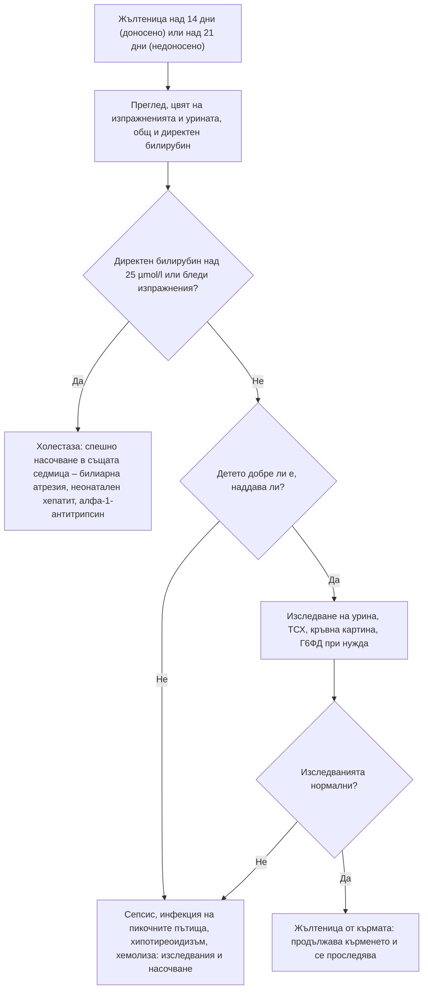

# Глава 73. Новороденото и кърмачето: жълтеница, плач, растеж и развитие

> **Част XIV. Детска възраст**

## Цели на главата

- Да се разграничава физиологичната от патологичната жълтеница при новороденото и да се разпознава **холестазата** (билиарна атрезия).
- Да се преглежда систематично кърмачето с **прекомерен плач** и да се разпознават органичните причини зад „коликите“.
- Да се оценява **изоставането в растежа** и да се разграничават недостатъчният прием, загубите и повишените нужди.
- Да се разпознава **изоставането в развитието** и регресията.
- Да се разпознават сериозните заболявания при кърмачето с неспецифични симптоми: „не се храни добре“, „не е както обикновено“.

## Ключови моменти

- Жълтеницата през първите 24 часа е патологична и изисква изследване на билирубина до 2 часа *(SORT C [1])*.
- Всяко новородено с жълтеница над 14 дни (над 21 дни при недоносените) има нужда от фракциониран билирубин и оценка на цвета на изпражненията *(SORT C [1])*.
- Колкото по-рано се прави операцията на Kasai при билиарна атрезия, толкова по-добра е преживяемостта със собствен черен дроб *(SORT B [2])*.
- Сериозна причина се открива при около 5% от кърмачетата с прекомерен плач без треска. Болният вид е най-силният насочващ белег *(SORT B [4])*.
- Загуба на над 10% от теглото при раждане или липса на възстановяване до 3 седмици изисква оценка на храненето и на детето *(SORT C [5])*.
- Регресията в развитието на всяка възраст изисква спешно насочване *(SORT C [8])*.

---

## 1. Жълтеница при новороденото

### 1.1. Физиологична или патологична?

*Таблица 73.1. Жълтеница при новороденото: физиологична или патологична?*

| Белег | Физиологична | **Патологична** |
|---|---|---|
| Начало | **След 24-ия час** | **През първите 24 часа** |
| Максимум | 3–5-и ден | По всяко време |
| Продължителност | До 14 дни (доносени), 21 дни (недоносени) | Над 14 (21) дни – продължителна |
| Билирубин | Под праговете за фототерапия | Над праговете или бързо нарастващ |
| Фракция | **Индиректен** | Индиректен или директен (директен над 25 µmol/l или над 20% от общия) [1] |
| Състояние на детето | Добро | Болен вид, летаргия, лошо хранене |
| Изпражнения и урина | Нормални | Бледи (ахолични) изпражнения, тъмна урина – холестаза |

### 1.2. Причини

*Таблица 73.2. Причини за жълтеница при новороденото.*

| Време | Причини |
|---|---|
| **Първите 24 часа** | Хемолиза – Rh-несъвместимост, AB0-несъвместимост, дефицит на Г6ФД, сфероцитоза; вродени инфекции (TORCH); сепсис |
| **2–14 дни** | Физиологична; жълтеница при кърмене (недостатъчен прием, дехидратация); хемолиза; хематоми (кефалхематом); полицитемия; сепсис, инфекция на пикочните пътища; дефицит на Г6ФД |
| **Продължителна (над 14 дни)** | Индиректна: жълтеница от кърмата (най-честата, детето е добре), хипотиреоидизъм (скрининг), хемолиза, инфекция на пикочните пътища, синдром на Gilbert или Crigler-Najjar. Директна (холестаза): билиарна атрезия, неонатален хепатит (инфекции, метаболитни заболявания – дефицит на алфа-1-антитрипсин, галактоземия), кисти на холедоха, синдром на Alagille, кистозна фиброза, парентерално хранене |

### 1.3. Билиарна атрезия

- Продължителна жълтеница с директна хипербилирубинемия, бледи изпражнения (като глина), тъмна урина, хепатомегалия.
- **Детето изглежда добре и наддава** в началото – затова диагнозата често се забавя.
- **Операцията на Kasai до 45–60-ия ден** значително подобрява прогнозата. След 90 дни резултатите са лоши. Колкото по-късно е операцията, толкова по-ниска е преживяемостта със собствен черен дроб [2].
- При всяко новородено с жълтеница над 14 дни се изследва директният (конюгиран) билирубин и се оценява цветът на изпражненията (с цветна карта) [1].

### 1.4. Опасност от билирубинова енцефалопатия (ядрена жълтеница)

- Високият **индиректен** билирубин преминава кръвно-мозъчната бариера.
- **Остри симптоми:** летаргия, лошо сучене, хипотония, последвана от хипертонус, опистотонус, пронизителен плач, треска, гърчове.
- **Рискови фактори:** недоносеност, хемолиза (особено при дефицит на Г6ФД), сепсис, ацидоза, хипоалбуминемия, ранно изписване без контрол.
- Визуалната оценка е ненадеждна (особено при тъмна кожа) – използвайте транскутанен билирубинометър или кръвно изследване и номограми според възрастта в часове [1].

---

## 2. Прекомерен плач при кърмаче

### 2.1. Инфантилни колики

- **Правило на тройките (Wessel):** плач повече от 3 часа на ден, повече от 3 дни седмично, повече от 3 седмици, при иначе здраво кърмаче, което наддава нормално. Критериите Rome IV не изискват броене на часовете: кърмаче под 5 месеца с повтарящ се продължителен плач без изоставане в растежа, треска или друго заболяване [3].
- Започват на 2–3 седмици, максимум на 6 седмици, отзвучават до 3–4 месеца.
- Плачът е предимно **следобед и вечер**; кърмачето се зачервява, прибира крачетата.
- **Коликите са диагноза чрез изключване.**

### 2.2. Органични причини за плач

Сериозна органична причина се открива при около 5% от кърмачетата с прекомерен плач без треска, най-често инфекция на пикочните пътища. Болният вид е най-силният насочващ белег, а изследванията без насочваща клинична картина рядко помагат [4].

*Таблица 73.3. Органични причини за прекомерен плач.*

| Система | Причини | Насочващи белези |
|---|---|---|
| **Инфекции** | Инфекция на пикочните пътища, отит, менингит, сепсис | Треска, летаргия, лошо хранене |
| **Храносмилателна система** | Инвагинация, инкарцерирана херния, малротация, гастроезофагеален рефлукс с езофагит, алергия към белтъка на кравето мляко, запек, анална фисура | Повръщане (жлъчно), кръв в изпражненията, екзема, лошо наддаване |
| **Травма** | Фрактури (включително при насилие), синдром на разтърсеното бебе | Оток, болка при движение, синини, изпъкнала фонтанела |
| **Нервна система** | Субдурален хематом, хидроцефалия, повишено вътречерепно налягане | Изпъкнала фонтанела, нарастваща обиколка на главата, повръщане |
| **Очи** | Ерозия на роговицата, глаукома (сълзене, фотофобия, голяма роговица), чуждо тяло | Сълзене, зачервяване |
| **Кожа и меки тъкани** | Косъм, обвит около пръст, пенис („турникет от косъм“), драскотина | Оток и зачервяване на пръст |
| **Сърдечно-съдова система** | Суправентрикуларна тахикардия, сърдечна недостатъчност, аномален произход на лявата коронарна артерия (ALCAPA – плач и изпотяване при хранене) | Тахикардия над 220/min, изпотяване |
| **Урогенитална система** | Торзия на тестиса, парафимоза | |
| **Лекарства и вещества** | Лекарства, приемани от кърмещата майка; абстиненция при новородени от майки със зависимост | |
| **Метаболитни заболявания** | Хипогликемия, вродени метаболитни болести | Повръщане, летаргия |

### 2.3. Червени флагове при плачещо кърмаче

- Внезапна промяна в характера на плача: пронизителен, слаб или стенещ плач.
- **Треска** (при под 3 месеца – задължително насочване).
- Повръщане (особено жлъчно), кръв в изпражненията.
- Лошо наддаване, отказ от хранене.
- Летаргия, изпъкнала фонтанела, гърчове.
- Синини или обяснение, което не съответства на находката.
- **Плач, който не спира** – **съблечете детето напълно и го прегледайте** (косъм около пръст, фрактура, херния, тестис).

**Прекомерният плач е основен отключващ фактор за разтърсване на бебето.** Подкрепата на родителите и оценката на риска (изтощение, следродилна депресия, насилие в семейството) са част от прегледа.

---

## 3. Изоставане в растежа (faltering growth)

### 3.1. Определение

- **Спадане** на теглото през перцентилните пространства (NICE NG75, 2017):
  - през **1 или повече** пространства, ако теглото при раждане е под 9-ия перцентил;
  - през **2 или повече** пространства, ако теглото при раждане е между 9-ия и 91-ия перцентил (например от 50-ия под 9-ия перцентил);
  - през **3 или повече** пространства, ако теглото при раждане е над 91-ия перцентил.
- **Тегло под 2-ия перцентил**.
- Загуба на повече от 10% от теглото при раждане в първите дни или липса на възстановяване на теглото при раждане до 3 седмици [5].
- Оценявайте **тегло, ръст и обиколка на главата** заедно:
  - **засегнато е само теглото** – недостатъчен прием или загуби;
  - засегнати са тегло и ръст пропорционално, при нормална обиколка на главата – конституционално или ендокринно (при нормално тегло за ръста – дефицит на растежен хормон, хипотиреоидизъм);
  - **засегната е и обиколката на главата** – вродени инфекции, генетични синдроми, фетален алкохолен синдром, тежко недохранване.

### 3.2. Причини

*Таблица 73.4. Причини за изоставане в растежа (faltering growth).*

| Механизъм | Причини |
|---|---|
| **Недостатъчен прием** (най-честа) | Проблеми при кърменето (техника, недостатъчна лактация), грешно приготвяне на адаптираното мляко, затруднено хранене (цепка на небцето, анкилоглосия, неврологични нарушения), неглижиране, бедност, поведенчески проблеми при хранене, следродилна депресия |
| **Загуби** | Повръщане (рефлукс, пилорна стеноза), малабсорбция (цьолиакия, кистозна фиброза, алергия към белтъка на кравето мляко, лямблиоза), хронична диария |
| **Повишени нужди** | Сърдечни пороци, хронични белодробни заболявания (бронхопулмонална дисплазия, кистозна фиброза), хронични инфекции (HIV, туберкулоза, инфекция на пикочните пътища), хипертиреоидизъм, злокачествени заболявания |
| **Неефективно усвояване** | Хронично бъбречно заболяване, бъбречна тубулна ацидоза, метаболитни заболявания, хипотиреоидизъм, генетични синдроми |

### 3.3. Подход

- **Подробна анамнеза за храненето** – **наблюдение на хранене** в кабинета, дневник на храненето.
- Преглед за дисморфични белези, сърдечен шум, хепатоспленомегалия, признаци на неглижиране.
- Първоначални изследвания при липса на насочващи белези: урина (инфекция), кръвна картина, феритин, електролити, креатинин, чернодробни ензими, албумин, ТСХ, антитела за цьолиакия (след въвеждане на глутен), потен тест при съмнение за кистозна фиброза.

---

## 4. Изоставане в развитието

### 4.1. Ключови етапи и граници за насочване

*Таблица 73.5. Ключови етапи и граници за насочване.*

| Област | Етап | Средна възраст | **Насочване, ако липсва на** |
|---|---|---|---|
| **Груба моторика** | Държи главата | 6–8 седмици | 4 месеца |
| | Седи без опора | 6–8 месеца | **9 месеца** |
| | Ходи самостоятелно | 12 месеца | **18 месеца** |
| **Фина моторика** | Хваща предмет | 4–5 месеца | 6 месеца |
| | Пинсетен захват | 10 месеца | 12 месеца |
| **Реч и език** | Гукане | 2–3 месеца | 4 месеца |
| | Първи думи с разбиране | 12 месеца | **18 месеца** |
| | Изречения от 2 думи | 2 години | **2,5 години** |
| **Социално развитие** | Социална усмивка | **6 седмици** | **8 седмици** |
| | Сочи с пръст, споделено внимание | 12 месеца | **18 месеца** |

### 4.2. Червени флагове

- **Загуба на вече придобити умения (регресия)** на всяка възраст – спешно насочване (метаболитни, невродегенеративни заболявания, синдром на Rett, епилептични енцефалопатии, аутизъм).
- Асиметрия на движенията, предпочитане на едната ръка преди 12 месеца – хемипареза.
- Мускулна хипотония или хипертонус, персистиращи примитивни рефлекси.
- **Липса на реакция на звук** – **проверка на слуха**.
- Липса на следене с поглед, нистагъм, бял зеничен рефлекс (левкокория) – ретинобластом, катаракта [6].
- Липса на социална усмивка, споделено внимание, сочене, отговор на името – аутизъм (скрининг M-CHAT-R/F на 18–24 месеца [7]).
- **Необичайна обиколка на главата** – микроцефалия, макроцефалия (хидроцефалия).
- **Загриженост на родителите** – трябва да се приема сериозно [8].

### 4.3. Причини

- **Глобално изоставане:** генетични (синдром на Down, синдром на фрагилната X хромозома, микроделеции), вродени инфекции, фетален алкохолен синдром, перинатална асфиксия, недоносеност, хипотиреоидизъм, метаболитни заболявания, тежко неглижиране.
- **Изолирано моторно изоставане:** церебрална парализа, нервно-мускулни заболявания (мускулна дистрофия на Duchenne – момчета, ходят късно, белег на Gowers, висока креатинкиназа (КК); спинална мускулна атрофия).
- **Изолирано изоставане в речта:** нарушение на слуха, специфично езиково нарушение, аутизъм, недостатъчна стимулация.

**Момче, което не ходи на 18 месеца: изследвайте креатинкиназата (мускулна дистрофия на Duchenne)** [9].

---

## 5. Кърмачето, което „не е както обикновено“

Неспецифичните симптоми при малко кърмаче – лошо хранене, сънливост, раздразнителност, промяна в цвета, „не е както обикновено“ – могат да са единствената проява на:

- сепсис и менингит (температурата може да е нормална или ниска);
- **инфекция на пикочните пътища**;
- сърдечен порок, зависим от артериалния канал (шок или цианоза на 3–10-ия ден при затваряне на канала), миокардит, суправентрикуларна тахикардия;
- **вродена надбъбречна хиперплазия** (солезагубваща криза на 1–3 седмици);
- **вродени метаболитни болести** (след започване на хранене);
- **хипогликемия**;
- насилие (травма на главата);
- **отравяне** (включително от лекарства, давани от родителите);
- **коклюш** (апнеи);
- ботулизъм при кърмачета (запек, слабо сучене, хипотония, птоза; мед).

**Кърмаче под 3 месеца, което „не е както обикновено“, трябва да се прегледа в същия ден.** Треска ≥ 38 °C под 3 месеца изисква спешно насочване (вж. глава 68).

---

## 6. Безопасна диагностична стратегия

*Таблица 73.6. Безопасна диагностична стратегия.*

| Въпрос | Отговор |
|---|---|
| **Вероятна диагноза** | Физиологична жълтеница, жълтеница от кърмата, инфантилни колики, проблеми при храненето, конституционално ниско тегло |
| **Сериозни заболявания, които не бива да се пропускат** | Билиарна атрезия; хемолитична болест, дефицит на Г6ФД; ядрена жълтеница; сепсис, менингит, инфекция на пикочните пътища; сърдечни пороци; вродена надбъбречна хиперплазия; вродени метаболитни болести; хипотиреоидизъм; насилие и неглижиране; кистозна фиброза; мускулна дистрофия на Duchenne; ретинобластом; регресия в развитието |
| **Чести капани** | Продължителна жълтеница, приписана на кърмата, без изследване на директния билирубин; колики без пълен преглед; неизследвана урина; изоставане в развитието, приписано на „мързел“ или „той ще навакса“; левкокория, приета за отражение от светкавицата на снимка |
| **Маскиращи заболявания** | Инфекция на пикочните пътища, хипотиреоидизъм, цьолиакия, сърдечни пороци, нарушения на слуха |
| **Психосоциални аспекти** | Следродилна депресия, изтощение на родителите, бедност, неглижиране, насилие |

---

## 7. Диагностичен алгоритъм при продължителна жълтеница при новородено

*Фигура 73.1. Диагностичен алгоритъм при продължителна жълтеница при новородено. Схема на авторите въз основа на източниците, цитирани в главата.*

Текстово описание на фигура 73.1

1. Жълтеница над 14 дни (доносено) или над 21 дни (недоносено). Следва: към т. 2.
2. Преглед, цвят на изпражненията и урината, общ и директен билирубин. Следва: към т. 3.
3. **Въпрос:** Директен билирубин над 25 µmol/l или бледи изпражнения? Да – към т. 4; Не – към т. 5.
4. Холестаза: спешно насочване в същата седмица – билиарна атрезия, неонатален хепатит, алфа-1-антитрипсин.
5. **Въпрос:** Детето добре ли е, наддава ли? Не – към т. 6; Да – към т. 7.
6. Сепсис, инфекция на пикочните пътища, хипотиреоидизъм, хемолиза: изследвания и насочване.
7. Изследване на урина, ТСХ, кръвна картина, Г6ФД при нужда. Следва: към т. 8.
8. **Въпрос:** Изследванията нормални? Да – към т. 9; Не – към т. 6.
9. Жълтеница от кърмата: продължава кърменето и се проследява.

---

## 8. Червени флагове и насочване

### 8.1. Червени флагове

- Жълтеница през първите 24 часа.
- Жълтеница над 14 дни (над 21 дни при недоносени), бледи изпражнения или тъмна урина.
- Жълто кърмаче, което е летаргично, суче слабо или има пронизителен плач.
- Внезапна промяна в плача, треска под 3 месеца, жлъчно повръщане или кръв в изпражненията.
- Синини, изпъкнала фонтанела или обяснение, което не отговаря на находката.
- Загуба на над 10% от теглото при раждане, липса на възстановяване до 3 седмици или спад през перцентилните пространства.
- Регресия в развитието на всяка възраст.
- Асиметрия на движенията или предпочитане на едната ръка преди 12 месеца.
- Бял зеничен рефлекс, липса на следене с поглед или нистагъм.
- Кърмаче под 3 месеца, което „не е както обикновено“.

### 8.2. Кога и колко спешно да насочим

*Таблица 73.7. Кога и колко спешно да насочим.*

| Спешност | Клинична ситуация |
|---|---|
| **Незабавно (112 или спешно отделение)** | Кърмаче с летаргия, шок, цианоза или апнеи (сепсис, сърдечен порок, зависим от артериалния канал, метаболитна криза); жълтеница с белези на билирубинова енцефалопатия; треска ≥ 38 °C под 3 месеца (вж. глава 68) |
| **В същия ден** | Жълтеница през първите 24 часа – билирубин до 2 часа [1]; продължителна жълтеница с бледи изпражнения, тъмна урина или директен билирубин над 25 µmol/l – детски гастроентеролог [1, 2]; кърмаче под 3 месеца, което „не е както обикновено“; внезапен пронизителен плач или болен вид [4]; регресия в развитието [8]; подозрение за насилие |
| **Бързо (до 2 седмици)** | Липсващ червен рефлекс – бързо насочване при подозрение за ретинобластом [6]; подозрение за нарушен слух – аудиологично изследване; значимо изоставане в растежа без ясна причина [5]; момче, което не ходи на 18 месеца, с висока креатинкиназа [9] |
| **Планово** | Изоставане в развитието без регресия – детски невролог или център за ранно детско развитие [8]; положителен скрининг M-CHAT-R/F [7] |
| **Проследяване в общата практика** | Физиологична жълтеница и жълтеница от кърмата след изключване на холестаза [1]; инфантилни колики с подкрепа за родителите [3]; леко забавяне в наддаването при добро хранене – наблюдение на храненето и контролни измервания [5] |

---

## 9. Клинични перли

- Жълтеница през първите 24 часа е винаги патологична.
- Всяко новородено с жълтеница над 14 дни има нужда от изследване на директния билирубин. Бледите изпражнения са алармен знак.
- При билиарната атрезия детето изглежда добре и наддава, докато не стане твърде късно за операцията на Kasai.
- Коликите са диагноза чрез изключване. Съблечете кърмачето и го прегледайте от главата до петите.
- Внезапен пронизителен плач при кърмаче: търсете инвагинация, менингит, фрактура, косъм около пръст.
- Прекомерният плач е фактор за разтърсване на бебето. Питайте как се справят родителите.
- Оценявайте теглото, ръста и обиколката на главата заедно. Кой параметър е засегнат пръв, насочва към механизма.
- Регресията в развитието на всяка възраст изисква спешно насочване.
- Момче, което не ходи на 18 месеца: креатинкиназа.
- Бял зеничен рефлекс: ретинобластом до доказване на противното.

---

## 10. Клиничен случай

**Етап 1 – клинична картина.** Момиче на 6 седмици е доведено на профилактичен преглед. Майката съобщава, че детето е „още жълтичко“, но „суче добре и е спокойно“. Детето е изключително кърмено. Теглото е нараснало от 3200 g при раждането на 4100 g.

> **Въпрос 1.** Какво ще попитате и изследвате?

**Етап 2 – преглед и изследвания.** Кожата и склерите са иктерични, а черният дроб се палпира 3 cm под ребрената дъга. Майката казва, че изпражненията „вече не са жълти, а светли, като кит“, а урината „оцветява пелената в тъмно“. Общият билирубин е 168 µmol/l, а директният – 110 µmol/l.

> **Въпрос 2.** Коя е най-вероятната диагноза?

> **Въпрос 3.** Защо състоянието е спешно?

Обсъждане и отговори

**Отговор 1.** При жълтеница над 14 дни се пита за цвета на изпражненията (с цветна карта) и на урината, за храненето и общото състояние. Изследват се общ и директен билирубин и урина и се проверява дали е направен скринингът за вроден хипотиреоидизъм [1].

**Отговор 2.** Продължителната жълтеница с директна хипербилирубинемия (над 25 µmol/l и над 20% от общия), ахоличните изпражнения, тъмната урина и хепатомегалията означават холестаза и насочва към билиарна атрезия [1]. Доброто общо състояние и нормалното наддаване са типични и често водят до погрешното заключение за „жълтеница от кърмата“, която е индиректна и не протича с бледи изпражнения.

**Отговор 3.** Детето се насочва **веднага** към детски гастроентеролог и хирург. Резултатът от операцията на Kasai зависи от възрастта: колкото по-рано се извърши, толкова по-дълго детето запазва собствения си черен дроб [2]. След 90-ия ден повечето деца развиват цироза и се нуждаят от трансплантация.

**Поука.** Питайте за цвета на изпражненията при всяко жълто кърмаче. Продължителната жълтеница изисква фракциониране на билирубина.

---

## Обобщение

- Жълтеницата през първите 24 часа и продължителната жълтеница изискват изследване. Бледите изпражнения и тъмната урина насочват към холестаза и билиарна атрезия.
- Коликите са диагноза чрез изключване. При прекомерен плач кърмачето се преглежда изцяло, а родителите получават подкрепа.
- Изоставането в растежа се оценява по спада през перцентилните пространства и по съотношението между тегло, ръст и обиколка на главата.
- Регресията в развитието, асиметрията, левкокорията и липсата на социални умения изискват насочване. Неспецифичните симптоми при малко кърмаче могат да крият тежко заболяване.

## Самопроверка

### Въпроси с един верен отговор

**1.** *(основно ниво)* Новородено на 18 часа има видима жълтеница. Кое е правилното поведение?

- **А.** Наблюдение до петия ден
- **Б.** Изследване на серумния билирубин до 2 часа
- **В.** Слънчеви бани
- **Г.** Спиране на кърменето
- **Д.** Изследване на билирубина след 48 часа

Отговор и обосновка

**Верен отговор: Б.** Жълтеницата през първите 24 часа е патологична и изисква спешно измерване на серумния билирубин [1].

**2.** *(основно ниво)* Кърмаче на 3 седмици е изключително кърмено, наддава добре и е жълто. Изпражненията са жълти, а урината е светла. Кое е правилното поведение?

- **А.** Не са нужни изследвания – жълтеница от кърмата
- **Б.** Общ и директен билирубин, изследване на урината и проверка на скрининга за хипотиреоидизъм
- **В.** Спиране на кърменето
- **Г.** Фототерапия у дома
- **Д.** Ехография на корема при всички

Отговор и обосновка

**Верен отговор: Б.** Жълтеницата над 14 дни изисква фракциониран билирубин и изключване на холестаза, инфекция и хипотиреоидизъм, дори когато детето изглежда добре [1].

**3.** *(основно ниво)* Кърмаче на 5 седмици плаче по 4 часа всяка вечер от 2 седмици. Наддава добре, няма треска, а пълният преглед е нормален. Кое е правилното поведение?

- **А.** Смяна на млякото с хидролизат при всички
- **Б.** Инфантилни колики – обяснение, подкрепа на родителите и указания при влошаване
- **В.** Изследване на урината и кръвта при всички
- **Г.** Антирефлуксно лечение
- **Д.** Спешно насочване

Отговор и обосновка

**Верен отговор: Б.** Коликите са диагноза чрез изключване при иначе здраво кърмаче [3]. Изследванията без насочваща клинична картина рядко помагат [4].

**4.** *(напреднало ниво)* Момче на 20 месеца още не ходи самостоятелно. Когато става от пода, се подпира с ръце на бедрата си. Кое изследване е най-подходящо първо?

- **А.** ЯМР на главата
- **Б.** Креатинкиназа
- **В.** Хромозомен анализ
- **Г.** ТСХ
- **Д.** ЕЕГ

Отговор и обосновка

**Верен отговор: Б.** Късното прохождане и белегът на Gowers при момче насочват към мускулна дистрофия на Duchenne. Първото изследване е креатинкиназата [9].

**5.** *(напреднало ниво)* Изключително кърмено бебе на 5 дни е загубило 12% от теглото при раждане и е сънливо. Кое е правилното поведение?

- **А.** Успокояване – загубата на тегло е нормална
- **Б.** Клинична оценка в същия ден за дехидратация и заболяване и наблюдение на храненето
- **В.** Преминаване изцяло на адаптирано мляко без преглед
- **Г.** Контрол след 2 седмици
- **Д.** Само претегляне след седмица

Отговор и обосновка

**Верен отговор: Б.** Загубата на над 10% от теглото при раждане изисква клинична оценка за дехидратация или заболяване и подробна оценка на храненето [5]. Сънливостта е допълнителен тревожен белег.

### Задача

Майка показва снимка на 10-месечното си бебе, на която едната зеница е бяла, а другата – червена. Как ще подходите?

Решение

Белият зеничен рефлекс (левкокория) е **ретинобластом** до доказване на противното. Проверява се червеният рефлекс на двете очи с офталмоскоп на тъмно, но нормалната находка в кабинета не отменя тревожната снимка. Детето се насочва бързо (до 2 седмици) към офталмолог [6]. Пита се за кривогледство, промяна в цвета на ириса и фамилна анамнеза за ретинобластом. Други причини са вродена катаракта и болест на Coats.

### OSCE станция: Оценка на кърмаче с продължителна жълтеница

**Време:** 7 минути. **Ниво:** основно (студенти, специализанти).

**Задача за кандидата.** Кърмаче на 3 седмици е жълто. Снемете насочена анамнеза и решете какви изследвания и колко спешно са нужни.

**Информация за симулирания пациент (за изпитващия).** Кърми изключително и наддава добре. Майката не е сигурна за цвета на изпражненията, но при показване на цветна карта посочва бледожълт цвят.

*Таблица 73.8. OSCE станция „Оценка на кърмаче с продължителна жълтеница“ – критерии за оценяване.*

| Критерий | Точки |
|---|---|
| Пита за началото на жълтеницата, храненето и наддаването | 1 |
| Пита за цвета на изпражненията (с цветна карта) и на урината | 2 |
| Пита за общото състояние: сучене, сънливост, повръщане, треска | 1 |
| Преглежда кожата, склерите, черния дроб и слезката | 1 |
| Назначава общ и директен билирубин, изследване на урината и проверява скрининга за хипотиреоидизъм | 2 |
| Тълкува правилно директен билирубин над 25 µmol/l като холестаза | 1 |
| Насочва в същия ден при бледи изпражнения или холестаза и обяснява на майката защо е нужно спешно насочване | 2 |
| **Общо** | **10** |

**Праг за успешно изпълнение:** 7 от 10 точки, включително въпроса за изпражненията и изследването на директния билирубин.

## Литература

1. National Institute for Health and Care Excellence. Jaundice in newborn babies under 28 days (Clinical guideline CG98). London: NICE; 2010 [актуализирано 2023]. Достъпно на: https://www.nice.org.uk/guidance/cg98
2. Serinet MO, Wildhaber BE, Broué P, Lachaux A, Sarles J, Jacquemin E, et al. Impact of age at Kasai operation on its results in late childhood and adolescence: a rational basis for biliary atresia screening. Pediatrics. 2009;123(5):1280-6. doi:10.1542/peds.2008-1949. PMID: 19403492.
3. Benninga MA, Faure C, Hyman PE, St James Roberts I, Schechter NL, Nurko S. Childhood Functional Gastrointestinal Disorders: Neonate/Toddler. Gastroenterology. 2016;150(6):1443-1455.e2. doi:10.1053/j.gastro.2016.02.016. PMID: 27144631.
4. Freedman SB, Al-Harthy N, Thull-Freedman J. The crying infant: diagnostic testing and frequency of serious underlying disease. Pediatrics. 2009;123(3):841-8. doi:10.1542/peds.2008-0113. PMID: 19255012.
5. National Institute for Health and Care Excellence. Faltering growth: recognition and management of faltering growth in children (NICE guideline NG75). London: NICE; 2017. Достъпно на: https://www.nice.org.uk/guidance/ng75
6. National Institute for Health and Care Excellence. Suspected cancer: recognition and referral (NICE guideline NG12). London: NICE; 2015 [актуализирано 2026]. Достъпно на: https://www.nice.org.uk/guidance/ng12
7. Robins DL, Casagrande K, Barton M, Chen CM, Dumont-Mathieu T, Fein D. Validation of the modified checklist for Autism in toddlers, revised with follow-up (M-CHAT-R/F). Pediatrics. 2014;133(1):37-45. doi:10.1542/peds.2013-1813. PMID: 24366990.
8. Lipkin PH, Macias MM; Council on Children with Disabilities, Section on Developmental and Behavioral Pediatrics. Promoting Optimal Development: Identifying Infants and Young Children With Developmental Disorders Through Developmental Surveillance and Screening. Pediatrics. 2020;145(1):e20193449. doi:10.1542/peds.2019-3449. PMID: 31843861.
9. Birnkrant DJ, Bushby K, Bann CM, Apkon SD, Blackwell A, Brumbaugh D, et al. Diagnosis and management of Duchenne muscular dystrophy, part 1: diagnosis, and neuromuscular, rehabilitation, endocrine, and gastrointestinal and nutritional management. Lancet Neurol. 2018;17(3):251-267. doi:10.1016/S1474-4422(18)30024-3. PMID: 29395989.

*Последна проверка на съдържанието: септември 2026 г. Следващ планиран преглед: септември 2027 г. (вж. „Политика за актуализация“ в README).*

<!-- навигация -->

---

[← Глава 72. Накуцване и болки в крайниците при деца](72-nakutsvane.md) · [Съдържание](../README.md) · [Глава 74. Депресивни и тревожни симптоми →](74-depresia-trevozhnost.md)
