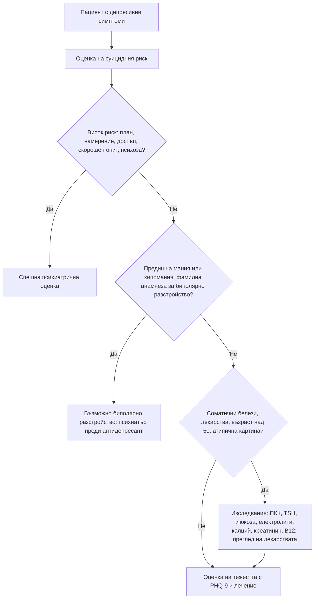

# Глава 74. Депресивни и тревожни симптоми

> **Част XV. Психични симптоми**

## Цели на главата

- Да се разпознава депресията, включително когато се представя със соматични оплаквания.
- Да се разграничават униполярната депресия, **биполярното разстройство**, реакцията на стрес и нормалната скръб.
- Да се изключват **соматичните заболявания и лекарствата**, които причиняват депресивни и тревожни симптоми.
- Да се разграничават видовете тревожни разстройства.
- Да се оценява **суицидният риск** при всеки пациент с депресия.

---

## 1. Депресия

### 1.1. Как се представя в общата практика

- **Само около половината** от пациентите съобщават директно за понижено настроение.
- Честите „маски“ са: **умора**, **безсъние** (особено **ранно сутрешно събуждане**), **болки** (главоболие, болки в гърба, коремна болка), **загуба на апетит и тегло**, **„нерви“**, **проблеми с паметта** (особено при възрастни), **чести посещения** с неясни оплаквания, **раздразнителност** (особено при мъже и подрастващи).
- **Скрининг с два въпроса (PHQ-2):**
  1. През последните 2 седмици чувствали ли сте се потиснати, депресирани или без надежда?
  2. През последните 2 седмици имали ли сте малко интерес или удоволствие от нещата, които правите?
- Положителният отговор налага **PHQ-9** и клинична оценка.

### 1.2. Диагностични критерии за голям депресивен епизод (по DSM-5 и МКБ-11, опростено)

**Поне 2 седмици**, почти всеки ден, с **понижено настроение** или **загуба на интерес и удоволствие (анхедония)** и общо **поне 5** от следните:

- понижено настроение;
- анхедония;
- промяна в **апетита или теглото**;
- **безсъние** или хиперсомния;
- **психомоторна забавеност** или възбуда;
- **умора**, липса на енергия;
- **чувство за безполезност или вина**;
- **нарушена концентрация**, нерешителност;
- **мисли за смърт, суицидни мисли** или опит.

### 1.3. Диференциална диагноза на депресивните симптоми

| Състояние | Отличителни белези |
|---|---|
| **Голяма депресия** | Критериите по-горе; функционално увреждане |
| **Биполярна депресия** | **Предишни епизоди на мания или хипомания** (намалена нужда от сън без умора, ускорена реч, грандиозност, прекомерни харчове, рискова дейност); **ранно начало**, **внезапно начало и край**, **хиперсомния**, **психотични симптоми**, **фамилна анамнеза за биполярно разстройство**, **следродилно начало**, **мания след антидепресант** |
| **Дистимия** (персистиращо депресивно разстройство) | По-леки симптоми, **продължаващи поне 2 години** |
| **Разстройство в адаптацията** | Ясен **стресов фактор** през последните 3 месеца; симптомите не отговарят на критериите за депресия |
| **Нормална скръб** | След загуба; **вълни** от болка, свързани с мисли за починалия; **самооценката е запазена**; хуморът и удоволствието са възможни |
| **Продължително разстройство на скръбта** | Интензивна скръб **над 12 месеца** (над 6 месеца по МКБ-11) с функционално увреждане |
| **Следродилна депресия** | До 12 месеца след раждането; **тревожност за бебето**, чувство за некомпетентност; скрининг с **Единбургската скала** |
| **Сезонна депресия** | Есен–зима, **хиперсомния, повишен апетит**, желание за въглехидрати |
| **Депресия с психотични симптоми** | **Налудности за вина, бедност, болест**, **нихилистични** налудности, халюцинации — висок суициден риск |
| **Предменструално дисфорично разстройство** | Симптомите са **само в лутеалната фаза** и изчезват с менструацията |
| **Депресия при деменция и „псевдодеменция“** | Вж. глава 44 |
| **Злоупотреба с вещества** | Алкохол, бензодиазепини, канабис, **абстиненция от стимуланти** |

### 1.4. Соматични заболявания, които причиняват или имитират депресия

| Група | Заболявания |
|---|---|
| **Ендокринни** | **Хипотиреоидизъм**, **хипертиреоидизъм** (особено при възрастни — „апатичен“), **синдром на Cushing**, **надбъбречна недостатъчност**, **хиперкалциемия** (хиперпаратиреоидизъм), **хипогонадизъм** при мъже, **диабет**, **менопауза** |
| **Неврологични** | **Инсулт** (особено левостранен фронтален), **болест на Parkinson**, **множествена склероза**, **деменция**, **мозъчни тумори**, **епилепсия**, **болест на Huntington**, травма на главата |
| **Злокачествени** | **Карцином на панкреаса** (депресията може да **предхожда** диагнозата), **белодробен карцином**, лимфом, мозъчни тумори |
| **Инфекциозни** | **Поствирусни** състояния (инфекциозна мононуклеоза, грип, COVID-19), **HIV**, **хепатит C**, **невросифилис**, **бруцелоза**, **Лаймска болест** |
| **Хематологични и метаболитни** | **Анемия**, **дефицит на витамин B12** и **фолиева киселина**, **хипонатриемия**, **уремия**, **чернодробна енцефалопатия** |
| **Автоимунни** | **Системен лупус еритематодес**, **ревматоиден артрит** |
| **Сърдечно-съдови и дихателни** | **Сърдечна недостатъчност**, **след миокарден инфаркт**, **обструктивна сънна апнея**, ХОББ |
| **Хронична болка** | Фибромиалгия, болки в гърба, мигрена |

### 1.5. Лекарства и вещества, свързани с депресия

- **Кортикостероиди** (депресия, мания, психоза).
- **Интерферон-алфа**, **изотретиноин**.
- **Бета-блокери** (връзката е спорна), **резерпин**, **метилдопа**, **клонидин**.
- **Хормонални контрацептиви**, **GnRH агонисти**, **финастерид**, тамоксифен.
- **Бензодиазепини**, **опиоиди**, **барбитурати**.
- **Антиепилептични лекарства** — **леветирацетам**, топирамат, фенобарбитал.
- **Монтелукаст** (при деца и подрастващи — промени в поведението, суицидни мисли).
- **Ефавиренц**, **мефлохин**.
- **Алкохол**; **абстиненция** от кокаин, амфетамини, никотин, кофеин.

**Минимални изследвания** при първи депресивен епизод, особено при атипична картина, **възраст над 50 години**, **соматични симптоми** или **липса на отговор на лечение**: кръвна картина, **TSH**, глюкоза, електролити и **калций**, креатинин, чернодробни ензими, **витамин B12**, при нужда — **сифилис**, **HIV**, **кортизол**, образно изследване на главния мозък.

---

## 2. Мания и хипомания

**Винаги питайте за мания преди да започнете антидепресант.** Антидепресантът при недиагностицирано биполярно разстройство може да **отключи мания** или да **ускори цикличността**.

**Белези на мания:** **повишено или раздразнително настроение**, **намалена нужда от сън** (без умора), **ускорена реч** и **„бягство на идеите“**, **грандиозност**, **повишена активност**, **рисково поведение** (харчове, сексуално, шофиране), **разсеяност**. **Хипомания** — по-леко, без психотични симптоми и без тежко функционално увреждане, поне 4 дни.

**Вторична мания** (особено при **първа проява над 50 години**): **кортикостероиди**, **леводопа**, **стимуланти**, **антидепресанти**, **хипертиреоидизъм**, **синдром на Cushing**, **мозъчни лезии** (дясно полукълбо, фронтален дял), **множествена склероза**, **HIV**, **невросифилис**, **деменция на фронталния дял**.

---

## 3. Тревожност

### 3.1. Тревожни разстройства

| Разстройство | Ключови белези |
|---|---|
| **Генерализирано тревожно разстройство** | **Прекомерна, трудно контролируема тревога** за **много неща** (здраве, пари, семейство, работа), поне **6 месеца**; **мускулно напрежение**, раздразнителност, умора, нарушен сън; скрининг с **GAD-2** и **GAD-7** |
| **Паническо разстройство** | **Повтарящи се неочаквани** пристъпи на силен страх с **пик за минути**: **сърцебиене, задух, болка в гърдите, изпотяване, треперене, замайване, изтръпване, страх от смърт или от полудяване**; **страх от следващ пристъп**; избягващо поведение (**агорафобия**) |
| **Социална тревожност** | Страх от **оценка от другите**; избягване на социални ситуации |
| **Специфични фобии** | Страх от конкретен обект или ситуация (височини, животни, кръв, игли) |
| **Посттравматично стресово разстройство** | След **травматично събитие**: **натрапчиви спомени** и **кошмари**, **избягване**, **свръхбдителност**, негативни промени в мисленето и настроението, над 1 месец |
| **Обсесивно-компулсивно разстройство** | **Натрапливи мисли** (замърсяване, съмнения, агресивни или сексуални образи), **компулсии** (миене, проверяване, броене), които **отнемат време** |
| **Тревожност за здравето** (хипохондрия) | Постоянна загриженост, че има **сериозна болест**, въпреки нормалните изследвания; вж. глава 76 |

### 3.2. Соматични заболявания, които имитират тревожност

| Група | Заболявания | Насочващи белези |
|---|---|---|
| **Ендокринни** | **Хипертиреоидизъм** | Загуба на тегло при добър апетит, непоносимост към топлина, тремор, тахикардия, **предсърдно мъждене** |
| | **Хипогликемия** | Пристъпи **на гладно** или след инсулин или сулфонилурея; **инсулином** |
| | **Феохромоцитом** | **Пристъпи** от **главоболие, изпотяване, сърцебиене** с **хипертония** |
| | Хиперпаратиреоидизъм, синдром на Cushing, менопауза | |
| **Сърдечно-съдови** | **Пароксизмални аритмии** (суправентрикуларна тахикардия, предсърдно мъждене) | **Внезапно** начало и край, **регулярен** много бърз пулс; ЕКГ по време на пристъпа или Холтер |
| | **Стенокардия**, **миокарден инфаркт** | Рискови фактори, връзка с усилие |
| | **Белодробна емболия** | Задух, тахикардия, хипоксемия, рискови фактори |
| | **Пролапс на митралната клапа**, **сърдечна недостатъчност** | |
| **Дихателни** | **Бронхиална астма**, **ХОББ**, **хипоксемия** | Свирене, спирометрия, пулсоксиметрия |
| **Неврологични** | **Фокални епилептични пристъпи** (темпорален дял) | **Кратки стереотипни** епизоди, **déjà vu**, **епигастрално усещане**, **обонятелни халюцинации**, **автоматизми** |
| | **Вестибуларни нарушения** | Световъртеж |
| | Ранна деменция, болест на Parkinson, множествена склероза | |
| **Други** | **Карциноиден синдром** | **Зачервяване (флъш)**, диария, свирене |
| | **Анафилаксия** | Уртикария, ангиоедем |
| | **Порфирия** | Коремна болка, невропатия, психични симптоми |

### 3.3. Лекарства и вещества, които причиняват тревожност

- **Кофеин** (кафе, енергийни напитки), **никотин**.
- **Абстиненция** от **алкохол**, **бензодиазепини**, **опиоиди**, никотин, кофеин.
- **Стимуланти** — кокаин, амфетамини, **метилфенидат**, **синтетични катинони**.
- **Канабис** (особено високопотентен).
- **Бета-агонисти** (**салбутамол**), **теофилин**.
- **Прекомерна доза левотироксин**.
- **Кортикостероиди**.
- **Деконгестанти** (**псевдоефедрин**, фенилефрин).
- **Антидепресанти** в началото на лечението (SSRI), **акатизия** от антипсихотици и метоклопрамид.
- **Хранителни добавки** за отслабване.

---

## 4. Оценка на суицидния риск

**Питането за суицидни мисли не увеличава риска.** Пациентите често изпитват облекчение, когато могат да говорят за тях.

### 4.1. Структура на въпросите

1. „Чувствате ли се понякога така, сякаш животът не си струва да се живее?“
2. „Мислили ли сте да си навредите или да сложите край на живота си?“
3. „Имате ли **план**? Как? Кога?“
4. „Имате ли **достъп** до средствата (лекарства, оръжие, отрови)?“
5. „Какво ви **спира**?“ (защитни фактори)
6. „Правили ли сте **опит** преди?“

### 4.2. Рискови и защитни фактори

| Рискови фактори | Защитни фактори |
|---|---|
| **Предишен опит** (най-силният предиктор) | Деца, отговорност към семейството |
| **Конкретен план и достъп до средства** | Социална подкрепа |
| **Мъжки пол**, **възраст над 65** или **подрастващи** | Религиозни убеждения |
| **Самотност**, развод, овдовяване, **загуба на работа** | Добра връзка с лекар |
| **Злоупотреба с алкохол и вещества** | Надежда, бъдещи планове |
| **Хронична болка**, **тежко соматично заболяване** | Достъп до лечение |
| **Психотични симптоми** (налудности за вина, императивни халюцинации) | |
| **Безнадеждност**, **възбуда**, **безсъние** | |
| **Скорошно изписване** от психиатрично заведение | |
| **Фамилна анамнеза** за самоубийство | |
| **Внезапно спокойствие** след период на тежка депресия (решение е взето) | |

**Скалите за суициден риск не предсказват надеждно самоубийството** и не бива да се използват самостоятелно за решения. Решението се основава на **клиничната оценка** на цялата ситуация.

### 4.3. Поведение

- **Висок риск** (план, намерение, достъп, скорошен опит, психоза) — **спешна психиатрична оценка**; пациентът **не се оставя сам**.
- **Умерен риск** — план за безопасност, **ограничаване на достъпа до средства** (включително **предписване на малки количества** лекарства — трициклични антидепресанти и парацетамол са опасни при предозиране), включване на близките, чест контрол, насочване към психиатър.
- **Нисък риск** — лечение, наблюдение, ясни инструкции какво да прави при влошаване.

---

## 5. Безопасна диагностична стратегия

| Въпрос | Отговор |
|---|---|
| **Вероятна диагноза** | Голяма депресия, генерализирано тревожно разстройство, паническо разстройство, разстройство в адаптацията, смесени тревожно-депресивни състояния |
| **Сериозни заболявания, които не бива да се пропускат** | **Суициден риск**; **биполярно разстройство**; **депресия с психотични симптоми**; **следродилна депресия и психоза**; **хипотиреоидизъм и хипертиреоидизъм**; **злокачествени заболявания** (панкреас, бял дроб, мозък); **аритмии**; **хипогликемия**; **феохромоцитом**; **ранна деменция** и **мозъчни тумори**; **белодробна емболия** при „паническа атака“ |
| **Чести капани** | Соматичните симптоми на депресията, изследвани безкрайно без да се пита за настроението; антидепресант при недиагностицирано биполярно разстройство; аритмия, приета за паническа атака; злоупотреба с алкохол, скрита зад депресия или тревожност; депресия при възрастни, приета за деменция, и обратното |
| **Маскиращи заболявания** | Лекарства, алкохол, щитовидна жлеза, анемия, дефицит на витамин B12, сънна апнея |
| **Психосоциални аспекти** | Насилие в семейството, бедност, самота, загуба, тормоз, стигма |

---

## 6. Диагностичен алгоритъм при депресивни симптоми

---

## 7. Клинични перли

- Питайте за настроението при всеки пациент с умора, безсъние или хронична болка.
- Питайте за суицидни мисли. Въпросът не увеличава риска.
- Преди антидепресант винаги питайте за мания или хипомания в миналото.
- Внезапното спокойствие след тежка депресия може да означава, че решението за самоубийство е взето.
- Първи депресивен епизод след 50-годишна възраст изисква търсене на соматична причина, включително карцином на панкреаса.
- „Паническата атака“ с регулярен пулс над 180/min е суправентрикуларна тахикардия, докато не се докаже противното.
- Пристъпите на тревожност на гладно или няколко часа след хранене може да са хипогликемия.
- Кофеинът, алкохолът и абстиненцията от бензодиазепини са сред най-честите причини за тревожност.
- Възрастният мъж, който живее сам, пие и има хронична болест, е с висок суициден риск, дори ако не се оплаква от депресия.

---

## 8. Клиничен случай

**Случай.** Мъж на 24 години е лекуван от 4 седмици със сертралин 50 mg за депресия след раздяла с приятелката си. Майка му го води, защото от 5 дни почти не спи („не ми трябва сън“), говори непрекъснато, изтеглил е кредит, за да „инвестира в криптовалута“, и е раздразнителен, когато му се противоречи. При разговора е с ускорена реч, прескача от тема на тема и твърди, че има „специална мисия“. Дядо му по бащина линия е лекуван от „маниакално-депресивна психоза“. Токсикологичният тест на урината е отрицателен, TSH е нормален.

**Въпроси.** 1) Какво се е случило? 2) Какво е поведението?

**Обсъждане.** Намалената нужда от сън без умора, ускорената реч и бягството на идеите, грандиозността и рисковите финансови решения са **маниен епизод**, отключен от **антидепресант** при недиагностицирано **биполярно разстройство**. Фамилната анамнеза и ранното начало на депресията са предупредителни белези. Изключени са злоупотребата със стимуланти и хипертиреоидизмът. Сертралинът се спира. Пациентът се насочва **спешно** към психиатър, тъй като грандиозните идеи, раздразнителността и рисковото поведение могат да доведат до сериозни последствия и често налагат хоспитализация. Лечението включва стабилизатор на настроението или антипсихотик.

**Поука.** Преди антидепресант питайте за мания в миналото и за биполярно разстройство в семейството. Всяка депресия може да е първият епизод на биполярно разстройство.

<!-- навигация -->

---

[← Глава 73. Новороденото и кърмачето: жълтеница, плач, растеж и развитие](73-novorodeno-karmache.md) · [Съдържание](../README.md) · [Глава 75. Психоза, възбуда и поведенчески промени →](75-psihoza.md)
