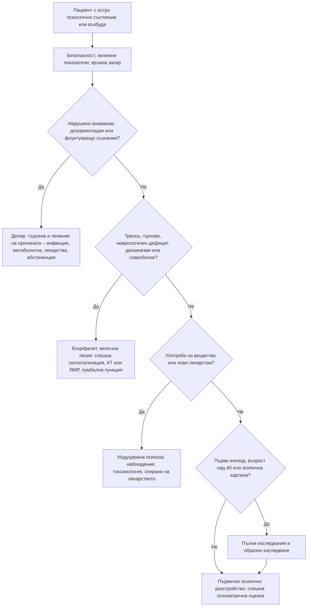

# Глава 75. Психоза, възбуда и поведенчески промени

> **Част XV. Психични симптоми**

## Цели на главата

- Да се разграничават първичните психични от вторичните (органични) причини за психоза.
- Да се разпознават белезите, които насочват към делир, интоксикация, енцефалит или друго соматично заболяване.
- Да се определя минималният обем изследвания при първи психотичен епизод.
- Да се прилагат мерките за безопасност при възбуден пациент и да се изброяват обратимите причини за възбудата.
- Да се разграничават малигненият невролептичен синдром, серотониновият синдром, антихолинергичната интоксикация и кататонията.
- Да се разпознават поведенческите промени като проява на неврологично заболяване.

## Ключови моменти

- Психоза с нарушено внимание, дезориентация или флуктуиращо съзнание е делир до доказване на противното *(SORT C [1])*.
- Първи епизод след 40-годишна възраст, зрителни, тактилни или обонятелни халюцинации и неврологични находки насочват към вторична психоза *(SORT C [1])*.
- Първи психотичен епизод с гърчове, дискинезии, треска или вегетативна нестабилност налага търсене на енцефалит – херпесен или автоимунен *(SORT B [5, 6])*.
- Ранното лечение на анти-NMDA рецепторния енцефалит е свързано с по-добър изход *(SORT B [15])*.
- Критериите на Hunter са по-точни от по-старите критерии за серотонинов синдром. Клонусът е ключовият белег *(SORT B [11])*.
- Тиаминът при съмнение за енцефалопатия на Wernicke се дава парентерално, но лечението на хипогликемията не се отлага *(SORT C [13, 14])*.
- Не започвайте антипсихотик при първи психотичен епизод в общата практика без консултация с психиатър *(SORT C [8])*.

### Първите 60 секунди

- Безопасност: не оставайте сами с пациента, осигурете изход и при непосредствена опасност се обадете на 112 и полицията.
- Вербална деескалация: спокоен тон, кратки изречения, предлагане на избор [9].
- Жизнени показатели, SpO₂, температура и **капилярна кръвна захар**. Хипогликемията се лекува веднага. При злоупотреба с алкохол или недохранване тиаминът се дава заедно с глюкозата [14].
- Нарушено внимание или ориентация: помислете за делир и търсете причината.
- Треска с ригидност, клонус, суха гореща кожа, гърчове или дискинезии: малигнен невролептичен синдром, серотонинов синдром, антихолинергична интоксикация или енцефалит – спешен транспорт до болница.

---

## 1. Основни понятия

- **Психоза** – нарушена връзка с реалността: налудности (устойчиви погрешни убеждения, които не съответстват на културата на пациента), халюцинации (възприятия без обект), дезорганизирано мислене и поведение.
- Налудностите могат да са персекуторни (преследване), на отношение, грандиозни, соматични, нихилистични, за вина, ревност (синдром на Othello), еротомански; вмъкване, отнемане и излъчване на мисли.
- Халюцинациите могат да са слухови (най-чести при първичните психози), зрителни, тактилни, обонятелни, вкусови. Зрителните, тактилните и обонятелните халюцинации насочват към органична причина [1].
- **Делир** – остро, флуктуиращо нарушение на вниманието и съзнанието (вж. глава 43). Психозата при запазено съзнание и ориентация е по-вероятно първична; психозата с нарушено внимание и ориентация е делир.

---

## 2. Причини за психоза

### 2.1. Първични психични разстройства

*Таблица 75.1. Причини за психоза: първични психични разстройства.*

| Разстройство | Ключови белези |
|---|---|
| **Шизофрения** | Начало на 15–35 години; продромален период на социално оттегляне и влошаване на представянето в училище или в работата; слухови халюцинации (гласове, коментиращи или разговарящи помежду си), персекуторни и странни налудности, негативни симптоми (афективна бедност, апатия, оскъдна реч), продължителност над 1 месец (МКБ-11) или 6 месеца (DSM-5) |
| **Шизоафективно разстройство** | Психотични симптоми и едновременно изразени афективни епизоди |
| **Биполярно разстройство – мания с психотични симптоми** | Грандиозни налудности, повишено или раздразнително настроение, намалена нужда от сън, ускорена реч |
| **Депресия с психотични симптоми** | Налудности за вина, бедност, болест, нихилистични налудности; висок суициден риск |
| **Остро и преходно психотично разстройство** | Внезапно начало, често след стрес; отзвучаване до 3 месеца |
| **Налудно разстройство** | Устойчиви правдоподобни налудности (ревност, преследване, соматични) при запазено функциониране в други области |
| **Следродилна психоза** | Първите 2 седмици след раждането; бързо начало, объркване, флуктуация, афективни симптоми; риск за майката и детето – спешно състояние [2]; оценка от психиатър до 4 часа [3]; силна връзка с биполярно разстройство [2] |
| **Индуцирано психотично разстройство** (folie à deux) | Налудностите се споделят от близък човек |

### 2.2. Вторични (органични) причини

*Таблица 75.2. Вторични (органични) причини за психоза.*

| Група | Причини |
|---|---|
| **Вещества – интоксикация** | Канабис (включително синтетични канабиноиди), амфетамини, метамфетамин, кокаин, синтетични катинони („соли за вана“), халюциногени (LSD, псилоцибин), кетамин, фенциклидин |
| **Вещества – абстиненция** | Алкохол – делириум тременс (обикновено 48–72 часа след последната доза, понякога по-късно) и алкохолна халюциноза (слухови халюцинации при ясно съзнание); бензодиазепини, барбитурати, GHB |
| **Лекарства** | Кортикостероиди (дозозависимо), леводопа и допаминови агонисти, антихолинергици (включително трихексифенидил, антихистамини, трициклични антидепресанти), опиоиди, изониазид, мефлохин, антиепилептични лекарства (леветирацетам), интерферон, дигоксин (токсичност), флуорохинолони, бупропион, метилфенидат |
| **Неврологични** | Деменция с телца на Lewy (ярки зрителни халюцинации, паркинсонизъм, флуктуации [4]), болест на Parkinson (лекарства), епилепсия (иктална, постиктална и интериктална психоза), мозъчни тумори (фронтален и темпорален дял), инсулт, травма на главата, множествена склероза, болест на Huntington (хорея, фамилна анамнеза), болест на Wilson (млади хора, тремор, чернодробно заболяване, пръстени на Kayser-Fleischer) |
| **Възпалителни и инфекциозни** | Херпес симплекс енцефалит (треска, главоболие, гърчове, обонятелни халюцинации, промени в поведението [5]), автоимунен енцефалит (анти-NMDA рецепторен – млади жени, тератом на яйчника [6, 7]), невросифилис, HIV, системен лупус еритематодес (невропсихиатричен), болест на Creutzfeldt-Jakob (бързо прогресираща деменция, миоклонус), сепсис и инфекции при възрастни |
| **Ендокринни и метаболитни** | Хипо- и хипертиреоидизъм („микседемна лудост“), синдром на Cushing, хипо- и хипергликемия, хипонатриемия, хиперкалциемия, уремия, чернодробна енцефалопатия, остра интермитентна порфирия (коремна болка, невропатия, тъмна урина), дефицит на витамин B12, пелагра, енцефалопатия на Wernicke |
| **Хипоксия** | Дихателна недостатъчност, отравяне с въглероден оксид |

### 2.3. Белези, които насочват към органична причина

- **Първи епизод след 40-годишна възраст**, особено без психиатрична анамнеза [1].
- **Остро начало** (часове до дни).
- Флуктуиращо съзнание, дезориентация, нарушено внимание, нарушения на паметта.
- Зрителни, тактилни или обонятелни халюцинации.
- **Отклонения в жизнените показатели** – **треска**, тахикардия, хипертония, хипоксемия.
- **Неврологични находки** – гърчове, фокален дефицит, атаксия, дискинезии, миоклонус, менингеален синдром, главоболие.
- Скорошна травма на главата, нови лекарства, употреба на вещества.
- **Соматични симптоми** – загуба на тегло, коремна болка, тъмна урина, иктер.
- Атипичен ход, липса на отговор на антипсихотици, изразени странични ефекти от ниски дози антипсихотици (особено при деменция с телца на Lewy [4] и анти-NMDA енцефалит).

---

## 3. Изследвания при първи психотичен епизод

*Таблица 75.3. Изследвания при първи психотичен епизод.*

| Изследване | Цел |
|---|---|
| **Кръвна захар** | Хипогликемия |
| **ПКК, CRP** | Инфекция, анемия |
| **Електролити, калций, креатинин, чернодробни ензими** | Метаболитни причини |
| **ТСХ** | Щитовидна жлеза |
| **Витамин B12** | Дефицит |
| **Токсикологичен тест на урината** | Вещества (синтетичните канабиноиди и катинони често не се откриват) |
| **Сифилис, HIV** | Инфекции |
| **ЕКГ** | Изходен QTc интервал преди антипсихотици – особено при сърдечно-съдово заболяване или рискови фактори и при хоспитализация [8] |
| **Образно изследване на главния мозък** (КТ или ЯМР) | При неврологични находки, атипична картина, възраст над 40 години, травма; не е рутинно изследване при всеки първи епизод [8] |
| **ЕЕГ** | При подозрение за епилепсия или енцефалит |
| **Лумбална пункция** | При треска, менингеален синдром, гърчове, дискинезии, нарушено съзнание – енцефалит [5] |
| **Специфични изследвания** | Церулоплазмин и мед в урината (болест на Wilson, под 40 години), ANA, антитела срещу NMDA рецептора (серум и ликвор), кортизол, порфобилиноген в урината |

---

## 4. Възбуденият пациент

### 4.1. Безопасност

- **Собствената безопасност и безопасността на персонала** са приоритет: не оставайте сами с агресивен пациент, осигурете изход, не заставайте между пациента и вратата.
- **Вербална деескалация** – спокоен тон, уважение, кратки изречения, предлагане на избор. Деескалацията продължава и когато се налагат ограничителни мерки [9].
- При опасност – полиция и спешна помощ. Задължителното лечение се провежда по реда на Закона за здравето.

### 4.2. Обратими причини, които трябва да се търсят

Хипоксия, хипогликемия, болка, задръжка на урина, запек, травма на главата, интоксикация, абстиненция, инфекция, хипертермия, хипонатриемия, лекарства. Особено при възрастни и при пациенти с деменция възбудата често е проява на делир или болка.

### 4.3. Състояния с възбуда, треска и мускулна ригидност

*Таблица 75.4. Състояния с възбуда, треска и мускулна ригидност.*

| Белег | **Малигнен невролептичен синдром** | **Серотонинов синдром** | **Антихолинергична интоксикация** | **Малигнена кататония** | **Симпатикомиметична интоксикация** |
|---|---|---|---|---|---|
| Причина | Антипсихотици, рязко спиране на леводопа или други допаминергични лекарства [10] | SSRI, SNRI, МАО-инхибитори, трамадол, линезолид, триптани, литий, комбинации | Антихистамини, трициклични антидепресанти, атропин, татул (*Datura*), антипаркинсонови лекарства | Психично разстройство, спиране на бензодиазепини | Кокаин, амфетамини, катинони |
| Начало | Часове до дни, обикновено до 2 седмици след започване на лекарството [10] | Часове (под 24) | Часове | Дни | Часове |
| Мускулен тонус | **Ригидност тип „оловна тръба“** | Клонус (индуциран, спонтанен, очен), хиперрефлексия – повече в краката | Нормален | Каталепсия, негативизъм, мутизъм, восъчна гъвкавост | Повишен |
| Зеници | Нормални | **Мидриаза** | **Мидриаза** | Нормални | **Мидриаза** |
| Кожа | **Изпотяване** | **Изпотяване** | **Суха, зачервена, гореща** | Изпотяване | **Изпотяване** |
| Черва и пикочен мехур | Без особености | Диария, усилена перисталтика | Липсваща перисталтика, задръжка на урина | | |
| Съзнание | Ступор, мутизъм | Възбуда | Делир („луд като шапкар“), мърморене, посягане към въображаеми предмети | Ступор или възбуда | Възбуда, параноя |
| Лабораторни | Много висока креатинкиназа (КК), левкоцитоза, миоглобинурия | КК умерено повишена | | КК повишена | КК, рабдомиолиза |

**Серотонинов синдром** – критерии на Hunter (чувствителност 84% и специфичност 97%) [11]: при прием на серотонинергично вещество и някое от: спонтанен клонус; индуциран клонус с възбуда или изпотяване; очен клонус с възбуда или изпотяване; тремор с хиперрефлексия; мускулна хипертония, температура над 38 °C и очен или индуциран клонус.

---

## 5. Промени в личността и поведението

Нова промяна в личността при възрастен (апатия, дезинхибиция, социално неподходящо поведение, хипероралност, загуба на емпатия, компулсивно поведение, промени в храненето) без предишно психично заболяване изисква неврологична оценка. Дезинхибицията, апатията, загубата на емпатия, компулсивното поведение и хипероралността са основните белези на поведенческия вариант на фронтотемпоралната деменция [12]. Причини:

- **фронтотемпорална деменция** (начало на 45–65 години);
- тумор на фронталния дял (включително менингиом);
- **нормотензивна хидроцефалия** (нарушена походка, инконтиненция, когнитивни нарушения);
- **хроничен субдурален хематом**;
- **болест на Huntington**;
- **множествена склероза**;
- **невросифилис** (прогресивна парализа);
- хипотиреоидизъм, дефицит на витамин B12;
- **лекарства** – допаминови агонисти (патологичен хазарт, хиперсексуалност, компулсивно пазаруване);
- **обструктивна сънна апнея**, алкохол.

---

## 6. Безопасна диагностична стратегия

*Таблица 75.5. Безопасна диагностична стратегия.*

| Въпрос | Отговор |
|---|---|
| **Вероятна диагноза** | Шизофрения, биполярно разстройство, психоза, индуцирана от вещества, делир при възрастни |
| **Сериозни заболявания, които не бива да се пропускат** | Делир (вж. глава 43) и неговите причини; енцефалит (херпес, автоимунен); хипогликемия; алкохолна абстиненция и делириум тременс; енцефалопатия на Wernicke; малигнен невролептичен синдром и серотонинов синдром; следродилна психоза; мозъчни тумори и субдурален хематом; риск от самоубийство или убийство; болест на Wilson |
| **Чести капани** | Делир, приет за психоза; психоза при възрастен, приписана на деменция без търсене на остра причина; енцефалит, приет за „първи психотичен епизод“; отрицателен токсикологичен тест при употреба на синтетични канабиноиди; зрителни халюцинации без търсене на органична причина; тежки странични ефекти от антипсихотик при деменция с телца на Lewy |
| **Маскиращи заболявания** | Лекарства (кортикостероиди, леводопа, антихолинергици), заболявания на щитовидната жлеза, хипонатриемия, порфирия, системен лупус еритематодес |
| **Психосоциални аспекти** | Насилие, бездомност, стигма, риск за децата (следродилна психоза) |

---

## 7. Диагностичен алгоритъм при остро психотично състояние

*Фигура 75.1. Диагностичен алгоритъм при остро психотично състояние. Схема на авторите въз основа на източниците, цитирани в главата.*

Текстово описание на фигура 75.1

1. Пациент с остро психотично състояние или възбуда. Следва: към т. 2.
2. Безопасност; жизнени показатели; кръвна захар. Следва: към т. 3.
3. **Въпрос:** Нарушено внимание, дезориентация или флуктуиращо съзнание? Да – към т. 4; Не – към т. 5.
4. Делир: търсене и лечение на причината – инфекция, метаболитна, лекарства, абстиненция.
5. **Въпрос:** Треска, гърчове, неврологичен дефицит, дискинезии или главоболие? Да – към т. 6; Не – към т. 7.
6. Енцефалит, мозъчна лезия: спешна хоспитализация, КТ или ЯМР, лумбална пункция.
7. **Въпрос:** Употреба на вещества или нови лекарства? Да – към т. 8; Не – към т. 9.
8. Индуцирана психоза: наблюдение, токсикология, спиране на лекарството.
9. **Въпрос:** Първи епизод, възраст над 40 или атипична картина? Да – към т. 10; Не – към т. 11.
10. Пълни изследвания и образно изследване. Следва: към т. 11.
11. Първично психично разстройство: спешна психиатрична оценка.

---

## 8. Червени флагове и насочване

### 8.1. Червени флагове

- Нарушено внимание, дезориентация или флуктуиращо съзнание.
- Треска, главоболие, менингеален синдром, гърчове или фокален неврологичен дефицит.
- Орофациални дискинезии, вегетативна нестабилност или нарушено дишане.
- Ригидност, клонус или хипертермия след антипсихотик или серотонинергично лекарство.
- Първи епизод след 40-годишна възраст; зрителни, тактилни или обонятелни халюцинации.
- Объркване, атаксия, нистагъм или офталмоплегия при злоупотреба с алкохол или недохранване.
- Психоза или мания в първите седмици след раждането.
- Императивни халюцинации, мисли за самоубийство или убийство.
- Нова промяна в личността при възрастен без психично заболяване.

### 8.2. Кога и колко спешно да насочим

*Таблица 75.6. Кога и колко спешно да насочим.*

| Спешност | Клинична ситуация |
|---|---|
| **Незабавно (112 или спешно отделение)** | Психоза или възбуда с треска, гърчове, нарушено съзнание, дискинезии или вегетативна нестабилност – енцефалит [5, 6]; подозрение за малигнен невролептичен синдром [10] или серотонинов синдром [11]; делир; енцефалопатия на Wernicke [13]; непосредствена опасност за пациента или околните [9] |
| **В същия ден** | Първи психотичен епизод – спешна психиатрична оценка без започване на антипсихотик в общата практика [8]; следродилна психоза – оценка от психиатър до 4 часа [3]; императивни халюцинации, мисли за самоубийство или убийство |
| **Бързо (до 2 седмици)** | Преходни или слабо изразени психотични симптоми със спад във функционирането или с психоза при роднина от първа степен – насочване без отлагане [8]; нова промяна в личността при възрастен – неврологична оценка и образно изследване [12]; зрителни халюцинации с паркинсонизъм – подозрение за деменция с телца на Lewy [4] |
| **Планово** | Хронични поведенчески симптоми при установена деменция без остра промяна |
| **Проследяване в общата практика** | Стабилна шизофрения или биполярно разстройство – регистър, контрол на физическото здраве (кръвно налягане, липиди, кръвна захар, тегло) и насочване при рецидив [8] |

---

## 9. Клинични перли

- Психоза с нарушено внимание и ориентация е делир до доказване на противното.
- Зрителните, тактилните и обонятелните халюцинации насочват към органична причина.
- Първи психотичен епизод след 40-годишна възраст изисква търсене на неврологична или соматична причина.
- Млада жена с психоза, гърчове, дискинезии и вегетативна нестабилност: анти-NMDA рецепторен енцефалит. Търсете тератом на яйчника.
- Треска и промени в поведението: херпес симплекс енцефалит. Започнете ацикловир (10 mg/kg i.v. на 8 часа при нормална бъбречна функция), без да чакате изследванията [5].
- Злоупотреба с алкохол или недохранване с объркване, атаксия или нарушения на очните движения: енцефалопатия на Wernicke. Тиаминът се дава парентерално, преди или заедно с глюкозата [13], но лечението на хипогликемията не се отлага [14].
- Отрицателният токсикологичен тест не изключва синтетични канабиноиди или катинони.
- Възрастен пациент с нова промяна в личността: помислете за фронтотемпорална деменция, фронтален тумор, субдурален хематом, нормотензивна хидроцефалия.
- Следродилната психоза е спешно състояние с риск за майката и бебето.
- Малигнен невролептичен синдром: часове до дни, ригидност тип „оловна тръба“, брадикинезия. Серотонинов синдром: часове, клонус, хиперрефлексия, диария.

---

## 10. Клиничен случай

**Етап 1 – клинична картина.** Жена на 23 години е доведена от семейството си заради странно поведение от 10 дни. Преди две седмици е имала главоболие и температура, приети за грип. След това е станала тревожна и безсънна, твърди, че съседите я следят, и чува гласове. Няма психично заболяване и не употребява вещества.

> **Въпрос 1.** Кои белези в анамнезата не съответстват на първично психично разстройство?

**Етап 2 – преглед.** Пациентката е объркана и говори несвързано. Има **неволеви движения на устата и езика** (облизване, дъвчене). Пулсът е 128/min, артериалното налягане се колебае между 100/60 и 170/100 mmHg, температурата е 37,9 °C. Вчера е имала генерализиран гърч. Токсикологичният тест е отрицателен, а КТ на главата е нормална.

> **Въпрос 2.** Коя е най-вероятната диагноза?

> **Въпрос 3.** Какви са следващите стъпки?

Обсъждане и отговори

**Отговор 1.** Грипоподобният продром, острото начало и безсънието при човек без психична анамнеза са необичайни за първична психоза. Острото начало и нарушеното съзнание насочват към вторична причина [1].

**Отговор 2.** Психозата с объркване, орофациални дискинезии, гърчове и вегетативна нестабилност при млада жена е типична за анти-NMDA рецепторен енцефалит [6]. Той често е свързан с тератом на яйчника [7]. Херпес симплекс енцефалитът трябва да се изключи [5].

**Отговор 3.** Необходими са спешна хоспитализация в неврологично отделение, ЯМР (често нормален), ЕЕГ, лумбална пункция с антитела срещу NMDA рецептора в ликвора и серума и образно изследване на малкия таз за тератом. Ацикловир се започва до получаване на PCR за херпес симплекс вирус [5]. Имунотерапията и отстраняването на тератома водят до добър изход при около 80% от пациентите след 2 години, а ранното лечение подобрява прогнозата [15]. Антипсихотиците често предизвикват тежки странични ефекти и не решават проблема.

**Поука.** Първи психотичен епизод с гърчове, дискинезии, треска или вегетативна нестабилност е енцефалит до доказване на противното.

---

## Обобщение

- Първата задача при остра психоза е да се изключат делирът, интоксикацията, абстиненцията и соматичните заболявания.
- Нарушеното съзнание, късното начало, зрителните, тактилните и обонятелните халюцинации и неврологичните находки насочват към вторична психоза.
- Възбудата с треска и ригидност изисква разграничаване на малигнения невролептичен синдром, серотониновия синдром, антихолинергичната интоксикация и кататонията.
- Новата промяна в личността при възрастен изисква неврологична оценка. Първият психотичен епизод изисква спешна психиатрична оценка.

## Самопроверка

### Въпроси с един верен отговор

**1.** *(основно ниво)* Мъж на 78 години е приет след операция на тазобедрената става. Вечерта е възбуден, твърди, че в стаята има непознати, а на сутринта е сънлив и не знае къде се намира. Коя е най-вероятната диагноза?

- **А.** Шизофрения с късно начало
- **Б.** Делир
- **В.** Налудно разстройство
- **Г.** Депресия с психотични симптоми
- **Д.** Болест на Alzheimer

Отговор и обосновка

**Верен отговор: Б.** Остро, флуктуиращо нарушение на вниманието и ориентацията със зрителни халюцинации е делир. Зрителните халюцинации и дезориентацията насочват към вторична причина [1].

**2.** *(основно ниво)* Жена на 55 години без психиатрична анамнеза от 3 седмици чувства миризма на изгоряло, която никой друг не усеща, и има епизоди на „вцепеняване“ с облизване на устните. Кое е най-подходящото следващо действие?

- **А.** Антипсихотик и контрол след месец
- **Б.** Неврологична оценка с ЯМР и ЕЕГ
- **В.** Психотерапия
- **Г.** Успокояване
- **Д.** Насочване към УНГ специалист

Отговор и обосновка

**Верен отговор: Б.** Обонятелните халюцинации насочват към заболяване на темпоралния дял, а първият епизод след 40 години – към вторична причина [1].

**3.** *(напреднало ниво)* Мъж на 34 години, лекуван с есциталопрам, започва трамадол за болка в гърба. След 8 часа е възбуден, изпотен, с температура 38,6 °C, мидриаза, диария и индуциран клонус, по-изразен в краката. Коя е най-вероятната диагноза?

- **А.** Малигнен невролептичен синдром
- **Б.** Серотонинов синдром
- **В.** Антихолинергична интоксикация
- **Г.** Малигнена кататония
- **Д.** Менингит

Отговор и обосновка

**Верен отговор: Б.** Серотонинергично лекарство и клонус с възбуда и изпотяване изпълняват критериите на Hunter [11]. Малигненият невролептичен синдром се развива по-бавно, с ригидност тип „оловна тръба“ и без клонус [10].

**4.** *(основно ниво)* Мъж на 50 години със злоупотреба с алкохол е намерен объркан, с атаксия и нистагъм. Капилярната кръвна захар е 2,4 mmol/l. Кое е правилното поведение?

- **А.** Да се изчака тиаминът и едва след това да се даде глюкоза
- **Б.** Глюкоза веднага и парентерален тиамин едновременно или веднага след нея
- **В.** Само глюкоза през устата
- **Г.** Бензодиазепин
- **Д.** Антипсихотик за възбудата

Отговор и обосновка

**Верен отговор: Б.** Хипогликемията се лекува веднага. Тиаминът се дава парентерално заедно с глюкозата или веднага след нея [13, 14].

**5.** *(основно ниво)* Жена на 29 години е родила преди 6 дни. От 2 дни не спи, говори бързо и объркано, твърди, че бебето „не е нейното“. Кое е правилното поведение?

- **А.** Контрол след седмица
- **Б.** Оценка от психиатър до 4 часа
- **В.** Бензодиазепин за сън и контрол след 3 дни
- **Г.** Насочване към психолог
- **Д.** Прекратяване на кърменето и наблюдение вкъщи

Отговор и обосновка

**Верен отговор: Б.** Следродилната психоза е спешно състояние с риск за майката и детето [2]. NICE препоръчва оценка от психиатър до 4 часа [3].

### Задача

Мъж на 58 години е доведен от съпругата си. От година е станал „друг човек“: прави неприлични коментари на непознати, изял е цяла торта наведнъж, не се интересува от болестта на майка си и е изхарчил спестяванията си за ненужни покупки. Няма психично заболяване. Как ще подходите?

Решение

Картината подсказва **поведенчески вариант на фронтотемпоралната деменция**: дезинхибиция, хипероралност, загуба на емпатия и компулсивно поведение [12]. Нужни са неврологична оценка и ЯМР на главния мозък, за да се изключат фронтален тумор, субдурален хематом и нормотензивна хидроцефалия. Изследват се ТСХ, витамин B12 и сифилис. Преглеждат се лекарствата – допаминовите агонисти могат да предизвикат компулсивно поведение. Обсъждат се финансовата защита и подкрепата за съпругата.

### OSCE станция: Оценка на пациент с остра психоза

**Време:** 8 минути. **Ниво:** основно (студенти, специализанти).

**Задача за кандидата.** Мъж на 42 години е доведен от брат си, защото от 3 дни чува гласове и смята, че го следят. Оценете пациента и решете за поведението.

**Информация за симулирания пациент (за изпитващия).** Няма психично заболяване. Пие по 10–12 бири дневно, но от 3 дни не е пил. Трепери и се поти. Не знае коя дата е и мисли, че е в полицията. Пулсът е 118/min, температурата е 37,8 °C.

*Таблица 75.7. OSCE станция „Оценка на пациент с остра психоза“ – критерии за оценяване.*

| Критерий | Точки |
|---|---|
| Осигурява безопасност и използва вербална деескалация | 1 |
| Измерва жизнените показатели и капилярната кръвна захар | 2 |
| Оценява вниманието и ориентацията и разпознава делира | 2 |
| Пита за алкохол, вещества и лекарства и свързва картината с алкохолна абстиненция | 2 |
| Търси признаци на енцефалопатия на Wernicke и планира парентерален тиамин | 1 |
| Не започва антипсихотик като единствено лечение и организира спешна хоспитализация | 2 |
| **Общо** | **10** |

**Праг за успешно изпълнение:** 7 от 10 точки, включително разпознаването на делира и спешната хоспитализация.

## Литература

1. Keshavan MS, Kaneko Y. Secondary psychoses: an update. World Psychiatry. 2013;12(1):4-15. doi:10.1002/wps.20001. PMID: 23471787.
2. Bergink V, Rasgon N, Wisner KL. Postpartum Psychosis: Madness, Mania, and Melancholia in Motherhood. Am J Psychiatry. 2016;173(12):1179-1188. doi:10.1176/appi.ajp.2016.16040454. PMID: 27609245.
3. National Institute for Health and Care Excellence. Antenatal and postnatal mental health: clinical management and service guidance (Clinical guideline CG192). London: NICE; 2014 [актуализирано 2020]. Достъпно на: https://www.nice.org.uk/guidance/cg192
4. McKeith IG, Boeve BF, Dickson DW, Halliday G, Taylor JP, Weintraub D, et al. Diagnosis and management of dementia with Lewy bodies: Fourth consensus report of the DLB Consortium. Neurology. 2017;89(1):88-100. doi:10.1212/WNL.0000000000004058. PMID: 28592453.
5. Solomon T, Michael BD, Smith PE, Sanderson F, Davies NW, Hart IJ, et al. Management of suspected viral encephalitis in adults--Association of British Neurologists and British Infection Association National Guidelines. J Infect. 2012;64(4):347-73. doi:10.1016/j.jinf.2011.11.014. PMID: 22120595.
6. Graus F, Titulaer MJ, Balu R, Benseler S, Bien CG, Cellucci T, et al. A clinical approach to diagnosis of autoimmune encephalitis. Lancet Neurol. 2016;15(4):391-404. doi:10.1016/S1474-4422(15)00401-9. PMID: 26906964.
7. Dalmau J, Gleichman AJ, Hughes EG, Rossi JE, Peng X, Lai M, et al. Anti-NMDA-receptor encephalitis: case series and analysis of the effects of antibodies. Lancet Neurol. 2008;7(12):1091-8. doi:10.1016/S1474-4422(08)70224-2. PMID: 18851928.
8. National Institute for Health and Care Excellence. Psychosis and schizophrenia in adults: prevention and management (Clinical guideline CG178). London: NICE; 2014 [актуализирано 2026]. Достъпно на: https://www.nice.org.uk/guidance/cg178
9. National Institute for Health and Care Excellence. Violence and aggression: short-term management in mental health, health and community settings (NICE guideline NG10). London: NICE; 2015. Достъпно на: https://www.nice.org.uk/guidance/ng10
10. Berman BD. Neuroleptic malignant syndrome: a review for neurohospitalists. Neurohospitalist. 2011;1(1):41-7. doi:10.1177/1941875210386491. PMID: 23983836.
11. Dunkley EJ, Isbister GK, Sibbritt D, Dawson AH, Whyte IM. The Hunter Serotonin Toxicity Criteria: simple and accurate diagnostic decision rules for serotonin toxicity. QJM. 2003;96(9):635-42. doi:10.1093/qjmed/hcg109. PMID: 12925718.
12. Rascovsky K, Hodges JR, Knopman D, Mendez MF, Kramer JH, Neuhaus J, et al. Sensitivity of revised diagnostic criteria for the behavioural variant of frontotemporal dementia. Brain. 2011;134(Pt 9):2456-77. doi:10.1093/brain/awr179. PMID: 21810890.
13. Galvin R, Bråthen G, Ivashynka A, Hillbom M, Tanasescu R, Leone MA; EFNS. EFNS guidelines for diagnosis, therapy and prevention of Wernicke encephalopathy. Eur J Neurol. 2010;17(12):1408-18. doi:10.1111/j.1468-1331.2010.03153.x. PMID: 20642790.
14. Schabelman E, Kuo D. Glucose before thiamine for Wernicke encephalopathy: a literature review. J Emerg Med. 2012;42(4):488-94. doi:10.1016/j.jemermed.2011.05.076. PMID: 22104258.
15. Titulaer MJ, McCracken L, Gabilondo I, Armangué T, Glaser C, Iizuka T, et al. Treatment and prognostic factors for long-term outcome in patients with anti-NMDA receptor encephalitis: an observational cohort study. Lancet Neurol. 2013;12(2):157-65. doi:10.1016/S1474-4422(12)70310-1. PMID: 23290630.

*Последна проверка на съдържанието: септември 2026 г. Следващ планиран преглед: септември 2027 г. (вж. „Политика за актуализация“ в README).*

<!-- навигация -->

---

[← Глава 74. Депресивни и тревожни симптоми](74-depresia-trevozhnost.md) · [Съдържание](../README.md) · [Глава 76. Функционални симптоми и употреба на психоактивни вещества →](76-funktsionalni-veshtestva.md)
