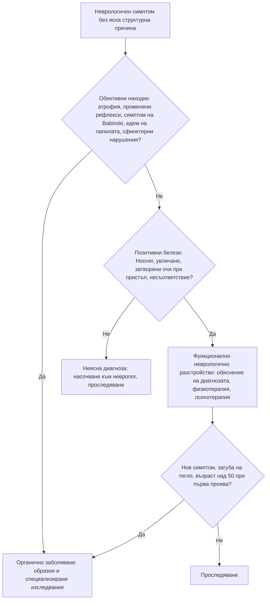

# Глава 76. Функционални симптоми и употреба на психоактивни вещества

> **Част XV. Психични симптоми**

## Цели на главата

- Да се поставя диагнозата функционално разстройство въз основа на позитивни клинични белези, а не само чрез изключване.
- Да се разграничават соматичното симптомно разстройство, тревожността за здравето, изкуственото (фактитивно) разстройство и симулацията.
- Да се разпознава „диагностичното засенчване“ – пропускане на соматично заболяване при пациент с психиатрична диагноза.
- Да се разпознават **интоксикацията и абстиненцията** при основните психоактивни вещества.
- Да се разпознават соматичните усложнения на употребата на вещества, които имитират други заболявания.

## Ключови моменти

- Функционалното неврологично разстройство се диагностицира с позитивни белези. Те имат ниска чувствителност, но висока специфичност *(SORT B [2])*.
- Функционалните гърчове се разпознават по съвкупност от белези, а не по един белег *(SORT B [3])*.
- При внимателна неврологична оценка функционалната диагноза рядко се оказва погрешна *(SORT B [1])*.
- Психичните разстройства съкращават живота с 10–20 години. Не позволявайте психиатричната диагноза да засенчи новите соматични симптоми *(SORT B [4])*.
- AUDIT-C е кратък скрининг за вредна употреба на алкохол, а CIWA-Ar оценява тежестта на абстиненцията *(SORT B [5, 8])*.
- Класическата триада на Wernicke често липсва. При съмнение се дава парентерален тиамин *(SORT C [9, 10])*.

### Първите 60 секунди

- Дишане и съзнание: понижено съзнание с миоза и бавно дишане – опиоидно предозиране; поддържане на дихателния път, налоксон и 112.
- Капилярна кръвна захар и температура. Хипогликемията се лекува веднага, а при злоупотреба с алкохол или недохранване тиаминът се дава заедно с глюкозата [12].
- Гърч, дезориентация, халюцинации или треска след спиране на алкохола или бензодиазепините: спешна хоспитализация [9].
- Болка в гърдите след кокаин или стимуланти: ЕКГ и 112 [14].
- Питайте за намерение за самонараняване при всяко предозиране.

---

## 1. Функционални соматични симптоми

### 1.1. Общи положения

- Функционалните симптоми са реални и не са симулирани. Те се дължат на нарушена функция на нервната система, а не на структурно увреждане.
- Чести са в общата практика. Около **една трета** от новите пациенти в неврологичните кабинети имат симптоми, които не се обясняват или се обясняват само отчасти със структурно заболяване. При внимателна оценка диагнозата рядко се променя: за 18 месеца неочаквано органично заболяване, което обяснява симптомите, е установено при 0,4% [1].
- **Често съжителстват** със соматични заболявания (например функционални гърчове при епилепсия).
- **Функционалните синдроми** в различните специалности се припокриват:
  - **синдром на раздразненото черво** и функционална диспепсия (гастроентерология);
  - **фибромиалгия** (ревматология);
  - **синдром на хроничната умора** (миалгичен енцефаломиелит);
  - **функционална болка в гърдите** (кардиология);
  - **функционални неврологични разстройства** (неврология);
  - хронична тазова болка, синдром на болезнения пикочен мехур;
  - индуцирана обструкция на ларинкса (дисфункция на гласните гънки), дисфункционално дишане;
  - **персистиращ постурално-перцептивен световъртеж (PPPD)** (вж. глава 41).

### 1.2. Функционални неврологични разстройства – позитивни белези

*Таблица 76.1. Функционални неврологични разстройства – позитивни белези.*

| Симптом | Позитивни белези |
|---|---|
| **Функционална слабост** | Белег на Hoover – при флексия на здравия крак в тазобедрената става „слабият“ крак се екстендира с нормална сила; „поддаваща“ слабост (give-way); отклонение без пронация при пробата на Barré; несъответствие между прегледа и ежедневната активност (например може да ходи, но при прегледа няма движение в леглото); влачене на крака, а не циркумдукция. Позитивните белези имат ниска чувствителност, но висока специфичност [2] |
| **Функционален тремор** | Увличане (*entrainment*) – треморът приема ритъма на ритмично движение с другата ръка; изчезва или се променя при отвличане на вниманието; променлива честота и амплитуда; внезапно начало и спонтанни ремисии |
| **Функционални (дисоциативни) гърчове** | Затворени очи по време на пристъпа (при епилептичните – обикновено отворени); съпротива при отваряне на клепачите; продължителност над 2 минути; странично поклащане на главата, тазови тласъци, асинхронни движения; флуктуиращ ход; спомен за пристъпа; плач след пристъпа; пристъпи в присъствието на свидетели, в кабинета; липса на постиктално объркване; нито един белег не е достатъчен сам [3] |
| **Функционални нарушения на походката** | Много бавна походка, „ходене по лед“, колебливост, внезапно подгъване на коленете без падане, астазия-абазия |
| **Функционални нарушения на сетивността** | Граница на средната линия, загуба на вибрационния усет само на половината от челото или гръдната кост, липса на съответствие с дерматомите |
| **Функционални нарушения на зрението** | Тубуларно (цилиндрично) зрително поле, което не се разширява с разстоянието |

Видеозапис на пристъпа, направен от свидетел, е много полезен. Видео-ЕЕГ мониторирането е златният стандарт за разграничаване на дисоциативните от епилептичните пристъпи.

### 1.3. Разграничаване на свързаните състояния

*Таблица 76.2. Разграничаване на свързаните състояния.*

| Състояние | Съзнателно ли се произвеждат симптомите? | Мотивация | Особености |
|---|---|---|---|
| **Функционално разстройство** | **Не** | Няма | Позитивни клинични белези |
| **Соматично симптомно разстройство** | **Не** | Няма | Прекомерни мисли, чувства и поведение, свързани със симптомите; висока тревожност; много време и енергия, посветени на здравето |
| **Тревожност за здравето** (хипохондрия) | Не | Няма | Убеждение за сериозна болест при малко или никакви симптоми; проверки, търсене в интернет, повтарящи се изследвания или избягване на лекари |
| **Телесно дисморфично разстройство** | Не | Няма | Загриженост за въображаем или незначителен дефект във външния вид |
| **Изкуствено (фактитивно) разстройство** (синдром на Münchausen) | **Да** | Вътрешна – ролята на болен | Медицински персонал; много хоспитализации, различни болници; драматична, но неясна анамнеза; необичайни находки (самоинжектиране на инсулин – ниско C-пептидно ниво; бактерии от кал в хемокултурите; заличаване на рани); съгласие за инвазивни процедури |
| **Изкуствено разстройство, наложено на друг** (Münchausen by proxy) | Да – от родителя | Вътрешна | Симптомите при детето се появяват само в присъствието на родителя; форма на насилие над дете |
| **Симулация** | **Да** | Външна – пари, обезщетение, отпуск, лекарства, избягване на наказание | Юридически контекст, несъответствие, отказ от сътрудничество |

### 1.4. Капани: функционален или соматичен?

**Заболявания, които често се приемат за функционални в началото:**

- **множествена склероза** (преходни сетивни симптоми, умора);
- **миастения гравис** (флуктуираща слабост);
- **синдром на Guillain-Barré** в ранния стадий (изтръпване с нормален преглед);
- **синдром на скования човек**;
- **дистонии** (особено цервикална и пароксизмални);
- **фронтален епилептичен пристъп** (странни хиперкинетични движения по време на сън);
- **остра интермитентна порфирия**;
- хипертиреоидизъм, болест на Addison;
- системен лупус еритематодес, васкулити;
- спинална компресия, субдурален хематом;
- цьолиакия, възпалителни болести на червата;
- миокардна исхемия при жени и микросъдова стенокардия;
- дефицит на витамин B12 (включително от диазотен оксид).

**Диагностично засенчване:** при пациент с психиатрична диагноза, интелектуален дефицит или зависимост новите симптоми се приписват на основното състояние и соматичното заболяване се пропуска. Тези пациенти имат значително по-висока смъртност от сърдечно-съдови и дихателни заболявания. Психичните разстройства съкращават продължителността на живота с 10–20 години [4].

**Червени флагове при предполагаема функционална причина:** обективни находки (атрофия, фасцикулации, промени в рефлексите, екстензорен плантарен отговор, едем на папилата), загуба на тегло, треска, нов симптом при пациент с известно функционално разстройство, възраст над 50 години при първа проява, отклонения в изследванията.

---

## 2. Употреба на психоактивни вещества

### 2.1. Алкохол

**Скрининг:** AUDIT-C (3 въпроса) [5] или пълен AUDIT [6]; CAGE (Cut down, Annoyed, Guilty, Eye-opener) – ≥ 2 положителни отговора са значими.

**Лабораторни маркери:**

- **ГГТ** (повишена при около 60%);
- **MCV** (макроцитоза);
- **CDT** (карбохидрат-дефицитен трансферин) – по-специфичен;
- **АСАТ/АЛАТ над 2** (алкохолна чернодробна болест);
- триглицериди, пикочна киселина;
- **тромбоцитопения**.

**Клинични признаци на хронична злоупотреба:** телеангиектазии по лицето, ринофима, паротидна хипертрофия, палмарен еритем, контрактура на Dupuytren, гинекомастия, тремор, травми с различна давност, хипертония, предсърдно мъждене („празнично сърце“), периферна невропатия, мозъчечна атаксия.

*Таблица 76.3. Алкохолна абстиненция – времева последователност.*

| Време след последната доза | Прояви |
|---|---|
| **6–24 часа** | Тремор, изпотяване, тахикардия, хипертония, тревожност, безсъние, гадене [7] |
| **12–24 часа** | Алкохолна халюциноза (зрителни, слухови или тактилни халюцинации при ясно съзнание) [7] |
| **Обикновено 24–48 часа** | Абстинентни гърчове (генерализирани тонично-клонични; при около 10% от пациентите с абстиненция) [7] |
| **Обикновено 48–72 часа** (понякога до 10 дни) | Делириум тременс – делир, тежка вегетативна нестабилност, треска, зрителни халюцинации (често дребни животни); развива се при около 5% от пациентите с абстиненция и е животозастрашаващ [7] |

Тежестта се оценява със скалата CIWA-Ar [6, 8]. При абстиненция с висок риск от гърчове или делириум тременс се предлага хоспитализация за медикаментозно лечение [9].

**Енцефалопатия на Wernicke** – объркване, атаксия, офталмоплегия и нистагъм (пълната триада е описана само при 16% в аутопсийна серия [10]). При всеки пациент с хронична злоупотреба с алкохол, недохранване или многократно повръщане и някое от тези оплаквания се дава парентерален тиамин преди или заедно с глюкозата, но лечението на хипогликемията не се отлага [11, 12]. EFNS препоръчва 200 mg 3 пъти дневно [11]. NICE препоръчва дози в горната част на диапазона в британския национален формуляр [9], където се използват до 500 mg 3 пъти дневно. Нелекуваната енцефалопатия на Wernicke води до синдром на Korsakoff (тежка антероградна амнезия, конфабулации).

Метанол (вж. глава 79) – ракия от неизвестен произход; зрителни нарушения („снежна буря“), тежка метаболитна ацидоза с висока анионна разлика.

### 2.2. Интоксикация и абстиненция при други вещества

*Таблица 76.4. Интоксикация и абстиненция при други вещества.*

| Вещество | Интоксикация | Абстиненция |
|---|---|---|
| **Опиоиди** (хероин, метадон, трамадол, фентанил) | Миоза, дихателна депресия, понижено съзнание, брадикардия; белодробен оток | Мидриаза, прозяване, сълзене и хрема, „гъша кожа“, болки в мускулите, коремни колики, диария, тревожност – неприятна, но рядко опасна (освен при новородени) |
| **Бензодиазепини** | Сънливост, атаксия, дизартрия; дихателна депресия с алкохол или опиоиди | Тревожност, безсъние, тремор, гърчове, делир – опасна, може да продължи седмици |
| **Канабис** | Еуфория, зачервени конюнктиви, тахикардия, повишен апетит, тревожност, параноя, психоза (при продукти с високо съдържание на THC) | Раздразнителност, безсъние, намален апетит; канабиноиден хиперемезисен синдром при хронична употреба – вж. по-долу |
| **Синтетични канабиноиди** („спайс“) | Тежка възбуда, психоза, гърчове, тахикардия, остро бъбречно увреждане, инсулт, миокарден инфаркт – не се откриват в стандартните тестове | |
| Стимуланти (кокаин, амфетамини, метамфетамин, MDMA, катинони) | Мидриаза, тахикардия, хипертония, хипертермия, възбуда, параноя, гърчове, миокарден инфаркт (кокаин – болка в гърдите при млад човек), аортна дисекация, инсулт; MDMA – хипонатриемия | „Срив“ – изтощение, хиперсомния, повишен апетит, депресия, суицидни мисли |
| **GHB и GBL** | Внезапна дълбока кома с бързо събуждане, брадикардия, повръщане | Тежка, подобна на алкохолната, делир |
| **Диазотен оксид** („райски газ“, балони) | Кратка еуфория, замайване | Хронична употреба – функционален дефицит на витамин B12: миелопатия (подостра комбинирана дегенерация), невропатия, атаксия, анемия; тромбози |
| **Халюциногени** (LSD, псилоцибин) | Зрителни илюзии и халюцинации, мидриаза, тревожност („лошо пътуване“) | Персистиращо разстройство на възприятието („флашбекове“) |
| **Кетамин** | Дисоциация, халюцинации, нистагъм | Хронично – кетаминов цистит (тежки уринарни симптоми, намален капацитет на пикочния мехур) |
| **Никотин** | | Раздразнителност, тревожност, повишен апетит, безсъние |

### 2.3. Соматични усложнения, които имитират други заболявания

*Таблица 76.5. Соматични усложнения, които имитират други заболявания.*

| Картина | Вещество | Капан |
|---|---|---|
| Повтарящо се тежко повръщане, което се облекчава от горещи душове | Канабис (продължителна и честа употреба) – канабиноиден хиперемезисен синдром [13] | Многократни ендоскопии и КТ; пациентът не свързва симптомите с канабиса |
| **Болка в гърдите при млад човек** | **Кокаин** | Миокарден инфаркт, аортна дисекация; при остра интоксикация бета-блокерите се избягват [14] |
| **Подостра миелопатия** – изтръпване, атаксия, нестабилна походка | **Диазотен оксид** | Приема се за функционално разстройство или множествена склероза; B12 може да е нормален – изследват се хомоцистеин и метилмалонова киселина [15] |
| **Уринарни симптоми, хематурия** | **Кетамин** | Приема се за инфекция на пикочните пътища |
| **Треска и сърдечен шум** | **Интравенозна употреба** | Инфекциозен ендокардит (трикуспидален – септични белодробни емболии) |
| Кожни абсцеси, некротизиращ фасциит, раневи ботулизъм | Интравенозна или подкожна употреба | |
| **Хипонатриемия и гърчове** | **MDMA** | |
| **Рабдомиолиза и остро бъбречно увреждане** | Стимуланти, опиоиди (продължително лежане), синтетични канабиноиди | |
| **Хепатит, HIV** | Интравенозна употреба | |
| **Психоза** | Стимуланти, канабис, синтетични вещества | Приема се за шизофрения |

### 2.4. Търсене на лекарства

**Белези:** „изгубени“ рецепти, искане на конкретно лекарство по име, „алергия“ към алтернативите, много лекари и аптеки, ранни искания за нова рецепта, несъответствие между оплакванията и находката, натиск или ласкателство. Най-често търсени: опиоиди (трамадол, кодеин), бензодиазепини, прегабалин, габапентин, Z-хипнотици, метилфенидат.

---

## 3. Безопасна диагностична стратегия

*Таблица 76.6. Безопасна диагностична стратегия.*

| Въпрос | Отговор |
|---|---|
| **Вероятна диагноза** | Функционални соматични симптоми, синдром на раздразненото черво, фибромиалгия, тревожност за здравето, злоупотреба с алкохол |
| **Сериозни заболявания, които не бива да се пропускат** | Соматично заболяване, прието за функционално (множествена склероза, миастения, Guillain-Barré, порфирия, спинална компресия); делириум тременс; енцефалопатия на Wernicke; абстиненция от бензодиазепини; опиоидно предозиране; усложнения от кокаин (миокарден инфаркт, дисекация); ендокардит при интравенозна употреба; отравяне с метанол; суициден риск; изкуствено разстройство, наложено на дете |
| **Чести капани** | Функционална диагноза само чрез изключване, без позитивни белези; диагностично засенчване при психиатрични пациенти; скрита злоупотреба с алкохол (тремор, хипертония, повишени ГГТ и MCV); канабиноиден хиперемезисен синдром, неразпознат при многократни хоспитализации; миелопатия от диазотен оксид с нормален B12 |
| **Маскиращи заболявания** | Алкохол, лекарства, депресия, тревожност |
| **Психосоциални аспекти** | Травма и насилие в миналото, стрес, социална изолация, бедност, стигма; юридически контекст (симулация) |

---

## 4. Диагностичен алгоритъм при подозрение за функционален неврологичен симптом

*Фигура 76.1. Диагностичен алгоритъм при подозрение за функционален неврологичен симптом. Схема на авторите въз основа на източниците, цитирани в главата.*

Текстово описание на фигура 76.1

1. Неврологичен симптом без ясна структурна причина. Следва: към т. 2.
2. **Въпрос:** Обективни находки: атрофия, променени рефлекси, симптом на Babinski, едем на папилата, сфинктерни нарушения? Да – към т. 3; Не – към т. 4.
3. Органично заболяване: образни и специализирани изследвания.
4. **Въпрос:** Позитивни белези: Hoover, увличане, затворени очи при пристъп, несъответствие? Да – към т. 5; Не – към т. 6.
5. Функционално неврологично разстройство: обяснение на диагнозата, физиотерапия, психотерапия. Следва: към т. 7.
6. Неясна диагноза: насочване към невролог, проследяване.
7. **Въпрос:** Нов симптом, загуба на тегло, възраст над 50 при първа проява? Да – към т. 3; Не – към т. 8.
8. Проследяване.

---

## 5. Червени флагове и насочване

### 5.1. Червени флагове

- Обективни неврологични находки при предполагаем функционален симптом.
- Нов симптом при известно функционално разстройство, загуба на тегло, треска или първа проява след 50-годишна възраст.
- Объркване, атаксия или нарушени очни движения при злоупотреба с алкохол или недохранване.
- Абстиненция с дезориентация, халюцинации, треска или гърчове.
- Понижено съзнание, миоза и дихателна депресия.
- Болка в гърдите след кокаин или други стимуланти.
- Треска и нов сърдечен шум при интравенозна употреба.
- Изтръпване и нестабилна походка при употреба на диазотен оксид.
- Предозиране с намерение за самонараняване.
- Подозрение за изкуствено разстройство, наложено на дете.

### 5.2. Кога и колко спешно да насочим

*Таблица 76.7. Кога и колко спешно да насочим.*

| Спешност | Клинична ситуация |
|---|---|
| **Незабавно (112 или спешно отделение)** | Опиоидно предозиране; делириум тременс или абстинентни гърчове [9]; подозрение за енцефалопатия на Wernicke [9, 11]; болка в гърдите след кокаин [14]; треска и сърдечен шум при интравенозна употреба; предозиране с намерение за самонараняване |
| **В същия ден** | Абстиненция при висок риск от гърчове или делириум тременс – хоспитализация за медикаментозно лечение [9]; подостра миелопатия или невропатия при употреба на диазотен оксид [15]; подозрение за изкуствено разстройство, наложено на дете – мерки за защита на детето |
| **Бързо (до 2 седмици)** | Обективни неврологични находки при предполагаем функционален симптом – невролог; пристъпи с неясен характер – невролог и видео-ЕЕГ [3] |
| **Планово** | Функционално неврологично разстройство – невролог, физиотерапия, психотерапия [2]; злоупотреба с алкохол с резултат по AUDIT над 15 – цялостна оценка в специализирана служба [6] |
| **Проследяване в общата практика** | Функционални соматични симптоми – обяснение на диагнозата и планирани контролни прегледи; вредна употреба на алкохол – кратка интервенция и повторен AUDIT като мярка за резултата [6] |

---

## 6. Клинични перли

- Функционалното разстройство се диагностицира с позитивни белези (например белег на Hoover), а не само чрез изключване.
- Функционалните и органичните заболявания често съжителстват. Пациентът с функционални гърчове може да има и епилепсия.
- Затворени очи и съпротива при отварянето им по време на пристъп насочват към функционален пристъп.
- Пациентите с тежко психично заболяване умират 10–20 години по-рано [4], предимно от соматични заболявания. Не позволявайте психиатричната диагноза да засенчи новите симптоми.
- Изкуственото разстройство, наложено на дете, е форма на насилие.
- Тремор, хипертония, повишени ГГТ и MCV: питайте за алкохола.
- Злоупотреба с алкохол с объркване, атаксия или нистагъм: парентерален тиамин, без да се отлага лечението на хипогликемията [11, 12].
- Абстиненцията от бензодиазепини и алкохол може да е смъртоносна, а абстиненцията от опиоиди рядко е опасна.
- Повтарящо се повръщане, което се облекчава от горещ душ: канабиноиден хиперемезисен синдром.
- Болка в гърдите при млад човек: питайте за кокаин.

---

## 7. Клиничен случай

**Етап 1 – клинична картина.** Мъж на 20 години, студент, от 6 седмици има изтръпване на пръстите на ръцете и краката, а от 2 седмици ходи несигурно, особено на тъмно. Прегледан е в спешно отделение и е изписан с диагноза „тревожност“, защото КТ на главата е нормална.

> **Въпрос 1.** Какво трябва да изясните при прегледа и в анамнезата?

**Етап 2 – преглед и изследвания.** Вибрационният и ставно-мускулният усет в краката са отслабени, пробата на Romberg е положителна, ахилесовите рефлекси липсват, а плантарните отговори са екстензорни двустранно. Признава, че от няколко месеца в почивните дни вдишва „по няколко десетки балончета“ с диазотен оксид. Хемоглобинът е 118 g/l, MCV – 104 fl, витамин B12 е в долната граница на нормата, а **хомоцистеинът и метилмалоновата киселина са значително повишени**.

> **Въпрос 2.** Коя е диагнозата?

> **Въпрос 3.** Какво е поведението?

Обсъждане и отговори

**Отговор 1.** Нужен е пълен неврологичен преглед с търсене на обективни находки – рефлекси, плантарни отговори, дълбок усет, Romberg. Пита се за вещества, включително диазотен оксид, за хранене и за лекарства. Обективните находки изключват функционална диагноза.

**Отговор 2.** Засягането на задните стълбове (дълбок усет, Romberg), пирамидните белези (екстензорни плантарни отговори) и периферната невропатия (липсващи ахилесови рефлекси) са типични за **подостра комбинирана дегенерация на гръбначния мозък**. Диазотният оксид инактивира витамин B12, затова серумният B12 може да е нормален, а функционалният дефицит се доказва с повишените хомоцистеин и метилмалонова киселина [15].

**Отговор 3.** Насочване в същия ден към невролог, ЯМР на гръбначния мозък (хиперинтензен сигнал в задните стълбове на шийния отдел – белег на „обърнатото V“), спиране на диазотния оксид и парентерален витамин B12 във високи дози. При ранно лечение възстановяването е добро. Първоначалната диагноза „тревожност“ е пример за функционална диагноза без позитивни белези и при наличие на обективни находки.

**Поука.** Обективните неврологични находки изключват функционална диагноза. При млад човек с миелопатия или невропатия питайте за диазотен оксид и изследвайте хомоцистеин и метилмалонова киселина.

---

## Обобщение

- Функционалните симптоми са чести и реални. Диагнозата се поставя с позитивни белези, а обективните находки изискват търсене на органична причина.
- Соматичното симптомно разстройство, тревожността за здравето, изкуственото разстройство и симулацията се разграничават по това дали симптомите се произвеждат съзнателно и с каква цел.
- Алкохолът и другите вещества имитират много заболявания. AUDIT-C, CIWA-Ar и познаването на времевия ход на абстиненцията помагат за диагнозата.
- Енцефалопатията на Wernicke, делириум тременс, опиоидното предозиране и усложненията от кокаин са спешни състояния.

## Самопроверка

### Въпроси с един верен отговор

**1.** *(основно ниво)* Жена на 35 години има слабост в десния крак от 3 седмици. При опит за екстензия на десния крак в тазобедрената става силата е намалена, но при флексия на левия крак срещу съпротива десният крак се екстендира със сила. Рефлексите са симетрични, плантарните отговори са флексорни. Коя находка е описана?

- **А.** Белег на Babinski
- **Б.** Белег на Hoover
- **В.** Белег на Romberg
- **Г.** Белег на Lhermitte
- **Д.** Белег на Kernig

Отговор и обосновка

**Верен отговор: Б.** Белегът на Hoover е позитивен белег за функционална слабост. Позитивните белези имат ниска чувствителност, но висока специфичност [2].

**2.** *(основно ниво)* Жена на 24 години има пристъпи с гърчове. Съпругът ѝ описва 5-минутни пристъпи със затворени очи, поклащане на главата встрани и асинхронни движения на крайниците, след които тя плаче и помни част от случилото се. Кое е вярно?

- **А.** Описанието е типично за генерализиран тонично-клоничен пристъп
- **Б.** Белезите насочват към функционални (дисоциативни) гърчове, а видео-ЕЕГ мониторирането потвърждава диагнозата
- **В.** Един белег е достатъчен за диагнозата
- **Г.** Функционалните гърчове изключват епилепсия
- **Д.** Необходимо е спешно започване на антиепилептично лекарство

Отговор и обосновка

**Верен отговор: Б.** Продължителността, затворените очи, страничното поклащане на главата, асинхронните движения, плачът и споменът насочват към функционални гърчове, но диагнозата се поставя по съвкупност от белези [3].

**3.** *(основно ниво)* Мъж на 52 години със злоупотреба с алкохол е хоспитализиран след счупване. На третия ден е дезориентиран, вижда „буболечки по стената“, трепери, поти се, пулсът е 128/min, температурата е 38,3 °C. Коя е най-вероятната диагноза?

- **А.** Алкохолна халюциноза
- **Б.** Делириум тременс
- **В.** Шизофрения
- **Г.** Енцефалопатия на Wernicke без абстиненция
- **Д.** Тревожно разстройство

Отговор и обосновка

**Верен отговор: Б.** Делир с вегетативна нестабилност и треска 48–72 часа след последната доза е делириум тременс. Дезориентацията го отличава от алкохолната халюциноза [7].

**4.** *(основно ниво)* Мъж на 26 години е хоспитализиран за трети път тази година с тежко повръщане и коремна болка. Ендоскопията и КТ са нормални. Казва, че се облекчава само под горещ душ. Кой въпрос е най-важен?

- **А.** За пътувания в чужбина
- **Б.** За употреба на канабис
- **В.** За фамилна анамнеза за мигрена
- **Г.** За прием на НСПВС
- **Д.** За хранителни алергии

Отговор и обосновка

**Верен отговор: Б.** Повтарящото се повръщане с облекчение от горещ душ при продължителна употреба на канабис е характерно за канабиноидния хиперемезисен синдром [13].

**5.** *(напреднало ниво)* Мъж на 30 години има болка в гърдите 1 час след употреба на кокаин. Пулсът е 124/min, АН 175/105 mmHg, зениците са разширени. Кое лекарство трябва да се избягва в острата фаза?

- **А.** Бензодиазепин
- **Б.** Ацетилсалицилова киселина
- **В.** Нитроглицерин
- **Г.** Бета-блокер
- **Д.** Кислород при хипоксемия

Отговор и обосновка

**Верен отговор: Г.** При остра кокаинова интоксикация бета-блокерите се избягват. Бензодиазепините и нитратите са първа линия [14].

### Задача

Мъж на 45 години с шизофрения, лекуван с клозапин, живее в защитено жилище. От 5 дни се оплаква от коремна болка и няма дефекация. Персоналът смята, че „пак си измисля“. Как ще подходите?

Решение

Това е типична ситуация за **диагностично засенчване** – новите симптоми се приписват на психичното заболяване, а психичните разстройства съкращават живота с 10–20 години [4]. Клозапинът забавя перисталтиката и може да доведе до тежък запек, илеус и перфорация. Нужни са пълен преглед на корема и ректално туше, жизнени показатели и при болка, подуване, повръщане или липса на газове – насочване в същия ден. Преглеждат се и другите лекарства с антихолинергичен ефект.

### OSCE станция: Обяснение на диагнозата функционално неврологично разстройство

**Време:** 8 минути. **Ниво:** основно (студенти, специализанти).

**Задача за кандидата.** Жена на 32 години има слабост в левия крак от 2 месеца. ЯМР на главния и гръбначния мозък е нормален. При прегледа белегът на Hoover е положителен. Обяснете диагнозата.

**Информация за симулирания пациент (за изпитващия).** Тревожи се, че лекарите мислят, че си „измисля“. Иска още изследвания.

*Таблица 76.8. OSCE станция „Обяснение на диагнозата функционално неврологично разстройство“ – критерии за оценяване.*

| Критерий | Точки |
|---|---|
| Представя диагнозата с името ѝ и я описва като реално и често състояние | 2 |
| Обяснява, че диагнозата се основава на позитивни белези, и демонстрира белега на Hoover [2] | 2 |
| Не казва, че „нищо няма“ или че симптомите са „измислени“ | 1 |
| Обяснява защо не са нужни още изследвания и кога биха били нужни (нови обективни находки) | 1 |
| Обсъжда лечението – физиотерапия, психотерапия, насочване към невролог | 2 |
| Проверява разбирането и дава възможност за въпроси | 1 |
| Уговаря контролен преглед | 1 |
| **Общо** | **10** |

**Праг за успешно изпълнение:** 7 от 10 точки, включително обяснението на диагнозата с позитивни белези.

## Литература

1. Stone J, Carson A, Duncan R, Coleman R, Roberts R, Warlow C, et al. Symptoms 'unexplained by organic disease' in 1144 new neurology out-patients: how often does the diagnosis change at follow-up? Brain. 2009;132(Pt 10):2878-88. doi:10.1093/brain/awp220. PMID: 19737842.
2. Daum C, Hubschmid M, Aybek S. The value of 'positive' clinical signs for weakness, sensory and gait disorders in conversion disorder: a systematic and narrative review. J Neurol Neurosurg Psychiatry. 2014;85(2):180-90. doi:10.1136/jnnp-2012-304607. PMID: 23467417.
3. Avbersek A, Sisodiya S. Does the primary literature provide support for clinical signs used to distinguish psychogenic nonepileptic seizures from epileptic seizures? J Neurol Neurosurg Psychiatry. 2010;81(7):719-25. doi:10.1136/jnnp.2009.197996. PMID: 20581136.
4. Chesney E, Goodwin GM, Fazel S. Risks of all-cause and suicide mortality in mental disorders: a meta-review. World Psychiatry. 2014;13(2):153-60. doi:10.1002/wps.20128. PMID: 24890068.
5. Bush K, Kivlahan DR, McDonell MB, Fihn SD, Bradley KA. The AUDIT alcohol consumption questions (AUDIT-C): an effective brief screening test for problem drinking. Arch Intern Med. 1998;158(16):1789-95. doi:10.1001/archinte.158.16.1789. PMID: 9738608.
6. National Institute for Health and Care Excellence. Alcohol-use disorders: diagnosis, assessment and management of harmful drinking (high-risk drinking) and alcohol dependence (Clinical guideline CG115). London: NICE; 2011 [актуализирано 2014]. Достъпно на: https://www.nice.org.uk/guidance/cg115
7. Mirijello A, D'Angelo C, Ferrulli A, Vassallo G, Antonelli M, Caputo F, et al. Identification and management of alcohol withdrawal syndrome. Drugs. 2015;75(4):353-65. doi:10.1007/s40265-015-0358-1. PMID: 25666543.
8. Sullivan JT, Sykora K, Schneiderman J, Naranjo CA, Sellers EM. Assessment of alcohol withdrawal: the revised clinical institute withdrawal assessment for alcohol scale (CIWA-Ar). Br J Addict. 1989;84(11):1353-7. doi:10.1111/j.1360-0443.1989.tb00737.x. PMID: 2597811.
9. National Institute for Health and Care Excellence. Alcohol-use disorders: diagnosis and management of physical complications (Clinical guideline CG100). London: NICE; 2010 [актуализирано 2017]. Достъпно на: https://www.nice.org.uk/guidance/cg100
10. Harper CG, Giles M, Finlay-Jones R. Clinical signs in the Wernicke-Korsakoff complex: a retrospective analysis of 131 cases diagnosed at necropsy. J Neurol Neurosurg Psychiatry. 1986;49(4):341-5. doi:10.1136/jnnp.49.4.341. PMID: 3701343.
11. Galvin R, Bråthen G, Ivashynka A, Hillbom M, Tanasescu R, Leone MA; EFNS. EFNS guidelines for diagnosis, therapy and prevention of Wernicke encephalopathy. Eur J Neurol. 2010;17(12):1408-18. doi:10.1111/j.1468-1331.2010.03153.x. PMID: 20642790.
12. Schabelman E, Kuo D. Glucose before thiamine for Wernicke encephalopathy: a literature review. J Emerg Med. 2012;42(4):488-94. doi:10.1016/j.jemermed.2011.05.076. PMID: 22104258.
13. Simonetto DA, Oxentenko AS, Herman ML, Szostek JH. Cannabinoid hyperemesis: a case series of 98 patients. Mayo Clin Proc. 2012;87(2):114-9. doi:10.1016/j.mayocp.2011.10.005. PMID: 22305024.
14. McCord J, Jneid H, Hollander JE, de Lemos JA, Cercek B, Hsue P, et al. Management of cocaine-associated chest pain and myocardial infarction: a scientific statement from the American Heart Association Acute Cardiac Care Committee of the Council on Clinical Cardiology. Circulation. 2008;117(14):1897-907. doi:10.1161/CIRCULATIONAHA.107.188950. PMID: 18347214.
15. Garakani A, Jaffe RJ, Savla D, Welch AK, Protin CA, Bryson EO, et al. Neurologic, psychiatric, and other medical manifestations of nitrous oxide abuse: A systematic review of the case literature. Am J Addict. 2016;25(5):358-69. doi:10.1111/ajad.12372. PMID: 27037733.

*Последна проверка на съдържанието: септември 2026 г. Следващ планиран преглед: септември 2027 г. (вж. „Политика за актуализация“ в README).*

<!-- навигация -->

---

[← Глава 75. Психоза, възбуда и поведенчески промени](75-psihoza.md) · [Съдържание](../README.md) · [Глава 77. Сепсис и тежко болният пациент →](77-sepsis.md)
