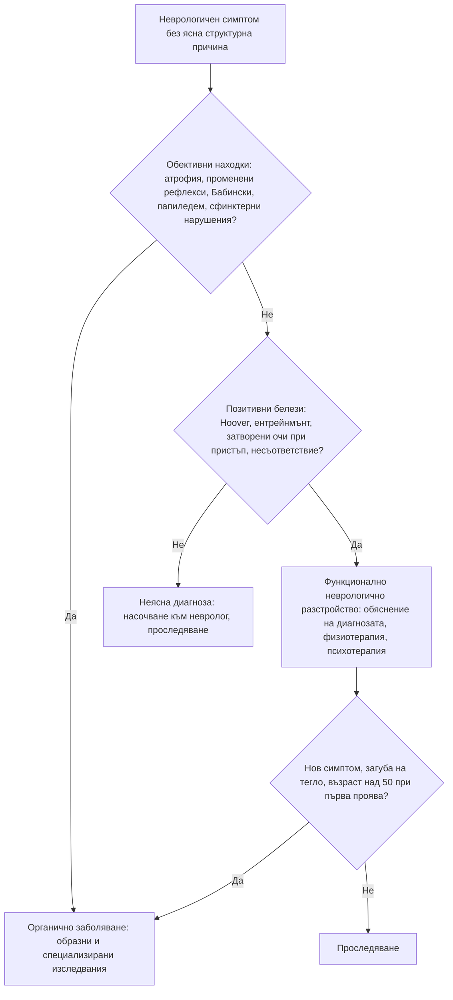

# Глава 76. Функционални симптоми и употреба на психоактивни вещества

> **Част XV. Психични симптоми**

## Цели на главата

- Да се поставя диагнозата **функционално разстройство** въз основа на **позитивни клинични белези**, а не само чрез изключване.
- Да се разграничават соматичното симптомно разстройство, тревожността за здравето, **изкуственото (фактитивно) разстройство** и **симулацията**.
- Да се избягва „диагностичното засенчване“ — пропускане на соматично заболяване при пациент с психиатрична диагноза.
- Да се разпознават **интоксикацията и абстиненцията** при основните психоактивни вещества.
- Да се разпознават соматичните усложнения на употребата на вещества, които имитират други заболявания.

---

## 1. Функционални соматични симптоми

### 1.1. Общи положения

- Функционалните симптоми са **реални** и **не са симулирани**. Те се дължат на **нарушена функция** на нервната система, а не на структурно увреждане.
- Засягат **до една трета** от пациентите в общата практика и в специализираните кабинети.
- **Често съжителстват** със соматични заболявания (например функционални гърчове при епилепсия).
- **Функционалните синдроми** в различните специалности се припокриват:
  - **синдром на раздразненото черво** и функционална диспепсия (гастроентерология);
  - **фибромиалгия** (ревматология);
  - **синдром на хроничната умора** (миалгичен енцефаломиелит);
  - **функционална болка в гърдите** (кардиология);
  - **функционални неврологични разстройства** (неврология);
  - **хронична тазова болка**, **синдром на болезнения пикочен мехур**;
  - **индуцирана обструкция на ларинкса** (дисфункция на гласните гънки), **дисфункционално дишане**;
  - **персистиращо постурално-перцептивно замайване** (вж. глава 41).

### 1.2. Функционални неврологични разстройства — позитивни белези

| Симптом | Позитивни белези |
|---|---|
| **Функционална слабост** | **Белег на Hoover** — при флексия на здравия крак в тазобедрената става „слабият“ крак се екстендира с нормална сила; **„поддаваща“ слабост** (give-way); **отклонение без пронация** при пробата на Barré; **несъответствие** между прегледа и ежедневната активност (например може да ходи, но при прегледа няма движение в леглото); **влачене** на крака, а не циркумдукция |
| **Функционален тремор** | **Ентрейнмънт** — треморът приема ритъма на ритмично движение с другата ръка; **разсейване** — изчезва при разсейване; вариабилна честота и амплитуда; внезапно начало и спонтанни ремисии |
| **Функционални (дисоциативни) гърчове** | **Затворени очи** по време на пристъпа (при епилептичните — обикновено отворени); **съпротива при отваряне** на клепачите; **продължителност над 2 минути**; **странично поклащане** на главата, **тазови тласъци**, **асинхронни** движения; **флуктуиращ ход**; **спомен** за пристъпа; **плач** след пристъпа; **пристъпи в присъствието на свидетели**, в кабинета; **липса на постиктално объркване** |
| **Функционални нарушения на походката** | **Много бавна** походка, **„ходене по лед“**, **колебливост**, **внезапно подгъване на коленете** без падане, **астазия-абазия** |
| **Функционални нарушения на сетивността** | Граница на **средната линия**, **загуба на вибрационния усет** само на половината от челото или гръдната кост, липса на съответствие с дерматомите |
| **Функционални нарушения на зрението** | **Тубуларно** (цилиндрично) зрително поле, което не се разширява с разстоянието |

**Видео записът** от свидетел на пристъпа е безценен. **Видео-ЕЕГ мониторирането** е златният стандарт при гърчове.

### 1.3. Разграничаване на свързаните състояния

| Състояние | Съзнателно ли се произвеждат симптомите? | Мотивация | Особености |
|---|---|---|---|
| **Функционално разстройство** | **Не** | Няма | Позитивни клинични белези |
| **Соматично симптомно разстройство** | **Не** | Няма | **Прекомерни мисли, чувства и поведение**, свързани със симптомите; висока тревожност; много време и енергия, посветени на здравето |
| **Тревожност за здравето** (хипохондрия) | Не | Няма | **Убеждение за сериозна болест** при **малко или никакви** симптоми; проверки, търсене в интернет, повтарящи се изследвания или избягване на лекари |
| **Телесно дисморфично разстройство** | Не | Няма | Загриженост за **въображаем** или **незначителен** дефект във външния вид |
| **Изкуствено (фактитивно) разстройство** (синдром на Münchausen) | **Да** | **Вътрешна** — ролята на болен | **Медицински персонал**; **много хоспитализации**, **различни болници**; **драматична, но неясна** анамнеза; **необичайни находки** (самоинжектиране на инсулин — ниско C-пептидно ниво; бактерии от кал в хемокултурите; заличаване на рани); **съгласие за инвазивни процедури** |
| **Изкуствено разстройство, наложено на друг** (Münchausen by proxy) | **Да** — от родителя | Вътрешна | Симптомите при детето се появяват **само в присъствието на родителя**; **форма на насилие над дете** |
| **Симулация** | **Да** | **Външна** — пари, обезщетение, отпуск, лекарства, избягване на наказание | Юридически контекст, несъответствие, отказ от сътрудничество |

### 1.4. Капани: функционален или соматичен?

**Заболявания, които често се приемат за функционални в началото:**

- **множествена склероза** (преходни сетивни симптоми, умора);
- **миастения гравис** (флуктуираща слабост);
- **синдром на Guillain-Barré** в ранния стадий (изтръпване с нормален преглед);
- **синдром на скования човек**;
- **дистонии** (особено цервикална и пароксизмални);
- **фронтален епилептичен пристъп** (странни хиперкинетични движения от съня);
- **остра интермитентна порфирия**;
- **хипертиреоидизъм**, **Адисонова болест**;
- **системен лупус еритематодес**, **васкулити**;
- **спинална компресия**, **субдурален хематом**;
- **цьолиакия**, **възпалителни заболявания на червата**;
- **миокардна исхемия при жени** и **микросъдова стенокардия**;
- **дефицит на витамин B12** (включително от **азотен оксид**).

**Диагностично засенчване:** при пациент с психиатрична диагноза, интелектуален дефицит или зависимост новите симптоми се приписват на основното състояние и **соматичното заболяване се пропуска**. Тези пациенти имат **значително по-висока смъртност** от сърдечно-съдови и дихателни заболявания.

**Червени флагове при предполагаема функционална причина:** **обективни находки** (атрофия, фасцикулации, промени в рефлексите, екстензорен плантарен отговор, папиледем), **загуба на тегло**, **треска**, **нов симптом** при пациент с известно функционално разстройство, **възраст над 50 години** при първа проява, **отклонения в изследванията**.

---

## 2. Употреба на психоактивни вещества

### 2.1. Алкохол

**Скрининг:** **AUDIT-C** (3 въпроса) или пълен **AUDIT**; **CAGE** (Cut down, Annoyed, Guilty, Eye-opener) — ≥ 2 положителни отговора са значими.

**Лабораторни маркери:**

- **ГГТ** (повишена при около 60%);
- **MCV** (макроцитоза);
- **CDT** (карбохидрат-дефицитен трансферин) — по-специфичен;
- **АСАТ/АЛАТ над 2** (алкохолна чернодробна болест);
- **триглицериди**, **пикочна киселина**;
- **тромбоцитопения**.

**Клинични признаци на хронична злоупотреба:** **лицева телеангиектазия**, **ринофима**, **паротидна хипертрофия**, **палмарен еритем**, **контрактура на Dupuytren**, **гинекомастия**, **тремор**, **травми** с различна давност, **хипертония**, **предсърдно мъждене** („празнично сърце“), **периферна невропатия**, **церебеларна атаксия**.

**Алкохолна абстиненция — времева последователност:**

| Време след последната доза | Прояви |
|---|---|
| **6–24 часа** | **Тремор**, изпотяване, тахикардия, хипертония, тревожност, безсъние, гадене |
| **12–48 часа** | **Абстинентни гърчове** (генерализирани, често единичен пристъп) |
| **12–48 часа** | **Алкохолна халюциноза** (слухови или зрителни халюцинации при **ясно** съзнание) |
| **48–96 часа** | **Делириум тременс** — **делир**, **тежка вегетативна нестабилност**, **треска**, зрителни халюцинации (често дребни животни), смъртност **до 5%** |

**Тежестта** се оценява със **скалата CIWA-Ar**.

**Енцефалопатия на Wernicke** — **объркване**, **атаксия**, **офталмоплегия и нистагъм** (**пълната триада при под 20%**). При всеки пациент с хроничен алкохолизъм, недохранване или многократно повръщане и **някое** от тези оплаквания — **тиамин i.v. преди глюкоза**. Нелекувана води до **синдром на Korsakoff** (тежка антероградна амнезия, конфабулации).

**Метанол** (вж. глава 79) — **ракия от неизвестен произход**; **зрителни нарушения** („снежна буря“), тежка **метаболитна ацидоза с висока анионна разлика**.

### 2.2. Интоксикация и абстиненция при други вещества

| Вещество | Интоксикация | Абстиненция |
|---|---|---|
| **Опиоиди** (хероин, метадон, трамадол, фентанил) | **Миоза**, **дихателна депресия**, **понижено съзнание**, брадикардия; белодробен оток | **Мидриаза**, **прозяване**, **сълзене и хрема**, **„гъша кожа“**, **болки в мускулите**, коремни колики, **диария**, тревожност — **неприятна, но рядко опасна** (освен при новородени) |
| **Бензодиазепини** | Сънливост, **атаксия**, дизартрия; дихателна депресия **с алкохол или опиоиди** | **Тревожност, безсъние**, тремор, **гърчове**, **делир** — **опасна**, може да продължи седмици |
| **Канабис** | Еуфория, **зачервени конюнктиви**, тахикардия, повишен апетит, **тревожност, параноя, психоза** (високопотентни продукти) | Раздразнителност, безсъние, намален апетит; **канабиноиден хиперемезисен синдром** при хронична употреба — вж. по-долу |
| **Синтетични канабиноиди** („спайс“) | **Тежка възбуда**, **психоза**, **гърчове**, **тахикардия**, **остро бъбречно увреждане**, **инсулт**, **миокарден инфаркт** — **не се откриват** в стандартните тестове | |
| **Стимуланти** (кокаин, амфетамини, **метамфетамин**, **MDMA**, катинони) | **Мидриаза**, **тахикардия**, **хипертония**, **хипертермия**, **възбуда**, **параноя**, **гърчове**, **миокарден инфаркт** (кокаин — **болка в гърдите при млад човек**), **аортна дисекация**, **инсулт**; MDMA — **хипонатриемия** | **„Срив“** — **изтощение, хиперсомния**, повишен апетит, **депресия**, **суицидни мисли** |
| **GHB и GBL** | **Внезапна** дълбока кома с **бързо** събуждане, брадикардия, повръщане | Тежка, подобна на алкохолната, делир |
| **Азотен оксид** („веселящ газ“, балони) | Кратка еуфория, замайване | Хронична употреба — **функционален дефицит на витамин B12**: **миелопатия** (подостра комбинирана дегенерация), **невропатия**, **атаксия**, **анемия**; **тромбози** |
| **Халюциногени** (LSD, псилоцибин) | Зрителни илюзии и халюцинации, **мидриаза**, тревожност („лошо пътуване“) | Персистиращо разстройство на възприятието (флашбекове) |
| **Кетамин** | Дисоциация, халюцинации, нистагъм | Хронично — **кетаминов цистит** (тежки уринарни симптоми, свит пикочен мехур) |
| **Никотин** | | Раздразнителност, тревожност, повишен апетит, безсъние |

### 2.3. Соматични усложнения, които имитират други заболявания

| Картина | Вещество | Капан |
|---|---|---|
| **Повтарящо се тежко повръщане**, което се облекчава от **горещи душове** | **Канабис** (хронична ежедневна употреба) — **канабиноиден хиперемезисен синдром** | Многократни ендоскопии и КТ; пациентът не свързва симптомите с канабиса |
| **Болка в гърдите при млад човек** | **Кокаин** | Миокарден инфаркт, аортна дисекация; **бета-блокерите са противопоказани** при остра интоксикация |
| **Подостра миелопатия** — изтръпване, атаксия, нестабилна походка | **Азотен оксид** | Приема се за функционално разстройство или множествена склероза; **B12 може да е нормален** — изследват се **хомоцистеин** и **метилмалонова киселина** |
| **Уринарни симптоми, хематурия** | **Кетамин** | Приема се за инфекция на пикочните пътища |
| **Треска и шум на сърцето** | **Интравенозна употреба** | **Инфекциозен ендокардит** (трикуспидален — септични белодробни емболии) |
| **Кожни абсцеси, некротизиращ фасциит**, **ботулизъм на рани** | Интравенозна или подкожна употреба | |
| **Хипонатриемия и гърчове** | **MDMA** | |
| **Рабдомиолиза и остро бъбречно увреждане** | Стимуланти, опиоиди (продължително лежане), синтетични канабиноиди | |
| **Хепатит, HIV** | Интравенозна употреба | |
| **Психоза** | Стимуланти, канабис, синтетични вещества | Приема се за шизофрения |

### 2.4. Търсене на лекарства

**Белези:** **„изгубени“ рецепти**, искане на **конкретно лекарство по име**, **„алергия“ към алтернативите**, **много лекари** и аптеки, **ранни** искания за нова рецепта, **несъответствие** между оплакванията и находката, **натиск** или **ласкателство**. **Най-често търсени:** **опиоиди** (трамадол, кодеин), **бензодиазепини**, **прегабалин**, **габапентин**, **Z-хипнотици**, **метилфенидат**.

---

## 3. Безопасна диагностична стратегия

| Въпрос | Отговор |
|---|---|
| **Вероятна диагноза** | Функционални соматични симптоми, синдром на раздразненото черво, фибромиалгия, тревожност за здравето, злоупотреба с алкохол |
| **Сериозни заболявания, които не бива да се пропускат** | **Соматично заболяване**, прието за функционално (множествена склероза, миастения, Guillain-Barré, порфирия, спинална компресия); **делириум тременс**; **енцефалопатия на Wernicke**; **абстиненция от бензодиазепини**; **опиоидно предозиране**; **усложнения от кокаин** (миокарден инфаркт, дисекация); **ендокардит** при интравенозна употреба; **отравяне с метанол**; **суициден риск**; **изкуствено разстройство, наложено на дете** |
| **Чести капани** | Функционална диагноза само чрез изключване, без позитивни белези; диагностично засенчване при психиатрични пациенти; скрита злоупотреба с алкохол (тремор, хипертония, повишени ГГТ и MCV); канабиноиден хиперемезисен синдром, неразпознат при многократни хоспитализации; миелопатия от азотен оксид с нормален B12 |
| **Маскиращи заболявания** | Алкохол, лекарства, депресия, тревожност |
| **Психосоциални аспекти** | Травма и насилие в миналото, стрес, социална изолация, бедност, стигма; юридически контекст (симулация) |

---

## 4. Диагностичен алгоритъм при подозрение за функционален неврологичен симптом

---

## 5. Клинични перли

- Функционалното разстройство се диагностицира с позитивни белези (например белег на Hoover), а не само чрез изключване.
- Функционалните и органичните заболявания често съжителстват. Пациентът с функционални гърчове може да има и епилепсия.
- Затворени очи и съпротива при отварянето им по време на пристъп насочват към функционален пристъп.
- Пациентите с тежко психично заболяване умират 10–20 години по-рано, предимно от соматични заболявания. Не позволявайте психиатричната диагноза да засенчи новите симптоми.
- Изкуственото разстройство, наложено на дете, е форма на насилие.
- Тремор, хипертония, повишени ГГТ и MCV: питайте за алкохола.
- Алкохолик с объркване, атаксия или нистагъм: тиамин преди глюкоза.
- Абстиненцията от бензодиазепини и алкохол може да е смъртоносна; абстиненцията от опиоиди рядко е.
- Повтарящо се повръщане, което се облекчава от горещ душ: канабиноиден хиперемезисен синдром.
- Болка в гърдите при млад човек: питайте за кокаин.

---

## 6. Клиничен случай

**Случай.** Мъж на 20 години, студент, се оплаква от изтръпване на пръстите на ръцете и краката от 6 седмици и от несигурна походка от 2 седмици, особено на тъмно. Прегледан е в спешно отделение и е изписан с диагноза „тревожност“, защото КТ на главата е нормална. При прегледа: **отслабен вибрационен и ставно-мускулен усет** в краката, **положителна проба на Romberg**, **липсващи ахилесови рефлекси**, но **екстензорни плантарни отговори** двустранно. На въпрос за употреба на вещества признава, че от няколко месеца всеки уикенд вдишва „по няколко десетки балончета“ с азотен оксид на партита. Хемоглобин 118 g/l, MCV 104 fl, витамин B12 — в долната граница на нормата, **хомоцистеин и метилмалонова киселина — значително повишени**.

**Въпроси.** 1) Коя е диагнозата? 2) Какво е поведението?

**Обсъждане.** Комбинацията от **засягане на задните стълбове** (вибрационен и ставно-мускулен усет, Romberg), **пирамидни белези** (екстензорни плантарни отговори) и **периферна невропатия** (липсващи ахилесови рефлекси) е типична за **подостра комбинирана дегенерация на гръбначния мозък**. Азотният оксид **инактивира витамин B12** (окислява кобалта), затова серумният B12 може да е нормален, а **функционалният дефицит** се доказва с повишените **хомоцистеин** и **метилмалонова киселина**. ЯМР на гръбначния мозък обикновено показва сигнал в задните стълбове на шийния отдел („обърнато V“). Лечението е **спиране на азотния оксид** и **парентерален витамин B12** във високи дози. При ранно лечение възстановяването е добро. Първоначалната диагноза „тревожност“ е пример за функционална диагноза без позитивни белези, при наличие на обективни неврологични находки.

**Поука.** Обективните неврологични находки изключват функционална диагноза. При млад човек с миелопатия или невропатия питайте за азотен оксид и изследвайте хомоцистеин и метилмалонова киселина.
