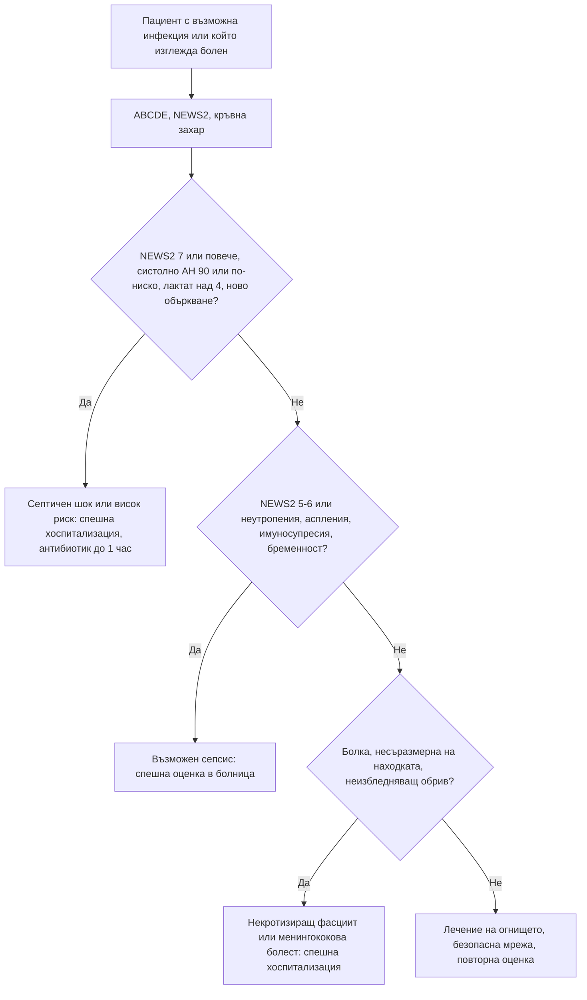

# Глава 77. Сепсис и тежко болният пациент

> **Част XVI. Спешни състояния и инфекции**

## Цели на главата

- Да се разпознава тежко болният пациент чрез систематичен подход (ABCDE) и скали за ранно предупреждение (NEWS2).
- Да се разпознава **сепсисът** рано, включително при пациенти **без треска**.
- Да се търси **огнището** на инфекцията систематично.
- Да се разпознават рисковите групи: възрастни хора, пациенти с неутропения, аспления, имуносупресия, бременни и родилки.
- Да се разпознава **некротизиращият фасциит** по болката, несъразмерна на находката.
- Да се разграничава сепсисът от **състоянията, които го имитират**.

---

## 1. Тежко болният пациент

### 1.1. Подход ABCDE

| Стъпка | Оценка | Тревожни находки |
|---|---|---|
| **A — дихателни пътища** | Говори ли? Звуци (стридор, хъркане, гъргорене) | Обструкция, оток, повръщане |
| **B — дишане** | Дихателна честота, SpO₂, усилие, аускултация | **ДЧ над 24/min** или **под 8/min**, SpO₂ под 92%, цианоза, тих гръден кош |
| **C — циркулация** | Пулс, АН, капилярно пълнене, кожа, диуреза | **Систолно АН под 100 mmHg**, **пулс над 130/min**, капилярно пълнене **над 3 s**, **мраморна кожа**, олигурия |
| **D — неврологичен статус** | **AVPU** или GCS, зеници, **кръвна захар** | **Ново объркване**, понижено съзнание, хипогликемия |
| **E — експозиция** | Температура, кожа (обрив, рани, петехии), корем, крайници | Неизбледняващ обрив, некроза, рана, **хипотермия** |

### 1.2. NEWS2 (National Early Warning Score 2)

| Показател | 3 | 2 | 1 | 0 | 1 | 2 | 3 |
|---|---|---|---|---|---|---|---|
| **Дихателна честота (/min)** | ≤ 8 | | 9–11 | 12–20 | | 21–24 | **≥ 25** |
| **SpO₂ (%)** (скала 1) | ≤ 91 | 92–93 | 94–95 | ≥ 96 | | | |
| **Допълнителен кислород** | | Да | | Не | | | |
| **Систолно АН (mmHg)** | **≤ 90** | 91–100 | 101–110 | 111–219 | | | ≥ 220 |
| **Пулс (/min)** | ≤ 40 | | 41–50 | 51–90 | 91–110 | 111–130 | **≥ 131** |
| **Съзнание** | | | | Буден | | | **Ново объркване, V, P или U** |
| **Температура (°C)** | ≤ 35,0 | | 35,1–36,0 | 36,1–38,0 | 38,1–39,0 | ≥ 39,1 | |

**Интерпретация:**

- **0–4** — нисък риск;
- **3 в един показател** — спешна оценка от лекар;
- **5–6** — **спешна** оценка (възможен сепсис);
- **≥ 7** — **спешна хоспитализация**, реанимационен екип.

**Дихателната честота е най-чувствителният и най-често пропусканият показател** за тежко заболяване.

### 1.3. Усещането „пациентът е болен“

- **Интуицията** на опитния лекар и **тревогата** на близките („не е на себе си“, „никога не е бил така“) са валидни предиктори за сериозно заболяване.
- **Нормалните жизнени показатели в един момент не изключват сепсис.** Решаваща е **динамиката**.

---

## 2. Сепсис

### 2.1. Определения (Sepsis-3)

- **Сепсис** — **животозастрашаваща органна дисфункция**, причинена от **дисрегулиран отговор** на организма към инфекция (повишаване на скалата SOFA с ≥ 2 точки).
- **Септичен шок** — сепсис с **хипотония, изискваща вазопресори** за средно АН ≥ 65 mmHg, и **лактат над 2 mmol/l** въпреки адекватна инфузия. Смъртност **над 40%**.
- **qSOFA** (извън болница): **ДЧ ≥ 22/min**, **променено съзнание**, **систолно АН ≤ 100 mmHg**. **≥ 2 точки** означават висок риск от неблагоприятен изход. **qSOFA е специфичен, но нечувствителен** — **не се използва за изключване** на сепсис.

### 2.2. Ранни и атипични белези

- **Треска** или **хипотермия** (под 36 °C — **по-лоша прогноза**).
- **Тахипнея** — често **първият** белег (метаболитна ацидоза, дихателна недостатъчност).
- **Тахикардия**, **хипотония**.
- **Ново объркване** или **сънливост** — особено при **възрастни**.
- **Мраморна кожа**, **студени крайници**, удължено капилярно пълнене; в началото кожата може да е **топла и зачервена**.
- **Олигурия** (липса на уриниране за 12–18 часа).
- **Силно общо неразположение**, „**никога не съм се чувствал така**“, **силни мускулни болки**.
- **Гадене, повръщане, диария** — често при **стрептококов** и **стафилококов** токсичен шок.

### 2.3. Рискови групи

| Група | Особености |
|---|---|
| **Възрастни и немощни** | **Без треска**, **объркване**, **падане**, **„отказване“**, **хипотермия** |
| **Неутропения** (химиотерапия, **метамизол**, **клозапин**, карбимазол) | **Треска над 38 °C** при **неутрофили под 0,5 × 10⁹/l** — **антибиотик до 1 час**; локални белези на възпаление **липсват** |
| **Аспления** (спленектомия, сърповидно-клетъчна анемия) | **Фулминантна** пневмококова, менингококова, *Capnocytophaga* (**ухапване от куче**) инфекция |
| **Имуносупресия** | Кортикостероиди, биологични средства, трансплантация, HIV — атипични причинители, притъпени симптоми |
| **Бременни и родилки** | **Ендометрит**, **септичен аборт**, **мастит**, **пиелонефрит**, **стрептококи група A**; физиологичната тахикардия маскира |
| **Интравенозна употреба на наркотици** | **Ендокардит**, абсцеси, некротизиращ фасциит |
| **Скорошна операция или инвазивна процедура** | Инфекция на раната, анастомозен теч, **централен венозен катетър** |
| **Диабет, цироза, алкохолизъм, бъбречна недостатъчност** | По-тежко протичане; **спонтанен бактериален перитонит** при асцит |
| **Кърмачета и малки деца** | Вж. глави 68 и 69 |

---

## 3. Търсене на огнището

| Огнище | Честота | Насочващи белези | Особени причини |
|---|---|---|---|
| **Дихателни пътища** | **Най-често** (около 40%) | Кашлица, задух, крепитации, **тахипнея**, хипоксемия | Пневмококи, *Legionella* (**климатици, хотели**, хипонатриемия, диария), грип, **ку-треска** |
| **Пикочни пътища** | Често | Дизурия, болка в слабините; **при възрастни — само объркване** | **Обструктивен пиелонефрит** (камък) — **спешна декомпресия** |
| **Корем** | Често | Болка, перитонеални белези, иктер | **Холангит** (триада на Charcot: треска, иктер, болка), **перфорация**, **абсцес**, **спонтанен бактериален перитонит**, **исхемия на червата** |
| **Кожа и меки тъкани** | Често | Целулит, **рани**, язви, **декубитуси** | **Некротизиращ фасциит**, **гангрена на Fournier**, **газова гангрена** |
| **Централна нервна система** | По-рядко | Главоболие, вратна ригидност, объркване, гърчове | **Менингит**, **енцефалит**, мозъчен абсцес |
| **Сърце** | По-рядко | **Нов шум**, емболични явления, изкуствени клапи, **интравенозна употреба** | **Инфекциозен ендокардит** |
| **Кости и стави** | По-рядко | Болезнена става, болки в гърба | **Септичен артрит**, **спондилодисцит**, **епидурален абсцес** |
| **Устройства** | | Централен катетър, пейсмейкър, ставни протези, уретрален катетър | |
| **Гинекологично** | | След раждане, аборт, **тампон** | **Токсичен шок**, ендометрит, тубоовариален абсцес |
| **Без явно огнище** | До 30% | | **Ендокардит**, **абсцеси** (черен дроб, простата, **псоас**), **менингококемия**, **токсичен шок**, **рикетсиози**, **лептоспироза**, **Кримска-Конго хеморагична треска**, **малария** след пътуване |

### 3.1. Инфекции, специфични за България

- **Марсилска треска** (*Rickettsia conorii*) — **злокачествена форма** при възрастни, диабетици, алкохолици, **Г6ФД дефицит**: сепсис, ДИК, бъбречна недостатъчност. Търсете **„tache noire“**.
- **Лептоспироза** — **работа с вода, животни, гризачи**, наводнения; треска, **миалгии (прасци)**, **конюнктивална суфузия**, **иктер**, **остро бъбречно увреждане**, **белодробни кръвоизливи** (болест на Weil).
- **Кримска-Конго хеморагична треска** — **ухапване от кърлеж** или контакт с кръв на животни (**Кърджали, Хасково, Бургас, Стара Загора**, пролет–лято); треска, **тромбоцитопения**, **левкопения**, повишени трансаминази, **кръвоизливи** — **изолация и защита на персонала**.
- **Хантавирусна треска с бъбречен синдром** — контакт с **гризачи** (гори, вили, складове); треска, **остро бъбречно увреждане**, тромбоцитопения, **миопия**.
- **Туларемия**, **антракс** (кожна форма — безболезнена черна язва с оток), **бруцелоза**.

---

## 4. Некротизиращ фасциит

**Белези:**

- **болка, несъразмерна** на видимата находка (най-ранният и най-важният белег);
- **бързо разпространение** на еритема и оток (часове) — **маркирайте границите**;
- **оток извън границите** на зачервяването, **„дървена“ твърдост** на тъканите;
- **мехури** (**хеморагични**), **сивкаво-лилава** кожа, **некроза**, **крепитации** (газ);
- **хипестезия** на кожата над засегнатата зона (увреждане на нервите);
- **системна токсичност** — тахикардия, хипотония, **объркване**, **несъответствие между тежкото общо състояние и скромната кожна находка**.

**Рискови фактори:** **диабет**, **интравенозна употреба на наркотици**, **варицела** при деца, **НСПВС** (маскират), имуносупресия, затлъстяване, **малки травми**, **операции**. **Гангрена на Fournier** — перинеум и скротум при диабетици.

**Скалата LRINEC** (CRP, левкоцити, хемоглобин, натрий, креатинин, глюкоза) **не е достатъчно чувствителна** за изключване. **Решението е клинично. Лечението е спешна хирургична ревизия.**

---

## 5. Състояния, които имитират сепсис

| Състояние | Насочващи белези |
|---|---|
| **Белодробна емболия** | Внезапен задух, плеврална болка, хипоксемия, рискови фактори |
| **Миокарден инфаркт, кардиогенен шок** | Болка в гърдите, ЕКГ, тропонин, **белодробен застой** |
| **Остър панкреатит** | Епигастрална болка към гърба, липаза |
| **Надбъбречна криза** | Хипотония, **хипонатриемия, хиперкалиемия**, хипогликемия, **кортикостероиди** в анамнезата |
| **Тиреотоксична криза** | Треска, тахикардия, предсърдно мъждене, възбуда, гуша |
| **Диабетна кетоацидоза** | Хипергликемия, кетони, дишане на Kussmaul (**може да е отключена от инфекция**) |
| **Анафилаксия** | Експозиция, уртикария, бронхоспазъм |
| **Лекарствени синдроми** | **Малигнен невролептичен синдром**, **серотонинов синдром**, **DRESS**, **салицилатно отравяне**, **антихолинергична интоксикация** (вж. глави 75 и 79) |
| **Топлинен удар** | Експозиция на топлина, **суха кожа**, температура над 40 °C, объркване |
| **Тромботични микроангиопатии** (ТТП, ХУС) | **Тромбоцитопения**, **хемолиза** (шистоцити), бъбречно увреждане, неврологични симптоми |
| **Хемофагоцитна лимфохистиоцитоза** | Персистираща треска, **цитопении**, **много висок феритин**, хепатоспленомегалия |
| **Остра надбъбречна, чернодробна недостатъчност** | |
| **Алкохолна абстиненция** | Треска, тахикардия, тремор, делир |
| **Трансфузионна реакция** | По време или след кръвопреливане |
| **Васкулити, системен лупус** | Мултиорганно засягане, обриви |
| **Злокачествени заболявания** | Туморна треска, **синдром на туморния разпад** |

**Много от тези състояния могат да съществуват едновременно с инфекция.** При съмнение се започва лечение за сепсис, докато търсенето продължава.

---

## 6. Изследвания

- **Лактат** (над 2 mmol/l — хипоперфузия; **над 4 mmol/l** — висок риск).
- **Хемокултури** (две двойки) **преди антибиотика**, ако това **не го забавя**.
- **ПКК** (левкоцитоза или **левкопения**, **тромбоцитопения**), **CRP**, **прокалцитонин**.
- **Креатинин, урея, електролити**, **билирубин**, **чернодробни ензими**, **глюкоза**.
- **Коагулация** (ДИК), **газов анализ**.
- **Урина**, **посявки** от предполагаемото огнище, **рентгенография** на гръдния кош.
- **Образни изследвания** на огнището (ехография, КТ).

---

## 7. Поведение в общата практика и в спешна помощ

- **Разпознайте** сепсиса — NEWS2 ≥ 5, qSOFA ≥ 2 или клинично подозрение.
- **Спешна хоспитализация.** **Антибиотик до 1 час** при септичен шок или висок риск.
- В общата практика **парентерален антибиотик** се прилага преди транспорта **при подозрение за менингококова болест** и когато **транспортът ще се забави значително**.
- **Кислород**, **венозен достъп и инфузия**, ако са възможни.
- **Съобщете** на приемащия екип находките и NEWS2.

---

## 8. Безопасна диагностична стратегия

| Въпрос | Отговор |
|---|---|
| **Вероятна диагноза** | Пневмония, инфекция на пикочните пътища, целулит, интраабдоминална инфекция |
| **Сериозни заболявания, които не бива да се пропускат** | **Септичен шок**; **менингококова болест**; **некротизиращ фасциит**; **токсичен шок**; **неутропеничен сепсис**; **сепсис при аспления**; **обструктивен пиелонефрит**; **холангит**; **ендокардит**; **епидурален абсцес**; **КХТ и лептоспироза**; **малария** след пътуване |
| **Чести капани** | Липса на треска при възрастни и имуносупресирани; неизмерена дихателна честота; нормално АН в началото при компенсиран шок (особено при млади и бременни); бета-блокерите маскират тахикардията; антипиретикът „нормализира“ температурата; НСПВС маскират некротизиращ фасциит; метамизол като причина за агранулоцитоза |
| **Маскиращи заболявания** | Надбъбречна недостатъчност, диабет, лекарства, отравяния, злокачествени заболявания |
| **Психосоциални аспекти** | Самотни възрастни хора, бездомни, зависими; забавено търсене на помощ |

---

## 9. Диагностичен алгоритъм при подозрение за сепсис

---

## 10. Клинични перли

- Измервайте дихателната честота. Тя е най-ранният и най-често пропусканият белег на сепсис.
- Липсата на треска не изключва сепсис, особено при възрастни хора. Хипотермията е лош прогностичен белег.
- Ново объркване при възрастен човек е сепсис, докато не се докаже противното.
- Болка, несъразмерна на находката: некротизиращ фасциит. Маркирайте границите на зачервяването и преоценете след час.
- Треска при пациент на химиотерапия, метамизол, клозапин или карбимазол: изследвайте неутрофилите и не чакайте.
- Треска при пациент без слезка: антибиотик веднага.
- Обструктивният пиелонефрит изисква спешна декомпресия, а не само антибиотик.
- „Никога не съм се чувствал толкова зле“ е червен флаг.
- Треска, тромбоцитопения и повишени трансаминази след ухапване от кърлеж в Югоизточна България: мислете за Кримска-Конго хеморагична треска.

---

## 11. Клиничен случай

**Случай.** Мъж на 56 години с диабет тип 2 се оплаква от силна болка в лявото бедро от 18 часа. Преди 3 дни се е одраскал на ограда в градината. Приел е ибупрофен без ефект. Болката е „непоносима“, но по кожата на бедрото се вижда само **бледо зачервяване** с размери 10 × 8 cm, **оток**, който се простира извън зачервяването, и **силна болезненост при палпация** извън неговите граници. Температура 38,6 °C, пулс 122/min, АН 98/60 mmHg, ДЧ 24/min, объркан е. Кръвна захар 19 mmol/l. Два часа по-късно зачервяването се е разширило с 5 cm и се появяват **хеморагични мехури**.

**Въпроси.** 1) Коя е най-вероятната диагноза? 2) Какво е поведението?

**Обсъждане.** **Болката, несъразмерна на видимата находка**, **отокът и болезнеността извън границите на еритема**, **бързото разпространение**, **хеморагичните мехури** и **системната токсичност** (NEWS2 над 7, хипотония, объркване) при диабетик след малка травма са типични за **некротизиращ фасциит**. Ибупрофенът е притъпил симптомите и забавил търсенето на помощ. Нормалната на вид кожа в началото е честа причина за пропуск, защото инфекцията се разпространява по фасцията под кожата. Пациентът се насочва **спешно** в хирургично отделение за **незабавна хирургична ревизия и некректомия**, широкоспектърни антибиотици (включително **клиндамицин** за потискане на токсините) и интензивно лечение. Всеки час забавяне увеличава смъртността.

**Поука.** Болка, несъразмерна на находката, при системно болен пациент е некротизиращ фасциит, докато хирургът не докаже противното.

<!-- навигация -->

---

[← Глава 76. Функционални симптоми и употреба на психоактивни вещества](76-funktsionalni-veshtestva.md) · [Съдържание](../README.md) · [Глава 78. Шок, анафилаксия и ангиоедем →](78-shok-anafilaksia.md)
