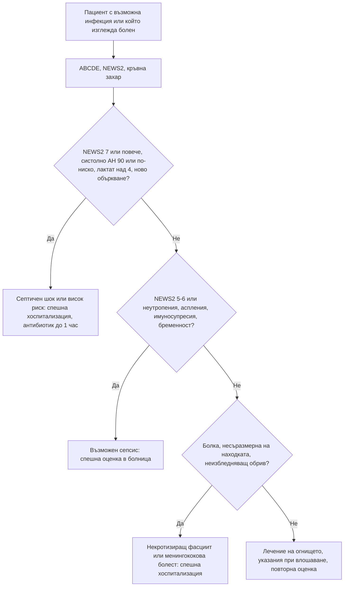

# Глава 77. Сепсис и тежко болният пациент

> **Част XVI. Спешни състояния и инфекции**

## Цели на главата

- Да се разпознава тежко болният пациент чрез систематичен подход (ABCDE) и скали за ранно предупреждение (NEWS2).
- Да се разпознава сепсисът рано, включително при пациенти без треска.
- Да се търси **огнището** на инфекцията систематично.
- Да се разпознават рисковите групи: възрастни хора, пациенти с неутропения, аспления, имуносупресия, бременни и родилки.
- Да се разпознава **некротизиращият фасциит** по болката, несъразмерна на находката.
- Да се разграничава сепсисът от **състоянията, които го имитират**.

## Ключови моменти

- Сепсисът е животозастрашаваща органна дисфункция, причинена от дисрегулиран отговор към инфекция *(SORT C [4])*.
- NEWS2 ≥ 7 означава висок риск, а 5–6 – среден риск. Показател с 3 точки при инфекция е червен флаг *(SORT C [1])*.
- qSOFA не се използва самостоятелно за скрининг или изключване на сепсис *(SORT B [5])*.
- При висок риск широкоспектърният антибиотик се дава до 1 час *(SORT C [1, 5])*.
- Хипотермията при сепсис е свързана с по-висока смъртност *(SORT B [6])*.
- LRINEC и липсата на треска не изключват некротизиращ фасциит. При клинично съмнение е нужна ранна хирургична консултация *(SORT B [10])*.
- Подозрението за неутропеничен сепсис налага незабавно насочване и антибиотик *(SORT C [7])*.

### Първите 60 секунди

- ABCDE: дихателна честота, SpO₂, пулс, АН, съзнание (AVPU), температура – изчислете NEWS2 [2].
- Всеки критерий за висок риск или NEWS2 ≥ 7: 112 и предупреждаване на приемащата болница [1].
- Кислород при ниска сатурация до целеви 94–98% (88–92% при риск от хиперкапнична дихателна недостатъчност) [1].
- Капилярна кръвна захар.
- Неизбледняващ обрив: бензилпеницилин i.m. или i.v., без да се забавя транспортът [12].

---

## 1. Тежко болният пациент

### 1.1. Подход ABCDE

*Таблица 77.1. Тежко болният пациент: подход ABCDE.*

| Стъпка | Оценка | Тревожни находки |
|---|---|---|
| **A – дихателни пътища** | Говори ли? Звуци (стридор, хъркане, гъргорене) | Обструкция, оток, повръщане |
| **B – дишане** | Дихателна честота, SpO₂, усилие, аускултация | ДЧ над 24/min или под 8/min, SpO₂ под 92%, цианоза, тих гръден кош |
| **C – циркулация** | Пулс, АН, капилярно пълнене, кожа, диуреза | Систолно АН под 100 mmHg, пулс над 130/min, капилярно пълнене над 3 s, мраморна кожа, олигурия |
| **D – неврологичен статус** | AVPU или GCS, зеници, кръвна захар | Ново объркване, понижено съзнание, хипогликемия |
| **E – експозиция** | Температура, кожа (обрив, рани, петехии), корем, крайници | Неизбледняващ обрив, некроза, рана, хипотермия |

### 1.2. NEWS2 (National Early Warning Score 2)

*Таблица 77.2. NEWS2 (National Early Warning Score 2).*

| Показател | 3 | 2 | 1 | 0 | 1 | 2 | 3 |
|---|---|---|---|---|---|---|---|
| **Дихателна честота (/min)** | ≤ 8 | | 9–11 | 12–20 | | 21–24 | **≥ 25** |
| **SpO₂ (%)** (скала 1) | ≤ 91 | 92–93 | 94–95 | ≥ 96 | | | |
| **Допълнителен кислород** | | Да | | Не | | | |
| **Систолно АН (mmHg)** | **≤ 90** | 91–100 | 101–110 | 111–219 | | | ≥ 220 |
| **Пулс (/min)** | ≤ 40 | | 41–50 | 51–90 | 91–110 | 111–130 | **≥ 131** |
| **Съзнание** | | | | Буден | | | **Ново объркване, V, P или U** |
| **Температура (°C)** | ≤ 35,0 | | 35,1–36,0 | 36,1–38,0 | 38,1–39,0 | ≥ 39,1 | |

*Източник: Reproduced from: Royal College of Physicians. National Early Warning Score (NEWS) 2: Standardising the assessment of acute-illness severity in the NHS. Updated report of a working party. London: RCP, 2017. Преводът на показателите не е одобрен от Royal College of Physicians; преди клинична употреба сверете с оригинала на английски език („The wording of this translation has not been specifically approved by the Royal College of Physicians – please refer to the English language version before making any clinical use of this information.“).*

**Тълкуване:**

- **0** – много нисък риск, но при инфекция пациентът се преоценява при влошаване или клинична тревога [1];
- **1–4** – нисък риск [2];
- **3 в един показател** – спешна оценка от лекар; при инфекция може да е белег на органна дисфункция [1, 2];
- **5–6** – среден риск, **спешна** оценка (възможен сепсис) [1, 2];
- **≥ 7** – висок риск, **спешна хоспитализация**, реанимационен екип [1, 2].

**Дихателната честота е ранен и често пропускан показател** за тежко заболяване [3].

### 1.3. Усещането „пациентът е болен“

- Интуицията на опитния лекар и тревогата на близките („не е на себе си“, „никога не е бил така“) са валидни предиктори за сериозно заболяване.
- Нормалните жизнени показатели в един момент не изключват сепсис. Решаваща е динамиката.

---

## 2. Сепсис

### 2.1. Определения (Sepsis-3)

- **Сепсис** – животозастрашаваща органна дисфункция, причинена от дисрегулиран отговор на организма към инфекция (повишаване на скалата SOFA с ≥ 2 точки).
- **Септичен шок** – сепсис с хипотония, изискваща вазопресори за средно АН ≥ 65 mmHg, и лактат над 2 mmol/l въпреки адекватна инфузия. Смъртност над 40% [4].
- qSOFA (извън болница): ДЧ ≥ 22/min, променено съзнание, систолно АН ≤ 100 mmHg. ≥ 2 точки означават висок риск от неблагоприятен изход. qSOFA е специфичен, но нечувствителен – не се използва за изключване на сепсис и не се препоръчва като самостоятелен скрининг [5].

### 2.2. Ранни и атипични белези

- Треска или хипотермия (под 36 °C – по-лоша прогноза [6]).
- **Тахипнея** – често **първият** белег (метаболитна ацидоза, дихателна недостатъчност).
- Тахикардия, хипотония.
- Ново объркване или сънливост – особено при възрастни.
- Мраморна кожа, студени крайници, удължено капилярно пълнене; в началото кожата може да е топла и зачервена.
- **Олигурия** – липсата на уриниране за 12–18 часа е критерий за среден риск, а за над 18 часа – за висок риск [1].
- Силно общо неразположение, „никога не съм се чувствал така“, силни мускулни болки.
- **Гадене, повръщане, диария** – често при стрептококов и стафилококов токсичен шок.

### 2.3. Рискови групи

*Таблица 77.3. Сепсис: рискови групи.*

| Група | Особености |
|---|---|
| **Възрастни и немощни** | Без треска, объркване, падане, „отказване“, хипотермия |
| Неутропения (химиотерапия, метамизол, клозапин, карбимазол) | Треска над 38 °C при неутрофили под 0,5 × 10⁹/l – незабавно насочване и антибиотик [7]; локални белези на възпаление липсват |
| **Аспления** (спленектомия, сърповидно-клетъчна анемия) | Фулминантна пневмококова, менингококова, *Capnocytophaga* (ухапване от куче) инфекция [8] |
| **Имуносупресия** | Кортикостероиди, биологични средства, трансплантация, HIV – атипични причинители, притъпени симптоми |
| **Бременни и родилки** | Ендометрит, септичен аборт, мастит, пиелонефрит, стрептококи група A; физиологичната тахикардия маскира |
| **Интравенозна употреба на наркотици** | Ендокардит, абсцеси, некротизиращ фасциит |
| **Скорошна операция или инвазивна процедура** | Инфекция на раната, анастомозен теч, централен венозен катетър |
| **Диабет, цироза, алкохолизъм, бъбречна недостатъчност** | По-тежко протичане; спонтанен бактериален перитонит при асцит |
| **Кърмачета и малки деца** | Вж. глави 68 и 69 |

---

## 3. Търсене на огнището

*Таблица 77.4. Търсене на огнището.*

| Огнище | Честота | Насочващи белези | Особени причини |
|---|---|---|---|
| **Дихателни пътища** | **Най-често** | Кашлица, задух, крепитации, тахипнея, хипоксемия | Пневмококи, *Legionella* (климатици, хотели, хипонатриемия, диария), грип, ку-треска |
| **Пикочни пътища** | Често | Дизурия, болка в слабините; при възрастни – само объркване | Обструктивен пиелонефрит (камък) – спешна декомпресия |
| **Корем** | Често | Болка, перитонеални белези, иктер | Холангит (триада на Charcot: треска, иктер, болка), перфорация, абсцес, спонтанен бактериален перитонит, исхемия на червата |
| **Кожа и меки тъкани** | Често | Целулит, рани, язви, декубитуси | Некротизиращ фасциит, гангрена на Fournier, газова гангрена |
| **Централна нервна система** | По-рядко | Главоболие, вратна ригидност, объркване, гърчове | Менингит, енцефалит, мозъчен абсцес |
| **Сърце** | По-рядко | Нов шум, емболични явления, изкуствени клапи, интравенозна употреба | **Инфекциозен ендокардит** |
| **Кости и стави** | По-рядко | Болезнена става, болки в гърба | Септичен артрит, спондилодисцит, епидурален абсцес |
| **Устройства** | | Централен катетър, пейсмейкър, ставни протези, уретрален катетър | |
| **Гинекологично** | | След раждане, аборт, тампон | Токсичен шок, ендометрит, тубоовариален абсцес |
| **Без явно огнище** | Нерядко | | Ендокардит, абсцеси (черен дроб, простата, псоас), менингококемия, токсичен шок, рикетсиози, лептоспироза, Кримска-Конго хеморагична треска, малария след пътуване |

### 3.1. Инфекции, специфични за България

- Марсилска треска (*Rickettsia conorii*) – злокачествена форма при възрастни, диабетици, алкохолици, Г6ФД дефицит: сепсис, ДВС, бъбречна недостатъчност. Търсете „tache noire“.
- **Лептоспироза** – работа с вода, животни, гризачи, наводнения; треска, миалгии (прасци), конюнктивална суфузия, иктер, остро бъбречно увреждане, белодробни кръвоизливи (болест на Weil).
- **Кримска-Конго хеморагична треска** – ухапване от кърлеж или контакт с кръв на животни (през 2015–2024 г. най-много случаи в областите Кърджали, Благоевград, Хасково и Ямбол, от април до септември); треска, тромбоцитопения, левкопения, повишени трансаминази, коагулопатия и кръвоизливи [9] – изолация и защита на персонала.
- **Хантавирусна треска с бъбречен синдром** – контакт с гризачи (гори, вили, складове); треска, остро бъбречно увреждане, тромбоцитопения, миопия.
- Туларемия, антракс (кожна форма – безболезнена черна язва с оток), бруцелоза.

---

## 4. Некротизиращ фасциит

**Белези:**

- **болка, несъразмерна** на видимата находка (най-ранният и най-важният белег);
- бързо разпространение на еритема и оток (часове) – маркирайте границите;
- оток извън границите на зачервяването, „дървена“ твърдост на тъканите;
- мехури (хеморагични), сивкаво-лилава кожа, некроза, крепитации (газ);
- **хипестезия** на кожата над засегнатата зона (увреждане на нервите);
- **системна токсичност** – тахикардия, хипотония, объркване, несъответствие между тежкото общо състояние и скромната кожна находка.

**Рискови фактори:** диабет, интравенозна употреба на наркотици, варицела при деца, НСПВС (маскират), имуносупресия, затлъстяване, малки травми, операции. Гангрена на Fournier – перинеум и скротум при диабетици.

Скалата LRINEC (CRP, левкоцити, хемоглобин, натрий, креатинин, глюкоза) не е достатъчно чувствителна за изключване: при резултат ≥ 6 чувствителността е около 68%. Липсата на треска или хипотония също не изключва диагнозата [10]. Решението е клинично. Лечението е спешна хирургична ревизия [11].

---

## 5. Състояния, които имитират сепсис

*Таблица 77.5. Състояния, които имитират сепсис.*

| Състояние | Насочващи белези |
|---|---|
| **Белодробна тромбемболия** | Внезапен задух, плеврална болка, хипоксемия, рискови фактори |
| **Миокарден инфаркт, кардиогенен шок** | Болка в гърдите, ЕКГ, тропонин, белодробен застой |
| **Остър панкреатит** | Епигастрална болка към гърба, липаза |
| **Надбъбречна криза** | Хипотония, хипонатриемия, хиперкалиемия, хипогликемия, кортикостероиди в анамнезата |
| **Тиреотоксична криза** | Треска, тахикардия, предсърдно мъждене, възбуда, гуша |
| **Диабетна кетоацидоза** | Хипергликемия, кетони, дишане на Kussmaul (може да е отключена от инфекция) |
| **Анафилаксия** | Експозиция, уртикария, бронхоспазъм |
| **Лекарствени синдроми** | Малигнен невролептичен синдром, серотонинов синдром, DRESS, салицилатно отравяне, антихолинергична интоксикация (вж. глави 75 и 79) |
| **Топлинен удар** | Експозиция на топлина, суха кожа, температура над 40 °C, объркване |
| **Тромботични микроангиопатии** (ТТП, ХУС) | Тромбоцитопения, хемолиза (шистоцити), бъбречно увреждане, неврологични симптоми |
| **Хемофагоцитна лимфохистиоцитоза** | Персистираща треска, цитопении, много висок феритин, хепатоспленомегалия |
| **Остра надбъбречна, чернодробна недостатъчност** | |
| **Алкохолна абстиненция** | Треска, тахикардия, тремор, делир |
| **Трансфузионна реакция** | По време или след кръвопреливане |
| **Васкулити, системен лупус** | Мултиорганно засягане, обриви |
| **Злокачествени заболявания** | Туморна треска, синдром на туморния разпад |

**Много от тези състояния могат да съществуват едновременно с инфекция.** При съмнение се започва лечение за сепсис, докато търсенето продължава.

---

## 6. Изследвания

- Лактат (над 2 mmol/l – хипоперфузия; над 4 mmol/l – висок риск) [5].
- Хемокултури (две двойки) преди антибиотика, ако това не го забавя [5].
- ПКК (левкоцитоза или левкопения, тромбоцитопения), CRP, прокалцитонин.
- Креатинин, урея, електролити, билирубин, чернодробни ензими, глюкоза.
- Коагулация (ДВС), газов анализ.
- Урина, посявки от предполагаемото огнище, рентгенография на гръдния кош.
- **Образни изследвания** на огнището (ехография, КТ).

---

## 7. Поведение в общата практика и в спешна помощ

- **Разпознайте** сепсиса – NEWS2 ≥ 5, qSOFA ≥ 2 или клинично подозрение.
- **Спешна хоспитализация.** **Антибиотик до 1 час** при септичен шок или висок риск [1, 5].
- В общата практика парентерален антибиотик се прилага преди транспорта при подозрение за менингококова болест (бензилпеницилин i.m. или i.v.: под 1 година – 300 mg, 1–9 години – 600 mg, 10 и повече години и възрастни – 1,2 g) [12] и при висок риск, когато транспортът до болница ще отнеме над 1 час [1].
- Кислород, венозен достъп и инфузия, ако са възможни.
- **Съобщете** на приемащия екип находките и NEWS2.

---

## 8. Безопасна диагностична стратегия

*Таблица 77.6. Безопасна диагностична стратегия.*

| Въпрос | Отговор |
|---|---|
| **Вероятна диагноза** | Пневмония, инфекция на пикочните пътища, целулит, интраабдоминална инфекция |
| **Сериозни заболявания, които не бива да се пропускат** | Септичен шок; менингококова болест; некротизиращ фасциит; токсичен шок; неутропеничен сепсис; сепсис при аспления; обструктивен пиелонефрит; холангит; ендокардит; епидурален абсцес; КХТ и лептоспироза; малария след пътуване |
| **Чести капани** | Липса на треска при възрастни и имуносупресирани; неизмерена дихателна честота; нормално АН в началото при компенсиран шок (особено при млади и бременни); бета-блокерите маскират тахикардията; антипиретикът „нормализира“ температурата; НСПВС маскират некротизиращ фасциит; метамизол като причина за агранулоцитоза |
| **Маскиращи заболявания** | Надбъбречна недостатъчност, диабет, лекарства, отравяния, злокачествени заболявания |
| **Психосоциални аспекти** | Самотни възрастни хора, бездомни, зависими; забавено търсене на помощ |

---

## 9. Диагностичен алгоритъм при подозрение за сепсис

*Фигура 77.1. Диагностичен алгоритъм при подозрение за сепсис. Схема на авторите въз основа на източниците, цитирани в главата.*

Текстово описание на фигура 77.1

1. Пациент с възможна инфекция или който изглежда болен. Следва: към т. 2.
2. ABCDE, NEWS2, кръвна захар. Следва: към т. 3.
3. **Въпрос:** NEWS2 7 или повече, систолно АН 90 или по-ниско, лактат над 4, ново объркване? Да – към т. 4; Не – към т. 5.
4. Септичен шок или висок риск: спешна хоспитализация, антибиотик до 1 час.
5. **Въпрос:** NEWS2 5-6 или неутропения, аспления, имуносупресия, бременност? Да – към т. 6; Не – към т. 7.
6. Възможен сепсис: спешна оценка в болница.
7. **Въпрос:** Болка, несъразмерна на находката, неизбледняващ обрив? Да – към т. 8; Не – към т. 9.
8. Некротизиращ фасциит или менингококова болест: спешна хоспитализация.
9. Лечение на огнището, указания при влошаване, повторна оценка.

---

## 10. Червени флагове и насочване

### 10.1. Червени флагове

- Дихателна честота ≥ 25/min или нова нужда от кислород.
- Систолно АН ≤ 90 mmHg или с над 40 mmHg под обичайното.
- Пулс над 130/min.
- Ново объркване или понижено съзнание.
- Липса на уриниране за 18 часа.
- Мраморна или пепеляво-сива кожа, цианоза, неизбледняващ обрив.
- Треска при неутропения или аспления.
- Болка, несъразмерна на находката, бързо разпространяващ се еритем, хеморагични мехури.
- Треска с тромбоцитопения след ухапване от кърлеж.

### 10.2. Кога и колко спешно да насочим

*Таблица 77.7. Кога и колко спешно да насочим.*

| Спешност | Клинична ситуация |
|---|---|
| **Незабавно (112 или спешно отделение)** | Критерий за висок риск – ДЧ ≥ 25/min, систолно АН ≤ 90 mmHg, пулс над 130/min, ново объркване, липса на уриниране за 18 часа, мраморна кожа, неизбледняващ обрив – или NEWS2 ≥ 7 [1]; подозрение за неутропеничен сепсис [7]; подозрение за некротизиращ фасциит [10, 11]; подозрение за менингококова болест – бензилпеницилин преди транспорта [12] |
| **В същия ден** | Критерий за среден риск – ДЧ 21–24/min, систолно АН 91–100 mmHg, пулс 91–130/min, липса на уриниране за 12–18 часа, температура под 36 °C – когато диагнозата не е ясна или лечението извън болница не е безопасно [1]; треска при аспления [8]; треска с тромбоцитопения след ухапване от кърлеж – инфекциозна клиника [9] |
| **Проследяване в общата практика** | Нисък риск с ясно огнище – лечение на огнището, указания при влошаване с ясни инструкции за признаците на влошаване и повторна оценка [1] |

---

## 11. Клинични перли

- Измервайте дихателната честота. Тя е най-ранният и най-често пропусканият белег на сепсис.
- Липсата на треска не изключва сепсис, особено при възрастни хора. Хипотермията е лош прогностичен белег.
- Ново объркване при възрастен човек е сепсис до доказване на противното.
- Болка, несъразмерна на находката: некротизиращ фасциит. Маркирайте границите на зачервяването и преоценете след час.
- Треска при пациент на химиотерапия, метамизол, клозапин или карбимазол: изследвайте неутрофилите и не чакайте.
- Треска при пациент без слезка: антибиотик веднага.
- Обструктивният пиелонефрит изисква спешна декомпресия, а не само антибиотик.
- „Никога не съм се чувствал толкова зле“ е червен флаг.
- Треска, тромбоцитопения и повишени трансаминази след ухапване от кърлеж в Южна България: помислете за Кримска-Конго хеморагична треска.

---

## 12. Клиничен случай

**Етап 1 – клинична картина.** Мъж на 56 години с диабет тип 2 се обажда заради силна болка в лявото бедро от 18 часа. Преди 3 дни се е одраскал на ограда в градината. Приел е ибупрофен без ефект. Казва, че болката е „непоносима“.

> **Въпрос 1.** Какво ви тревожи и как ще постъпите?

**Етап 2 – преглед.** По кожата на бедрото се вижда само бледо зачервяване с размери 10 × 8 cm, оток, който се простира извън зачервяването, и силна болезненост извън неговите граници. Температура 38,6 °C, пулс 122/min, АН 98/60 mmHg, ДЧ 24/min, объркан е. Кръвна захар 19 mmol/l. Два часа по-късно зачервяването се е разширило с 5 cm и се появяват хеморагични мехури.

> **Въпрос 2.** Коя е най-вероятната диагноза?

> **Въпрос 3.** Какво е поведението?

Обсъждане и отговори

**Отговор 1.** Непоносимата болка след малка травма при диабетик налага преглед в същия ден. Болката, несъразмерна на находката, е ранен белег на некротизиращ фасциит. Ибупрофенът може да притъпи симптомите.

**Отговор 2.** Болката, несъразмерна на видимата находка, отокът и болезнеността извън границите на еритема, бързото разпространение, хеморагичните мехури и системната токсичност (NEWS2 над 7, хипотония, объркване) са типични за **некротизиращ фасциит**. Хеморагичните мехури са специфичен, но късен белег, а липсата на треска или хипотония не изключва диагнозата [10]. Нормалната на вид кожа в началото е честа причина за пропуск, защото инфекцията се разпространява по фасцията.

**Отговор 3.** Пациентът е с висок риск [1]: 112, предупреждаване на болницата, кислород и венозен достъп. Необходими са **незабавна хирургична ревизия и некректомия**, широкоспектърни антибиотици, включително клиндамицин за потискане на токсините, и интензивно лечение [11]. Всеки час забавяне увеличава смъртността.

**Поука.** Болка, несъразмерна на находката, при системно болен пациент е некротизиращ фасциит, докато хирургът не докаже противното.

---

## Обобщение

- Тежко болният пациент се оценява систематично по ABCDE и с NEWS2. Дихателната честота е ключов показател.
- Сепсисът при възрастни, имуносупресирани и бременни често протича без треска. Хипотермията и новото объркване са тревожни белези.
- Огнището се търси систематично. Некротизиращият фасциит, менингококовата болест и неутропеничният сепсис изискват незабавно действие.
- При висок риск пациентът се насочва спешно, а антибиотикът се дава до 1 час. Много състояния имитират сепсис или съжителстват с него.

## Самопроверка

### Въпроси с един верен отговор

**1.** *(основно ниво)* Жена на 84 години от дом за възрастни хора е по-объркана от сутринта. Температурата е 36,2 °C, ДЧ 26/min, пулс 112/min, АН 92/54 mmHg, SpO₂ 94%. Кое е вярно?

- **А.** Липсата на треска изключва сепсис
- **Б.** Картината отговаря на висок риск от сепсис и налага спешно насочване
- **В.** Объркването се дължи на деменция и може да се проследи
- **Г.** Достатъчно е изследване на урината и контрол след 2 дни
- **Д.** Необходимо е само парацетамол

Отговор и обосновка

**Верен отговор: Б.** Дихателната честота ≥ 25/min и новото объркване са критерии за висок риск, а систолното АН 92 mmHg – за среден риск [1]. Сепсисът при възрастни често протича без треска.

**2.** *(основно ниво)* Мъж на 60 години с пневмония има ДЧ 20/min, систолно АН 118 mmHg и ясно съзнание (qSOFA 0), но пулсът е 124/min, SpO₂ 91% на въздух, температурата е 39,3 °C и NEWS2 е 7. Кое е вярно?

- **А.** qSOFA 0 изключва сепсис
- **Б.** qSOFA не изключва сепсис; NEWS2 ≥ 7 означава висок риск
- **В.** Пациентът може да се лекува вкъщи
- **Г.** NEWS2 не се използва при пневмония
- **Д.** Нужен е само рентгенов контрол след седмица

Отговор и обосновка

**Верен отговор: Б.** qSOFA не се препоръчва като самостоятелен скрининг [5]. NEWS2 ≥ 7 означава висок риск от тежко заболяване или смърт [1].

**3.** *(основно ниво)* Жена на 52 години е на 10-ия ден след химиотерапия за карцином на гърдата. Температурата е 38,4 °C, чувства се отпаднала, няма локални оплаквания. Кое е правилното поведение?

- **А.** Парацетамол и контрол след 2 дни
- **Б.** Незабавно насочване за оценка и антибиотик
- **В.** Изследване на урината и изчакване на резултата
- **Г.** Перорален антибиотик и контрол след седмица
- **Д.** Хемокултура и изчакване на резултата

Отговор и обосновка

**Верен отговор: Б.** Подозрението за неутропеничен сепсис е спешно състояние – антибиотик веднага и незабавно насочване [7]. Локалните белези на възпаление често липсват.

**4.** *(напреднало ниво)* Мъж на 45 години с диабет има силна болка в подбедрицата, несъразмерна на лекото зачервяване. Температурата е нормална, LRINEC е 4. Кое е вярно?

- **А.** Нормалната температура изключва некротизиращ фасциит
- **Б.** LRINEC под 6 изключва некротизиращ фасциит
- **В.** При клинично съмнение е нужна спешна хирургична консултация
- **Г.** Достатъчна е рентгенография
- **Д.** Необходимо е само НСПВС

Отговор и обосновка

**Верен отговор: В.** LRINEC има ниска чувствителност, а липсата на треска не изключва диагнозата [10]. Решението е клинично, а лечението – хирургично [11].

**5.** *(основно ниво)* Мъж на 40 години със спленектомия след травма е ухапан от куче преди 2 дни. Сега има треска, мраморна кожа и хипотония. Кой причинител трябва да се има предвид?

- **А.** *Clostridium tetani*
- **Б.** *Capnocytophaga canimorsus*
- **В.** *Bartonella henselae*
- **Г.** *Borrelia burgdorferi*
- **Д.** *Rickettsia conorii*

Отговор и обосновка

**Верен отговор: Б.** При аспления *Capnocytophaga* след ухапване от куче причинява фулминантен сепсис. Антибиотикът се дава веднага [8].

### Задача

Вие сте общопрактикуващ лекар в планинско село. Жена на 67 години има пиелонефрит, ДЧ 26/min, пулс 134/min и систолно АН 88 mmHg. Линейката ще пристигне след 50 минути, а пътят до болницата е още 40 минути. Как ще постъпите?

Решение

Пациентката отговаря на критериите за висок риск [1]. Обаждате се на 112 и предупреждавате болницата. Тъй като транспортът ще отнеме над 1 час, при възможност давате парентерален широкоспектърен антибиотик преди транспорта [1]. Осигурявате кислород до целеви 94–98% и венозен достъп с инфузия, ако е възможно. Предавате на екипа находките, NEWS2 и часа на антибиотика.

### OSCE станция: Оценка на тежко болен пациент в дома

**Време:** 8 минути. **Ниво:** основно (студенти, специализанти).

**Задача за кандидата.** Викат ви в дома на мъж на 74 години с кашлица и треска от 3 дни. Съпругата му казва, че „не е на себе си“. Оценете пациента и предприемете действия.

**Информация за симулирания пациент (за изпитващия).** ДЧ 28/min, SpO₂ 90% на въздух, пулс 118/min, АН 94/58 mmHg, реагира на глас, температура 38,9 °C. Не е уринирал от вчера сутринта.

*Таблица 77.8. OSCE станция „Оценка на тежко болен пациент в дома“ – критерии за оценяване.*

| Критерий | Точки |
|---|---|
| Прилага подхода ABCDE | 2 |
| Измерва и изчислява NEWS2 и разпознава високия риск [1, 2] | 2 |
| Пита за уринирането и търси мраморна кожа и обрив | 1 |
| Обажда се на 112 и предупреждава болницата | 2 |
| Дава кислород до целева сатурация | 1 |
| Предава информацията структурирано (находки, NEWS2, лечение) | 1 |
| Обяснява на съпругата какво се случва | 1 |
| **Общо** | **10** |

**Праг за успешно изпълнение:** 7 от 10 точки, включително разпознаването на високия риск и спешното насочване.

## Литература

1. National Institute for Health and Care Excellence. Suspected sepsis in people aged 16 or over: recognition, assessment and early management (NICE guideline NG253). London: NICE; 2025 [актуализирано 2026]. Достъпно на: https://www.nice.org.uk/guidance/ng253
2. Royal College of Physicians. National Early Warning Score (NEWS) 2: Standardising the assessment of acute-illness severity in the NHS. Updated report of a working party. London: RCP; 2017.
3. Cretikos MA, Bellomo R, Hillman K, Chen J, Finfer S, Flabouris A. Respiratory rate: the neglected vital sign. Med J Aust. 2008;188(11):657-9. doi:10.5694/j.1326-5377.2008.tb01825.x. PMID: 18513176.
4. Singer M, Deutschman CS, Seymour CW, Shankar-Hari M, Annane D, Bauer M, et al. The Third International Consensus Definitions for Sepsis and Septic Shock (Sepsis-3). JAMA. 2016;315(8):801-10. doi:10.1001/jama.2016.0287. PMID: 26903338.
5. Evans L, Rhodes A, Alhazzani W, Antonelli M, Coopersmith CM, French C, et al. Surviving sepsis campaign: international guidelines for management of sepsis and septic shock 2021. Intensive Care Med. 2021;47(11):1181-1247. doi:10.1007/s00134-021-06506-y. PMID: 34599691.
6. Kushimoto S, Gando S, Saitoh D, Mayumi T, Ogura H, Fujishima S, et al. The impact of body temperature abnormalities on the disease severity and outcome in patients with severe sepsis: an analysis from a multicenter, prospective survey of severe sepsis. Crit Care. 2013;17(6):R271. doi:10.1186/cc13106. PMID: 24220071.
7. National Institute for Health and Care Excellence. Neutropenic sepsis: prevention and management in people with cancer (Clinical guideline CG151). London: NICE; 2012. Достъпно на: https://www.nice.org.uk/guidance/cg151
8. Davies JM, Lewis MP, Wimperis J, Rafi I, Ladhani S, Bolton-Maggs PH; British Committee for Standards in Haematology. Review of guidelines for the prevention and treatment of infection in patients with an absent or dysfunctional spleen: prepared on behalf of the British Committee for Standards in Haematology by a working party of the Haemato-Oncology task force. Br J Haematol. 2011;155(3):308-17. doi:10.1111/j.1365-2141.2011.08843.x. PMID: 21988145.
9. Ngoc K, Stoikov I, Trifonova I, Panayotova E, Taseva E, Trifonova I, et al. Molecular and Clinical Characterization of Crimean-Congo Hemorrhagic Fever in Bulgaria, 2015-2024. Pathogens. 2025;14(8):785. doi:10.3390/pathogens14080785. PMID: 40872295.
10. Fernando SM, Tran A, Cheng W, Rochwerg B, Kyeremanteng K, Seely AJE, et al. Necrotizing Soft Tissue Infection: Diagnostic Accuracy of Physical Examination, Imaging, and LRINEC Score: A Systematic Review and Meta-Analysis. Ann Surg. 2019;269(1):58-65. doi:10.1097/SLA.0000000000002774. PMID: 29672405.
11. Stevens DL, Bryant AE. Necrotizing Soft-Tissue Infections. N Engl J Med. 2017;377(23):2253-2265. doi:10.1056/NEJMra1600673. PMID: 29211672.
12. National Institute for Health and Care Excellence. Meningitis (bacterial) and meningococcal disease: recognition, diagnosis and management (NICE guideline NG240). London: NICE; 2024. Достъпно на: https://www.nice.org.uk/guidance/ng240

*Последна проверка на съдържанието: септември 2026 г. Следващ планиран преглед: септември 2027 г. (вж. „Политика за актуализация“ в README).*

<!-- навигация -->

---

[← Глава 76. Функционални симптоми и употреба на психоактивни вещества](76-funktsionalni-veshtestva.md) · [Съдържание](../README.md) · [Глава 78. Шок, анафилаксия и ангиоедем →](78-shok-anafilaksia.md)
