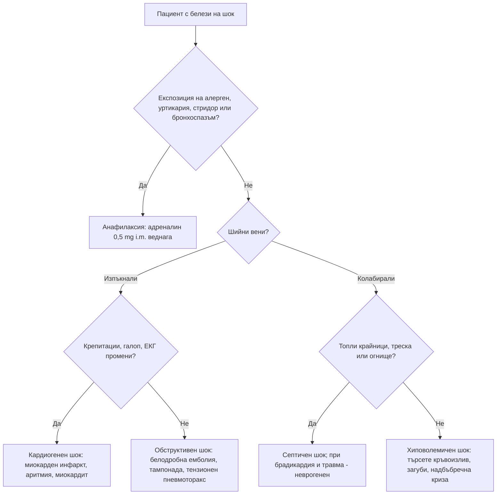

# Глава 78. Шок, анафилаксия и ангиоедем

> **Част XVI. Спешни състояния и инфекции**

## Цели на главата

- Да се разпознава шокът в **компенсирания** стадий, преди да настъпи хипотония.
- Да се разграничават четирите вида шок — **хиповолемичен**, **дистрибутивен**, **кардиогенен** и **обструктивен** — чрез клиничния преглед до леглото.
- Да се разпознава **анафилаксията** по клиничните критерии и да се лекува с **адреналин** без забавяне.
- Да се разграничава анафилаксията от състоянията, които я имитират.
- Да се разграничава **хистаминовият** от **брадикининовия** ангиоедем (АСЕ-инхибитори, наследствен ангиоедем).

---

## 1. Шок

### 1.1. Определение и ранно разпознаване

**Шокът** е **недостатъчна тъканна перфузия** и кислородна доставка. **Хипотонията е късен белег.** Младите хора, бременните и спортистите **компенсират** дълго и се влошават внезапно.

**Ранни белези:**

- **тахикардия** (може да липсва при **бета-блокери**, пейсмейкър, **неврогенен шок**, при възрастни хора);
- **тахипнея**;
- **удължено капилярно пълнене** (над 3 s), **студени, бледи, мраморни крайници** (или топли при ранен дистрибутивен шок);
- **безпокойство, объркване**;
- **олигурия** (под 0,5 ml/kg/h);
- **намалена пулсова амплитуда** (стеснено пулсово налягане);
- **шоков индекс** (пулс / систолно АН) **над 0,9–1,0**;
- **лактат над 2 mmol/l**.

### 1.2. Видове шок

| Вид | Причини | Шийни вени | Кожа | Други находки |
|---|---|---|---|---|
| **Хиповолемичен** | **Кръвоизлив** (травма, **стомашно-чревен**, **руптура на аортна аневризма**, **извънматочна бременност**, ретроперитонеален), **загуби на течности** (повръщане, диария, **диабетна кетоацидоза**, изгаряния, **панкреатит**) | **Колабирали** | **Студена, бледа** | Жажда, олигурия, **ортостатизъм** |
| **Дистрибутивен — септичен** | Инфекция | Колабирали или нормални | **Топла** в началото, после студена | Треска или хипотермия, огнище |
| **Дистрибутивен — анафилактичен** | Алергени | Колабирали | Зачервена, **уртикария**, ангиоедем | Бронхоспазъм, стридор |
| **Дистрибутивен — неврогенен** | **Увреждане на шийния или горния гръден гръбначен мозък** | Колабирали | **Топла, суха** под нивото на увреждането | **Брадикардия** с хипотония, неврологичен дефицит |
| **Дистрибутивен — ендокринен** | **Надбъбречна криза** | Колабирали | | **Хипонатриемия, хиперкалиемия**, хипогликемия, кортикостероиди в анамнезата, **пигментация** |
| **Кардиогенен** | **Миокарден инфаркт**, **аритмии** (брадикардия, тахикардия), **миокардит**, **остра клапна недостатъчност** (руптура на папиларен мускул, **ендокардит**), **кардиомиопатия**, **токсични вещества** (бета-блокери, калциеви антагонисти) | **Изпъкнали** | Студена, влажна | **Белодробен застой** (крепитации), **ритъм на галоп**, **нов шум**, ЕКГ промени |
| **Обструктивен** | **Масивна белодробна емболия**, **сърдечна тампонада**, **тензионен пневмоторакс**, **аортна дисекция** с тампонада | **Изпъкнали** | Студена | **Белодробна емболия** — хипоксемия, чисти бели дробове, ЕКГ белези на дясно обременяване; **тампонада** — **тихи сърдечни тонове**, **парадоксален пулс** (**триада на Beck**); **тензионен пневмоторакс** — **липсващо дишане** на едната страна, **девиация на трахеята**, **хиперсонорен** перкуторен звук |

### 1.3. Бърз подход до леглото

1. **Шийни вени:**
   - **изпъкнали** — кардиогенен или обструктивен шок;
   - **колабирали** — хиповолемичен или дистрибутивен.
2. **Крайници:**
   - **топли** — дистрибутивен шок (ранен септичен, анафилактичен, неврогенен);
   - **студени** — хиповолемичен, кардиогенен или обструктивен.
3. **Бели дробове:**
   - **крепитации** — кардиогенен шок;
   - **едностранно липсващо дишане** — пневмоторакс;
   - **свирене** — анафилаксия.
4. **Сърце** — шум, галоп, тихи тонове, аритмия.
5. **Корем и крайници** — **пулсираща формация** (аортна аневризма), **асиметрия на пулсовете** (дисекция), **мелена** при ректалното изследване, **кървене**.
6. **Ехография до леглото** (протокол RUSH), когато е налична — **перикарден излив**, **дилатирана дясна камера**, функция на лявата камера, **долна празна вена**, **свободна течност**, **аорта**, пневмоторакс.

---

## 2. Анафилаксия

### 2.1. Клинични критерии (по WAO 2020)

Анафилаксията е **много вероятна** при **едно** от следните:

1. **Остро начало** (минути до часове) на засягане на **кожата и/или лигавиците** (уртикария, сърбеж, зачервяване, **оток на устните, езика или увулата**) **и поне едно** от:
   - **дихателни** нарушения (задух, **свирене**, **стридор**, хипоксемия);
   - **понижено АН** или симптоми на органна дисфункция (**колапс**, **синкоп**, инконтиненция);
   - **тежки стомашно-чревни** симптоми (**силни коремни колики**, **повтарящо се повръщане**), особено след **неорален** алерген.
2. **Остро начало** на **хипотония**, **бронхоспазъм** или **засягане на ларинкса** след експозиция на **известен или много вероятен алерген** за пациента — **дори без кожни прояви**.

**Кожните прояви липсват при 10–20%** от случаите, особено при **тежка** анафилаксия с хипотония.

### 2.2. Отключващи фактори

| Група | Примери |
|---|---|
| **Храни** | **Фъстъци**, **ядки**, **риба**, **ракообразни**, **мляко**, **яйца**, **сусам**, плодове; **анафилаксия, зависима от храна и усилие** (пшеница) |
| **Лекарства** | **Бета-лактамни антибиотици**, **НСПВС** (включително **метамизол**), **мускулни релаксанти**, **контрастни вещества**, **хлорхексидин**, **моноклонални антитела**, химиотерапевтици, ваксини (рядко) |
| **Ужилвания от насекоми** | **Пчели**, **оси** (Hymenoptera) |
| **Латекс** | Медицински ръкавици, катетри |
| **Физически фактори** | **Усилие**, **студ** |
| **Алфа-гал синдром** | **Забавена** (3–6 часа) анафилаксия след **червено месо** при хора, ухапвани от **кърлежи** |
| **Идиопатична** | Изключете **мастоцитоза** (**базален триптаз**) |

**Кофактори**, които увеличават тежестта: **усилие**, **алкохол**, **НСПВС**, инфекции, менструация, стрес. **Рискови фактори за тежка и фатална анафилаксия:** **астма** (особено неконтролирана), **сърдечно-съдово заболяване**, **бета-блокери и АСЕ-инхибитори**, **мастоцитоза**, **забавено приложение на адреналин**, **изправяне** на пациента (синдром на „празната камера“).

### 2.3. Бифазна анафилаксия

Връщане на симптомите **1–72 часа** (обикновено до 12 часа) **без нова експозиция**. Рисковите фактори са **тежка първоначална реакция**, **необходимост от повече от една доза адреналин**, **забавено** приложение. **Пациентите се наблюдават** поне 6–12 часа след тежка реакция.

### 2.4. Поведение

- **Адреналин 0,5 mg i.m.** (1 mg/ml, 0,5 ml) в **антеролатералната част на бедрото** при възрастни; **0,01 mg/kg** при деца (**0,15 mg** под 6 години, **0,3 mg** на 6–12 години). **Повтаря се след 5 минути** при липса на ефект.
- **Легнало положение** с **повдигнати крака** (при задух — седнало). **Не изправяйте** пациента внезапно.
- **Кислород**, **инфузия**, инхалационен бронходилататор.
- **Антихистамините и кортикостероидите не са първа линия** и **не заместват** адреналина.
- **Серумен триптаз** — **1–2 часа** след началото (до 4 часа) и **базален** след 24 часа — **потвърждава** диагнозата, но **нормалният** триптаз не я изключва (особено при хранителна анафилаксия).
- **Насочване към алерголог**, **автоинжектор с адреналин** и обучение.

### 2.5. Състояния, които имитират анафилаксия

| Състояние | Отличителни белези |
|---|---|
| **Вазовагален синкоп** | **Бледост**, **изпотяване**, гадене, **брадикардия** (при анафилаксия — **тахикардия**), **без** уртикария и бронхоспазъм; **бързо** възстановяване в легнало положение |
| **Паническа атака** | Хипервентилация, изтръпване, **нормално АН**, **без** уртикария и стридор (усещането за „буца в гърлото“ е без обективен оток) |
| **Остър астматичен пристъп** | Без кожни прояви и хипотония |
| **Брадикининов ангиоедем** | **Без уртикария**, **без сърбеж**, **не отговаря на адреналин** — вж. раздел 3 |
| **Остра генерализирана уртикария** | **Без** засягане на дишането и циркулацията |
| **Скомбоидно отравяне** | **Риба** (скумрия, риба тон) — **хистамин**: зачервяване, главоболие, **пипериен или метален вкус**, засяга **няколко души** от една трапеза |
| **Синдром на „червения човек“** | **Бърза инфузия на ванкомицин** — зачервяване на горната половина на тялото |
| **Карциноиден синдром, феохромоцитом** | Зачервяване, пристъпи |
| **Мастоцитоза** | Повтарящи се епизоди, **кожни лезии**, **висок базален триптаз** |
| **Индуцирана обструкция на ларинкса** | Инспираторен стридор, **нормална сатурация** |
| **Септичен или кардиогенен шок** | Вж. раздел 1 |
| **Хипогликемия**, **гърч**, **белодробна емболия** | |

---

## 3. Ангиоедем

### 3.1. Хистаминов или брадикининов?

| Белег | **Хистаминов (мастоцитен)** | **Брадикининов** |
|---|---|---|
| **Уртикария и сърбеж** | **Обикновено има** | **Няма** |
| **Начало** | **Минути** | **Постепенно, часове** |
| **Продължителност** | **24–48 часа** | **2–5 дни** |
| **Локализация** | Лице, устни, клепачи, гениталии | **Устни, език**, **ларинкс**, лице, крайници, **стена на червата** (**коремни пристъпи**) |
| **Отговор на адреналин, антихистамини, кортикостероиди** | **Да** | **Не** (или минимален) |
| **Причини** | Алергия, **идиопатичен**, НСПВС | **АСЕ-инхибитори**, **наследствен ангиоедем**, **придобит дефицит на C1-инхибитора**, **глиптини**, **сакубитрил/валсартан**, **mTOR инхибитори**, **алтеплаза** |
| **Лечение** | Адреналин, антихистамини, кортикостероиди | **Икатибант**, **концентрат на C1-инхибитор**, (свежа замразена плазма); **осигуряване на дихателния път** |

### 3.2. Ангиоедем от АСЕ-инхибитори

- Засяга **0,1–0,7%** от приемащите, **по-често** при хора с **африкански произход**, пушачи, жени.
- Може да се появи **по всяко време** — **дори след години** лечение.
- **Езикът, устните и ларинксът** са най-засегнати. **Може да е фатален.**
- **Лечение:** **спиране на АСЕ-инхибитора завинаги**. Преминаването към **сартан** обикновено е безопасно, но с малък риск от рецидив. **Сакубитрил/валсартан** е **противопоказан**.
- **Често се пропуска**, защото пациентът и лекарят не свързват лекарството, приемано отдавна, с новия симптом.

### 3.3. Наследствен ангиоедем

- **Автозомно-доминантно** унаследяване (**25% без фамилна анамнеза** — нови мутации).
- **Начало в детството или юношеството**, влошаване в **пубертета**, с **естрогени** (контрацептиви, бременност) и **АСЕ-инхибитори**.
- **Повтарящи се отоци** на кожата **без уртикария**, **силни коремни пристъпи** (оток на червата — често **ненужни апендектомии**), **ларингеален оток** (риск от задушаване).
- **Отключващи фактори:** **травма**, **стоматологични процедури**, стрес, инфекции.
- **Продромален маргинален еритем** (не сърби) може да предшества пристъпа.
- **Изследвания:** **C4** (**нисък** — добър скринингов тест, особено по време на пристъп), **количество и функция на C1-инхибитора**. **Тип I** — ниско количество; **тип II** — нормално количество, ниска функция; **с нормален C1-инхибитор** — рядка форма.
- **Придобит дефицит на C1-инхибитора** — **начало над 40 години**, без фамилна анамнеза, **нисък C1q** — търсете **лимфопролиферативно заболяване** или автоимунно заболяване.

---

## 4. Безопасна диагностична стратегия

| Въпрос | Отговор |
|---|---|
| **Вероятна диагноза** | Хиповолемия (повръщане, диария), вазовагален синкоп, остра уртикария, хистаминов ангиоедем, лекарствена хипотония |
| **Сериозни заболявания, които не бива да се пропускат** | **Анафилаксия**; **септичен шок**; **скрит кръвоизлив** (стомашно-чревен, **руптура на аортна аневризма**, **извънматочна бременност**, ретроперитонеален при антикоагулант); **масивна белодробна емболия**; **тампонада**; **тензионен пневмоторакс**; **кардиогенен шок**; **надбъбречна криза**; **ангиоедем на ларинкса** (АСЕ-инхибитори, наследствен); **аортна дисекция** |
| **Чести капани** | Нормално АН при компенсиран шок; липса на тахикардия при бета-блокери; анафилаксия без кожни прояви; забавяне на адреналина в полза на антихистамини; изправяне на пациента с анафилаксия; ангиоедем от АСЕ-инхибитор, приеман от години; наследствен ангиоедем, приет за „апендицит“ |
| **Маскиращи заболявания** | Надбъбречна недостатъчност, лекарства (бета-блокери, антихипертензивни), мастоцитоза |
| **Психосоциални аспекти** | Страх от повторна реакция, тревожност при хранителни алергии, достъп до автоинжектор |

---

## 5. Диагностичен алгоритъм при шок

---

## 6. Клинични перли

- Хипотонията е късен белег на шок. Тахикардията, тахипнеята и студените крайници са ранни.
- Бета-блокерите маскират тахикардията. Нормалният пулс не изключва шок.
- При анафилаксия адреналинът се дава i.m. в бедрото без забавяне. Антихистамините не спасяват живот.
- Не изправяйте пациента с анафилаксия. Внезапната промяна на положението може да доведе до спиране на сърцето.
- Анафилаксията може да протече без уртикария, особено когато хипотонията е тежка.
- Ангиоедем без уртикария, който не отговаря на адреналин: брадикининов. Проверете за АСЕ-инхибитор.
- АСЕ-инхибиторът може да причини ангиоедем след години безпроблемно лечение.
- Повтарящи се коремни пристъпи и отоци без уртикария при млад човек: наследствен ангиоедем. Изследвайте C4.
- Шок с изпъкнали шийни вени и чисти бели дробове: белодробна емболия, тампонада или тензионен пневмоторакс.
- Шок при възрастен мъж с болка в корема или гърба: руптура на аортна аневризма.

---

## 7. Клиничен случай

**Случай.** Мъж на 67 години идва сутринта заради подуване на езика и долната устна, което е започнало през нощта и постепенно се увеличава. Говорът му е леко завален, преглъща трудно. Няма уртикария и сърбеж. Не е ял нищо ново, не е ужилен. Лекува се от 5 години с рамиприл и амлодипин за хипертония и с аторвастатин. Предишния ден е имал стоматологична манипулация. Приложени са адреналин i.m., антихистамин и кортикостероид в спешното отделение без ефект. АН 150/90 mmHg, SpO₂ 97%, без стридор.

**Въпроси.** 1) Коя е най-вероятната диагноза? 2) Какво е поведението?

**Обсъждане.** Постепенно развилият се оток на езика и устните **без уртикария и сърбеж**, **без отговор на адреналин, антихистамин и кортикостероид** при пациент, който приема **АСЕ-инхибитор**, е типичен за **брадикининов ангиоедем от АСЕ-инхибитор**. Дългогодишното безпроблемно лечение не изключва диагнозата. Стоматологичната манипулация е вероятният отключващ фактор (локална травма). Основният риск е **обструкция на дихателните пътища**. Пациентът се наблюдава в болница с готовност за **осигуряване на дихателния път** (фиброоптична интубация), а при прогресия се прилагат **икатибант** или концентрат на **C1-инхибитор**. **Рамиприлът се спира завинаги** и това се отбелязва ясно в документацията. АСЕ-инхибиторите и сакубитрил/валсартан са противопоказани в бъдеще.

**Поука.** Ангиоедемът без уртикария, който не отговаря на адреналин, е брадикининов. Проверете за АСЕ-инхибитор, независимо колко отдавна го приема пациентът.
