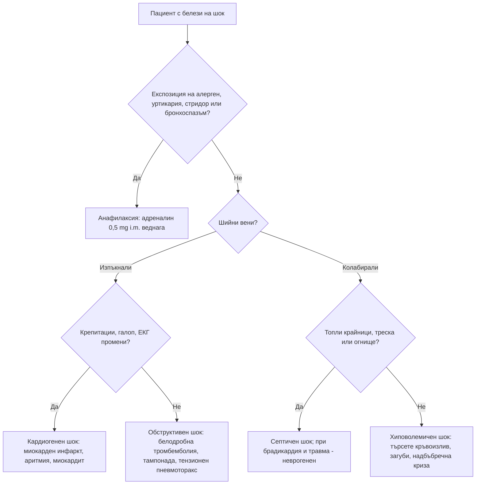

# Глава 78. Шок, анафилаксия и ангиоедем

> **Част XVI. Спешни състояния и инфекции**

## Цели на главата

- Да се разпознава шокът в **компенсирания** стадий, преди да настъпи хипотония.
- Да се разграничават четирите вида шок — **хиповолемичен**, **дистрибутивен**, **кардиогенен** и **обструктивен** — чрез клиничния преглед до леглото.
- Да се разпознава **анафилаксията** по клиничните критерии и да се лекува с **адреналин** без забавяне.
- Да се разграничава анафилаксията от състоянията, които я имитират.
- Да се разграничава **хистаминовият** от **брадикининовия** ангиоедем (АСЕ-инхибитори, наследствен ангиоедем).

## Ключови моменти

- Хипотонията е късен белег на шок. Тахикардията, тахипнеята, студените крайници и лактатът над 2 mmol/l са ранни *(SORT C [1])*.
- Анафилаксията е вероятна при остро засягане на кожата с дихателни, циркулаторни или тежки стомашно-чревни симптоми, както и при хипотония или бронхоспазъм след известен алерген дори без кожни прояви *(SORT C [2])*.
- Адреналин 0,5 mg i.m. в бедрото при възрастни, повторен при липса на ефект. Антихистамините и кортикостероидите не го заместват *(SORT C [2, 4])*.
- Внезапното изправяне на пациента с анафилаксия може да е фатално *(SORT C [3])*.
- Продължителността на наблюдението след анафилаксия зависи от броя на дозите адреналин и рисковите фактори *(SORT C [5])*.
- Ангиоедемът от АСЕ-инхибитор изисква спиране на лекарството завинаги. Икатибант не е по-ефективен от плацебо *(SORT B [7, 8])*.
- Ниският C4 е скринингов тест за наследствен ангиоедем *(SORT C [6])*.

### Първите 60 секунди

- ABCDE и повикване на помощ (112).
- Анафилаксия: **адреналин 0,5 mg i.m.** в бедрото веднага (при деца според възрастта); повторете след 5 минути при липса на ефект [2].
- Легнало положение с повдигнати крака, седнало при задух; не изправяйте пациента [2, 3].
- Кислород, венозен достъп и инфузия при хипотония.
- Шок без алерген: оценете шийните вени, крайниците и белите дробове, за да определите вида на шока.
- Ангиоедем без уртикария с дрезгав глас, затруднено преглъщане или стридор: 112 и готовност за осигуряване на дихателния път.

---

## 1. Шок

### 1.1. Определение и ранно разпознаване

**Шокът** е **недостатъчна тъканна перфузия** и кислородна доставка [1]. **Хипотонията е късен белег.** Младите хора, бременните и спортистите **компенсират** дълго и се влошават внезапно.

**Ранни белези:**

- **тахикардия** (може да липсва при **бета-блокери**, пейсмейкър, **неврогенен шок**, при възрастни хора);
- **тахипнея**;
- **удължено капилярно пълнене** (над 3 s), **студени, бледи, мраморни крайници** (или топли при ранен дистрибутивен шок);
- **безпокойство, объркване**;
- **олигурия** (под 0,5 ml/kg/h);
- **намалена пулсова амплитуда** (стеснено пулсово налягане);
- **шоков индекс** (пулс / систолно АН) **над 0,9–1,0**;
- **лактат над 2 mmol/l** [1].

### 1.2. Видове шок

*Таблица 78.1. Шок: видове шок.*

| Вид | Причини | Шийни вени | Кожа | Други находки |
|---|---|---|---|---|
| **Хиповолемичен** | **Кръвоизлив** (травма, **стомашно-чревен**, **руптура на аортна аневризма**, **извънматочна бременност**, ретроперитонеален), **загуби на течности** (повръщане, диария, **диабетна кетоацидоза**, изгаряния, **панкреатит**) | **Колабирали** | **Студена, бледа** | Жажда, олигурия, **ортостатизъм** |
| **Дистрибутивен — септичен** | Инфекция | Колабирали или нормални | **Топла** в началото, после студена | Треска или хипотермия, огнище |
| **Дистрибутивен — анафилактичен** | Алергени | Колабирали | Зачервена, **уртикария**, ангиоедем | Бронхоспазъм, стридор |
| **Дистрибутивен — неврогенен** | **Увреждане на шийния или горния гръден гръбначен мозък** | Колабирали | **Топла, суха** под нивото на увреждането | **Брадикардия** с хипотония, неврологичен дефицит |
| **Дистрибутивен — ендокринен** | **Надбъбречна криза** | Колабирали | | **Хипонатриемия, хиперкалиемия**, хипогликемия, кортикостероиди в анамнезата, **пигментация** |
| **Кардиогенен** | **Миокарден инфаркт**, **аритмии** (брадикардия, тахикардия), **миокардит**, **остра клапна недостатъчност** (руптура на папиларен мускул, **ендокардит**), **кардиомиопатия**, **токсични вещества** (бета-блокери, калциеви антагонисти) | **Изпъкнали** | Студена, влажна | **Белодробен застой** (крепитации), **ритъм на галоп**, **нов шум**, ЕКГ промени |
| **Обструктивен** | **Масивна белодробна тромбемболия**, **сърдечна тампонада**, **тензионен пневмоторакс**, **аортна дисекация** с тампонада | **Изпъкнали** | Студена | **Белодробна тромбемболия** — хипоксемия, чисти бели дробове, ЕКГ белези на дясно обременяване; **тампонада** — **тихи сърдечни тонове**, **парадоксален пулс** (**триада на Beck**); **тензионен пневмоторакс** — **липсващо дишане** на едната страна, **девиация на трахеята**, **хиперсонорен** перкуторен звук |

### 1.3. Бърз подход до леглото

1. **Шийни вени:**
   - **изпъкнали** — кардиогенен или обструктивен шок;
   - **колабирали** — хиповолемичен или дистрибутивен.
2. **Крайници:**
   - **топли** — дистрибутивен шок (ранен септичен, анафилактичен, неврогенен);
   - **студени** — хиповолемичен, кардиогенен или обструктивен.
3. **Бели дробове:**
   - **крепитации** — кардиогенен шок;
   - **едностранно липсващо дишане** — пневмоторакс;
   - **свирене** — анафилаксия.
4. **Сърце** — шум, галоп, тихи тонове, аритмия.
5. **Корем и крайници** — **пулсираща формация** (аортна аневризма), **асиметрия на пулсовете** (дисекация), **мелена** при ректалното изследване, **кървене**.
6. **Ехография до леглото** (протокол RUSH), когато е налична — **перикарден излив**, **дилатирана дясна камера**, функция на лявата камера, **долна празна вена**, **свободна течност**, **аорта**, пневмоторакс.

---

## 2. Анафилаксия

### 2.1. Клинични критерии (по WAO 2020)

Анафилаксията е **много вероятна** при **едно** от следните [2]:

1. **Остро начало** (минути до часове) на засягане на **кожата и/или лигавиците** (уртикария, сърбеж, зачервяване, **оток на устните, езика или увулата**) **и поне едно** от:
   - **дихателни** нарушения (задух, **свирене**, **стридор**, хипоксемия);
   - **понижено АН** или симптоми на органна дисфункция (**колапс**, **синкоп**, инконтиненция);
   - **тежки стомашно-чревни** симптоми (**силни коремни колики**, **повтарящо се повръщане**), особено след **неорален** алерген.
2. **Остро начало** на **хипотония**, **бронхоспазъм** или **засягане на ларинкса** след експозиция на **известен или много вероятен алерген** за пациента — **дори без кожни прояви**.

**Кожните прояви липсват при 10–20%** от случаите [2], особено при **тежка** анафилаксия с хипотония.

### 2.2. Отключващи фактори

*Таблица 78.2. Анафилаксия: отключващи фактори.*

| Група | Примери |
|---|---|
| **Храни** | **Фъстъци**, **ядки**, **риба**, **ракообразни**, **мляко**, **яйца**, **сусам**, плодове; **анафилаксия, зависима от храна и усилие** (пшеница) |
| **Лекарства** | **Бета-лактамни антибиотици**, **НСПВС** (включително **метамизол**), **мускулни релаксанти**, **контрастни вещества**, **хлорхексидин**, **моноклонални антитела**, химиотерапевтици, ваксини (рядко) |
| **Ужилвания от насекоми** | **Пчели**, **оси** (Hymenoptera) |
| **Латекс** | Медицински ръкавици, катетри |
| **Физически фактори** | **Усилие**, **студ** |
| **Алфа-гал синдром** | **Забавена** (3–6 часа) анафилаксия след **червено месо** при хора, ухапвани от **кърлежи** |
| **Идиопатична** | Изключете **мастоцитоза** (**базална триптаза**) |

**Кофактори**, които увеличават тежестта: **усилие**, **алкохол**, **НСПВС**, инфекции, менструация, стрес. **Рискови фактори за тежка и фатална анафилаксия:** **астма** (особено неконтролирана), **сърдечно-съдово заболяване**, **бета-блокери и АСЕ-инхибитори**, **мастоцитоза**, **забавено приложение на адреналин**, **изправяне** на пациента (синдром на „празната камера“) [3].

### 2.3. Бифазна анафилаксия

Връщане на симптомите след **1–72 часа** **без нова експозиция**; около половината бифазни реакции настъпват в първите 6–12 часа [2]. Рисковите фактори са **тежка първоначална реакция** и **необходимост от повече от една доза адреналин**. Антихистамините и кортикостероидите не предотвратяват надеждно бифазната реакция [4].

**Наблюдение след спешното лечение** [5]:

- **2 часа** след отзвучаването — при добър отговор (до 5–10 минути) на **една доза** адреналин i.m., приложена до 30 минути от началото, пълно отзвучаване на симптомите, **два** годни автоинжектора и умение за употребата им, и надзор от възрастен при нужда;
- **поне 6 часа** — при **две дози** адреналин или бифазна реакция в миналото;
- **поне 12 часа** — при **повече от две дози**, тежка астма или тежко засягане на дишането, възможна продължаваща абсорбция на алергена (например лекарства с удължено освобождаване), представяне извън работно време или труден достъп до спешна помощ.

### 2.4. Поведение

- **Адреналин 0,5 mg i.m.** (1 mg/ml, 0,5 ml) в **антеролатералната част на бедрото** при юноши и възрастни; **0,01 mg/kg** при деца (**0,15 mg** на 1–5 години, **0,3 mg** на 6–12 години; при кърмачета под 10 kg — 0,01 mg/kg). **Повтаря се след 5–15 минути** при липса на ефект [2].
- **Легнало положение** с **повдигнати крака** (при задух — седнало; при бременност — на лявата страна) [2]. **Не изправяйте** пациента внезапно [3].
- **Кислород**, **инфузия**, инхалационен бронходилататор.
- **Антихистамините и кортикостероидите не са първа линия** и **не заместват** адреналина [2, 4].
- **Серумна триптаза** — първа проба възможно най-скоро след започване на лечението и втора в рамките на **1–2 часа** (не по-късно от 4 часа) от началото [5]; **базална** — поне 24 часа след отзвучаването. Повишението **потвърждава** диагнозата, но **нормалната** триптаза не я изключва (особено при хранителна анафилаксия) [2].
- **Насочване към алерголог**, **два автоинжектора с адреналин** и обучение [5].

### 2.5. Състояния, които имитират анафилаксия

*Таблица 78.3. Състояния, които имитират анафилаксия.*

| Състояние | Отличителни белези |
|---|---|
| **Вазовагален синкоп** | **Бледост**, **изпотяване**, гадене, **брадикардия** (при анафилаксия — **тахикардия**), **без** уртикария и бронхоспазъм; **бързо** възстановяване в легнало положение |
| **Паническа атака** | Хипервентилация, изтръпване, **нормално АН**, **без** уртикария и стридор (усещането за „буца в гърлото“ е без обективен оток) |
| **Остър астматичен пристъп** | Без кожни прояви и хипотония |
| **Брадикининов ангиоедем** | **Без уртикария**, **без сърбеж**, **не отговаря на адреналин** — вж. раздел 3 |
| **Остра генерализирана уртикария** | **Без** засягане на дишането и циркулацията |
| **Скомбоидно отравяне** | **Риба** (скумрия, риба тон) — **хистамин**: зачервяване, главоболие, **пипериен или метален вкус**, засяга **няколко души** от една трапеза |
| **Синдром на „червения човек“** | **Бърза инфузия на ванкомицин** — зачервяване на горната половина на тялото |
| **Карциноиден синдром, феохромоцитом** | Зачервяване, пристъпи |
| **Мастоцитоза** | Повтарящи се епизоди, **кожни лезии**, **висока базална триптаза** |
| **Индуцирана обструкция на ларинкса** | Инспираторен стридор, **нормална сатурация** |
| **Септичен или кардиогенен шок** | Вж. раздел 1 |
| **Хипогликемия**, **гърч**, **белодробна тромбемболия** | |

---

## 3. Ангиоедем

### 3.1. Хистаминов или брадикининов?

*Таблица 78.4. Ангиоедем: хистаминов или брадикининов?*

| Белег | **Хистаминов (мастоцитен)** | **Брадикининов** |
|---|---|---|
| **Уртикария и сърбеж** | **Обикновено има** | **Няма** |
| **Начало** | **Минути** | **Постепенно, часове** |
| **Продължителност** | **24–48 часа** | **2–5 дни** |
| **Локализация** | Лице, устни, клепачи, гениталии | **Устни, език**, **ларинкс**, лице, крайници, **стена на червата** (**коремни пристъпи**) |
| **Отговор на адреналин, антихистамини, кортикостероиди** | **Да** | **Не** (или минимален) |
| **Причини** | Алергия, **идиопатичен**, НСПВС | **АСЕ-инхибитори**, **наследствен ангиоедем**, **придобит дефицит на C1-инхибитора**, **глиптини**, **сакубитрил/валсартан**, **mTOR инхибитори**, **алтеплаза** |
| **Лечение** | Адреналин, антихистамини, кортикостероиди | **Осигуряване на дихателния път**; при наследствен ангиоедем — **икатибант** или **концентрат на C1-инхибитор** [6]; при ангиоедем от АСЕ-инхибитор икатибант не е по-ефективен от плацебо [7] |

### 3.2. Ангиоедем от АСЕ-инхибитори

- Засяга около **0,2%** от започналите лечение. Честотата е около **4 пъти по-висока** при хора с **африкански произход** и с около 50% по-висока при жени [8]; рисков фактор е и тютюнопушенето.
- Около половината от случаите са през първите 3 месеца, но рискът остава и **след години** лечение [8].
- **Езикът, устните и ларинксът** са най-засегнати. **Може да е фатален.**
- **Лечение:** **спиране на АСЕ-инхибитора завинаги**. Преминаването към **сартан** обикновено е възможно; рискът от повторен потвърден ангиоедем е под 10% [9]. **Сакубитрил/валсартан** е **противопоказан**.
- **Често се пропуска**, защото пациентът и лекарят не свързват лекарството, приемано отдавна, с новия симптом.

### 3.3. Наследствен ангиоедем

- **Автозомно-доминантно** унаследяване (при около **20–25%** — нова мутация без фамилна анамнеза [6]).
- **Начало в детството или юношеството**, влошаване в **пубертета**, с **естрогени** (контрацептиви, бременност) и **АСЕ-инхибитори**.
- **Повтарящи се отоци** на кожата **без уртикария**, **силни коремни пристъпи** (оток на червата — често **ненужни апендектомии**), **ларингеален оток** (риск от задушаване).
- **Отключващи фактори:** **травма**, **стоматологични процедури**, стрес, инфекции.
- **Продромален маргинален еритем** (не сърби) може да предшества пристъпа.
- **Изследвания:** **C4** (**нисък** — добър скринингов тест, особено по време на пристъп), **количество и функция на C1-инхибитора** [6]. **Тип I** — ниско количество; **тип II** — нормално количество, ниска функция; **с нормален C1-инхибитор** — рядка форма.
- **Придобит дефицит на C1-инхибитора** — **начало над 40 години**, без фамилна анамнеза, **нисък C1q** — търсете **лимфопролиферативно заболяване** или автоимунно заболяване.

---

## 4. Безопасна диагностична стратегия

*Таблица 78.5. Безопасна диагностична стратегия.*

| Въпрос | Отговор |
|---|---|
| **Вероятна диагноза** | Хиповолемия (повръщане, диария), вазовагален синкоп, остра уртикария, хистаминов ангиоедем, лекарствена хипотония |
| **Сериозни заболявания, които не бива да се пропускат** | **Анафилаксия**; **септичен шок**; **скрит кръвоизлив** (стомашно-чревен, **руптура на аортна аневризма**, **извънматочна бременност**, ретроперитонеален при антикоагулант); **масивна белодробна тромбемболия**; **тампонада**; **тензионен пневмоторакс**; **кардиогенен шок**; **надбъбречна криза**; **ангиоедем на ларинкса** (АСЕ-инхибитори, наследствен); **аортна дисекация** |
| **Чести капани** | Нормално АН при компенсиран шок; липса на тахикардия при бета-блокери; анафилаксия без кожни прояви; забавяне на адреналина в полза на антихистамини; изправяне на пациента с анафилаксия; ангиоедем от АСЕ-инхибитор, приеман от години; наследствен ангиоедем, приет за „апендицит“ |
| **Маскиращи заболявания** | Надбъбречна недостатъчност, лекарства (бета-блокери, антихипертензивни), мастоцитоза |
| **Психосоциални аспекти** | Страх от повторна реакция, тревожност при хранителни алергии, достъп до автоинжектор |

---

## 5. Диагностичен алгоритъм при шок

*Фигура 78.1. Диагностичен алгоритъм при шок. Схема на авторите въз основа на източниците, цитирани в главата.*

Текстово описание на фигура 78.1

1. Пациент с белези на шок. Следва: към т. 2.
2. **Въпрос:** Експозиция на алерген, уртикария, стридор или бронхоспазъм? Да — към т. 3; Не — към т. 4.
3. Анафилаксия: адреналин 0,5 mg i.m. веднага.
4. **Въпрос:** Шийни вени? Изпъкнали — към т. 5; Колабирали — към т. 6.
5. **Въпрос:** Крепитации, галоп, ЕКГ промени? Да — към т. 7; Не — към т. 8.
6. **Въпрос:** Топли крайници, треска или огнище? Да — към т. 9; Не — към т. 10.
7. Кардиогенен шок: миокарден инфаркт, аритмия, миокардит.
8. Обструктивен шок: белодробна тромбемболия, тампонада, тензионен пневмоторакс.
9. Септичен шок; при брадикардия и травма — неврогенен.
10. Хиповолемичен шок: търсете кръвоизлив, загуби, надбъбречна криза.

---

## 6. Червени флагове и насочване

### 6.1. Червени флагове

- Стридор, дрезгав глас, оток на езика или затруднено преглъщане.
- Свирене, задух или хипоксемия след експозиция на алерген.
- Хипотония, синкоп или колапс.
- Ново объркване, студени мраморни крайници, олигурия.
- Шоков индекс над 1.
- Изпъкнали шийни вени с хипотония.
- Болка в корема или гърба с хипотония при възрастен.
- Нужда от повече от една доза адреналин.

### 6.2. Кога и колко спешно да насочим

*Таблица 78.6. Кога и колко спешно да насочим.*

| Спешност | Клинична ситуация |
|---|---|
| **Незабавно (112 или спешно отделение)** | Анафилаксия — след адреналин i.m. [2]; шок от всякакъв вид [1]; ангиоедем на езика или ларинкса, затруднено дишане или преглъщане [7] |
| **Бързо (до 2 седмици)** | След анафилаксия — алерголог [5]; подозрение за наследствен или придобит ангиоедем — алерголог или клиничен имунолог [6] |
| **Планово** | Повтаряща се уртикария или хистаминов ангиоедем без засягане на дишането — алерголог |
| **Проследяване в общата практика** | Ангиоедем от АСЕ-инхибитор — спиране завинаги и ясно отбелязване в документацията, избор на друго лекарство [9]; проверка на срока на годност на автоинжекторите и обучение [5] |

---

## 7. Клинични перли

- Хипотонията е късен белег на шок. Тахикардията, тахипнеята и студените крайници са ранни.
- Бета-блокерите маскират тахикардията. Нормалният пулс не изключва шок.
- При анафилаксия адреналинът се дава i.m. в бедрото без забавяне. Антихистамините не спасяват живот.
- Не изправяйте пациента с анафилаксия. Внезапната промяна на положението може да доведе до спиране на сърцето.
- Анафилаксията може да протече без уртикария, особено когато хипотонията е тежка.
- Ангиоедем без уртикария, който не отговаря на адреналин: брадикининов. Проверете за АСЕ-инхибитор.
- АСЕ-инхибиторът може да причини ангиоедем след години безпроблемно лечение.
- Повтарящи се коремни пристъпи и отоци без уртикария при млад човек: наследствен ангиоедем. Изследвайте C4.
- Шок с изпъкнали шийни вени и чисти бели дробове: белодробна тромбемболия, тампонада или тензионен пневмоторакс.
- Шок при възрастен мъж с болка в корема или гърба: руптура на аортна аневризма.

---

## 8. Клиничен случай

**Етап 1 — представяне.** Мъж на 67 години се обажда сутринта заради подуване на езика и долната устна, което е започнало през нощта и постепенно се увеличава. Няма уртикария и сърбеж. Не е ял нищо ново и не е ужилен. Лекува се от 5 години с рамиприл и амлодипин за хипертония и с аторвастатин. Предишния ден е имал стоматологична манипулация.

> **Въпрос 1.** Каква е най-вероятната причина и колко спешно е състоянието?

**Етап 2 — в спешното отделение.** Говорът е леко завален, преглъща трудно. АН 150/90 mmHg, SpO₂ 97%, без стридор. Приложени са адреналин i.m., антихистамин и кортикостероид без ефект.

> **Въпрос 2.** Защо лечението няма ефект?

> **Въпрос 3.** Какво е поведението?

Обсъждане и отговори

**Отговор 1.** Постепенно развилият се оток на езика и устните без уртикария при пациент на АСЕ-инхибитор подсказва **брадикининов ангиоедем от АСЕ-инхибитор**. Дългогодишното лечение не изключва диагнозата [8]. Стоматологичната манипулация е вероятният отключващ фактор. Отокът на езика с промяна в говора и преглъщането е спешно състояние — 112.

**Отговор 2.** Брадикининовият ангиоедем не отговаря на адреналин, антихистамини и кортикостероиди, защото не се дължи на мастоцитите.

**Отговор 3.** Основният риск е **обструкция на дихателните пътища**. Пациентът се наблюдава в болница с готовност за осигуряване на дихателния път (фиброоптична интубация). Икатибант не е по-ефективен от плацебо при ангиоедем от АСЕ-инхибитор [7]. **Рамиприлът се спира завинаги** и реакцията се отбелязва ясно в документацията. АСЕ-инхибиторите и сакубитрил/валсартан са противопоказани в бъдеще, а сартан може да се обсъди с малък риск от рецидив [9].

**Поука.** Ангиоедемът без уртикария, който не отговаря на адреналин, е брадикининов. Проверете за АСЕ-инхибитор, независимо колко отдавна го приема пациентът.

---

## Обобщение

- Шокът се разпознава рано по тахикардията, тахипнеята, кожата и съзнанието. Шийните вени, крайниците и белите дробове разграничават видовете шок.
- Анафилаксията е клинична диагноза и може да протече без кожни прояви. Първото лечение е адреналин i.m. в бедрото.
- Продължителността на наблюдението след анафилаксия зависи от отговора на лечението и рисковите фактори. При изписване пациентът има два автоинжектора и се насочва към алерголог.
- Ангиоедемът без уртикария е брадикининов — от АСЕ-инхибитор или наследствен — и не отговаря на адреналин.

## Самопроверка

### Въпроси с един верен отговор

**1.** *(основно ниво)* Мъж на 48 години е ужилен от оса. След 10 минути е блед, замаян, АН 70/40 mmHg, пулс 130/min. Няма уртикария. Кое е правилното първо действие?

- **А.** Антихистамин i.v.
- **Б.** Адреналин 0,5 mg i.m. в бедрото
- **В.** Кортикостероид i.v.
- **Г.** Изчакване на кожни прояви
- **Д.** Изправяне на пациента

Отговор и обосновка

**Верен отговор: Б.** Хипотонията след експозиция на известен алерген е анафилаксия дори без кожни прояви. Кожните прояви липсват при 10–20% [2].

**2.** *(основно ниво)* Жена на 30 години има анафилаксия след храна в ресторант. Как се прилага адреналинът?

- **А.** 1 mg i.v. бързо
- **Б.** 0,5 mg i.m. в антеролатералната част на бедрото
- **В.** 0,5 mg подкожно в рамото
- **Г.** 0,1 mg сублингвално
- **Д.** Инхалаторно

Отговор и обосновка

**Верен отговор: Б.** Адреналин 0,5 mg (1 mg/ml) i.m. в антеролатералната част на бедрото, повторен след 5–15 минути при липса на ефект [2].

**3.** *(напреднало ниво)* Мъж на 25 години получава анафилаксия след фъстъци. Една доза адреналин i.m. е дадена след 10 минути и симптомите отзвучават напълно за 5 минути. Има два годни автоинжектора и знае как да ги използва. Колко време е минималното наблюдение след отзвучаването?

- **А.** 30 минути
- **Б.** 2 часа
- **В.** 6 часа
- **Г.** 12 часа
- **Д.** 24 часа

Отговор и обосновка

**Верен отговор: Б.** При добър отговор на една доза адреналин, приложена до 30 минути, пълно отзвучаване и два автоинжектора може да се обсъди изписване след 2 часа наблюдение [5].

**4.** *(основно ниво)* Жена на 62 години, лекувана от 3 години с еналаприл, има оток на устните без уртикария и сърбеж. Антихистамин и кортикостероид нямат ефект. Кое е правилното поведение?

- **А.** Увеличаване на дозата на антихистамина
- **Б.** Спиране на еналаприла завинаги
- **В.** Преминаване към друг АСЕ-инхибитор
- **Г.** Продължаване на еналаприла, защото се приема от години
- **Д.** Преминаване към сакубитрил/валсартан

Отговор и обосновка

**Верен отговор: Б.** Ангиоедемът без уртикария при АСЕ-инхибитор е брадикининов. Може да се появи и след години лечение [8].

**5.** *(основно ниво)* Жена на 58 години след 12-часов полет има внезапен задух, пулс 128/min, АН 82/50 mmHg, изпъкнали шийни вени и чисти бели дробове. Какъв е видът на шока?

- **А.** Хиповолемичен
- **Б.** Септичен
- **В.** Кардиогенен от левокамерна недостатъчност
- **Г.** Обструктивен
- **Д.** Анафилактичен

Отговор и обосновка

**Верен отговор: Г.** Изпъкналите шийни вени с чисти бели дробове насочват към обструктивен шок — масивна белодробна тромбемболия, тампонада или тензионен пневмоторакс [1].

### Задача

Жена на 19 години има повтарящи се отоци на ръцете и лицето без уртикария от 14-годишна възраст и два епизода на силна коремна болка, при единия от които е направена апендектомия с нормален апендикс. Отоците се влошиха, след като започна комбиниран орален контрацептив. Как ще подходите?

Решение

Картината подсказва **наследствен ангиоедем**. Скрининговото изследване е **C4**, последвано от количество и функция на C1-инхибитора [6]. Фамилната анамнеза може да липсва при нова мутация. Естрогенсъдържащите контрацептиви отключват пристъпи и се спират [6]. Пациентката се насочва към алерголог или клиничен имунолог за потвърждаване и план за лечение на пристъпите. Обсъжда се рискът от ларингеален оток и кога да се обади на 112.

### OSCE станция: Лечение на анафилаксия в кабинета

**Време:** 8 минути. **Ниво:** основно (студенти, специализанти).

**Задача за кандидата.** Жена на 35 години получава обрив, задух и замайване 5 минути след инжекция на антибиотик в кабинета. Лекувайте я (манекен).

**Информация за симулирания пациент (за изпитващия).** Уртикария по тялото, свирене, АН 80/50 mmHg, пулс 128/min, SpO₂ 91%.

*Таблица 78.7. OSCE станция: Лечение на анафилаксия в кабинета — рубрика за оценяване.*

| Критерий | Точки |
|---|---|
| Разпознава анафилаксията и вика помощ (112) | 2 |
| Дава адреналин 0,5 mg i.m. в антеролатералната част на бедрото | 2 |
| Поставя пациентката легнала с повдигнати крака и не я изправя | 1 |
| Дава кислород и осигурява венозен достъп | 1 |
| Преоценява след 5 минути и повтаря адреналина при липса на ефект | 2 |
| Не дава антихистамин вместо адреналин | 1 |
| Документира часа, дозите и предполагаемия алерген | 1 |
| **Общо** | **10** |

**Праг за успешно представяне:** 7 от 10 точки, включително навременния адреналин i.m.

## Литература

1. Vincent JL, De Backer D. Circulatory shock. N Engl J Med. 2013;369(18):1726-34. doi:10.1056/NEJMra1208943. PMID: 24171518.
2. Cardona V, Ansotegui IJ, Ebisawa M, El-Gamal Y, Fernandez Rivas M, Fineman S, et al. World allergy organization anaphylaxis guidance 2020. World Allergy Organ J. 2020;13(10):100472. doi:10.1016/j.waojou.2020.100472. PMID: 33204386.
3. Pumphrey RS. Fatal posture in anaphylactic shock. J Allergy Clin Immunol. 2003;112(2):451-2. doi:10.1067/mai.2003.1614. PMID: 12897756.
4. Shaker MS, Wallace DV, Golden DBK, Oppenheimer J, Bernstein JA, Campbell RL, et al. Anaphylaxis-a 2020 practice parameter update, systematic review, and Grading of Recommendations, Assessment, Development and Evaluation (GRADE) analysis. J Allergy Clin Immunol. 2020;145(4):1082-1123. doi:10.1016/j.jaci.2020.01.017. PMID: 32001253.
5. National Institute for Health and Care Excellence. Anaphylaxis: assessment and referral after emergency treatment (NICE guideline NG258). London: NICE; 2026. Достъпно на: https://www.nice.org.uk/guidance/ng258
6. Maurer M, Magerl M, Betschel S, Aberer W, Ansotegui IJ, Aygören-Pürsün E, et al. The international WAO/EAACI guideline for the management of hereditary angioedema - The 2021 revision and update. World Allergy Organ J. 2022;15(3):100627. doi:10.1016/j.waojou.2022.100627. PMID: 35497649.
7. Sinert R, Levy P, Bernstein JA, Body R, Sivilotti MLA, Moellman J, et al. Randomized Trial of Icatibant for Angiotensin-Converting Enzyme Inhibitor-Induced Upper Airway Angioedema. J Allergy Clin Immunol Pract. 2017;5(5):1402-1409.e3. doi:10.1016/j.jaip.2017.03.003. PMID: 28552382.
8. Miller DR, Oliveria SA, Berlowitz DR, Fincke BG, Stang P, Lillienfeld DE. Angioedema incidence in US veterans initiating angiotensin-converting enzyme inhibitors. Hypertension. 2008;51(6):1624-30. doi:10.1161/HYPERTENSIONAHA.108.110270. PMID: 18413488.
9. Haymore BR, Yoon J, Mikita CP, Klote MM, DeZee KJ. Risk of angioedema with angiotensin receptor blockers in patients with prior angioedema associated with angiotensin-converting enzyme inhibitors: a meta-analysis. Ann Allergy Asthma Immunol. 2008;101(5):495-9. doi:10.1016/S1081-1206(10)60288-8. PMID: 19055203.

*Последна проверка на съдържанието: септември 2026 г. Следващ планиран преглед: септември 2027 г. (вж. „Политика за актуализация“ в README).*

<!-- навигация -->

---

[← Глава 77. Сепсис и тежко болният пациент](77-sepsis.md) · [Съдържание](../README.md) · [Глава 79. Отравяния и токсидроми →](79-otravyania.md)
