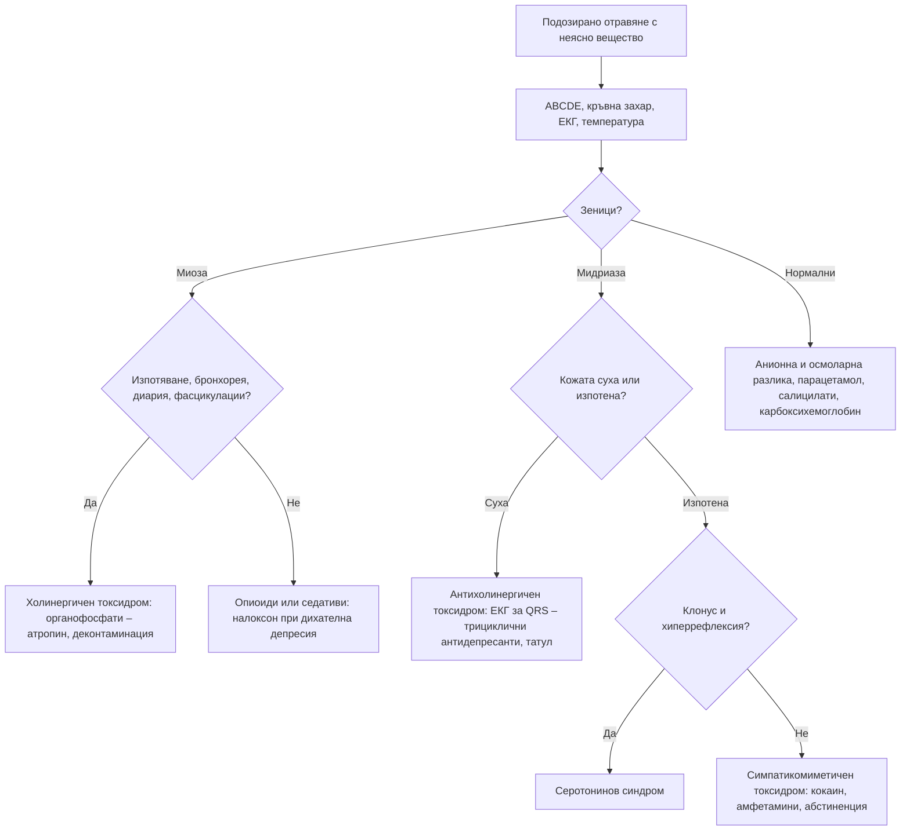

# Глава 79. Отравяния и токсидроми

> **Част XVI. Спешни състояния и инфекции**

## Цели на главата

- Да се прилага стъпков подход (ABCDE, токсидром, ЕКГ, анионна и осмоларна разлика) към пациента с подозирано отравяне, включително при неясна анамнеза.
- Да се разпознават основните **токсидроми** по жизнените показатели, зениците, кожата и перисталтиката.
- Да се използват **анионната и осмоларната разлика**, ЕКГ и серумните нива в диференциалната диагноза.
- Да се изследват **парацетамолът и салицилатите** при всяко умишлено предозиране.
- Да се разпознават отравянията, които са особено важни за България: гъби (*Amanita phalloides*), метанол, въглероден оксид, органофосфати, татул, ботулизъм, ухапване от пепелянка.

## Ключови моменти

- Номограмата за парацетамол важи само при еднократен прием на лекарство с непосредствено освобождаване и известен час на поглъщане *(SORT C [1])*.
- Обикновеният пулсоксиметър не открива отравяне с въглероден оксид. Измерва се карбоксихемоглобинът *(SORT B [2])*.
- QRS ≥ 100 ms при предозиране с трициклични антидепресанти предсказва гърчове, а ≥ 160 ms – камерни аритмии *(SORT B [6])*.
- При органофосфати атропинът се дава в удвояващи се дози до чисти бели дробове, пулс над 80/min и систолно АН над 80 mmHg *(SORT C [5])*.
- Симптомите след гъби, които започват след над 6 часа, насочват към хепатотоксично отравяне *(SORT C [4])*.
- Ботулизмът протича с низходяща парализа при запазено съзнание. Ранният антитоксин намалява смъртността *(SORT C [8])*.
- Фомепизолът е предпочитаният антидот при отравяне с метанол *(SORT C [3])*.

### Първите 60 секунди

- ABCDE и **капилярна кръвна захар** веднага.
- Дихателна депресия с миоза: налоксон i.v. или i.m. и поддържане на дишането.
- ЕКГ: QRS ≥ 100 ms или аритмия при предозиране – помислете за трициклични антидепресанти [6].
- Няколко души с главоболие и гадене в едно жилище: изведете всички, 100% кислород и 112 [2].
- Органофосфати: защитни средства, събличане и измиване, атропин [5].
- Всяко умишлено предозиране: спешна оценка, парацетамол и салицилати, оценка на суицидния риск.

---

## 1. Подход към отровения пациент

### 1.1. Анамнеза

- **Какво?** – опаковки, остатъци, лекарства в дома (включително на други членове на семейството), професия, хоби, гъби, домашни консерви, ракия.
- **Колко и кога?** – определя риска и тълкуването на нивата (парацетамол).
- **Как?** – поглъщане, вдишване, кожа, инжектиране, ухапване.
- **Защо?** – умишлено (суицидно) или случайно. При всяко умишлено отравяне се приема, че може да има повече от едно вещество.
- **Кой друг е засегнат?** – няколко души с едни и същи симптоми насочват към въглероден оксид, храна, гъби, ботулизъм, метанол.

Когато анамнезата липсва, отравянето трябва да се има предвид при всеки пациент с неясна кома, гърчове, аритмии, метаболитна ацидоза, делир или необичайно поведение, особено при млади хора.

### 1.2. Преглед

- ABCDE, кръвна захар веднага.
- **Жизнени показатели** – температура, пулс, АН, дихателна честота.
- **Зеници** – миоза, мидриаза, нистагъм.
- **Кожа** – суха или изпотена, зачервена, булозни лезии (барбитурати, въглероден оксид), следи от инжекции, цвят (цианоза, която не отговаря на кислород – метхемоглобинемия).
- **Перисталтика** – отслабена (антихолинергични, опиоиди) или усилена (холинергични).
- **Мирис** – алкохол, ацетон (кетоацидоза, изопропанол), чесън (органофосфати, арсен), горчиви бадеми (цианид).
- **Неврологичен статус** – тонус, рефлекси, **клонус**, гърчове.

---

## 2. Токсидроми

*Таблица 79.1. Токсидроми.*

| Токсидром | Причини | Съзнание | Зеници | Пулс и АН | Температура | Кожа | Перисталтика | Други |
|---|---|---|---|---|---|---|---|---|
| **Симпатикомиметичен** | Кокаин, амфетамини, катинони, кофеин, теофилин, абстиненция от алкохол и бензодиазепини | Възбуда, параноя | **Мидриаза** | **↑↑** | **↑** | **Изпотена** | Нормална | Тремор, гърчове, миокарден инфаркт |
| **Антихолинергичен** | Антихистамини (дифенхидрамин), трициклични антидепресанти, атропин, татул (*Datura stramonium*), антипаркинсонови, някои антипсихотици | Делир, мърморене, посягане във въздуха | **Мидриаза** | ↑ | **↑** | **Суха, зачервена, гореща** | **Отслабена или липсва** | **Задръжка на урина** |
| **Холинергичен** | Органофосфати и карбамати (пестициди), нервнопаралитични вещества, гъби (*Inocybe*, *Clitocybe*), пиридостигмин | Объркване, кома | **Миоза** | Брадикардия (или тахикардия) | Нормална | **Изпотена** | Усилена – диария | Бронхорея, бронхоспазъм, слюноотделяне, сълзене, уриниране, повръщане, фасцикулации, слабост, дихателна недостатъчност |
| **Опиоиден** | Хероин, метадон, фентанил, трамадол, кодеин | **Понижено** | Миоза (точковидни) | ↓ | ↓ | Нормална | **Отслабена** | Дихателна депресия; трамадол – гърчове, серотонинов синдром |
| **Седативно-хипнотичен** | Бензодиазепини, барбитурати, Z-хипнотици, алкохол, GHB | **Понижено** | Нормални или миоза | ↓ или нормални | ↓ | Нормална | Нормална | Атаксия, дизартрия, нистагъм; дихателна депресия при комбинации |
| **Серотонинов** | SSRI, SNRI, трамадол, MDMA, линезолид, МАО-инхибитори, комбинации | Възбуда | **Мидриаза** | ↑ | **↑** | **Изпотена** | **Усилена** | Клонус, хиперрефлексия (вж. глава 75) |

Холинергичният токсидром се запомня с мнемониката DUMBELS: Diarrhoea (диария), Urination (уриниране), Miosis (миоза), Bradycardia, Bronchorrhoea, Bronchospasm, Emesis (повръщане), Lacrimation (сълзене), Salivation (слюноотделяне).

Антихолинергичният синдром се описва с: „горещ като заек, сух като кост, червен като цвекло, сляп като прилеп, луд като шапкар“, плюс „пълен като мях“ (задръжка на урина).

---

## 3. Изследвания

### 3.1. Основни изследвания при всяко сериозно отравяне

- **Кръвна захар**.
- **ЕКГ** – QRS над 100 ms (блокиране на натриевите канали – трициклични антидепресанти, карбамазепин, антиаритмици, кокаин), удължен QTc (антипсихотици, метадон, антидепресанти), брадикардия и блокове (бета-блокери, калциеви антагонисти, дигоксин, клонидин, органофосфати), тахиаритмии.
- Електролити, креатинин, глюкоза, газов анализ, лактат.
- **Анионна разлика** = Na – (Cl + HCO₃); нормално 8–12 mmol/l.
- Осмоларна разлика = измерена – изчислена осмоларност [2 × Na + глюкоза + урея]; над 10 mOsm/kg насочва към токсични алкохоли.
- Парацетамол и салицилати – при всяко умишлено предозиране.
- Чернодробни ензими, INR, креатинкиназа (КК).
- Карбоксихемоглобин, метхемоглобин – при подозрение.
- **Специфични нива** – литий, дигоксин, желязо, теофилин, антиепилептични лекарства, **етанол**.
- **Токсикологичен тест на урината** – ограничено значение; **не променя** обикновено спешното лечение.

### 3.2. Метаболитна ацидоза с висока анионна разлика

*Таблица 79.2. Метаболитна ацидоза с висока анионна разлика.*

| Причина | Насочващи белези |
|---|---|
| **Метанол** | Зрителни нарушения („снежна буря“, слепота), висока осмоларна разлика в началото; нелегална ракия |
| **Етиленгликол** | Антифриз; остро бъбречно увреждане, кристали от калциев оксалат в урината, хипокалциемия |
| **Салицилати** | Шум в ушите, хипервентилация, смесена дихателна алкалоза и метаболитна ацидоза, хипертермия |
| **Желязо** | Повръщане, кървава диария, период на привидно подобрение, после шок и чернодробна недостатъчност |
| **Парацетамол** (масивно предозиране) | Ранна кома и ацидоза при много високи нива |
| Цианид, въглероден оксид | Много висок лактат, пожар (дим от пластмаси) |
| **Метформин** | Лактатна ацидоза, особено при бъбречна недостатъчност |
| **Изониазид** | Резистентни гърчове (антидот – пиридоксин) |
| **Кетоацидоза** | Диабетна, алкохолна (нормална или ниска глюкоза), от гладуване |
| **Уремия** | |

(Вж. и глава 31.)

---

## 4. Отравяния с особено значение

### 4.1. Парацетамол

- Първите 24 часа – без симптоми или само гадене и повръщане. Чернодробното увреждане се проявява след 24–72 часа (болка в десния горен квадрант, иктер, коагулопатия, енцефалопатия, хипогликемия, лактатна ацидоза, бъбречна недостатъчност).
- Ниво на парацетамол 4 часа след поглъщането (или по-късно) и номограма за решение за ацетилцистеин. Номограмата се използва само при еднократен прием на лекарство с непосредствено освобождаване и известен час на поглъщане [1].
- Рискови фактори за увреждане при по-ниски дози: хроничен алкохолизъм, недохранване, ниско тегло, ензимни индуктори.
- Поетапно предозиране (многократен прием за дни, например при зъбобол) и лекарства с удължено освобождаване – номограмата не важи; лечение според дозата, нивото и чернодробните ензими [1].
- **Парацетамолът е честа съставка на комбинирани аналгетици и противогрипни средства** – пациентът може да не знае, че го е приемал.

### 4.2. Въглероден оксид

- Главоболие, замайване, гадене, умора, объркване, синкоп, гърдна болка, гърчове, кома.
- Няколко души в едно жилище с подобни симптоми, домашни любимци, подобрение извън дома, зимата – печки на дърва и въглища, газови бойлери, генератори, пожари, автомобили в затворени гаражи.
- **Пулсоксиметрията показва нормална сатурация** – трябва да се измери **карбоксихемоглобинът** (кооксиметрия). Обикновеният пулсоксиметър не различава карбоксихемоглобина от оксихемоглобина [2].
- „Черешовочервеният“ цвят на кожата е **рядък** и късен белег.
- **Късни неврологични последици** (седмици) – когнитивни нарушения, паркинсонизъм [2].
- **Лечение:** **100% кислород**; при тежко отравяне и при бременност се обсъжда хипербарна оксигенация, която намалява трайните неврологични последици [2].

### 4.3. Метанол

- Нелегално произведена ракия или технически спирт; групи от пострадали.
- **Латентен период 12–24 часа** (по-дълъг при едновременен прием на етанол).
- Гадене, коремна болка, главоболие, зрителни нарушения („снежна буря“, замъглено зрение, слепота), дълбоко дишане, кома.
- Висока осмоларна разлика в началото, висока анионна разлика по-късно.
- **Лечение:** фомепизол (предпочитан антидот) или етанол, хемодиализа при тежки метаболитни нарушения, фолинова киселина [3].
- Вж. клиничния случай в глава 31.

### 4.4. Гъби

**Основно правило: латентен период над 6 часа между храненето и първите симптоми означава потенциално смъртоносно отравяне** [4].

*Таблица 79.3. Отравяне с гъби.*

| Латентен период | Синдром | Гъби | Проява |
|---|---|---|---|
| **Под 6 часа** (обикновено 0,5–3 часа) | **Гастроинтестинален** | Много видове | Повръщане, диария; доброкачествен ход |
| | **Мускаринов** | *Inocybe*, *Clitocybe* | Изпотяване, слюноотделяне, миоза, брадикардия |
| | Пантерински (изоксазолов) | *Amanita muscaria* (червена мухоморка), *Amanita pantherina* | Объркване, възбуда, халюцинации, сънливост, миоклонус |
| | **Копринов** | *Coprinus* + алкохол | Реакция, подобна на дисулфирам |
| **6–24 часа** | Фалоиден синдром (аматоксини – α-аманитин) | *Amanita phalloides* (зелена мухоморка), *Amanita virosa*, *Galerina*, *Lepiota* | Три фази: 1) холероподобна диария и повръщане (6–24 часа); 2) привидно подобрение (24–48 часа), докато трансаминазите се покачват; 3) остра чернодробна недостатъчност (3–5-и ден), бъбречна недостатъчност, коагулопатия, смърт |
| | **Гиромитрин** | *Gyromitra* (пролетна гъба) | Повръщане, гърчове (пиридоксин), хемолиза, чернодробно увреждане |
| **2–20 дни** | **Орелланин** | *Cortinarius* | Късна бъбречна недостатъчност (жажда, полиурия, после олигурия) |

**Поведение:**

- при съмнение за отравяне с гъби – **всички**, които са яли от ястието, се преглеждат;
- **остатъците** от гъбите или повърнатото се запазват за миколог;
- при латентен период над 6 часа – спешна хоспитализация в токсикологично отделение: активен въглен многократно, инфузии, силибинин, ацетилцистеин, проследяване на INR и трансаминазите; при фулминантна чернодробна недостатъчност – трансплантация.

**Привидното подобрение на 2-рия ден е най-опасният капан** при отравянето със зелена мухоморка.

### 4.5. Органофосфати и карбамати

- Земеделски пестициди, инсектициди в домакинството; случайно или суицидно поглъщане, кожна експозиция при пръскане.
- Холинергичен токсидром (DUMBELS), фасцикулации, мускулна слабост, дихателна недостатъчност („убиват чрез дишането“: бронхорея, бронхоспазъм, слабост на дихателната мускулатура, депресия на ЦНС).
- **Мирис на чесън** или на разтворител.
- **Изследване:** **ниска активност на холинестеразата** (серумна и еритроцитна).
- **Лечение:** атропин до изсушаване на бронхиалния секрет (дозите са в раздел 4.9), оксими (ползата им не е напълно изяснена), деконтаминация (събличане, измиване), защита на персонала [5].
- Интермедиерен синдром (24–96 часа) – слабост на проксималната, шийната и дихателната мускулатура; забавена невропатия (седмици).

### 4.6. Трициклични антидепресанти

- Антихолинергичен синдром, сънливост и кома, гърчове, хипотония, аритмии.
- **ЕКГ:** синусова тахикардия, разширен QRS ≥ 100 ms (риск от гърчове), ≥ 160 ms (риск от камерни аритмии) [6], висок R в aVR, удължен QTc.
- **Бързо влошаване** – пациентът може да изглежда добре при приемането и да изпадне в кома за час.
- **Лечение:** **натриев бикарбонат** при разширен QRS, аритмии или хипотония (дозата е в раздел 4.9) [7].

### 4.7. Други важни отравяния

*Таблица 79.4. Други важни отравяния.*

| Вещество | Насочващи белези |
|---|---|
| **Салицилати** | Шум в ушите, глухота, гадене, хипервентилация, хипертермия, объркване; смесена киселинно-алкална находка |
| **Литий** | Гадене, диария, тремор, атаксия, объркване, миоклонус, гърчове; хронична токсичност при дехидратация, диуретици, АСЕ инхибитори, НСПВС – дори при „терапевтични“ нива |
| **Дигоксин** | Гадене, повръщане, зрителни нарушения (жълто-зелено виждане), объркване, всякакви аритмии (особено предсърдна тахикардия с блок, двупосочна камерна тахикардия), хиперкалиемия (остро); рискови фактори – бъбречна недостатъчност, хипокалиемия, амиодарон, кларитромицин, верапамил |
| **Бета-блокери и калциеви антагонисти** | Брадикардия, хипотония, шок; калциеви антагонисти – хипергликемия; забавено действие при ретардни форми |
| **Сулфанилурейни препарати и инсулин** | Хипогликемия – продължителна и повтаряща се (сулфанилурейни – до 72 часа) |
| **Желязо** | Деца (витамини на майката); повръщане, кървава диария, привидно подобрение, шок |
| **Метхемоглобинемия** | Цианоза, която не отговаря на кислород, шоколадово-кафява кръв, SpO₂ около 85%; дапсон, локални анестетици (бензокаин), нитрати в кладенчова вода (кърмачета), нитрити („попърс“) |
| **Корозивни вещества** | Киселини и основи в домакинството; болка в устата и гърдите, дисфагия, слюноотделяне, стридор; липсата на изгаряния в устата не изключва увреждане на хранопровода |
| **Въглеводороди** (бензин, керосин, лампово масло) | Аспирационна пневмония – кашлица, задух (деца) |
| **Олово** | Коремни колики, запек, анемия с базофилно пунктиране, невропатия (падане на китката), енцефалопатия при деца, оловна линия по венците; стари бои, глазирани глинени съдове, традиционни лекарства и козметика, огнестрелни рани |
| **Талий** | Болезнена невропатия (ходилата), окапване на косата след 2–3 седмици |
| **Живак** | Тремор, еретизъм (раздразнителност, срамежливост), гингивит, нефрозен синдром |

### 4.8. Растения, животни и храни

*Таблица 79.5. Растения, животни и храни.*

| Причина | Насочващи белези |
|---|---|
| **Татул** (*Datura stramonium*) | Антихолинергичен синдром – деца, подрастващи (експериментиране), замърсени храни |
| **Напръстник (*Digitalis*), олеандър, момина сълза** | Сърдечни гликозиди – като при дигоксин |
| **Бучиниш** (*Conium maculatum*) | Възходяща парализа; объркване с магданоз или морков |
| **Ботулизъм** | Домашни консерви (зеленчуци, месо, риба), 12–72 часа след храненето; двойно виждане, птоза, разширени зеници, сухота в устата, дизартрия, дисфагия, низходяща симетрична парализа, запазено съзнание, обикновено без треска и без сетивни нарушения; няколко души – ранен антитоксин [8] |
| **Пепелянка** (*Vipera ammodytes*) | Болка и прогресиращ оток на мястото на ухапването, лимфангит, повръщане, хипотония, коагулопатия, тромбоцитопения; неврологична токсичност (птоза, офталмоплегия, дисфагия) – антиотрова интравенозно при системни прояви или бързо прогресиращ оток [9] |
| **Скорпион, паяк** (черна вдовица – *Latrodectus*) | Черна вдовица: силни мускулни крампи, коремна ригидност (имитира остър корем), изпотяване, хипертония |
| **Скомбоидно отравяне** | Риба – зачервяване, главоболие, пипериен вкус (вж. глава 78) |

### 4.9. Антидоти и начални дози за първите минути

Дозите са за възрастни. Те са ориентировъчни и не заместват консултацията с токсикологичен център и местния протокол.

*Таблица 79.6. Антидоти и начални дози за първите минути.*

| Отравяне | Антидот или мярка | Начална доза | Бележки |
|---|---|---|---|
| **Опиоиди** с дихателна депресия | **Налоксон** | 0,4 mg i.v. или i.m.; при пациенти със зависимост – 0,1–0,2 mg i.v. на всеки 2–3 минути до адекватно дишане | Действието му е по-кратко от това на метадона и ретардните форми – нужни са продължително наблюдение и често инфузия |
| **Органофосфати и карбамати** | **Атропин** | 1–3 mg i.v.; дозата се удвоява на всеки 5 минути до изсушаване на бронхиалния секрет, пулс > 80/min и систолно АН > 80 mmHg | Цел: чисти бели дробове, пулс > 80/min и систолно АН > 80 mmHg; оксими по протокол; персоналът използва защитни средства [5] |
| **Трициклични антидепресанти** (QRS > 100 ms, аритмия, хипотония) | **Натриев бикарбонат 8,4%** | 1–2 mmol/kg (1–2 ml/kg) i.v., повтаря се до pH 7,45–7,55 | Контрол на калия и натрия |
| **Хипогликемия** от инсулин или сулфанилурейни препарати | **Глюкоза** | 150–200 ml 10% глюкоза i.v. за 15 минути (при деца – 2 ml/kg 10% глюкоза) | При сулфанилурейни препарати – продължителна инфузия и наблюдение до 72 часа |
| **Въглероден оксид** | **Кислород 100%** | Маска с резервоар, 15 l/min | Хипербарна оксигенация при тежко отравяне и при бременност |
| **Парацетамол** | Ацетилцистеин i.v. | По протокол; решението се взема по номограмата и по чернодробните показатели | При поетапно предозиране номограмата не важи |
| **Метанол и етиленгликол** | Фомепизол или етанол; хемодиализа | По протокол на токсикологичния център | Фолинова киселина при метанол [3] |
| **Бензодиазепини** | **Флумазенил** | Не се препоръчва рутинно | Може да отключи гърчове, особено при смесено отравяне с трициклични антидепресанти |

---

## 5. Безопасна диагностична стратегия

*Таблица 79.7. Безопасна диагностична стратегия.*

| Въпрос | Отговор |
|---|---|
| **Вероятна диагноза** | Предозиране на лекарства (бензодиазепини, парацетамол, антидепресанти), алкохолна интоксикация, битова химия при деца |
| **Сериозни заболявания, които не бива да се пропускат** | Парацетамол (без симптоми в началото); трициклични антидепресанти; метанол и етиленгликол; въглероден оксид; зелена мухоморка; органофосфати; ботулизъм; сулфанилурейни препарати; ретардни лекарства (късна проява); съпътстваща травма на главата, хипогликемия, инфекция, хипотермия при „пиян“ пациент; суициден риск |
| **Чести капани** | Нормална сатурация при отравяне с въглероден оксид; привидно подобрение след отравяне с гъби или желязо; неизмерен парацетамол при умишлено предозиране; интоксикация с алкохол, която маскира травма, хипогликемия или метанол; хронична литиева токсичност при „терапевтични“ нива; повтарящо се главоболие и гадене през зимата в семейството |
| **Маскиращи заболявания** | Отравянето имитира инсулт, енцефалит, психоза, сепсис, миокарден инфаркт, остър корем, диабетна кетоацидоза |
| **Психосоциални аспекти** | Суициден опит, депресия, зависимост, насилие, неглижиране на деца, отравяне, причинено от друг |

---

## 6. Диагностичен алгоритъм при неизвестно отравяне

*Фигура 79.1. Диагностичен алгоритъм при неизвестно отравяне. Схема на авторите въз основа на източниците, цитирани в главата.*

Текстово описание на фигура 79.1

1. Подозирано отравяне с неясно вещество. Следва: към т. 2.
2. ABCDE, кръвна захар, ЕКГ, температура. Следва: към т. 3.
3. **Въпрос:** Зеници? Миоза – към т. 4; Мидриаза – към т. 5; Нормални – към т. 6.
4. **Въпрос:** Изпотяване, бронхорея, диария, фасцикулации? Да – към т. 7; Не – към т. 8.
5. **Въпрос:** Кожата суха или изпотена? Суха – към т. 9; Изпотена – към т. 10.
6. Анионна и осмоларна разлика, парацетамол, салицилати, карбоксихемоглобин.
7. Холинергичен токсидром: органофосфати – атропин, деконтаминация.
8. Опиоиди или седативи: налоксон при дихателна депресия.
9. Антихолинергичен токсидром: ЕКГ за QRS – трициклични антидепресанти, татул.
10. **Въпрос:** Клонус и хиперрефлексия? Да – към т. 11; Не – към т. 12.
11. Серотонинов синдром.
12. Симпатикомиметичен токсидром: кокаин, амфетамини, абстиненция.

---

## 7. Червени флагове и насочване

### 7.1. Червени флагове

- Понижено съзнание, дихателна депресия или гърчове.
- QRS ≥ 100 ms, аритмия или хипотония.
- Метаболитна ацидоза с висока анионна или осмоларна разлика.
- Няколко души със сходни симптоми.
- Симптоми след гъби, които започват след над 6 часа.
- Зрителни нарушения след алкохол с неизвестен произход.
- Птоза, двойно виждане и затруднено преглъщане след домашни консерви.
- Умишлено предозиране – независимо от симптомите.
- Ухапване от пепелянка с прогресиращ оток или системни прояви.

### 7.2. Кога и колко спешно да насочим

*Таблица 79.8. Кога и колко спешно да насочим.*

| Спешност | Клинична ситуация |
|---|---|
| **Незабавно (112 или спешно отделение)** | Всяко умишлено предозиране; дихателна депресия, кома, гърчове, QRS ≥ 100 ms [6]; отравяне с въглероден оксид [2]; подозрение за метанол [3]; гъби с латентен период над 6 часа – всички, които са яли [4]; органофосфати [5]; ботулизъм [8]; ухапване от пепелянка с прогресиращ оток или системни прояви [9] |
| **В същия ден** | Подозрение за хронична литиева или дигоксинова токсичност – нива, електролити и ЕКГ; повтарящо се главоболие и гадене у дома през зимата без тежки симптоми – карбоксихемоглобин и проверка на отоплителните уреди [2] |
| **Проследяване в общата практика** | След умишлено предозиране – проследяване на суицидния риск и ограничаване на лекарствата у дома; съвети за безопасно съхранение на лекарства и химикали при деца |

---

## 8. Клинични перли

- При всяко умишлено предозиране измерете парацетамола и салицилатите, дори ако пациентът отрича.
- Парацетамолът убива тихо. Първите 24 часа може да няма никакви симптоми.
- Главоболие и гадене при няколко души в едно жилище през зимата: въглероден оксид. Пулсоксиметърът не помага.
- Симптомите при отравяне с гъби, които започват след 6 часа, са сигнал за смъртна опасност. Подобрението на втория ден е капан.
- Разширен QRS при предозиране: трициклични антидепресанти. Пациентът може да изпадне в кома за минути.
- Пиян пациент в кома: изключете хипогликемия, травма на главата, метанол и хипотермия.
- Двойно виждане, птоза и сухота в устата при няколко души след домашна консерва: ботулизъм.
- Цианоза, която не се повлиява от кислород: метхемоглобинемия.
- Хроничната литиева токсичност може да се развие при нормални нива. Дехидратацията и новите лекарства (диуретици, АСЕ инхибитори, НСПВС) са отключващи фактори.
- Мирис на чесън и точковидни зеници: органофосфати. Защитете персонала.

---

## 9. Клиничен случай

**Етап 1 – клинична картина.** Семейство от трима души – родители на около 50 години и син на 20 години – е събрало гъби в гората край Витоша и ги е приготвило за вечеря. Около 10 часа след вечерята и тримата получават силна водниста диария, повръщане и коремни болки.

> **Въпрос 1.** Кой белег в анамнезата е най-тревожен?

**Етап 2 – след изписването.** В спешното отделение им вливат течности. На следващия ден се чувстват по-добре и са изписани. На третия ден майката се оплаква от силна отпадналост, пожълтяване и кървене от венците. АЛАТ 4800 U/l, АСАТ 5200 U/l, билирубин 78 µmol/l, INR 3,8, кръвна захар 3,1 mmol/l.

> **Въпрос 2.** Коя е диагнозата?

> **Въпрос 3.** Каква грешка е допусната и какво е поведението?

Обсъждане и отговори

**Отговор 1.** Латентният период над 6 часа между храненето и първите симптоми насочва към потенциално смъртоносно, хепатотоксично отравяне с гъби [4].

**Отговор 2.** Холероподобната диария, привидното подобрение на втория ден и последвалата остра чернодробна недостатъчност (много високи трансаминази, иктер, коагулопатия, хипогликемия) са типични за отравяне с аматоксини – най-вероятно от зелена мухоморка (*Amanita phalloides*). Тя расте в широколистните гори в България и се бърка с ядливи гъби.

**Отговор 3.** Пациентите са изписани при подобрение, без латентният период да се свърже с опасно отравяне и без проследяване на трансаминазите и INR. Тримата трябва да бъдат спешно хоспитализирани в токсикологично отделение. Лечението включва многократен активен въглен, силибинин, ацетилцистеин, лечение на коагулопатията и хипогликемията и оценка за спешна чернодробна трансплантация. Бащата и синът също са в риск, дори ако още се чувстват добре.

**Поука.** Отравянето с гъби, при което симптомите започват след повече от 6 часа, е потенциално смъртоносно. Привидното подобрение не е оздравяване.

---

## Обобщение

- Подходът към отровения пациент започва с ABCDE и кръвна захар, продължава с токсидрома, ЕКГ, анионната и осмоларната разлика.
- При всяко умишлено предозиране се изследват парацетамолът и салицилатите и се оценява суицидният риск.
- Въглеродният оксид, метанолът, гъбите с късно начало, органофосфатите и ботулизмът често засягат няколко души.
- Антидотите и началните мерки спасяват живот, но не заместват консултацията с токсикологичен център.

## Самопроверка

### Въпроси с един верен отговор

**1.** *(основно ниво)* Жена на 28 години е приета 2 часа след поглъщане на неизвестно количество амитриптилин. Сънлива е, пулсът е 128/min, АН 96/60 mmHg, QRS е 132 ms. Кое е най-подходящото лечение?

- **А.** Флумазенил
- **Б.** Натриев бикарбонат i.v.
- **В.** Физостигмин
- **Г.** Амиодарон
- **Д.** Бета-блокер

Отговор и обосновка

**Верен отговор: Б.** Разширеният QRS при предозиране с трициклични антидепресанти носи риск от гърчове и аритмии [6] и се лекува с натриев бикарбонат [7].

**2.** *(основно ниво)* През януари майка и двете ѝ деца имат главоболие и гадене, които се подобряват, когато излязат от дома. Отопляват се с печка на въглища. SpO₂ е 99% при всички. Кое е вярно?

- **А.** Нормалната сатурация изключва отравяне с въглероден оксид
- **Б.** Трябва да се измери карбоксихемоглобинът
- **В.** Вероятно е вирусна инфекция
- **Г.** Достатъчно е проветряване и парацетамол
- **Д.** Нужна е КТ на главата

Отговор и обосновка

**Верен отговор: Б.** Обикновеният пулсоксиметър не различава карбоксихемоглобина от оксихемоглобина [2].

**3.** *(напреднало ниво)* Земеделец на 55 години е изпил пестицид. Има миоза, обилна бронхорея, свирене, пулс 48/min, АН 78/40 mmHg. Какво е целта на лечението с атропин?

- **А.** Нормални зеници
- **Б.** Чисти бели дробове, пулс над 80/min и систолно АН над 80 mmHg
- **В.** Пулс над 120/min
- **Г.** Пълно изчезване на фасцикулациите
- **Д.** Нормална активност на холинестеразата

Отговор и обосновка

**Верен отговор: Б.** Атропинът се дава в удвояващи се дози на всеки 5 минути до чисти бели дробове, пулс над 80/min и систолно АН над 80 mmHg [5].

**4.** *(основно ниво)* Мъж на 60 години е ял гъби, събрани в гората. Повръщане и диария започват 9 часа по-късно. Съпругата му е яла от същото ястие и засега е добре. Кое е правилното поведение?

- **А.** Лечение на гастроентерита у дома
- **Б.** Спешна хоспитализация на двамата
- **В.** Хоспитализация само на пациента със симптоми
- **Г.** Контрол след 3 дни
- **Д.** Активен въглен у дома и наблюдение

Отговор и обосновка

**Верен отговор: Б.** Латентният период над 6 часа насочва към хепатотоксично отравяне [4]. Всички, които са яли от ястието, са в риск.

**5.** *(основно ниво)* Двама души имат двойно виждане, птоза, затруднено преглъщане и сухота в устата ден след като са яли домашна консерва от зелен фасул. В съзнание са, без треска. Коя е най-вероятната диагноза?

- **А.** Миастения гравис
- **Б.** Синдром на Guillain-Barré
- **В.** Ботулизъм
- **Г.** Инсулт в мозъчния ствол
- **Д.** Отравяне с органофосфати

Отговор и обосновка

**Верен отговор: В.** Черепно-мозъчните парези с низходяща симетрична парализа при запазено съзнание и без треска след домашна консерва са типични за ботулизъм. Ранният антитоксин намалява смъртността [8].

### Задача

Мъж на 35 години има зъбобол от 5 дни и приема по 6–8 g парацетамол дневно в различни комбинирани препарати. Сега е с гадене и болка в десния горен квадрант. Как ще подходите?

Решение

Това е **поетапно предозиране** с парацетамол. Номограмата не се използва [1]. Пациентът се насочва спешно за изследване на нивото на парацетамола и чернодробните ензими и INR и за ацетилцистеин според протокола [1]. Проверяват се всички приемани препарати, включително противогрипни средства, защото парацетамолът е честа съставка. Оценяват се рисковите фактори – злоупотреба с алкохол, недохранване, ниско тегло.

### OSCE станция: Подход към пациент с неизвестно отравяне

**Време:** 8 минути. **Ниво:** основно (студенти, специализанти).

**Задача за кандидата.** Мъж на 22 години е намерен сънлив от съквартиранта си. До него има празни блистери. Оценете пациента.

**Информация за симулирания пациент (за изпитващия).** Отговаря на болка, дишането е 10/min, зениците са точковидни, SpO₂ 90%. Съквартирантът казва, че е бил потиснат.

*Таблица 79.9. OSCE станция „Подход към пациент с неизвестно отравяне“ – критерии за оценяване.*

| Критерий | Точки |
|---|---|
| Прилага ABCDE и измерва кръвната захар | 2 |
| Разпознава опиоидния токсидром и дава налоксон | 2 |
| Поддържа дишането и дава кислород | 1 |
| Прави ЕКГ и търси разширен QRS | 1 |
| Планира изследване на парацетамол и салицилати | 2 |
| Приема възможността за умишлено предозиране и суициден риск | 1 |
| Организира спешен транспорт до болница | 1 |
| **Общо** | **10** |

**Праг за успешно изпълнение:** 7 от 10 точки, включително налоксона и изследването на парацетамол.

## Литература

1. Chiew AL, Reith D, Pomerleau A, Wong A, Isoardi KZ, Soderstrom J, et al. Updated guidelines for the management of paracetamol poisoning in Australia and New Zealand. Med J Aust. 2020;212(4):175-183. doi:10.5694/mja2.50428. PMID: 31786822.
2. Rose JJ, Wang L, Xu Q, McTiernan CF, Shiva S, Tejero J, et al. Carbon Monoxide Poisoning: Pathogenesis, Management, and Future Directions of Therapy. Am J Respir Crit Care Med. 2017;195(5):596-606. doi:10.1164/rccm.201606-1275CI. PMID: 27753502.
3. Barceloux DG, Bond GR, Krenzelok EP, Cooper H, Vale JA; American Academy of Clinical Toxicology Ad Hoc Committee on the Treatment Guidelines for Methanol Poisoning. American Academy of Clinical Toxicology practice guidelines on the treatment of methanol poisoning. J Toxicol Clin Toxicol. 2002;40(4):415-46. doi:10.1081/clt-120006745. PMID: 12216995.
4. Diaz JH. Syndromic diagnosis and management of confirmed mushroom poisonings. Crit Care Med. 2005;33(2):427-36. doi:10.1097/01.ccm.0000153531.69448.49. PMID: 15699849.
5. Eddleston M, Buckley NA, Eyer P, Dawson AH. Management of acute organophosphorus pesticide poisoning. Lancet. 2008;371(9612):597-607. doi:10.1016/S0140-6736(07)61202-1. PMID: 17706760.
6. Boehnert MT, Lovejoy FH Jr. Value of the QRS duration versus the serum drug level in predicting seizures and ventricular arrhythmias after an acute overdose of tricyclic antidepressants. N Engl J Med. 1985;313(8):474-9. doi:10.1056/NEJM198508223130804. PMID: 4022081.
7. Body R, Bartram T, Azam F, Mackway-Jones K. Guidelines in Emergency Medicine Network (GEMNet): guideline for the management of tricyclic antidepressant overdose. Emerg Med J. 2011;28(4):347-68. doi:10.1136/emj.2010.091553. PMID: 21436332.
8. Rao AK, Sobel J, Chatham-Stephens K, Luquez C. Clinical Guidelines for Diagnosis and Treatment of Botulism, 2021. MMWR Recomm Rep. 2021;70(2):1-30. doi:10.15585/mmwr.rr7002a1. PMID: 33956777.
9. Lamb T, de Haro L, Lonati D, Brvar M, Eddleston M. Antivenom for European Vipera species envenoming. Clin Toxicol (Phila). 2017;55(6):557-568. doi:10.1080/15563650.2017.1300261. PMID: 28349771.

*Последна проверка на съдържанието: септември 2026 г. Следващ планиран преглед: септември 2027 г. (вж. „Политика за актуализация“ в README).*

<!-- навигация -->

---

[← Глава 78. Шок, анафилаксия и ангиоедем](78-shok-anafilaksia.md) · [Съдържание](../README.md) · [Глава 80. Треска след пътуване, ендемични инфекции и имунокомпрометиран пациент →](80-patuvane-imunosupresia.md)
