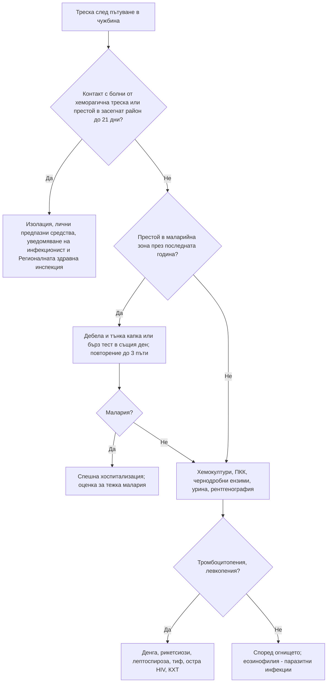

# Глава 80. Треска след пътуване, ендемични инфекции и имунокомпрометиран пациент

> **Част XVI. Спешни състояния и инфекции**

## Цели на главата

- Да се снема структурирана анамнеза за пътуване и експозиции.
- Да се използват **инкубационният период** и **географията** за стесняване на диференциалната диагноза.
- Да се изследва за малария в същия ден всеки пациент с треска след престой в тропически район (**малария, докато не се докаже противното**).
- Да се разпознават **ендемичните инфекции в България** — зоонози, трансмисивни и паразитни заболявания.
- Да се изброяват причините за **еозинофилия** при пътуващи и при местни жители и да се изключва стронгилоидоза преди кортикостероиди.
- Да се свързва видът имунен дефект с типичните причинители при **имунокомпрометирания** пациент.

## Ключови моменти

- Треската след престой в маларийна зона изисква изследване за малария с резултат в същия ден. Маларията се изключва след три отрицателни проби за 24–48 часа *(SORT C [2])*.
- Минималният инкубационен период на маларията е 6 дни *(SORT C [2])*.
- Средството на избор при тежка малария е интравенозният артесунат *(SORT A [2])*.
- Инкубационният период, географията и експозициите стесняват диференциалната диагноза при треска след пътуване *(SORT C [1])*.
- Предупредителните белези на тежка денга се появяват около спадането на треската *(SORT C [3])*.
- Индикаторните състояния (например херпес зостер, полово предавани инфекции, лимфом, хепатит B или C) са повод за изследване за HIV *(SORT B [7])*.

### Първите 60 секунди

- Питайте къде и кога е пътувал пациентът.
- Контакт с болни от хеморагична треска или престой в засегнат район през последните 21 дни: изолация, лични предпазни средства и уведомяване на инфекционист и РЗИ.
- Престой в маларийна зона: тест за малария с резултат в същия ден [2].
- Нарушено съзнание, гърчове, хипотония, задух, жълтеница или кървене: 112 — тежка малария или сепсис [2].
- Треска при неутропения или аспления: спешно насочване.

---

## 1. Анамнеза за пътуване и експозиции

*Таблица 80.1. Анамнеза за пътуване и експозиции.*

| Въпрос | Значение |
|---|---|
| **Къде?** (страна, район, **градски или селски**) | Малария (Субсахарска Африка — най-висок риск), денга (Югоизточна Азия, Латинска Америка), коремен тиф (Южна Азия) |
| **Кога?** (дати на заминаване и връщане, начало на симптомите) | Инкубационен период |
| **Профилактика и ваксини** | Химиопрофилактика на малария (липсата не изключва, наличието също не изключва), ваксини (хепатит A, коремен тиф, жълта треска, бяс) |
| **Дейности** | **Сладка вода** (шистозомоза, лептоспироза), **пещери** (хистоплазмоза, бяс), **сафари** (африканска кърлежова треска, трипанозомоза), **сексуални контакти** (HIV, сифилис), **татуировки**, медицински процедури |
| **Храна и вода** | Сурово месо и риба, непастьоризирано мляко (**бруцелоза**), улична храна |
| **Ухапвания** | **Комари**, **кърлежи**, **животни** (бяс), бълхи |
| **Контакти с болни** | Туберкулоза, вирусни хеморагични трески, морбили |
| **Посещение на роднини** (имигранти) | **По-висок риск** — рядко вземат профилактика |

---

## 2. Инкубационен период като диагностичен инструмент

Инкубационният период, географията и експозициите стесняват диференциалната диагноза [1].

*Таблица 80.2. Инкубационен период като диагностичен инструмент.*

| Инкубационен период | Заболявания |
|---|---|
| **Под 10 дни** | **Денга**, чикунгуня, зика, **рикетсиози**, **грип**, **легионелоза**, **менингококова болест**, **лептоспироза**, **Кримска-Конго хеморагична треска**, **пътнически диарии** |
| **10–21 дни** | **Малария** (*P. falciparum* — обикновено 7–30 дни), **коремен тиф**, **лептоспироза**, **остра HIV инфекция**, **бруцелоза**, **ку-треска**, **Ебола, Ласа**, хантавирус, **хепатит A** (15–50 дни) |
| **Над 21 дни** | **Малария** (***P. vivax*, *P. ovale*** — **месеци до години**, **P. falciparum до 3 месеца**, рядко по-късно), **туберкулоза**, **хепатит B, C, E**, **амебен чернодробен абсцес**, **висцерална лайшманиоза**, **шистозомоза** (треска на Katayama — 2–8 седмици), **бруцелоза**, **бяс**, **HIV** |

**Треска, която започва по-рано от 6 дни след пристигането в маларийна зона, трудно може да е малария, придобита там** (минималният инкубационен период е 6 дни) [2]. **Всяка треска след това — по време на престоя и до месеци след завръщането — изисква изследване за малария.**

---

## 3. Основни причини за треска след пътуване

### 3.1. Малария

- **Най-честата причина за смърт** при треска след пътуване. ***P. falciparum*** може да убие за **дни**.
- **Симптомите са неспецифични:** **треска** (не задължително периодична), **тръпки**, **главоболие**, **миалгии**, **гадене, повръщане, диария**, **кашлица** — често се бърка с **грип** или **гастроентерит**.
- **Лабораторно:** **тромбоцитопения** (най-честата находка), анемия, хипербилирубинемия, повишени трансаминази, **левкопения**.
- **Диагноза:** **дебела и тънка капка** и/или **бърз антигенен тест** с резултат **в същия ден**. Маларията се изключва след **три отрицателни проби** за 24–48 часа [2].
- **Критерии за тежка малария:** **нарушено съзнание** или **гърчове**, **паразитемия над 10%**, **хипогликемия**, **ацидоза**, **остро бъбречно увреждане**, **белодробен оток / ARDS**, **тежка анемия**, **шок**, **кървене**, **хемоглобинурия**, **иктер**. При паразитемия над 2% рискът от тежко протичане е повишен и лечението е интравенозно. Средството на избор при тежка малария е **интравенозен артесунат** [2].
- **Моряците, строителните работници и хората, посещаващи роднини в Африка**, са сред най-засегнатите в България.

### 3.2. Коремен тиф и паратиф

- **Южна Азия** (Индия, Пакистан, Бангладеш), Африка.
- **Постепенно покачваща се треска**, **главоболие**, **коремна болка**, **запек** (или диария), **относителна брадикардия**, **розеоли** по корема (рядко), **хепатоспленомегалия**, **левкопения**.
- **Хемокултури** (многократни); усложнения на **3-тата седмица** — **перфорация** и **кървене** от червата.
- Нарастваща **антибиотична резистентност**.

### 3.3. Денга

- **Тропици** (Югоизточна Азия, Латинска Америка, Карибите, Африка); **комари *Aedes*** — хапят **през деня**.
- **Внезапна висока треска**, **силно главоболие** с **болка зад очите**, **силни миалгии и артралгии** („чупене на кости“), **обрив** (често **„бели острови в червено море“** при възстановяване), **левкопения, тромбоцитопения**, повишени трансаминази.
- **Предупредителни белези** за тежка денга (обикновено при **спадане на треската**, 3–7-и ден) [3]: **коремна болка**, **упорито повръщане**, **натрупване на течности** (асцит, плеврален излив), **кървене от лигавиците**, **летаргия**, **хепатомегалия**, **повишаващ се хематокрит** с **бързо спадащи тромбоцити**.
- **Да се избягват НСПВС и аспирин** [3].

### 3.4. Други

*Таблица 80.3. Основни причини за треска след пътуване: други.*

| Заболяване | Насочващи белези |
|---|---|
| **Чикунгуня** | Треска, **силни, инвалидизиращи артралгии** (могат да персистират месеци) |
| **Рикетсиози** (африканска кърлежова треска, марсилска треска) | **Tache noire** (често **множествени** при африканската), обрив, лимфаденит |
| **Лептоспироза** | **Сладка вода** (рафтинг, наводнения), миалгии в прасците, **конюнктивална суфузия**, иктер, бъбречно увреждане |
| **Амебен чернодробен абсцес** | Треска, **болка в десния горен квадрант**, често **без диария**; ехография |
| **Шистозомоза** (треска на Katayama) | **Къпане в сладка вода в Африка**; треска, уртикария, кашлица, **еозинофилия**; по-късно хематурия |
| **Висцерална лайшманиоза** | Продължителна треска, **голяма спленомегалия**, **панцитопения**, хипергамаглобулинемия |
| **Вирусни хеморагични трески** (Ебола, Марбург, Ласа) | Пътуване в засегнат район **до 21 дни**, **контакт с болни**, погребения, диви животни; **изолация и уведомяване** |
| **Остра HIV инфекция** | Треска, **фарингит**, **обрив**, лимфаденопатия, язви в устата, **рисков контакт** 2–6 седмици преди това |
| **Бяс** | Ухапване или **одраскване** от животно (включително **кучета** в Азия, Африка, **прилепи**); парестезии на мястото на ухапването, **хидрофобия**, възбуда — **неизбежно смъртоносен** след появата на симптомите; **постекспозиционна профилактика** |
| **Туберкулоза** | Продължителна кашлица, загуба на тегло, нощно изпотяване |

---

## 4. Ендемични инфекции в България

*Таблица 80.4. Ендемични инфекции в България.*

| Заболяване | Причинител и пренос | Епидемиология | Ключови белези |
|---|---|---|---|
| **Марсилска треска** | *Rickettsia conorii*; **кучешки кърлеж** | **Лятото**, **Черноморието**, **Южна България**; контакт с кучета | Треска, **„tache noire“**, **макулопапулозен обрив**, включително **по дланите и ходилата**; злокачествена форма при възрастни и диабетици |
| **Кримска-Конго хеморагична треска** | Nairovirus; **кърлежи *Hyalomma***, **кръв на животни**, **нозокомиално** | През 2015–2024 г. най-много случаи в **Кърджали, Благоевград, Хасково, Ямбол и Бургас**; април–септември [4]; **овчари, животновъди, ветеринари** | **Внезапна треска**, миалгии, **тромбоцитопения**, **левкопения**, **повишени трансаминази**, **кръвоизливи** (петехии, екхимози, кървене от венците, мелена) — **изолация**, **съобщаване** |
| **Хантавирусна треска с бъбречен синдром** | Хантавируси (Добрава, Пуумала); **гризачи** (прах, екскременти) | Горски райони, вили, складове, **пролет–лято** | Треска, **болки в кръста**, **остро бъбречно увреждане**, **тромбоцитопения**, **преходна миопия**, **конюнктивални кръвоизливи** |
| **Лептоспироза** | *Leptospira*; **урина на гризачи, кучета, свине** | **Наводнения**, **земеделие**, **канализация**, риболов | Треска, **миалгии в прасците**, **конюнктивална суфузия**, **иктер**, бъбречно увреждане, **белодробни кръвоизливи** |
| **Бруцелоза** | *Brucella melitensis*; **непастьоризирано мляко и сирене**, **контакт с животни** | Отделни огнища, **Югоизточна България** (внос на животни) | **Вълнообразна треска**, **нощно изпотяване** (с характерен мирис), **артралгии**, **сакроилеит**, **спондилит**, **орхиепидидимит**, хепатоспленомегалия (вж. глава 4) |
| **Ку-треска** | *Coxiella burnetii*; **аерозол** от **овце, кози** (особено при **раждане**) | Епидемии в селски райони | Треска, **силно главоболие**, **атипична пневмония**, **хепатит**; хронична — **ендокардит** с отрицателни хемокултури |
| **Туларемия** | *Francisella tularensis*; **зайци**, гризачи, **вода**, кърлежи | **Западна и Северозападна България** (Софийско, Перник, Кюстендил) | **Улцерогландуларна** форма — язва и **голям болезнен регионален лимфен възел**; **орофарингеална** (вода, храна) — фарингит с **шийна лимфаденопатия** |
| **Лаймска болест** | *Borrelia burgdorferi*; **кърлежи *Ixodes*** | Горски и планински райони | **Мигриращ еритем**, **лицева парализа**, **менингит**, **радикулит**, **AV блок**, **артрит на коляното** |
| **Западнонилска треска** | Флавивирус; **комари *Culex*** | **Лятото**, **Дунавската равнина**, **Черноморието** | Обикновено лека; **невроинвазивна** форма при **възрастни** — **менингоенцефалит**, **остра вяла парализа** |
| **Висцерална лайшманиоза** | *Leishmania infantum*; **пясъчни мухи**; **кучета** — резервоар | **Югозападна България** (долината на Струма) | **Продължителна треска**, **голяма спленомегалия**, **панцитопения**, хипергамаглобулинемия; при **имуносупресирани** |
| **Ехинококоза** | *Echinococcus granulosus*; **кучета** (яйца), овце | **Югоизточна Европа** е настоящият център на кистозната ехинококоза в Европа [5]; селски райони | **Кисти в черния дроб** (70%) и **белите дробове** (20%); често **безсимптомна**; болка, **иктер**, **анафилаксия** при руптура |
| **Трихинелоза** | *Trichinella*; **недобре обработено свинско** и **месо от дива свиня** | **Зимата** (Коледа — домашни колбаси, **лов**), **семейни огнища** | Диария, после **треска**, **миалгии**, **периорбитален оток**, **субконюнктивални кръвоизливи**, **еозинофилия**, **висока креатинкиназа (КК)** |
| **Антракс** (кожен) | *Bacillus anthracis*; **заклани болни животни**, кожи | Селски райони, **нелегално клане** | **Безболезнена** папула → везикула → **черна некротична язва** с **изразен оток** |
| **Бяс** | Лисици, кучета, котки | Спорадично (лисици) | Постекспозиционна профилактика при всяко ухапване от животно с неизвестен статус |
| **Токсоплазмоза** | *Toxoplasma gondii*; **котки**, сурово месо | Разпространена | Лимфаденопатия (шийна), **вродена** при бременни; при **HIV** — мозъчни абсцеси |
| **Хепатит A** | Фекално-орален | Епидемии в общности с лоша хигиена | Жълтеница, треска, гадене |

---

## 5. Еозинофилия

*Таблица 80.5. Еозинофилия.*

| Степен | Стойност |
|---|---|
| Лека | 0,5–1,5 × 10⁹/l |
| Изразена | Над 1,5 × 10⁹/l |

**Причини:**

- **Паразитни инфекции** (при пътуващи и мигранти) [6]:
  - **шистозомоза**;
  - **стронгилоидоза** (опасна при **кортикостероиди** — **хиперинфекция**);
  - **анкилостомоза**, **аскаридоза** (синдром на Löffler);
  - **токсокароза** (деца, кучета);
  - **трихинелоза**;
  - **ехинококоза** (при руптура);
  - **филариози**, **фасциолоза**.
- **Алергични заболявания** — **астма**, **атопичен дерматит**, **алергичен ринит**; **алергична бронхопулмонална аспергилоза**.
- **Лекарства** — **DRESS**, **интерстициален нефрит**, пеницилини, антиепилептични.
- **Васкулити** — **еозинофилна грануломатоза с полиангиит** (Churg-Strauss: **астма**, синузит, **мононевропатия**).
- **Злокачествени заболявания** — **лимфом на Hodgkin**, Т-клетъчни лимфоми, **хипереозинофилен синдром**, хронична еозинофилна левкемия.
- **Ендокринни** — **надбъбречна недостатъчност** (еозинофилия при стрес е необичайна).
- **Холестеролова емболия** (след катетеризация).

**Преди кортикостероиди при пациент с еозинофилия и експозиция в тропически район изключете стронгилоидоза** [6].

---

## 6. Имунокомпрометираният пациент

### 6.1. Вид имунен дефект и типични причинители

*Таблица 80.6. Вид имунен дефект и типични причинители.*

| Имунен дефект | Причини | Типични причинители |
|---|---|---|
| **Неутропения** | **Химиотерапия**, **метамизол**, **клозапин**, **карбимазол**, левкемия | **Грам-отрицателни бактерии** (*Pseudomonas*), **Грам-положителни** (стафилококи, стрептококи), **гъбички** (*Candida*, ***Aspergillus*** при продължителна неутропения) |
| **Нарушен клетъчен имунитет** (Т-клетки) | **HIV**, **трансплантация**, **кортикостероиди**, **калциневринови инхибитори**, лимфом | **Пневмоцистна пневмония**, **туберкулоза** и атипични микобактерии, **CMV**, **херпес зостер**, **токсоплазмоза**, ***Cryptococcus***, ***Listeria***, ***Nocardia***, **хистоплазмоза**, **кандидоза**, **прогресивна мултифокална левкоенцефалопатия** |
| **Нарушен хуморален имунитет** (антитела) | **Общ вариабилен имунен дефицит**, **хронична лимфоцитна левкемия**, **мултиплен миелом**, **ритуксимаб** | **Капсулни бактерии** (**пневмококи**, *Haemophilus*), рецидивиращи **синузити, пневмонии**, **бронхиектазии**, **лямблиоза**, ентеровирусен менингоенцефалит |
| **Аспления** | Спленектомия, **сърповидно-клетъчна анемия**, **функционална** (цьолиакия, цироза) | **Пневмококи**, **менингококи**, *Haemophilus*, ***Capnocytophaga*** (ухапване от куче), **малария**, **бабезиоза** — **фулминантен сепсис** |
| **Дефицит на комплемента** | Вроден (**C5–C9**), **екулизумаб**, равулизумаб | **Neisseria** — **рецидивираща менингококова болест** |
| **Анти-TNF терапия** | Инфликсимаб, адалимумаб, етанерцепт | **Реактивиране на туберкулоза** (често **извънбелодробна**), **хистоплазмоза**, *Listeria*, *Legionella*, **реактивиране на хепатит B** |
| **Дефекти на бариерите** | **Изгаряния**, **централни катетри**, **мукозит**, **уретрален катетър** | Кожни бактерии, *Candida* |
| **Захарен диабет, цироза, бъбречна недостатъчност, алкохолизъм, недохранване, напреднала възраст** | Смесен дефект | Бактериални инфекции, **мукормикоза** (диабетна кетоацидоза), **злокачествен външен отит**, **емфизематозен пиелонефрит** |

### 6.2. HIV: опортюнистични инфекции според броя на CD4 клетките

*Таблица 80.7. HIV: опортюнистични инфекции според броя на CD4 клетките.*

| CD4 (клетки/µl) | Инфекции и заболявания |
|---|---|
| **Всякакъв брой** | **Бактериална пневмония**, **туберкулоза**, **херпес зостер**, кандидоза на устата, **сифилис**, сарком на Kaposi, лимфом |
| **Под 200** | **Пневмоцистна пневмония** (**задух при усилие**, **суха кашлица**, **десатурация при усилие**, рентгенография в началото може да е нормална), **кандидозен езофагит** |
| **Под 100** | **Церебрална токсоплазмоза** (**пръстеновидно контрастиращи лезии**), **криптококов менингит** (главоболие, **често без менингеален синдром**; **висок ликворен натиск**), **криптоспоридиоза** |
| **Под 50** | **CMV ретинит** и колит, **дисеминиран *M. avium* комплекс**, **първичен лимфом на ЦНС**, **прогресивна мултифокална левкоенцефалопатия** |

**Индикаторни състояния за изследване за HIV** — изследвайте при [7]: **туберкулоза**, **полово предавани инфекции**, **хепатит B и C**, **лимфом**, **херпес зостер под 50 години** или **в повече от един дерматом**, **необяснена левкопения или тромбоцитопения**, **себореен дерматит** (тежък), **кандидоза на устата** без причина, **необяснена загуба на тегло** или **треска**, **рецидивираща пневмония**, **мононуклеоза-подобен синдром**, **периферна невропатия**, **деменция** при млади. **Всички бременни** се изследват.

### 6.3. Особености при имунокомпрометирания пациент

- **Треската може да е единственият белег** или да **липсва** (кортикостероиди).
- **Локалните признаци на възпаление са притъпени** — пневмония без храчки, менингит без вратна ригидност, перитонит без перитонеално дразнене.
- **Бърза прогресия** — за часове.
- **Неинфекциозни причини за треска:** **лекарства**, **реакция на отхвърляне**, **реакция „присадка срещу гостоприемник“**, **основното заболяване** (лимфом), **тромбози**, **синдром на имунната реконституция** (IRIS) след започване на антиретровирусна терапия.

---

## 7. Безопасна диагностична стратегия

*Таблица 80.8. Безопасна диагностична стратегия.*

| Въпрос | Отговор |
|---|---|
| **Вероятна диагноза** | Вирусни инфекции (грип, COVID-19), пътническа диария, денга, инфекции на дихателните и пикочните пътища |
| **Сериозни заболявания, които не бива да се пропускат** | **Малария** (*P. falciparum*); **коремен тиф**; **вирусни хеморагични трески** (включително **Кримска-Конго**); **менингококова болест**; **лептоспироза**; **остра HIV инфекция**; **туберкулоза**; **бяс**; **неутропеничен сепсис**; **пневмоцистна пневмония**; **криптококов менингит**; **стронгилоидна хиперинфекция** |
| **Чести капани** | Малария, приета за грип или гастроентерит; отрицателна единична капка; малария месеци след пътуването (*P. vivax*, *P. ovale*); неспомената история на пътуване (питайте активно); взета профилактика, която не е изпита докрай; кортикостероиди при недиагностицирана стронгилоидоза; туберкулоза при анти-TNF терапия |
| **Маскиращи заболявания** | HIV, туберкулоза, бруцелоза, ку-треска, лайшманиоза |
| **Психосоциални аспекти** | Мигранти, бежанци, моряци, сезонни работници — ограничен достъп до здравни грижи, езикови бариери; стигма при HIV |

---

## 8. Диагностичен алгоритъм при треска след пътуване

*Фигура 80.1. Диагностичен алгоритъм при треска след пътуване. Схема на авторите въз основа на източниците, цитирани в главата.*

Текстово описание на фигура 80.1

1. Треска след пътуване в чужбина. Следва: към т. 2.
2. **Въпрос:** Контакт с болни от хеморагична треска или престой в засегнат район до 21 дни? Да — към т. 3; Не — към т. 4.
3. Изолация, лични предпазни средства, уведомяване на инфекционист и Регионалната здравна инспекция.
4. **Въпрос:** Престой в маларийна зона през последната година? Да — към т. 5; Не — към т. 6.
5. Дебела и тънка капка или бърз тест в същия ден; повторение до 3 пъти. Следва: към т. 7.
6. Хемокултури, ПКК, чернодробни ензими, урина, рентгенография. Следва: към т. 8.
7. **Въпрос:** Малария? Да — към т. 9; Не — към т. 6.
8. **Въпрос:** Тромбоцитопения, левкопения? Да — към т. 10; Не — към т. 11.
9. Спешна хоспитализация; оценка за тежка малария.
10. Денга, рикетсиози, лептоспироза, тиф, остра HIV, КХТ.
11. Според огнището; еозинофилия — паразитни инфекции.

---

## 9. Червени флагове и насочване

### 9.1. Червени флагове

- Треска след престой в маларийна зона.
- Нарушено съзнание, гърчове, жълтеница, хипотония или задух при треска след пътуване.
- Кървене, петехии и тромбоцитопения.
- Контакт с болни от хеморагична треска или престой в засегнат район през последните 21 дни.
- Коремна болка, упорито повръщане или кървене от лигавиците при денга.
- Треска при неутропения, аспления или HIV с нисък брой CD4 клетки.
- Главоболие без менингеален синдром при HIV.
- Задух при усилие с десатурация при HIV.

### 9.2. Кога и колко спешно да насочим

*Таблица 80.9. Кога и колко спешно да насочим.*

| Спешност | Клинична ситуация |
|---|---|
| **Незабавно (112 или спешно отделение)** | Треска след престой в маларийна зона с белези на тежка малария [2]; подозрение за вирусна хеморагична треска — изолация и уведомяване; денга с предупредителни белези [3]; треска при неутропения или аспления |
| **В същия ден** | Треска след престой в маларийна зона без белези на тежест — изследване за малария с резултат в същия ден [2]; треска с тромбоцитопения след ухапване от кърлеж — инфекциозна клиника [4]; подозрение за пневмоцистна пневмония или криптококов менингит при HIV |
| **Бързо (до 2 седмици)** | Еозинофилия след престой в тропиците — изследване за паразити, включително стронгилоидоза [6]; нова HIV инфекция — насочване към специализирано звено |
| **Проследяване в общата практика** | Изследване за HIV при индикаторни състояния [7]; съвети преди пътуване — профилактика на малария и ваксини; прекараната малария не предпазва от нова инфекция [2] |

---

## 10. Клинични перли

- Питайте всеки пациент с треска: „Пътували ли сте в чужбина през последната година?“
- Треската след престой в Субсахарска Африка е малария, докато три отрицателни капки не докажат противното.
- Химиопрофилактиката не изключва малария.
- Маларията може да се прояви с диария, кашлица или жълтеница. Тромбоцитопенията е ключов белег.
- *P. vivax* и *P. ovale* могат да дадат малария месеци след завръщането.
- При денга избягвайте НСПВС. Опасният период е при спадане на треската.
- Треска, тромбоцитопения и повишени трансаминази след ухапване от кърлеж в Южна България: Кримска-Конго хеморагична треска. Защитете персонала.
- Миалгии, периорбитален оток и еозинофилия след колбаси от дива свиня: трихинелоза. Често са засегнати няколко души.
- Преди кортикостероиди при еозинофилия и тропическа експозиция: изключете стронгилоидоза.
- Треска при пациент без слезка е спешност. Ухапване от куче при аспления: *Capnocytophaga*.
- Задух при усилие с десатурация и почти нормална рентгенография при HIV: пневмоцистна пневмония.

---

## 11. Клиничен случай

**Етап 1 — представяне.** Моряк на 38 години се връща от 6-месечен рейс с престой в пристанище в Нигерия. Десет дни след връщането си получава треска до 39,5 °C, тръпки, главоболие и болки в мускулите. Приема го за грип и се лекува с парацетамол. Не е приемал противомаларийна профилактика.

> **Въпрос 1.** Какво трябва да се направи още при първия контакт?

**Етап 2 — на четвъртия ден.** Съпругата му го води при личния лекар, защото е „объркан и пожълтял“. T 39,8 °C, пулс 118/min, АН 95/60 mmHg, ДЧ 28/min, лек иктер, спленомегалия. Хемоглобин 98 g/l, тромбоцити 34 × 10⁹/l, кръвна захар 3,2 mmol/l.

> **Въпрос 2.** Коя е най-вероятната диагноза и кои белези говорят за тежест?

> **Въпрос 3.** Какво е поведението?

Обсъждане и отговори

**Отговор 1.** Треската 10 дни след престой в Западна Африка без химиопрофилактика изисква изследване за малария с резултат в същия ден [2]. Пътуването трябва да се свърже с треската още при първия контакт.

**Отговор 2.** Треската с тромбоцитопения, анемия, иктер и спленомегалия е **малария, причинена от *Plasmodium falciparum***, докато не се докаже противното. Белезите на **тежка малария** са нарушеното съзнание, хипогликемията, хипотонията, тахипнеята (ацидоза или белодробен оток), иктерът и анемията.

**Отговор 3.** Спешно насочване в инфекциозна клиника с дебела и тънка капка и определяне на паразитемията. Лечението на тежката малария е **интравенозен артесунат** [2]. Смъртността при тежка малария е висока, а всеки час забавяне я увеличава.

**Поука.** Всяка треска след престой в маларийна зона е медицинска спешност. Питайте за пътуване и изследвайте за малария в същия ден.

---

## Обобщение

- Анамнезата за пътуване и експозиции, инкубационният период и географията насочват диференциалната диагноза.
- Маларията е най-важната диагноза при треска след престой в тропиците и се изследва в същия ден.
- В България трябва да се помни за Кримска-Конго хеморагичната треска, лептоспирозата, марсилската треска, туларемията, ехинококозата и трихинелозата.
- При имунокомпрометиран пациент видът на имунния дефект определя вероятните причинители, а локалните признаци на възпаление често липсват.

## Самопроверка

### Въпроси с един верен отговор

**1.** *(основно ниво)* Жена на 32 години се е върнала преди 3 седмици от Гана. Взимала е доксициклин като профилактика, но го е спряла при завръщането си. Има треска, главоболие и диария от 2 дни. Кое е правилното поведение?

- **А.** Симптоматично лечение на гастроентерита
- **Б.** Изследване за малария с резултат в същия ден
- **В.** Изследване за малария само ако треската продължи над седмица
- **Г.** Профилактиката изключва малария
- **Д.** Изпращане на изпражнения за посявка и контрол след 5 дни

Отговор и обосновка

**Верен отговор: Б.** Профилактиката не изключва малария. Треската след престой в маларийна зона изисква изследване в същия ден [2].

**2.** *(напреднало ниво)* Мъж на 45 години пристига в Кения и 3 дни по-късно получава треска. Кое е вярно?

- **А.** Най-вероятно е малария, придобита в Кения
- **Б.** Малария, придобита в Кения, е малко вероятна, защото минималният инкубационен период е 6 дни
- **В.** Трябва да започне лечение за малария без изследване
- **Г.** Трябва да се върне веднага в България
- **Д.** Инкубационният период няма значение

Отговор и обосновка

**Верен отговор: Б.** Минималният инкубационен период на маларията е 6 дни [2]. Треска след този срок изисква изследване за малария.

**3.** *(основно ниво)* Мъж на 28 години се е върнал от Тайланд. На 5-ия ден от треската температурата спада, но се появяват силна коремна болка, упорито повръщане и кървене от венците. Хематокритът се покачва, а тромбоцитите спадат бързо. Кое е правилното поведение?

- **А.** Ибупрофен и контрол след 2 дни
- **Б.** Спешна хоспитализация — денга с предупредителни белези
- **В.** Антибиотик за коремен тиф
- **Г.** Успокояване, защото треската спада
- **Д.** Изследване за малария и изчакване на резултата у дома

Отговор и обосновка

**Верен отговор: Б.** Предупредителните белези на тежка денга се появяват около спадането на треската [3].

**4.** *(основно ниво)* Мъж на 50 години, мигрант от Югоизточна Азия, има еозинофилия 1,8 × 10⁹/l. Предстои лечение с кортикостероиди за ревматична полимиалгия. Кое трябва да се изключи първо?

- **А.** Лаймска болест
- **Б.** Стронгилоидоза
- **В.** Токсоплазмоза
- **Г.** Туберкулоза
- **Д.** Бруцелоза

Отговор и обосновка

**Верен отговор: Б.** Кортикостероидите при недиагностицирана стронгилоидоза могат да предизвикат хиперинфекция [6].

**5.** *(основно ниво)* Мъж на 35 години има херпес зостер. Иначе е здрав. Кое изследване трябва да се предложи?

- **А.** Туморни маркери
- **Б.** Изследване за HIV
- **В.** КТ на гръдния кош
- **Г.** Имуноглобулини
- **Д.** Никое

Отговор и обосновка

**Верен отговор: Б.** Херпес зостер е индикаторно състояние, при което изследването за HIV е оправдано [7].

### Задача

Овчар на 58 години от Кърджалийско има внезапна треска, силни мускулни болки и отпадналост от 3 дни. Преди седмица е махнал кърлеж от крака си. Тромбоцитите са 42 × 10⁹/l, левкоцитите 2,1 × 10⁹/l, АСАТ и АЛАТ са 4 пъти над нормата. Как ще постъпите?

Решение

Картината подсказва **Кримска-Конго хеморагична треска** — ухапване от кърлеж, професионален риск, ендемичен район, треска, тромбоцитопения, левкопения и чернодробно засягане [4]. Пациентът се насочва в същия ден в инфекциозна клиника. Персоналът използва лични предпазни средства, а случаят се съобщава на РЗИ. Разграничават се марсилска треска, лептоспироза и хантавирусна треска.

### OSCE станция: Анамнеза за пътуване при треска

**Време:** 8 минути. **Ниво:** основно (студенти, специализанти).

**Задача за кандидата.** Жена на 40 години има треска от 3 дни. Снемете анамнеза за пътуване и експозиции и решете за изследванията.

**Информация за симулирания пациент (за изпитващия).** Преди 2 седмици се е върнала от Индия, където е посетила роднини. Не е взимала профилактика за малария. Яла е улична храна.

*Таблица 80.10. OSCE станция: Анамнеза за пътуване при треска — рубрика за оценяване.*

| Критерий | Точки |
|---|---|
| Пита активно за пътуване през последната година | 1 |
| Уточнява къде, кога и колко дълго е била | 2 |
| Пита за профилактика и ваксини | 1 |
| Пита за храна, вода, ухапвания, контакт с болни и сексуални контакти | 2 |
| Свързва треската с малария, коремен тиф и денга | 2 |
| Планира изследване за малария с резултат в същия ден [2] | 2 |
| **Общо** | **10** |

**Праг за успешно представяне:** 7 от 10 точки, включително изследването за малария в същия ден.

## Литература

1. Thwaites GE, Day NP. Approach to Fever in the Returning Traveler. N Engl J Med. 2017;376(6):548-560. doi:10.1056/NEJMra1508435. PMID: 28177860.
2. Lalloo DG, Shingadia D, Bell DJ, Beeching NJ, Whitty CJM, Chiodini PL; PHE Advisory Committee on Malaria Prevention in UK Travellers. UK malaria treatment guidelines 2016. J Infect. 2016;72(6):635-649. doi:10.1016/j.jinf.2016.02.001. PMID: 26880088.
3. World Health Organization. Dengue: guidelines for diagnosis, treatment, prevention and control. New edition. Geneva: WHO; 2009.
4. Ngoc K, Stoikov I, Trifonova I, Panayotova E, Taseva E, Trifonova I, et al. Molecular and Clinical Characterization of Crimean-Congo Hemorrhagic Fever in Bulgaria, 2015-2024. Pathogens. 2025;14(8):785. doi:10.3390/pathogens14080785. PMID: 40872295.
5. Casulli A, Abela-Ridder B, Petrone D, Fabiani M, Bobić B, Carmena D, et al. Unveiling the incidences and trends of the neglected zoonosis cystic echinococcosis in Europe: a systematic review from the MEmE project. Lancet Infect Dis. 2023;23(3):e95-e107. doi:10.1016/S1473-3099(22)00638-7. PMID: 36427513.
6. Thakker C, Warrell C, Barrett J, Booth HL, Chiodini PL, Defres S, et al. UK guidelines for the investigation and management of eosinophilia in returning travellers and migrants. J Infect. 2025;90(2):106328. doi:10.1016/j.jinf.2024.106328. PMID: 39537036.
7. Sullivan AK, Raben D, Reekie J, Rayment M, Mocroft A, Esser S, et al. Feasibility and effectiveness of indicator condition-guided testing for HIV: results from HIDES I (HIV indicator diseases across Europe study). PLoS One. 2013;8(1):e52845. doi:10.1371/journal.pone.0052845. PMID: 23341910.

*Последна проверка на съдържанието: септември 2026 г. Следващ планиран преглед: септември 2027 г. (вж. „Политика за актуализация“ в README).*

<!-- навигация -->

---

[← Глава 79. Отравяния и токсидроми](79-otravyania.md) · [Съдържание](../README.md) · [Глава 81. Възрастният пациент: падания, функционален упадък и атипично представяне →](81-vazrastniyat-patsient.md)
