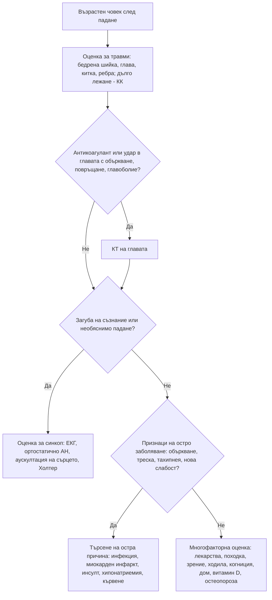

# Глава 81. Възрастният пациент: падания, функционален упадък и атипично представяне

> **Част XVII. Напреднала възраст**

## Цели на главата

- Да се разпознава **атипичното представяне** на острите заболявания при възрастни хора.
- Да се извършва многофакторна оценка на **падането** като симптом с множество причини, а не като „злополука“.
- Да се разграничава **синкопът** от механичното падане и да се търсят **ортостатичната хипотония** и лекарствените причини.
- Да се оценява **острият функционален упадък** („не може да ходи“, „не се справя“) като проява на остро заболяване.
- Да се разпознават **немощта (frailty)**, **полипрагмазията** и **каскадите на предписване**.
- Да се разпознава **насилието над възрастни хора**.

---

## 1. Атипично представяне

### 1.1. Защо заболяванията протичат атипично?

- **Намален физиологичен резерв** — първа „отказва“ най-слабата система (мозъкът — делир; походката — падане; пикочният мехур — инконтиненция).
- **Притъпен имунен и температурен отговор** — инфекции **без треска**.
- **Променено възприятие на болката** — миокарден инфаркт и остър корем **без болка**.
- **Множество съпътстващи заболявания** и **лекарства** (бета-блокерите маскират тахикардията, кортикостероидите — перитонита, НСПВС — треската).
- **Когнитивни нарушения и нарушения на слуха** — затруднена анамнеза.
- **„Приписване на възрастта“** — от пациента, близките и лекаря.

### 1.2. Неспецифични прояви на остро заболяване

„**Гериатричните гиганти**“ често са **единствената** проява на ново заболяване. Bernard Isaacs описва четири (обездвижване, нестабилност и падания, инконтиненция, нарушение на интелекта); по-късно към тях се добавя и ятрогенията:

- **остро объркване (делир)**;
- **падане**;
- **обездвижване** („не може да стане“, „краката не го държат“);
- **инконтиненция** (нова);
- **ятрогенни увреждания** (лекарства).

Към тях се добавят **загуба на апетит**, **отказ от храна и течности**, **сънливост**, **„не е на себе си“**, **влошаване на хронично заболяване**.

### 1.3. Атипично протичане на честите заболявания

| Заболяване | Типично при млади | Често при възрастни |
|---|---|---|
| **Пневмония** | Треска, кашлица, храчки, плеврална болка | **Объркване**, **падане**, **тахипнея**, **без треска**, **без кашлица** |
| **Инфекция на пикочните пътища, уросепсис** | Дизурия, треска | **Делир**, **падане**, **нова инконтиненция**; **безсимптомната бактериурия** е честа и **не е причина** за всеки симптом |
| **Сепсис** | Треска, тахикардия | **Хипотермия**, **объркване**, хипотония, падане |
| **Миокарден инфаркт** | Болка в гърдите | **Задух**, **синкоп**, **объркване**, **слабост**, **гадене**, **падане** — **„тих“ инфаркт** (особено при **диабет**, **жени**, **над 85 години**) |
| **Остър корем** (апендицит, перфорация, мезентериална исхемия, холецистит) | Силна болка, перитонеални белези | **Лека болка**, **без мускулна защита**, **без левкоцитоза** и треска; **мезентериална исхемия** — **силна болка при мек корем** |
| **Хипертиреоидизъм** | Тремор, възбуда, топлинна непоносимост | **„Апатичен“** — **умора, депресия**, **загуба на тегло**, **предсърдно мъждене**, **сърдечна недостатъчност** |
| **Хипотиреоидизъм** | Умора, наддаване на тегло | **Объркване**, **депресия**, **падане**, **хипотермия** — приписва се на възрастта |
| **Депресия** | Понижено настроение | **Соматични оплаквания**, **когнитивни нарушения** („псевдодеменция“), **загуба на тегло** |
| **Белодробна емболия** | Задух, плеврална болка | **Синкоп**, **объркване**, **необяснена тахикардия** |
| **Язвена болест, стомашно-чревно кървене** | Епигастрална болка | **Безболезнено** кървене (НСПВС), **анемия**, **синкоп**, **мелена** без предхождаща болка |
| **Хиперкалциемия** | Жажда, полиурия | **Объркване**, **запек**, **обезводняване** |
| **Хипонатриемия** | | **Падане**, **объркване**, **нестабилна походка** — дори при леко изразена |
| **Туберкулоза** | Кашлица, треска, хемоптиза | **Загуба на тегло**, **обща слабост**, **лека кашлица** — **реактивиране** |

---

## 2. Падания

### 2.1. Значение

- Около **една трета** от хората **над 65 години** и **половината над 80 години** падат поне веднъж годишно.
- **Падането е симптом, а не диагноза.** То често е **първата проява** на остро заболяване.
- **Последици:** **фрактури** (**бедрена шийка**, китка, прешлени, таз, раменна кост), **травма на главата** (**субдурален хематом**, особено при **антикоагуланти**), **„дълго лежане“** (рабдомиолиза, декубитуси, хипотермия, дехидратация, пневмония), **страх от падане** и обездвижване, **загуба на независимост**.

### 2.2. Основни въпроси

1. **Имаше ли загуба на съзнание?** Възрастните хора често **не помнят** загубата на съзнание — „просто се озовах на пода“. **Необяснено падане без ясна механична причина се оценява като възможен синкоп.**
2. **Какво правеше в момента?** — **ставане** (ортостатизъм), **след хранене** (постпрандиална хипотония), **уриниране или дефекация** (ситуационен синкоп), **завъртане на главата**, **гледане нагоре**, **усилие** (аортна стеноза, аритмия), **спъване** (механично).
3. **Предупредителни симптоми?** — замайване, сърцебиене, болка в гърдите, световъртеж.
4. **Колко време е лежал?** Могъл ли е да стане сам?
5. **Предишни падания?**
6. **Нови лекарства** или промяна на дозите?

### 2.3. Причини за падане

| Група | Причини |
|---|---|
| **Остро заболяване** | **Инфекции** (пневмония, ИПП), **дехидратация**, **хипонатриемия**, **хипогликемия**, **миокарден инфаркт**, **инсулт**, **стомашно-чревно кървене**, **белодробна емболия** |
| **Сърдечно-съдови** | **Ортостатична хипотония**, **постпрандиална хипотония**, **брадиаритмии** (синдром на болния синусов възел, **AV блок**), **тахиаритмии**, **аортна стеноза**, **хиперсензитивност на каротидния синус**, **вазовагален синкоп** |
| **Неврологични** | **Болест на Parkinson** и паркинсонизъм (**включително лекарствен** — **цинаризин**, **флунаризин**, метоклопрамид, антипсихотици), **нормотензивна хидроцефалия**, **инсулт**, **периферна невропатия**, **миелопатия** (шийна спондилоза, **дефицит на B12**), **деменция**, **епилепсия**, **хроничен субдурален хематом**, **церебеларни нарушения** |
| **Мускулно-скелетни** | **Саркопения**, **артроза**, **деформации на ходилата**, **миопатия** (статини, кортикостероиди, **остеомалация**, **хипотиреоидизъм**, **ревматична полимиалгия**) |
| **Сетивни** | **Намалено зрение** (**катаракта**, макулна дегенерация, **многофокални очила**), **вестибуларни нарушения** (**ДППВ**), **намален слух** |
| **Когнитивни и психични** | **Деменция**, **делир**, **депресия**, **страх от падане** |
| **Уринарни** | **Спешност**, **ноктурия** (нощно ставане в тъмното) |
| **Лекарства** | Вж. раздел 2.4 |
| **Алкохол** | Често скрит |
| **Околна среда** | **Килими**, **лошо осветление**, **стълби без парапет**, **неподходящи обувки**, **домашни любимци**, **хлъзгави подове** в банята |

### 2.4. Лекарства, които увеличават риска от падане

| Група | Механизъм |
|---|---|
| **Бензодиазепини**, **Z-хипнотици** (золпидем, зопиклон) | Седация, атаксия, забавена реакция |
| **Антидепресанти** (трициклични, **SSRI**, миртазапин, тразодон) | Седация, **ортостатизъм**, **хипонатриемия** |
| **Антипсихотици** | Седация, **паркинсонизъм**, ортостатизъм |
| **Антихипертензивни** — **алфа-блокери** (доксазозин, **тамсулозин**), **диуретици**, **нитрати**, АСЕ-инхибитори, калциеви антагонисти | **Ортостатична хипотония**, **хипонатриемия** (тиазиди), **дехидратация** |
| **Бета-блокери**, **дигоксин**, **верапамил**, **дилтиазем**, **донепезил** | **Брадикардия**, блок |
| **Опиоиди**, **габапентин**, **прегабалин** | Седация, **замайване**, атаксия |
| **Антихолинергици** (оксибутинин, **антихистамини от първо поколение**, трициклични) | **Делир**, **замъглено зрение**, ортостатизъм |
| **Антиепилептични** | Атаксия, седация, **остеопороза** |
| **Инсулин**, **сулфанилурейни препарати** | **Хипогликемия** |
| **Вестибуларни супресори** (**цинаризин**, **бетахистин**, **флунаризин**, **метоклопрамид**) | Седация, **паркинсонизъм** |

**Броят на лекарствата** е независим рисков фактор. При **4 или повече** лекарства рискът се увеличава значително.

### 2.5. Преглед след падане

- **Травми** — **бедрена шийка** (**скъсен, ротиран навън** крак, **болка в слабините**; **импактираната фрактура** позволява **ходене** — при болка и нормална рентгенография се прави **КТ или ЯМР**), **глава**, **китка**, **ребра**, **таз**, **гръбначен стълб**.
- **Ортостатично АН** — измерване след **5 минути в легнало** положение и на **1-вата и 3-тата минута след изправяне**. **Спадане на систолното с ≥ 20 mmHg** или на диастолното с ≥ 10 mmHg (или систолно под 90 mmHg) е положителен тест.
- **Пулс и ЕКГ** — **брадикардия**, **блокове**, **предсърдно мъждене**.
- **Сърдечни шумове** — **аортна стеноза**.
- **Неврологичен преглед** — паркинсонизъм, фокален дефицит, невропатия, **проприоцепция**.
- **Походка и равновесие** — тест **„Стани и върви“** (Timed Up and Go): **над 12–14 секунди** — повишен риск.
- **Зрение**, **ходила и обувки**.
- **Когнитивна оценка**.
- **Изследвания** — ПКК, електролити (**натрий**), креатинин, **глюкоза**, **КК** (при дълго лежане), **TSH**, **витамин B12**, **витамин D**, **урина**, ЕКГ; при съмнение — **Холтер**, **ехокардиография**, **КТ на главата**.

**Травма на главата при пациент на антикоагулант** (варфарин, НОАК) изисква **КТ на главата**, дори при нормален неврологичен статус. **Хроничният субдурален хематом** може да се прояви **седмици** след незначителна травма с **объркване**, **главоболие**, **сънливост**, **нови падания** или **хемипареза**.

---

## 3. Функционален упадък

### 3.1. Остър или постепенен?

| Упадък | Значение | Причини |
|---|---|---|
| **Остър** (дни) | **Остро заболяване**, докато не се докаже противното | **Инфекция** (пневмония, ИПП), **делир**, **инсулт**, **миокарден инфаркт**, **фрактура** (включително **прешленна** и **тазова**), **дехидратация**, **хипонатриемия**, **хиперкалциемия**, **задръжка на урина**, **запек**, **лекарства**, **хипотермия**, **субдурален хематом** |
| **Подостър** (седмици) | Прогресиращо заболяване | **Злокачествено заболяване**, **депресия**, **хипотиреоидизъм**, **сърдечна недостатъчност**, **ревматична полимиалгия**, **туберкулоза**, **субдурален хематом**, **нормотензивна хидроцефалия** |
| **Постепенен** (месеци) | Хронично заболяване, **немощ** | **Деменция**, **болест на Parkinson**, **саркопения**, **недохранване**, **социална изолация**, **неглижиране** |

**„Социалният прием“** („не се справя вкъщи“, „acopia“) е **опасно понятие**: при значителен дял от тези пациенти се открива **остро медицинско заболяване**.

### 3.2. Немощ (frailty)

- **Синдром на намален физиологичен резерв** и **повишена уязвимост** към стресови фактори.
- **Фенотип на Fried** (≥ 3 от 5 = немощ): **непреднамерена загуба на тегло**, **изтощение**, **слаба сила на стискане**, **бавна походка**, **ниска физическа активност**.
- **Клинична скала на немощта** (Clinical Frailty Scale, 1–9) — от „много добра форма“ до „терминално болен“.
- Немощта **предсказва** падания, хоспитализации, делир, усложнения след операции и смъртност по-добре от хронологичната възраст.

### 3.3. Недохранване и загуба на тегло

- Вж. глава 6. При възрастни хора честите причини са: **депресия**, **деменция**, **злокачествени заболявания**, **лекарства** (**дигоксин**, **метформин**, **донепезил**, **SSRI**, опиоиди), **проблеми със зъбите и протезите**, **дисфагия**, **социална изолация**, **бедност**, **хипертиреоидизъм**, **хронични заболявания** (сърдечна недостатъчност, ХОББ).
- **Скрининг:** **MNA** (Mini Nutritional Assessment), **MUST**.

---

## 4. Полипрагмазия и каскади на предписване

### 4.1. Полипрагмазия

- **5 или повече** лекарства; **тежка полипрагмазия** — 10 или повече.
- **Всеки нов симптом при възрастен пациент е нежелана лекарствена реакция, докато не се докаже противното.**
- **Инструменти:** критерии **STOPP/START**, критерии на **Beers**, **скали за антихолинергичното натоварване**.

### 4.2. Каскади на предписване

**Каскада на предписване** — нежеланата реакция на едно лекарство се приема за ново заболяване и се лекува с второ лекарство.

| Първо лекарство | Нежелана реакция | Второ лекарство |
|---|---|---|
| **Амлодипин** | **Отоци на глезените** | **Фуроземид** → хипокалиемия, дехидратация, инконтиненция, падане |
| **Инхибитор на холинестеразата** (донепезил) | **Инконтиненция** | **Оксибутинин** → **влошаване на деменцията** |
| **НСПВС** | **Хипертония**, отоци | **Антихипертензивни**, диуретици |
| **Метоклопрамид**, **цинаризин**, антипсихотици | **Паркинсонизъм** | **Леводопа** |
| **Тиазиди** | **Хиперурикемия, подагра** | **Алопуринол**, колхицин |
| **АСЕ-инхибитори** | **Кашлица** | **Противокашлични**, антибиотици |
| **Антихолинергици** | **Запек**, задръжка на урина | **Лаксативи**, **тамсулозин** → ортостатизъм |
| **Калциеви антагонисти**, опиоиди | **Запек** | Лаксативи |
| **Кортикостероиди** | **Хипергликемия** | **Антидиабетни** лекарства |
| **SSRI** | **Безсъние**, тревожност | **Бензодиазепини** → падания |

### 4.3. Лекарства, които изискват особено внимание при възрастни

- **Бензодиазепини и Z-хипнотици** — падания, делир, **зависимост**.
- **Антихолинергици** — делир, запек, задръжка на урина, **когнитивен упадък**.
- **НСПВС** — **стомашно-чревно кървене**, **бъбречно увреждане**, **сърдечна недостатъчност**, хипертония.
- **Сулфанилурейни препарати** (глибенкламид) — **хипогликемия**.
- **Дигоксин** — токсичност при бъбречна недостатъчност.
- **Антипсихотици при деменция** — **инсулт**, **смъртност**.
- **Метамизол** — **агранулоцитоза**.
- **Трамадол** — **хипонатриемия**, **гърчове**, **хипогликемия**, серотонинов синдром.

---

## 5. Други гериатрични проблеми

### 5.1. Инконтиненция

| Вид | Особености | Причини |
|---|---|---|
| **Стрес инконтиненция** | При **кашляне**, кихане, усилие | Слабост на тазовото дъно (жени), след **простатектомия** |
| **Инконтиненция от спешност** | **Внезапна нужда**, не може да стигне до тоалетната | **Хиперактивен детрузор**, **ИПП**, **инсулт**, **болест на Parkinson**, **деменция**, **камъни**, **карцином на пикочния мехур** |
| **Преливна инконтиненция** | **Постоянно изтичане**, **голям остатъчен обем** | **Задръжка** — **простатна хиперплазия**, **запек**, **антихолинергици**, **опиоиди**, **диабетна невропатия**, **спинална компресия** |
| **Функционална** | Нормален пикочен мехур, но **не може да стигне** до тоалетната | **Обездвижване**, **деменция**, **среда** |

**Остро появилата се инконтиненция** търси остра причина: **ИПП**, **делир**, **запек**, **задръжка на урина**, **хипергликемия**, **хиперкалциемия**, **лекарства** (диуретици), **спинална компресия** (синдром на конската опашка).

### 5.2. Хипотермия

- **Телесна температура под 35 °C** — **възрастни хора в студени жилища** (енергийна бедност), след **падане и дълго лежане**, **хипотиреоидизъм**, **сепсис**, **хипогликемия**, **алкохол**, **лекарства** (антипсихотици, седативи), **инсулт**.
- **Обикновените термометри не отчитат ниски температури** — използвайте **нискоградусен** термометър.
- **Объркване**, **сънливост**, **брадикардия**, **J вълни** (вълни на Osborn) на ЕКГ, **аритмии**.

### 5.3. Насилие над възрастни хора

- **Видове:** **физическо**, **психологическо**, **финансово**, **сексуално**, **неглижиране** (включително **самонеглижиране**).
- **Белези:** **необяснени синини** (особено по **вътрешната страна на ръцете** — захващане, **гърба**, **лицето**), **фрактури**, **декубитуси**, **недохранване**, **дехидратация**, **лоша хигиена**, **забавено търсене на помощ**, **несъответстващо обяснение**, **страх** от гледащия, **гледащ, който не допуска** пациента да говори сам, **внезапни финансови промени**, **пропуснати лекарства** или **предозиране** на седативи.
- **Поведение:** разговор с пациента **насаме**, документиране, уведомяване на **Дирекция „Социално подпомагане“** и при нужда на **полицията**.

---

## 6. Безопасна диагностична стратегия

| Въпрос | Отговор |
|---|---|
| **Вероятна диагноза** | Инфекции (пневмония, ИПП), лекарствени нежелани реакции, ортостатична хипотония, дехидратация, запек, влошаване на хронично заболяване |
| **Сериозни заболявания, които не бива да се пропускат** | **Сепсис без треска**; **„тих“ миокарден инфаркт**; **остър корем без перитонеални белези** (мезентериална исхемия, перфорация); **фрактура на бедрената шийка**, която позволява ходене; **субдурален хематом** (антикоагуланти); **брадиаритмии**, **аортна стеноза**; **инсулт**; **хипонатриемия**, **хиперкалциемия**; **хипотермия**; **злокачествени заболявания**; **депресия и суициден риск**; **насилие и неглижиране** |
| **Чести капани** | Всичко се приписва на възрастта; „социален прием“ без медицинска оценка; безсимптомна бактериурия, приета за причина на объркването; новото лекарство, което не е свързано с новия симптом; нормална температура при сепсис; падането, прието за механично без оценка за синкоп; нормално АН при хипертоник (относителна хипотония) |
| **Маскиращи заболявания** | Лекарства, депресия, хипотиреоидизъм, анемия, дефицит на B12, ревматична полимиалгия |
| **Психосоциални аспекти** | Самота, бедност, енергийна бедност, загуба на партньор, изтощение на грижещите се, насилие |

---

## 7. Диагностичен алгоритъм при падане на възрастен човек

---

## 8. Клинични перли

- При възрастни хора делирът, падането, обездвижването и новата инконтиненция са често единствените прояви на остро заболяване.
- Всеки нов симптом при възрастен човек е нежелана лекарствена реакция, докато не се докаже противното.
- Безсимптомната бактериурия е честа при възрастните хора. Не я приемайте автоматично за причина на объркването.
- Миокардният инфаркт при възрастни често протича без болка — със задух, объркване или падане.
- Силна коремна болка при мек корем при възрастен човек с предсърдно мъждене: мезентериална исхемия.
- Импактираната фрактура на бедрената шийка позволява ходене. При болка в слабините и нормална рентгенография направете КТ или ЯМР.
- „Не помня как паднах“ може да означава загуба на съзнание. Оценете за синкоп.
- Измервайте ортостатичното АН при всяко падане и при всяко замайване.
- Цинаризинът и флунаризинът причиняват лекарствен паркинсонизъм и падания. Спрете ги.
- Хроничният субдурален хематом може да се прояви седмици след незначителен удар, особено при антикоагуланти.
- „Не се справя вкъщи“ не е диагноза. Потърсете медицинската причина.

---

## 9. Клиничен случай

**Случай.** Жена на 82 години, която живее сама, е паднала три пъти през последния месец, два пъти при ставане през нощта да отиде до тоалетната. Не помни дали е губила съзнание. При последното падане е лежала на пода 5 часа, докато съседката я е намерила. Лекарства: **амлодипин** 10 mg, **доксазозин** 4 mg (добавен преди 2 месеца заради „високо кръвно“), **индапамид** 1,5 mg, **фуроземид** 40 mg (заради отоци на глезените), **зопиклон** 7,5 mg вечер, **амитриптилин** 25 mg (за „нервни болки“ в краката), **цинаризин** (за „световъртеж“). При прегледа: АН в легнало положение 148/78 mmHg, на третата минута след изправяне 108/64 mmHg със замайване; пулс 76/min, ритмичен. Лек тремор на ръцете в покой и забавени движения. Синини по лявото бедро и ръката. Na 129 mmol/l, КК 1450 U/l, креатинин 118 µmol/l.

**Въпроси.** 1) Кои са причините за паданията? 2) Какво трябва да се промени?

**Обсъждане.** Паданията са **многофакторни** и в основата им стоят **лекарствата**:

- **ортостатична хипотония** (спадане на систолното АН с 40 mmHg) от комбинацията **доксазозин**, **два диуретика**, **амлодипин** и **амитриптилин**;
- **седация** и забавени реакции от **зопиклон** и **амитриптилин** (при нощно ставане);
- **лекарствен паркинсонизъм** от **цинаризина** (тремор, брадикинезия);
- **хипонатриемия** от **индапамида** (и амитриптилина);
- **каскада на предписване**: отоците от амлодипин са лекувани с фуроземид, който води до ноктурия и нощни ставания.

Повишената КК и креатининът отразяват **рабдомиолизата** от **дългото лежане**. Необходими са: **спиране** на доксазозина, фуроземида, цинаризина и зопиклона (с постепенно намаляване), **замяна** на амитриптилина, преоценка на антихипертензивното лечение (**целево АН се определя спрямо немощта**), контрол на натрия, ЕКГ и Холтер (за изключване на аритмия), оценка за остеопороза и витамин D, **физиотерапия** за походка и равновесие, **лична аларма** и оценка на дома.

**Поука.** Паданията при възрастни хора най-често имат няколко причини, а лекарствата са сред най-честите и най-лесно отстранимите. Прегледайте списъка с лекарства при всяко падане.

<!-- навигация -->

---

[← Глава 80. Треска след пътуване, ендемични инфекции и имунокомпрометиран пациент](80-patuvane-imunosupresia.md) · [Съдържание](../README.md) · [Приложение А. Референтни стойности на основните лабораторни показатели →](../prilozhenia/a-referentni-stoynosti.md)
